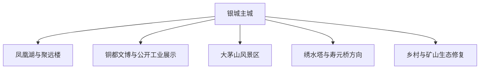
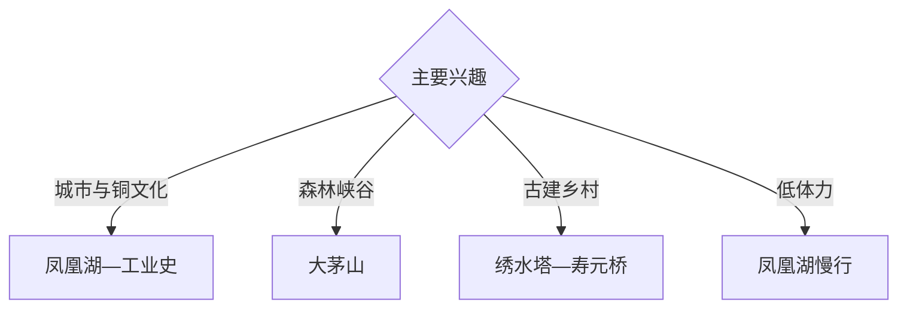

# 德兴旅行指南

德兴位于赣东北怀玉山地，以铜都工业史、凤凰湖城市景观、大茅山森林峡谷、古塔古桥与乡村生态形成独立目的地。固定快照中的 **Dexing / GeoNames 1786659** 锚定银城主城；大茅山和矿业相关点位分别需要独立交通安排。

## 城市速览

| 项目 | 信息 |
|---|---|
| 主线 | 银城主城—凤凰湖—铜都工业史—大茅山—古建乡村 |
| 停留 | 主城 1 天；大茅山另留 1 天，工业或古建专题再加半日 |
| 住宿 | 银城主城便于接驳；大茅山正规住宿适合山地慢游 |
| 交通 | 铁路与公路抵达，山地和乡镇宜约车或自驾 |
| 季节 | 春秋适合山地；梅雨期关注峡谷水位和地质预警 |
| 预算 | 城市线支出较低，山地车辆、住宿和景区服务增加预算 |

## 城市格局与游览区域

主城以凤凰湖、城市公共空间和铜文化为主；大茅山位于山地，适合作为完整一日线；矿山、冶炼厂与生产设施只在正式开放的展示空间参观。保护地、矿业生产区、尾矿设施和未开放山路按管理边界执行。

## 主要景点

| 景点 | 区域 | 类型 | 核心体验 | 用时 | 环境 | 体力 | 研究价值 | 拥挤 | 优先级 |
|---|---|---|---|---:|---|---|---|---|---|
| 凤凰湖景区公开区 | 主城 | 城市湖泊 | 湖山城市、慢行与公共生活 | 2–3 小时 | 室外 | 低 | 中高 | 傍晚中 | A |
| 聚远楼及周边公共区 | 主城 | 城市地标 | 赣东北城市视野与地方文化 | 1–2 小时 | 混合 | 低中 | 高 | 中 | A |
| 铜文化公开展陈 | 主城或矿业展区 | 工业文博 | 采铜历史、工业城市与生态转型 | 2–3 小时 | 室内 | 低 | 很高 | 预约制 | A |
| 大茅山依法开放区 | 花桥等方向 | 森林与峡谷 | 花岗岩山地、溪谷、瀑布与森林 | 1 天 | 室外 | 中高 | 很高 | 旺季中 | A |
| 梧风洞等正式开放片区 | 大茅山 | 峡谷 | 溪潭、岩石与山地生态 | 半天至 1 天 | 室外 | 高 | 高 | 季节性 | B |
| 绣水塔公开区 | 黄柏方向 | 古塔 | 明代古塔、地方建筑与乡野景观 | 2–3 小时 | 室外 | 低中 | 高 | 低 | B |
| 寿元桥等古建公开点 | 乡镇 | 古桥与古建 | 交通遗产、村落与水系 | 半天 | 室外 | 低中 | 中高 | 低 | C |

## 美食与餐饮

德兴赣东北小炒、米粉、山蔬、笋菌和地方河鲜适合在主城体验。山地餐饮选择较少，早出时携带饮水与简餐；野生动植物以观赏和保护为主，食材来源按正规餐饮标识确认。

## 经典行程

### 主城一日线
**路线**：凤凰湖—聚远楼—地方午餐—铜文化公开展陈。**逻辑**：从城市景观进入资源型城市史。**预约锚点**：展陈开放。**休息**：主城。**删除条件**：展陈未开放时增加湖区慢行。

### 铜都专题线
**路线**：城市文博—正式开放工业展示—生态修复观察点。**逻辑**：同时理解工业贡献与环境治理。**预约锚点**：接待许可。**休息**：主城。**删除条件**：生产单位不接待时保留公共展陈。

### 大茅山一日线
**路线**：主城—景区入口—依法开放峡谷步道—返程。**逻辑**：独立一天承接山路和天气变量。**预约锚点**：景区与道路。**休息**：游客中心。**删除条件**：暴雨、山洪、地质或防火预警时顺延。

### 梧风洞山水线
**路线**：正规入口—溪谷—正式开放观景点—返程。**逻辑**：聚焦大茅山水景。**预约锚点**：片区开放。**休息**：服务点。**删除条件**：水位或步道封闭时改凤凰湖。

### 古塔古桥线
**路线**：主城—绣水塔公开区—寿元桥或一个古村点—返程。**逻辑**：同方向串联乡土建筑。**预约锚点**：车辆。**休息**：镇区。**删除条件**：时间不足时只选一处。

### 亲子低体力线
**路线**：凤凰湖短段—城市文博—地方午餐。**逻辑**：步行可控且学习线索明确。**预约锚点**：场馆活动。**休息**：主城。**删除条件**：高温时全部转室内。

### 两日组合线
**路线**：首日主城与铜文化；次日大茅山或古塔古桥线。**逻辑**：工业与自然乡村分日。**预约锚点**：第二日车辆。**休息**：连续住主城。**删除条件**：一天时保留主城线。

## 住宿区域

银城主城适合交通、餐饮与多方向出发；大茅山正规住宿适合早入山和慢游。订房核对夜间接驳、消防、停车、山地降雨和退改政策。

## 市内交通

铁路站点到银城主城需核对接驳；凤凰湖与主城用公交、出租车或步行，大茅山、古塔古桥和乡村点提前确认车辆及返程。山区自驾按落石、临水路段和临时管制行驶。

## 不同旅行者须知

工业史旅行者优先正式展陈；自然旅行者给大茅山完整一天；亲子与长者以凤凰湖和室内场馆为主；摄影者选择清晨湖区或天气稳定的山地。矿坑、冶炼生产线、尾矿库、林地封控区与未开放峡谷保留明确限制。

## 行前核对

- 核对凤凰湖、聚远楼、铜文化展陈与工业接待安排。
- 核对大茅山各片区、步道、道路与森林防火公告。
- 核对铁路接驳、乡镇车辆、返程和山区住宿。
- 核对暴雨、山洪、雷电和地质灾害预警。

## 来源与更新记录

| 来源 | 支持内容 | 核验日期 |
|---|---|---|
| [江西省文化和旅游厅](https://dct.jiangxi.gov.cn/) | 景区、文旅活动与旅行安全信息核对入口 | 2026-09-03 |
| [江西日报：德兴文旅融合](https://epaper.jxxw.com.cn/resfile/2025-04-26/08/jxrb-20250426-008.pdf) | 凤凰湖、大茅山、铜都品牌与文旅方向 | 2026-09-03 |
| [GeoNames 1786659](https://www.geonames.org/1786659/) | Dexing 固定人口点与德兴主城位置 | 2026-09-03 |
