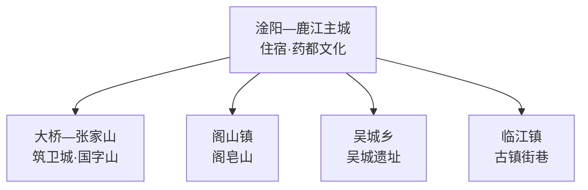
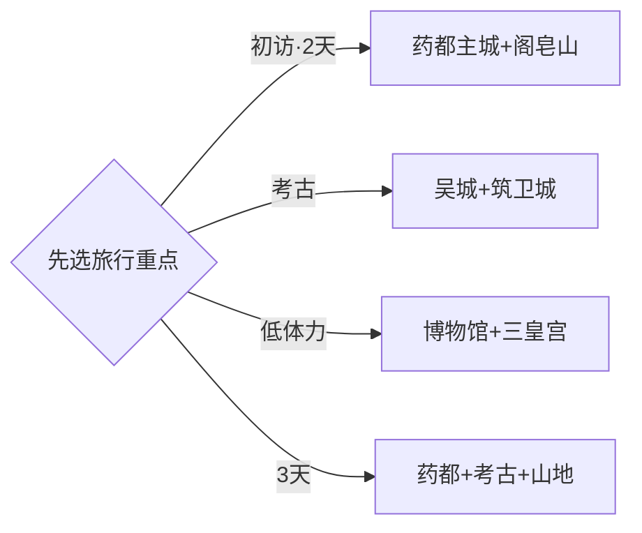

# 樟树旅行指南

樟树位于赣江中游，适合按“药都文化—商代考古—阁皂山”三条线来选。初访者住在淦阳、鹿江一带，用一天认识樟帮中药炮制和三皇宫，再从吴城遗址与阁皂山中选择一条远线；考古爱好者可把筑卫城—国字山加入第三天。固定快照中的 **Daqiao / GeoNames 1924728** 落在樟树市大桥街道范围，坐标、名称和宜春市行政层级闭合，因此映射到樟树市；丰城、新干与高安均按跨县级行政区行程处理。

> 建议停留：2–3 天\
> 旅行关键词：中国药都、樟帮炮制、三皇宫、吴城遗址、阁皂山\
> 主要体力：主城低；考古点中等；阁皂山中等至较高\
> 最近研究：2026-09-03

## 城市速览

| 项目 | 旅行信息 |
|---|---|
| 主要旅行价值 | 在药都街区理解中医药商贸与炮制传统，再用吴城和筑卫城认识赣江流域青铜文明 |
| 建议停留 | 2天安排主城与阁皂山或吴城；三条主线都想看可留3天 |
| 较舒适季节 | 春秋适合街区、遗址和登山；夏季关注高温雷雨；冬季留意湿冷和山路结冰 |
| 预算特点 | 主城消费温和，吴城与阁皂山的车辆、门票和讲解是主要变量 |
| 步行强度 | 主城低，遗址开放段中等，阁皂山按游线有连续台阶 |
| 主要天气风险 | 高温、雷暴、短时强降雨、山洪、雾和森林火险 |
| 独行旅行 | 主城容易安排，乡镇远线先确定返程和通信条件 |
| 亲子旅行 | 药都文化、博物馆和考古研学容易组合，户外段按年龄减量 |
| 长者与低体力旅行 | 以主城街区和室内展陈为主，阁皂山选择交通可达的开放点 |
| 无障碍信息 | 主城新建公共设施相对友好，历史建筑、遗址和山地需逐点确认 |

## 城市格局与游览区域

| 区域 | 主要内容 | 游览特点 | 与其他区域的关系 |
|---|---|---|---|
| 淦阳—鹿江主城 | 三皇宫、樟帮中医药街区、市博物馆与赣江公共空间 | 餐饮住宿集中，适合抵达日 | 作为考古和山地远线的共同基地 |
| 大桥—张家山 | 筑卫城、国字山及相关考古线索 | 以预约或批准开放范围为准 | 距主城较近，可与主城拼成一天 |
| 阁山镇 | 阁皂山、药文化与山林 | 山地游线受天气和防火影响 | 宜留半天至一天 |
| 吴城乡 | 吴城遗址及相关展陈 | 考古主题突出，开放方式需提前核实 | 适合单独半天以上 |
| 临江镇 | 历史街巷与赣派民居线索 | 适合慢走和观察城镇生活 | 可作为第三日替代线 |

## 主要景点

| 景点 | 区域 | 类型 | 主要看点 | 建议用时 | 室内外 | 体力 | 预约风险 | 天气影响 | 优先级 |
|---|---|---|---|---:|---|---|---|---|---|
| 樟树市博物馆 | 主城 | 博物馆 | 地方历史、中医药与考古线索 | 1.5–2小时 | 室内 | 低 | 中 | 低 | A |
| 三皇宫历史文化街区 | 主城 | 历史建筑与街区 | 药帮会馆、药商交往与城市记忆 | 1–2小时 | 混合 | 低 | 中 | 中 | A |
| 樟帮中医药公开展陈或体验点 | 主城 | 非遗与产业文化 | 炮制工具、药材辨识和行业传统 | 1–2小时 | 室内 | 低 | 高 | 低 | A |
| 阁皂山正式开放游线 | 阁山镇 | 山地与道教文化 | 山林、宫观与药文化源流 | 半天–1天 | 混合 | 中高 | 中高 | 很高 | A |
| 吴城遗址批准开放区及展陈 | 吴城乡 | 考古遗址 | 商代城址与赣江流域青铜文明 | 半天 | 混合 | 中 | 高 | 高 | A |
| 筑卫城—国字山批准开放点 | 大桥方向 | 考古遗址 | 古城与东周墓葬考古线索 | 2–3小时 | 室外 | 中 | 很高 | 高 | B |
| 临江镇历史街巷 | 临江镇 | 古镇与民居 | 旧街格局、赣派民居和地方生活 | 2–3小时 | 室外 | 低中 | 中 | 高 | B |
| 赣江沿岸公共空间 | 主城 | 江景与城市生活 | 赣江水系、桥梁与滨水城市景观 | 1–2小时 | 室外 | 低 | 低 | 很高 | C |

## 美食与餐饮

| 菜品或餐饮类型 | 常见区域 | 一个人用餐与常见份量 | 风味、过敏原与饮食限制 | 排队风险与替代方法 |
|---|---|---|---|---|
| 樟树清汤 | 主城早餐店与小吃店 | 一碗或一小份适合独行 | 常含猪肉、面粉或淀粉，先问馅料 | 早餐高峰可换社区同类店 |
| 米粉与瓦罐汤 | 主城 | 单份友好 | 辣椒、肉汤和配菜可分开选 | 选择翻台快的日常店 |
| 赣江水系家常鱼 | 主城正规餐馆 | 多人分享更合适，独行可问小份 | 注意鱼刺、辣度与水产来源 | 看明码标价，按人数点菜 |
| 药膳类餐饮 | 药都文化街区与正规餐馆 | 套餐常适合分享 | 先看配料；孕期、过敏或正在用药时咨询专业人士 | 把它当餐饮体验，不以功效宣传选店 |
| 临江与乡镇家常菜 | 临江、阁山、吴城正规餐馆 | 两三道小份可组合 | 口味偏咸辣时可提前说明 | 远线午餐提前确认营业时间 |

## 经典行程

### 一日经典路线

**路线**：樟树市博物馆 → 三皇宫历史文化街区 → 樟帮中医药公开展陈 → 赣江公共空间

- **串联逻辑**：用室内展陈建立背景，再到历史街区理解药商与城市空间。
- **预约锚点**：市博物馆、三皇宫及非遗体验的开放和讲解。
- **休息安排**：主城餐饮区与场馆公共空间。
- **时间不足时**：保留市博物馆和三皇宫，江边改为短停。

### 两日城市路线

**第 1 天**：主城博物馆 → 三皇宫 → 樟帮中医药文化。\
**第 2 天**：阁皂山正式开放游线。

- **串联逻辑**：先理解药都传统，再到阁山看药文化与山林环境的联系。
- **预约锚点**：非遗体验、阁皂山票务与景区交通。
- **休息安排**：主城连住；山地日使用正式服务区。
- **时间不足时**：第二日只选交通可达的核心开放点。

### 三日深度路线

**第 1 天**：主城药都文化。\
**第 2 天**：吴城遗址与相关展陈。\
**第 3 天**：阁皂山或筑卫城—国字山二选一。

- **串联逻辑**：药业传统、商代考古和山地人文分日展开，减少跨向折返。
- **预约锚点**：吴城、筑卫城—国字山的开放边界与讲解。
- **休息安排**：主城连住，远线日预留午间返程缓冲。
- **时间不足时**：先删第三日，再把吴城改为市博物馆考古展陈。

### 雨天路线

**路线**：樟树市博物馆 → 主城午餐 → 三皇宫室内开放部分 → 中医药公开展陈

- **适用条件**：普通降雨采用室内线；暴雨、雷电或赣江防汛响应时减少跨江和远线。
- **预约锚点**：各场馆临时闭馆与接待安排。
- **休息安排**：博物馆、街区正规餐饮与公共服务空间。
- **时间不足时**：保留市博物馆和一处药文化展陈。

### 亲子或低体力路线

**亲子路线**：市博物馆 → 药材辨识或炮制研学 → 三皇宫。\
**低体力路线**：市博物馆 → 车辆接驳三皇宫 → 主城休息。

- **减负方式**：亲子以可操作的研学活动串联；低体力线减少街巷连续步行和山地台阶。
- **预约锚点**：研学年龄要求、无障碍入口、停车和座椅。
- **休息安排**：场馆公共区与主城商业区。
- **时间不足时**：两类路线都优先保留市博物馆。

### 吴城考古路线

**路线**：主城出发 → 吴城遗址接待或展陈点 → 批准开放区 → 吴城乡公共空间 → 返回

- **适用条件**：适合遗址或相关展陈明确开放、道路正常的日期。
- **预约锚点**：开放入口、讲解、团体要求和返程车辆。
- **休息安排**：正式游客服务点与乡镇正规餐饮。
- **时间不足时**：保留一处有讲解的公开展陈，取消分散点位。

### 筑卫城与国字山路线

**路线**：主城 → 大桥方向公开考古展陈或接待点 → 筑卫城批准开放区 → 国字山相关展陈 → 返回

- **适用条件**：适合主管单位已确认开放范围、天气稳定的日期。
- **预约锚点**：文物管理要求、讲解、停车和现场作业安排。
- **休息安排**：主城补给后出发，在正式接待点休息。
- **时间不足时**：选择一处公开展陈，不追求多个野外点位。

## 住宿区域

| 区域 | 优点 | 缺点 | 适合人群 | 交通特点 |
|---|---|---|---|---|
| 淦阳—鹿江主城 | 餐饮、药都街区和城市服务集中 | 前往吴城和阁皂山仍需接驳 | 初访、独行、公共交通旅行者 | 适合作为各方向共同基地 |
| 樟树站周边 | 普通列车抵离方便 | 与部分主城景点仍有距离 | 早晚车、短住旅行者 | 订房时核对站名与进出站方式 |
| 樟树东站方向 | 高铁抵离方便 | 通常需要车辆进入主城 | 高铁往返、商务与家庭旅行者 | 预留接驳时间并核对末班 |
| 阁山正规住宿 | 靠近阁皂山 | 餐饮和夜间交通选择较少 | 自驾、山地慢游 | 按景区正式入口选择 |

## 市内交通

| 场景 | 建议与取舍 | 行前需要重查的内容 |
|---|---|---|
| 从南昌或宜春抵达 | 先区分樟树站与樟树东站，再按住宿位置选车次 | 车次、站名、接驳和末班 |
| 主城—阁皂山 | 留半天以上，按景区正式入口和交通方式往返 | 票务、景交、防火与返程 |
| 主城—吴城 | 单独安排半天以上，公共交通不便时选择正规车辆 | 遗址开放、道路、叫车覆盖与末班 |
| 主城—筑卫城或临江 | 每天选一个方向，先确认接待点再出发 | 开放范围、停车和乡镇返程 |
| 赣江两岸通行 | 根据桥梁、汛情和道路施工安排路线 | 防汛、交通管制和导航更新 |

## 不同旅行者须知

| 旅行维度 | 可行条件 | 主要取舍 | 需额外核对 |
|---|---|---|---|
| 独行旅行 | 主城交通餐饮较集中 | 远线晚间返程选择少 | 末班、叫车覆盖与通信 |
| 亲子旅行 | 博物馆、药材辨识和考古研学可组合 | 山地与遗址户外段受天气影响 | 年龄要求、讲解和休息点 |
| 长者或低体力旅行 | 主城室内线负担较低 | 阁皂山台阶和遗址地面较费力 | 无障碍入口、座椅和景交 |
| 无障碍需求 | 新建公共场馆优先 | 历史建筑、遗址和山地连续性有限 | 电梯、坡道、卫生间与陪同 |
| 摄影旅行 | 药都街区、赣江和遗址题材多样 | 文物与企业场所拍摄规则不同 | 三脚架、闪光灯、航拍和肖像授权 |
| 预算有限 | 主城住宿餐饮选择较多 | 两条远线车辆会增加支出 | 公交、拼车、门票与退改 |
| 晚出发或紧凑行程 | 主城可安排半日 | 吴城与阁皂山需要完整时段 | 最晚入场和返程 |
| 特殊天气或自然条件 | 普通小雨可转室内药都文化线 | 暴雨、雾、山洪和火险影响远线 | 气象、景区、道路与防汛公告 |

吴城、筑卫城、国字山及其他考古点按文物保护和批准展示范围参观；药厂、药材仓库、质检区与加工车间按生产安全和企业接待边界进入。药材体验以文化和工艺认知为主，购买与使用药品遵循正规渠道和专业医疗建议。阁皂山、赣江岸线和乡村只使用正式开放游线与公共道路，防火、防汛或考古作业期按主管部门公告调整。

## 行前核对

| 核对事项 | 为什么需要重查 | 建议核对时间 | 官方入口 |
|---|---|---|---|
| 市博物馆、三皇宫与药文化体验 | 闭馆、活动和团队接待会变化 | 排入行程前及到访前一日 | [樟树市人民政府](https://www.zhangshu.gov.cn/) |
| 阁皂山开放、票务与景交 | 天气、防火、维护和活动影响游线 | 出发前三日及当天 | [樟树市人民政府](https://www.zhangshu.gov.cn/) |
| 吴城与筑卫城—国字山开放边界 | 考古、保护工程和讲解安排会变化 | 订车前及到访前一日 | [国家文物局](https://www.ncha.gov.cn/) |
| 雷暴、山洪与赣江水位 | 山地、遗址和岸线受影响 | 出发前三日及当天 | [江西省气象局](http://jx.cma.gov.cn/) |
| 铁路与乡镇接驳 | 车次、站点和末班会变化 | 购票前及当天 | [中国铁路12306](https://www.12306.cn/) |

## 来源与更新记录

### 主要来源

| 来源 | 类型 | 支持内容 | 核验日期 |
|---|---|---|---|
| [樟树市人民政府](https://www.zhangshu.gov.cn/) | 政府 | 市域管理、公共服务与动态公告入口 | 2026-09-03 |
| [国家文物局：大遗址保护利用“十四五”专项规划](https://www.ncha.gov.cn/art/2021/11/18/art_2318_45063.html) | 国家机关 | 吴城遗址（含筑卫城遗址）的大遗址身份与保护原则 | 2026-09-03 |
| [国家文物局：第八批全国重点文物保护单位名单](https://www.ncha.gov.cn/art/2019/10/18/art_2289_157100.html) | 国家机关 | 国字山墓群位于樟树市并入筑卫城遗址 | 2026-09-03 |
| [商务部老字号数字博物馆：药都](https://lzhbwg.mofcom.gov.cn/edi_ecms_web_front/thb/detail/676a1fde606747f198d18b90bc40030e) | 国家机关 | 樟树药业、樟帮炮制、三皇宫和公开工业旅游线索 | 2026-09-03 |
| [新华网：樟树中医药产业发展](https://www.news.cn/city/20230619/75a053de26f343cfa92a27e5ec7cc3c0/c.html) | 中央媒体 | 中国药都品牌、樟帮中医药街区与产业背景 | 2026-09-03 |
| [GeoNames 1924728](https://www.geonames.org/1924728/) | 开放数据 | Daqiao 固定人口点、坐标与行政代码 | 2026-09-03 |

### 更新记录

| 日期 | 更新内容 |
|---|---|
| 2026-09-03 | 首次完成资料研究、空间拆分、七条路线与县级市映射 |
