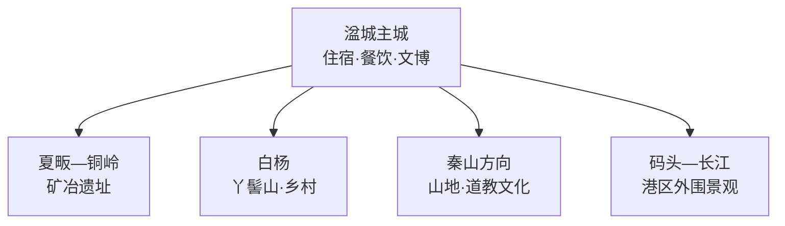
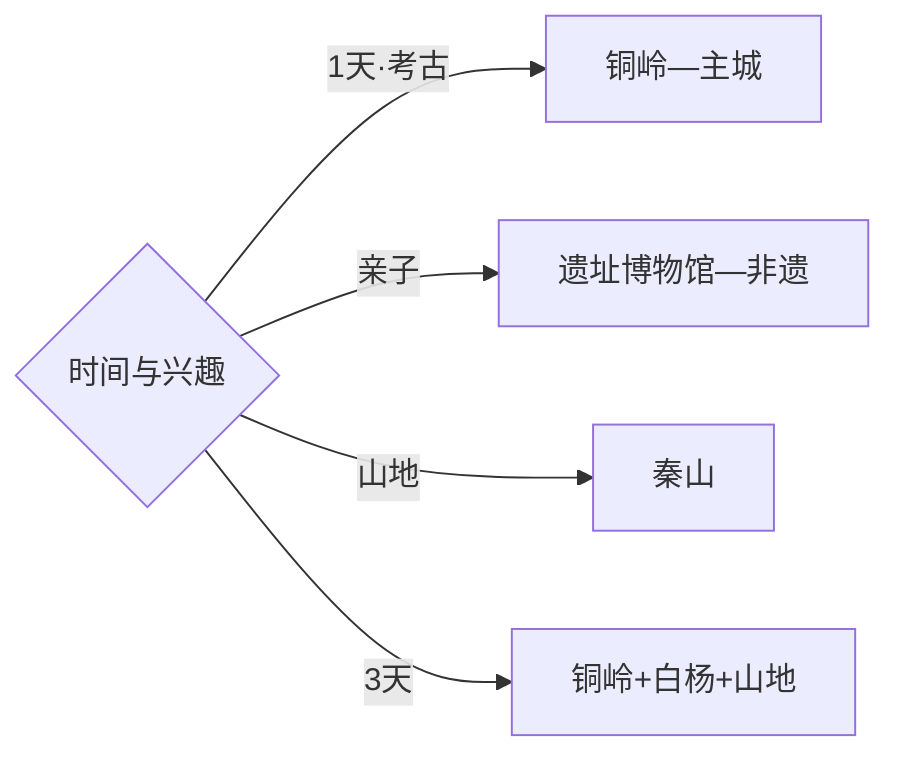

# 瑞昌旅行指南

瑞昌位于赣北长江南岸，最鲜明的旅行线索是三千余年的铜矿冶文明。湓城主城适合住宿和看地方文博，夏畈铜岭铜矿遗址值得留出完整半天，秦山与白杨等山乡则按天气和体力追加。固定快照中的 **Baiyang / GeoNames 7643655** 对应瑞昌市白杨镇，坐标、行政代码与现行县级市范围闭合；九江主城、湖北武穴和大冶均按跨市行程计算。

> 建议停留：2–3 天\
> 旅行关键词：铜岭铜矿、青铜文明、瑞昌竹编、秦山、长江南岸\
> 主要体力：主城低；遗址中等；山地中等至较高\
> 最近研究：2026-09-03

## 城市速览

| 项目 | 旅行信息 |
|---|---|
| 主要旅行价值 | 从铜岭遗址理解商周矿冶技术，再看赣北非遗、山地与沿江生活 |
| 建议停留 | 2天覆盖主城与铜岭；增加秦山、竹编体验或白杨乡村可安排3天 |
| 较舒适季节 | 春秋适合遗址和山地；夏季注意高温雷雨；冬季关注山路湿滑 |
| 预算特点 | 主城消费温和，遗址接驳与山地车辆是主要变量 |
| 步行强度 | 博物馆较低，考古遗址中等，秦山按开放段有连续坡路 |
| 主要天气风险 | 高温、雷暴、短时强降雨、山洪、雾和森林火险 |
| 独行旅行 | 主城易安排，夏畈与山地先落实返程 |
| 亲子旅行 | 铜岭遗址博物馆和非遗体验适合研学，户外段安排补水与休息 |
| 长者与低体力旅行 | 选择主城—铜岭博物馆室内展陈，减少山地和遗址远段 |
| 无障碍信息 | 新建博物馆相对友好，遗址现场、村落和山路连续性需逐点确认 |

## 城市格局与游览区域

| 区域 | 主要内容 | 游览特点 | 与其他区域的关系 |
|---|---|---|---|
| 湓城主城 | 瑞昌市博物馆、竹编与城市服务 | 室内点集中，适合抵达日 | 作为铜岭和山地共同基地 |
| 夏畈—铜岭 | 铜岭铜矿遗址博物馆与考古遗址公园 | 以考古、工业文明和研学为主 | 宜留半天以上，可与主城同日 |
| 白杨 | 丫髻山、乡村历史与赤湖邻近区域 | 以正规接待点和公开步道为主 | 可作为第三日轻量补充 |
| 秦山方向 | 山地、森林与宗教文化 | 受天气、防火和开放范围影响 | 适合单独半天至一天 |
| 码头—长江 | 沿江城镇、港区外公共空间 | 工业港航边界明确 | 只在公共观景和开放文化点活动 |

## 主要景点

| 景点 | 区域 | 类型 | 主要看点 | 建议用时 | 室内外 | 体力 | 预约风险 | 天气影响 | 优先级 |
|---|---|---|---|---:|---|---|---|---|---|
| 铜岭铜矿遗址博物馆 | 夏畈镇 | 考古博物馆 | 商周采铜冶铜技术与出土遗存 | 2–3小时 | 室内 | 低 | 中高 | 低 | A |
| 铜岭铜矿考古遗址公园开放区 | 夏畈镇 | 考古遗址 | 采矿区、冶炼遗迹与矿冶环境 | 2–3小时 | 混合 | 中 | 中高 | 高 | A |
| 瑞昌市博物馆 | 湓城主城 | 博物馆 | 地方历史、铜矿文化与民俗 | 1.5–2小时 | 室内 | 低 | 中 | 低 | A |
| 瑞昌竹编公开展陈或体验点 | 主城 | 非遗 | 瑞昌竹编技艺、纹样与当代传承 | 1–2小时 | 室内 | 低 | 高 | 低 | B |
| 秦山正式开放游线 | 山地区域 | 山地与人文 | 山林、瀑布与道教文化线索 | 半天–1天 | 室外 | 中高 | 高 | 很高 | B |
| 白杨丫髻山公开步道 | 白杨镇 | 丘陵与乡村 | 双峰地貌和乡村视野 | 2–3小时 | 室外 | 中 | 中 | 高 | B |
| 赤湖公共观景点 | 东北方向 | 湖泊与湿地 | 湖面、候鸟季与水乡环境 | 1–2小时 | 室外 | 低 | 中 | 很高 | C |
| 码头镇沿江公共空间 | 长江沿线 | 港镇与江景 | 长江航运与赣北沿江生活 | 1–2小时 | 室外 | 低 | 低 | 高 | C |

## 美食与餐饮

| 菜品或餐饮类型 | 常见区域 | 一个人用餐与常见份量 | 风味、过敏原与饮食限制 | 排队风险与替代方法 |
|---|---|---|---|---|
| 瑞昌山药菜肴 | 主城与乡镇 | 小炒或炖汤可按人数点 | 山药黏液可能引起接触不适 | 选家常店并按份量点单 |
| 鱼头与长江水系家常鱼 | 主城正规餐馆 | 多适合分享，独行可问鱼片小份 | 鱼刺、辣椒和来源先确认 | 选明码标价与合法来源水产 |
| 糯米粑与米制小吃 | 市场、早餐店 | 单份友好 | 糯米不易消化，馅料可能含芝麻花生 | 上午选择多，少量尝试 |
| 赣北瓦罐汤与米粉 | 主城 | 单份友好 | 肉汤、辣椒和面筋按配料选择 | 早餐高峰可换社区同类店 |
| 竹笋与山野时蔬 | 山乡正规餐馆 | 小份易搭配 | 按季节供应，野生食材确认来源 | 选择正规餐饮，不自行采食 |

## 经典行程

### 一日经典路线

**路线**：铜岭铜矿遗址博物馆 → 遗址公园开放区 → 夏畈午餐 → 瑞昌市博物馆

- **串联逻辑**：先在原址理解矿冶技术，再回主城补全地方历史。
- **预约锚点**：铜岭博物馆和遗址讲解。
- **休息安排**：博物馆公共区与夏畈正规餐饮点。
- **时间不足时**：保留铜岭博物馆，遗址室外段按天气缩短。

### 两日城市路线

**第 1 天**：湓城主城 → 瑞昌市博物馆 → 竹编体验。\
**第 2 天**：铜岭博物馆与考古遗址公园。

- **串联逻辑**：地方文化和矿冶考古分日，第二日保持完整学习节奏。
- **预约锚点**：竹编体验、铜岭讲解与交通。
- **休息安排**：主城连住，第二日在游客中心休息。
- **时间不足时**：首日压缩为市博物馆半日。

### 三日深度路线

**第 1 天**：主城文博与非遗。\
**第 2 天**：铜岭矿冶遗址。\
**第 3 天**：秦山或白杨乡村线。

- **串联逻辑**：城市文化、考古现场和山地乡村各占一天。
- **预约锚点**：第三日开放路线、车辆和防火公告。
- **休息安排**：主城连住，山地日带足饮水。
- **时间不足时**：先删第三日，再压缩主城为半日。

### 雨天路线

**路线**：铜岭铜矿遗址博物馆 → 主城午餐 → 瑞昌市博物馆 → 竹编公开展陈

- **适用条件**：普通降雨采用室内线；暴雨和山洪预警时留在主城。
- **预约锚点**：场馆开放与非遗接待。
- **休息安排**：两座博物馆和主城商业区。
- **时间不足时**：保留铜岭博物馆深度参观。

### 亲子或低体力路线

**亲子路线**：铜岭博物馆 → 研学活动 → 竹编体验。\
**低体力路线**：瑞昌市博物馆 → 铜岭博物馆室内展陈 → 主城休息。

- **减负方式**：亲子用讲解串联技术线索；低体力线以车辆连接并减少遗址和山路。
- **预约锚点**：研学、无障碍入口和停车。
- **休息安排**：场馆公共区与主城。
- **时间不足时**：两类路线均保留铜岭博物馆。

### 铜岭考古路线

**路线**：游客中心 → 铜岭博物馆 → 考古遗址批准开放区 → 研学中心或村落公共空间

- **适用条件**：适合场馆和遗址室外区均开放的日期。
- **预约锚点**：讲解、遗址开放和团队接待。
- **休息安排**：游客中心与博物馆。
- **时间不足时**：按讲解顺序保留核心展厅和一处遗址展示。

### 山地与乡村路线

**路线**：主城出发 → 秦山或白杨丫髻山二选一 → 乡镇午餐 → 返回

- **串联逻辑**：一天只选一座山，兼顾山路、天气和返程。
- **预约锚点**：开放入口、道路、防火和乡村接待。
- **休息安排**：乡镇正规餐饮点和正式服务区。
- **时间不足时**：保留山脚公共景观，取消上行长线。

## 住宿区域

| 区域 | 优点 | 缺点 | 适合人群 | 交通特点 |
|---|---|---|---|---|
| 湓城主城 | 餐饮、住宿和交通集中 | 前往铜岭与山地需接驳 | 首访、独行、公共交通旅行者 | 适合作为多方向共同基地 |
| 瑞昌站周边 | 抵离方便 | 夜间体验少于主城核心 | 短住、早晚车旅行者 | 先核对到市中心距离 |
| 夏畈正规住宿 | 靠近铜岭遗址 | 房型和餐饮选择较少 | 考古研学、团队 | 订房前确认到景区入口距离 |
| 山乡正规民宿 | 安静、靠近山地 | 天气和道路影响较大 | 自驾、慢游 | 按具体开放点选择 |

## 市内交通

| 场景 | 建议与取舍 | 行前需要重查的内容 |
|---|---|---|
| 从九江或南昌抵达 | 铁路与公路均可，先到瑞昌站或主城再分线 | 车次、客运站与末班 |
| 主城—铜岭 | 留半天以上，公共交通不足时使用正规车辆 | 景区接驳、开放和返程 |
| 主城—秦山或白杨 | 一天选择一个方向，按天气决定上山范围 | 山路、防火、停车和补给 |
| 码头沿江方向 | 公路连接，港区外围选择公共观景点 | 港航作业、堤防管制和水位 |

## 不同旅行者须知

| 旅行维度 | 可行条件 | 主要取舍 | 需额外核对 |
|---|---|---|---|
| 独行旅行 | 主城交通餐饮方便 | 乡镇返程选择较少 | 末班、叫车覆盖与接驳 |
| 亲子旅行 | 铜岭博物馆和竹编体验易组合 | 遗址室外段受天气影响 | 研学预约、防晒和休息点 |
| 长者或低体力旅行 | 双博物馆路线负担较低 | 山地和遗址步道较重 | 无障碍入口、座椅与车辆 |
| 无障碍需求 | 新建博物馆优先 | 遗址现场和乡村连续性有限 | 电梯、坡道与卫生间 |
| 摄影旅行 | 遗址、竹编和山地题材丰富 | 文物与矿区拍摄规则不同 | 三脚架、闪光灯与航拍 |
| 预算有限 | 主城住宿和博物馆成本较稳 | 远线车辆增加支出 | 公交、拼车与退改 |
| 晚出发或紧凑行程 | 主城博物馆可做半日 | 铜岭适合完整半天 | 最晚入馆与返程 |
| 特殊天气或自然条件 | 普通小雨可转室内文博线 | 暴雨、雾和火险影响山地 | 气象、景区与道路公告 |

铜岭遗址、考古工作区和矿冶遗存按文物保护与批准展示范围参观；现代矿山、码头、港区、仓储和铁路作业区按生产安全边界通行。长江岸线、赤湖、山林与乡村使用公共道路和正式开放空间，防汛或高火险期按主管部门公告调整。

## 行前核对

| 核对事项 | 为什么需要重查 | 建议核对时间 | 官方入口 |
|---|---|---|---|
| 铜岭博物馆与遗址开放 | 展陈维护、考古工作和团队活动会变化 | 预约前及到访前一日 | [瑞昌市人民政府](http://www.ruichang.gov.cn/) |
| 市博物馆与非遗体验 | 闭馆、临展和接待安排会调整 | 排入行程前 | [九江市人民政府](https://www.jiujiang.gov.cn/) |
| 秦山与白杨山地路线 | 道路、天气和森林防火决定可走范围 | 出发前三日及当天 | [瑞昌市人民政府](http://www.ruichang.gov.cn/) |
| 雷暴、山洪与长江水位 | 遗址室外段、山地和岸线受影响 | 出发前三日及当天 | [江西省气象局](http://jx.cma.gov.cn/) |
| 铁路与乡镇接驳 | 班次、站点和末班会变化 | 购票前及当天 | [中国铁路12306](https://www.12306.cn/) |

## 来源与更新记录

### 主要来源

| 来源 | 类型 | 支持内容 | 核验日期 |
|---|---|---|---|
| [瑞昌市人民政府](http://www.ruichang.gov.cn/) | 政府 | 市域管理、公共服务与动态公告入口 | 2026-09-03 |
| [九江市政府驻深圳办：印象瑞昌](https://szfzsb.jiujiang.gov.cn/ftrq_233/jjts/202209/t20220904_5688857.html) | 政府 | 铜岭遗址、秦山与瑞昌竹编等旅行资源 | 2026-09-03 |
| [新华网：铜岭铜矿遗址博物馆开馆](https://www.news.cn/city/20241010/e86a13aadc4a4f97a6e29580ff336ab5/c.html) | 中央媒体 | 博物馆展陈、遗址公园与研学设施 | 2026-09-03 |
| [GeoNames 7643655](https://www.geonames.org/7643655/) | 开放数据 | Baiyang 固定人口点、坐标与行政代码 | 2026-09-03 |

### 更新记录

| 日期 | 更新内容 |
|---|---|
| 2026-09-03 | 首次完成资料研究、空间拆分、七条路线与县级市映射 |
