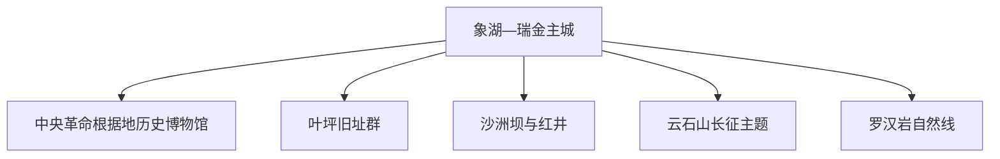
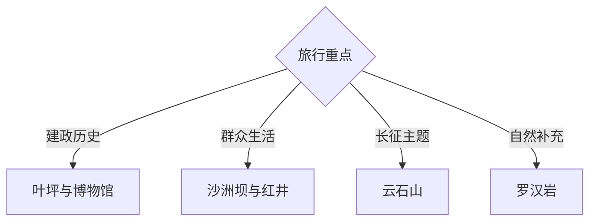

# 瑞金旅行指南

瑞金位于赣南，以叶坪、沙洲坝、云石山等革命旧址群为核心，并由中央革命根据地历史博物馆、绵江城市空间、客家村落和罗汉岩山水补充。固定快照中的 **Xianghu / GeoNames 1790568** 对应象湖主城；红色旧址群分布在不同乡镇，适合按主题和交通分日。

## 城市速览

| 项目 | 信息 |
|---|---|
| 主线 | 象湖主城—叶坪—沙洲坝—云石山—罗汉岩 |
| 停留 | 红色核心 2 天；增加自然或客家主题共 3 天 |
| 住宿 | 象湖主城便于餐饮交通；景区周边住宿适合早入场 |
| 交通 | 铁路、公路与景区接驳组合，旧址群之间需车辆 |
| 季节 | 春秋舒适；夏季避开正午；汛期关注山区和绵江水位 |
| 预算 | 多数成本来自住宿、讲解与跨点车辆 |

## 城市格局与游览区域

主城承担铁路、住宿与综合服务；叶坪、沙洲坝、云石山分别承载苏区建政、群众生活和长征出发等不同叙事。革命旧址、烈士纪念设施、文物库房、自然保护地和乡村生产空间按纪念礼仪、开放时间与保护边界进入。

## 主要景点

| 景点 | 区域 | 类型 | 核心体验 | 用时 | 环境 | 体力 | 研究价值 | 拥挤 | 优先级 |
|---|---|---|---|---:|---|---|---|---|---|
| 叶坪革命旧址群 | 叶坪镇 | 革命旧址 | 中华苏维埃共和国早期建政史 | 半天 | 混合 | 低中 | 很高 | 节假日高 | A |
| 沙洲坝革命旧址群与红井 | 沙洲坝镇 | 革命旧址 | 中央机关、群众生活与红井叙事 | 半天 | 混合 | 低中 | 很高 | 节假日高 | A |
| 中央革命根据地历史博物馆 | 主城方向 | 博物馆 | 苏区历史、制度与文物系统展陈 | 3小时 | 室内 | 低 | 很高 | 团体时高 | A |
| 云石山长征主题公开区 | 云石山乡 | 革命旧址 | 中央红军长征出发历史与山地空间 | 半天 | 混合 | 中 | 很高 | 纪念日中高 | A |
| 二苏大旧址等核心公开点 | 沙洲坝方向 | 革命旧址 | 苏区制度、会议与建筑空间 | 2–3小时 | 混合 | 低 | 很高 | 团体时中高 | A |
| 绵江与主城公共文化空间 | 象湖 | 城市街区 | 红都城市、河流与当代生活 | 2小时 | 室外 | 低 | 中 | 傍晚中 | B |
| 罗汉岩依法开放区 | 壬田方向 | 山水与红色历史 | 丹霞山水、宗教文化与游击区历史 | 1天 | 室外 | 中高 | 高 | 节假日中 | B |

## 美食与餐饮

瑞金牛肉汤、米果、芋子饺、鱼丸和客家小炒适合在主城分餐体验。团队餐常按桌计，独行者选择汤粉、小吃和小份菜；对辣椒、猪油、花生和酒酿有需求时提前说明。

## 经典行程

### 红色核心一日线
**路线**：中央革命根据地历史博物馆—叶坪旧址群—主城。**逻辑**：先建立整体历史，再看建政现场。**预约锚点**：博物馆和讲解。**休息**：叶坪或主城。**删除条件**：时间不足时保留博物馆与叶坪核心。

### 沙洲坝专题线
**路线**：沙洲坝旧址群—红井—二苏大公开点—返城。**逻辑**：集中理解中央机关与群众生活。**预约锚点**：景区和团队讲解。**休息**：游客中心。**删除条件**：客流高时按现场单向路线删减。

### 长征主题线
**路线**：主城—云石山公开区—沿线纪念点—返程。**逻辑**：给长征出发历史半天以上。**预约锚点**：场馆与车辆。**休息**：乡镇服务点。**删除条件**：强降雨或山路调整时改主城文博。

### 罗汉岩山水线
**路线**：主城—罗汉岩景区—依法开放步道—返程。**逻辑**：用完整一天补充自然与游击区历史。**预约锚点**：景区和道路。**休息**：游客中心。**删除条件**：山洪、雷暴或地质预警时顺延。

### 主城慢行线
**路线**：地方文博—红都公共街区—绵江公共空间—客家晚餐。**逻辑**：以低强度观察城市记忆。**预约锚点**：场馆。**休息**：象湖。**删除条件**：高温时缩短滨水段。

### 亲子低体力线
**路线**：历史博物馆—叶坪短线—主城休息。**逻辑**：室内先行、旧址点位少而清晰。**预约锚点**：儿童讲解。**休息**：馆区与游客中心。**删除条件**：疲劳时只保留博物馆。

### 三日组合线
**路线**：首日博物馆与叶坪；次日沙洲坝与云石山；第三日罗汉岩或客家乡村。**逻辑**：叙事与方向分日。**预约锚点**：讲解与第三日车辆。**休息**：连续住主城。**删除条件**：两天时删除第三日。

## 住宿区域

象湖主城适合铁路、餐饮和多方向出发；叶坪或沙洲坝周边正规住宿便于早入旧址群；乡村住宿适合自然线。订房核对团队噪声、停车、早餐、夜间接驳和汛期退改。

## 市内交通

瑞金站与公路客运承担主要抵达，机场等新设施以当期官方运行信息为准。主城用公交、出租车和网约车；旧址群、云石山与罗汉岩提前安排景区接驳或车辆，预留团体客流时间。

## 不同旅行者须知

历史旅行者先看博物馆再进旧址；亲子家庭选择少量核心点和儿童讲解；长者减少连续站立与正午户外；摄影者尊重纪念设施礼仪。革命旧址非开放房间、文物保护区、烈士纪念核心空间、自然保护核心区和河道封控区保留明确限制。

## 行前核对

- 核对博物馆、叶坪、沙洲坝、云石山和罗汉岩开放。
- 核对讲解预约、团体客流、纪念活动与单向游线。
- 核对瑞金站、景区接驳、乡村车辆与返程。
- 核对高温、暴雨、山洪、地质灾害与森林火险。

## 来源与更新记录

| 来源 | 支持内容 | 核验日期 |
|---|---|---|
| [瑞金市政府：十四五规划](https://www.ruijin.gov.cn/rjsxxgk/rjin79480/202503/62d82a993fad47bfad4d63aaf795f772.shtml) | 叶坪、沙洲坝、云石山、罗汉岩与全域旅游格局 | 2026-09-03 |
| [瑞金市政府：叶坪与红井旅游动态](https://www.ruijin.gov.cn/rjsrmzfyyh/c104417/202504/a79d58cbe96e408097ce4ae478239855.shtml) | 叶坪、红井、研学与节假日客流 | 2026-09-03 |
| [GeoNames 1790568](https://www.geonames.org/1790568/) | Xianghu 固定人口点与瑞金主城位置 | 2026-09-03 |

