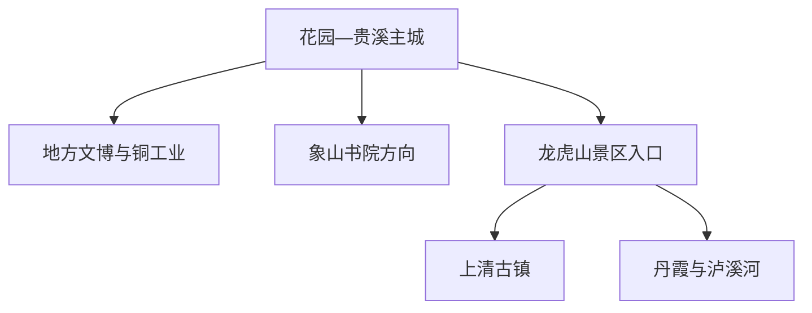
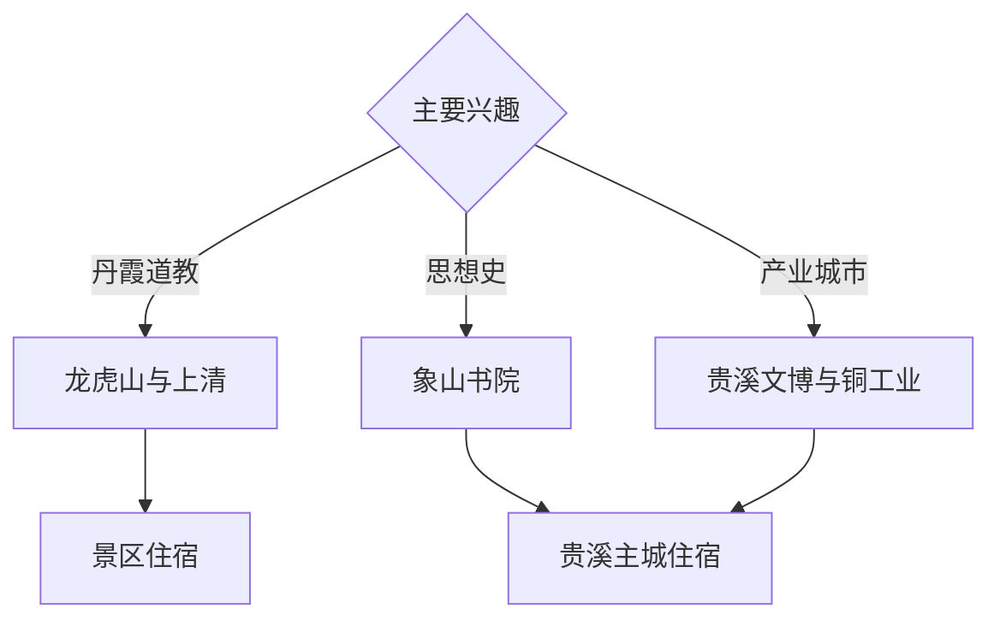

# 贵溪旅行指南

贵溪位于信江中游，以铜工业、象山心学、龙虎山丹霞与道教文化、上清古镇和乡村山水构成旅行主线。固定快照中的 **Huayuan / GeoNames 1788406** 对应花园—主城一带；龙虎山风景区由专门管理体系运营，页面按实际入口与属地边界安排，而不是把整个鹰潭市都并入贵溪。

## 城市速览

| 项目 | 信息 |
|---|---|
| 主线 | 贵溪主城—铜工业展陈—象山书院—龙虎山与上清 |
| 停留 | 主城与文化线 1 天；龙虎山核心另留 1–2 天 |
| 住宿 | 贵溪主城适合铁路与产业线；龙虎山游客区适合山水慢游 |
| 交通 | 铁路、公路与景区交通组合，先确认实际到站和入口 |
| 季节 | 春秋适合丹霞与古镇；汛期关注泸溪河水位和游船 |
| 预算 | 景区票制、景交与住宿是主要成本，主城消费平实 |

## 城市格局与游览区域

主城区沿信江与铁路展开；铜产业区、象山书院、龙虎山游客区和上清古镇各有独立交通。龙虎山是跨多种保护与管理边界的景区体系，丹霞崖壁、崖墓、河道、宗教场所、考古点和生产厂区均按正式开放范围活动。

## 主要景点

| 景点 | 区域 | 类型 | 核心体验 | 用时 | 环境 | 体力 | 研究价值 | 拥挤 | 优先级 |
|---|---|---|---|---:|---|---|---|---|---|
| 龙虎山风景区核心公开区 | 龙虎山方向 | 丹霞与道教文化 | 丹霞峰林、泸溪河、崖墓与道教历史 | 1–2天 | 混合 | 中 | 很高 | 旺季高 | A |
| 象山书院依法开放区 | 应天山方向 | 书院与思想史 | 陆九渊、心学源流与山林书院空间 | 半天 | 混合 | 中 | 很高 | 低 | A |
| 上清古镇公开街区 | 上清方向 | 古镇与道教文化 | 古镇、水系、宫观历史与居民生活 | 半天 | 室外 | 低中 | 高 | 节假日中高 | A |
| 贵溪地方文博 | 主城区 | 博物馆 | 信江流域、地方历史与铜工业城市 | 2–3小时 | 室内 | 低 | 高 | 低 | B |
| 正式开放铜产业展示点 | 工业区 | 工业研学 | 铜冶炼、材料产业与城市发展 | 半天 | 室内 | 低 | 很高 | 预约制 | A |
| 信江公共滨水空间 | 主城区 | 河流与城市公园 | 河谷城市、慢行与日常生活 | 2小时 | 室外 | 低 | 中 | 傍晚中 | B |
| 耳口等依法开放山地乡村 | 市域南部 | 山地与乡村 | 武夷山余脉、古村与季节生态 | 1天 | 室外 | 中高 | 中 | 季节性 | C |

## 美食与餐饮

贵溪适合寻找江西米粉、灯芯糕、板栗烧肉、河鲜与赣东北家常菜。主城一人用餐方便，景区以套餐和游客餐居多；点餐时说明辣度、鱼刺、坚果和酒糟等需求。

## 经典行程

### 贵溪主城线
**路线**：地方文博—午餐—正式开放铜产业展示—信江公共空间。**逻辑**：从流域历史进入现代产业。**预约锚点**：工业接待。**休息**：主城。**删除条件**：企业停接时保留文博和滨水。

### 龙虎山一日线
**路线**：游客中心—一组丹霞与文化核心—景交或游船—住宿。**逻辑**：按景区交通减少折返。**预约锚点**：门票、景交、游船。**休息**：游客区。**删除条件**：水位或天气变化时按景区调整。

### 龙虎山两日线
**路线**：首日丹霞与泸溪河；次日上清古镇与另一组公开点。**逻辑**：山水与人文拆日。**预约锚点**：连续票制与住宿。**休息**：景区周边。**删除条件**：一天时选开放稳定的核心组团。

### 象山书院线
**路线**：主城—象山书院公开区—乡村午餐—返程。**逻辑**：以完整半天理解心学源流。**预约锚点**：场馆和车辆。**休息**：沿线正规服务点。**删除条件**：山路或场馆关闭时改主城文博。

### 上清古镇线
**路线**：龙虎山游客区—上清古镇—依法开放文化设施—返程。**逻辑**：集中在同一文化地理方向。**预约锚点**：景交与场馆。**休息**：古镇商业区。**删除条件**：大型宗教活动时服从现场分流。

### 亲子低体力线
**路线**：地方文博—龙虎山低坡公开点—景交观景。**逻辑**：减少长阶梯与连续换乘。**预约锚点**：儿童票与游船。**休息**：游客中心。**删除条件**：天气差时只保留文博。

### 三日组合线
**路线**：首日贵溪主城；次日龙虎山；第三日象山书院或上清。**逻辑**：产业、山水和思想史分层。**预约锚点**：景区住宿与工业接待。**休息**：按次日方向换宿。**删除条件**：两天时取消主城或书院其一。

## 住宿区域

贵溪主城适合铁路、产业与城市线；龙虎山游客区适合连续景区游览；上清周边正规住宿适合古镇早晚。订房核对景区接驳、停车、潮湿天气、夜间交通和退改。

## 市内交通

贵溪站、贵溪北站及鹰潭方向铁路枢纽服务不同车次，订票后核对实际到站。主城用公交、出租车和网约车；龙虎山按景区交通；象山书院和山地乡村提前安排车辆。

## 不同旅行者须知

地质旅行者给龙虎山完整一天；思想史旅行者优先象山书院；产业旅行者预约铜业展示；亲子与长者选择景交覆盖的低坡路线。丹霞崖壁、崖墓保护区、宗教非开放空间、河道封航段、铜冶炼厂区和自然保护核心区保留明确限制。

## 行前核对

- 核对龙虎山门票、景交、游船、水位与各组团开放。
- 核对象山书院、上清场馆、地方文博和工业接待。
- 核对贵溪与鹰潭铁路站点、换乘和末班返程。
- 核对暴雨、雷电、山洪、地质灾害和森林火险。

## 来源与更新记录

| 来源 | 支持内容 | 核验日期 |
|---|---|---|
| [生态中国：龙虎山风景名胜区](https://www.eco.gov.cn/news_info/40344.html) | 龙虎山丹霞、道教、崖墓与象山书院 | 2026-09-03 |
| [北京市规划自然资源委：历史文化名城保护法规汇编](https://ghzrzyw.beijing.gov.cn/zhengwuxinxi/zxzt/bjslswhmc/flfg/flfg/201912/P020230526426101281647.pdf) | 龙虎山、上清宫与象山书院的法定风景名胜资料 | 2026-09-03 |
| [GeoNames 1788406](https://www.geonames.org/1788406/) | Huayuan 固定人口点与贵溪主城位置 | 2026-09-03 |

