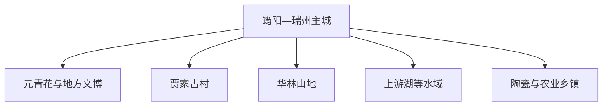
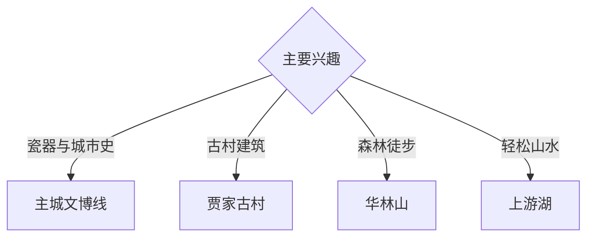

# 高安旅行指南

高安位于赣西平原与丘陵过渡带，旅行重点集中在元青花、古郡城市史、贾家古村、华林山地与地方陶瓷农业。固定快照中的 **Junyang / GeoNames 1785657** 对应筠阳主城；古村与山地分别位于不同乡镇方向。

## 城市速览

| 项目 | 信息 |
|---|---|
| 主线 | 筠阳主城—元青花—贾家古村—华林山地—乡村产业 |
| 停留 | 主城 1 天；古村或山地方向各另留 1 天 |
| 住宿 | 筠阳—瑞州主城交通餐饮便利；山地住宿适合慢游 |
| 交通 | 公路与铁路抵达，乡镇景点宜约车或自驾 |
| 季节 | 春秋适合古村山地；夏季关注高温、暴雨与雷电 |
| 预算 | 文博城市线支出较低，山地车辆与住宿增加预算 |

## 城市格局与游览区域

主城适合文博、餐饮和接驳；贾家古村偏建筑与聚落，华林方向偏山地自然，上游湖及乡村产业点按独立半日或一日安排。古建、林地防火区、水库管理区与生产车间依正式开放边界进入。

## 主要景点

| 景点 | 区域 | 类型 | 核心体验 | 用时 | 环境 | 体力 | 研究价值 | 拥挤 | 优先级 |
|---|---|---|---|---:|---|---|---|---|---|
| 高安元青花博物馆 | 主城 | 博物馆 | 元代窖藏、青花瓷与地方收藏史 | 2–3 小时 | 室内 | 低 | 很高 | 节假日中 | A |
| 大观楼及公开历史空间 | 主城 | 城市历史 | 古郡记忆、城市轴线与公共生活 | 1–2 小时 | 混合 | 低 | 高 | 中 | A |
| 贾家古村公开区 | 新街方向 | 古村 | 赣派建筑、宗祠、巷道与聚落格局 | 半天至 1 天 | 混合 | 低中 | 很高 | 节假日中高 | A |
| 华林山依法开放区 | 华林方向 | 山地 | 丘陵森林、古道与乡村景观 | 1 天 | 室外 | 中高 | 高 | 季节性 | B |
| 上游湖公开游览区 | 市域山水 | 湖泊 | 水库景观、休闲与山水组合 | 半天 | 室外 | 低中 | 中 | 周末中 | B |
| 八百洞天等依法开放点 | 乡镇 | 岩溶与山地 | 洞穴地貌与地方景观 | 半天 | 混合 | 中 | 中 | 季节性 | C |
| 陶瓷或农业公开体验点 | 产业乡镇 | 产业体验 | 建陶、稻作与地方生产体系 | 半天 | 混合 | 低 | 中 | 预约制 | C |

## 美食与餐饮

高安腐竹、米粉、米馃、地方肉菜和赣西小炒适合在主城分顿体验。乡镇餐饮提前确认营业；腐竹和米制品可观察制作传统，进入生产空间需取得接待许可并遵守卫生与安全要求。

## 经典行程

### 主城一日线
**路线**：元青花博物馆—地方午餐—大观楼及城市公共空间。**逻辑**：用代表性馆藏连接古郡与当代城市。**预约锚点**：博物馆开放。**休息**：主城。**删除条件**：场馆闭馆时改为半日城市慢行。

### 元青花专题线
**路线**：博物馆常设展—专题展—陶瓷资料整理。**逻辑**：为重要馆藏保留充足观察时间。**预约锚点**：讲解与临展。**休息**：馆内公共区。**删除条件**：时间不足时保留常设展。

### 贾家古村线
**路线**：主城—贾家古村公开街巷—古建外观—返程。**逻辑**：完整阅读聚落格局。**预约锚点**：重点建筑开放。**休息**：新街镇。**删除条件**：大型活动或暴雨时顺延。

### 华林山地线
**路线**：主城—山地入口—依法开放步道—返程。**逻辑**：独立一天承接山路尺度。**预约锚点**：防火与道路公告。**休息**：游客服务点。**删除条件**：雷雨、山洪、地质或防火封控时整段取消。

### 上游湖轻松线
**路线**：主城—上游湖公开区—乡镇午餐—返程。**逻辑**：以较低体力体验湖山。**预约锚点**：开放和交通。**休息**：正规服务区。**删除条件**：水库管理或恶劣天气时改主城。

### 亲子低体力线
**路线**：元青花博物馆—主城午餐—短段公园。**逻辑**：室内为主并保留活动弹性。**预约锚点**：亲子活动。**休息**：主城。**删除条件**：疲劳时只保留博物馆。

### 两日组合线
**路线**：首日主城文博；次日贾家古村、华林山或上游湖三选一。**逻辑**：远郊方向分日。**预约锚点**：第二日车辆。**休息**：连续住主城。**删除条件**：一天时保留主城线。

## 住宿区域

筠阳—瑞州主城适合文博、餐饮与交通接驳；华林方向的正规住宿适合山地慢游。订房核对夜间返程、消防、停车、早餐和恶劣天气退改。

## 市内交通

主城以公交、出租车和步行为主；贾家古村、华林山、上游湖与产业乡镇提前确认城乡班次和返程。自驾进入古村窄路、山路与水库周边时按现场交通组织停车。

## 不同旅行者须知

陶瓷爱好者优先元青花博物馆；建筑旅行者给贾家古村半天以上；亲子与长者以主城文博和湖区低坡段为主；徒步者根据防火和天气选择山路。文物展柜、古建内部、未开放洞段、水源保护区与生产车间保留明确限制。

## 行前核对

- 核对元青花博物馆、贾家古村重点建筑及讲解安排。
- 核对华林山、洞穴与上游湖开放、道路和防火公告。
- 核对铁路公路抵达、城乡班次与返程约车。
- 核对暴雨、高温、雷电和地质灾害预警。

## 来源与更新记录

| 来源 | 支持内容 | 核验日期 |
|---|---|---|
| [高安市人民政府](https://www.gaoan.gov.cn/) | 城市、文旅、交通与公共服务核对入口 | 2026-09-03 |
| [大江网：高安贾家古村](https://ysgc.jxnews.com.cn/system/2021/03/17/019218452.shtml) | 贾家古村位置、历史与聚落建筑 | 2026-09-03 |
| [GeoNames 1785657](https://www.geonames.org/1785657/) | Junyang 固定人口点与高安主城位置 | 2026-09-03 |
