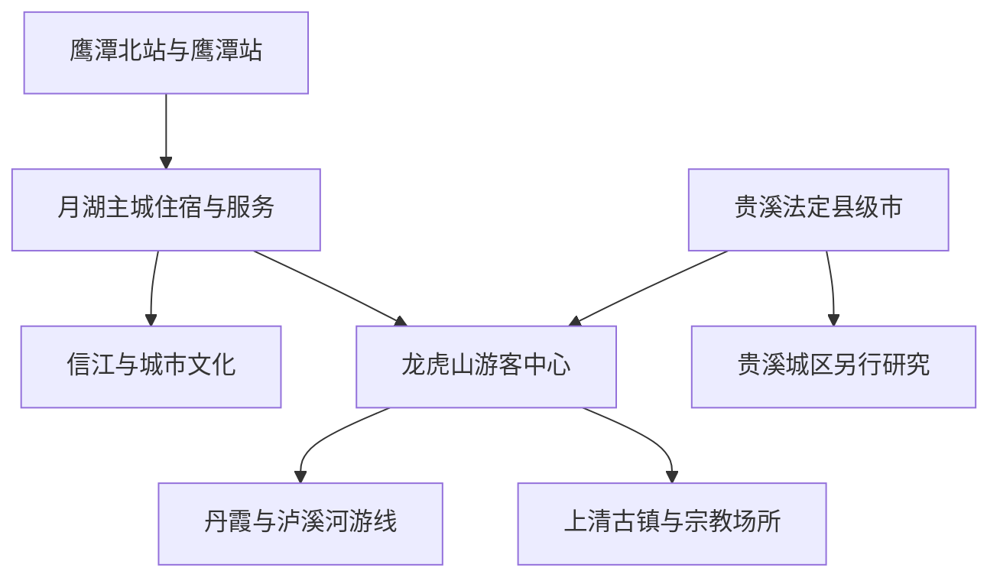
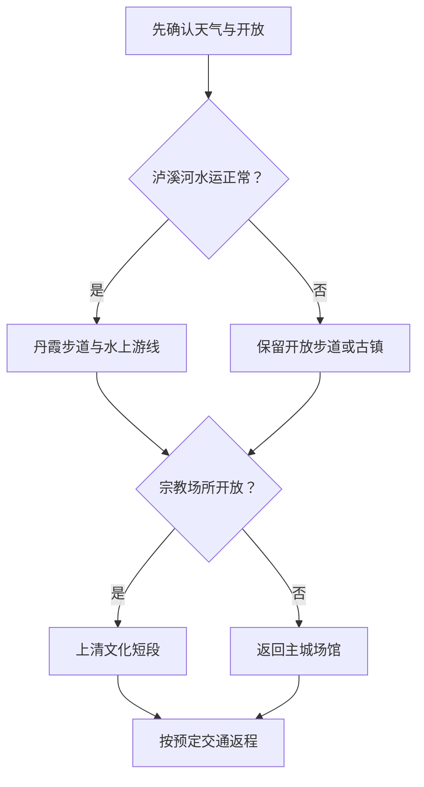

# 鹰潭旅行指南

鹰潭是一座把铁路枢纽、信江城市生活和龙虎山丹霞—道教文化放在不同片区的赣东北城市。月湖区是住宿、铁路和公共服务最集中的主城；龙虎山完整父景区位于主城西南方向，由泸溪河、丹霞游线、上清古镇和宗教文化场所等共同构成；贵溪市则是鹰潭代管的法定县级市，拥有自己的城区和行政边界。第一次到访最稳妥的做法，是用主城承接抵离，把完整一天交给龙虎山，而不是把贵溪城区、龙虎山和月湖街区压成一条“市内步行线”。

> 建议停留：主城半天至 1 天；龙虎山 1–2 天；主城加龙虎山共 2–3 天 
> 旅行关键词：信江、铁路枢纽、中国丹霞、泸溪河、道教文化、古镇、赣东饮食 
> 主要体力：主城低至中等；龙虎山中等至较高，竹筏不能替代全部步行 
> 最近研究：2026-08-12

## 城市速览

| 项目 | 旅行信息 |
|---|---|
| 主要旅行价值 | 在月湖主城理解“铁路带来的城市”与信江生活，在龙虎山用一整天连接丹霞地貌、泸溪河水上游线、上清古镇和正一派道教文化 |
| 建议停留 | 1 天只选龙虎山或主城；2 天适合主城加龙虎山核心；3 天可把自然游线与上清文化线分开，给天气和交通留缓冲 |
| 较舒适季节 | 春秋通常适合步行；春夏雨水多，泸溪河水运、山路和演出易调整；盛夏高温高湿；冬季湿冷、低能见度和水上寒风会降低舒适度 |
| 预算特点 | 主城消费中等；龙虎山门票、景区交通、竹筏或游船、演出和景区住宿构成主要增量，套票包含项目需逐项核对 |
| 步行强度 | 月湖街区可用公交或出租车降低负担；龙虎山有台阶、栈道、坡路、上下码头和较长候车，乘竹筏也不能形成全程无障碍路线 |
| 主要天气风险 | 暴雨、雷电、山洪、泸溪河水位、大风、高温与冬季湿滑；景区停筏、停演、封闭步道或分流时应删整段路线 |
| 独行旅行 | 主城和铁路枢纽容易独立安排；龙虎山要预先锁定门票、景区车与返程，不依赖现场陌生人拼车或非正规竹筏 |
| 亲子旅行 | 市博物馆、信江短段和龙虎山游客中心较易组合；临水、竹筏、悬崖栈道、拥挤演出与宗教场所需要持续看护 |
| 长者与低体力旅行 | 适合“车辆接驳＋泸溪河一段＋古镇短段”，不追求全部山地环线；订票前确认码头台阶、景区车落客点和座椅 |
| 无障碍信息 | 车站与现代公共场馆较可能有基础设施；古镇石板、宗教古建门槛、码头和丹霞步道连续可达资料不足，应逐处向运营方确认 |

## 城市格局与游览区域

鹰潭市法定行政区划代码为 `360600`，辖月湖区、余江区，并代管县级贵溪市。旅行宣传中的“鹰潭龙虎山”是城市品牌与景区管理表达，不意味着龙虎山内部所有点都位于月湖主城，也不意味着贵溪市已被当作鹰潭主城区完成。贵溪市代码为 `360681`，其城区、工业与乡镇应在未来独立城市指南中研究；本页只处理龙虎山与鹰潭旅游交通的直接关系。

| 区域 | 主要内容 | 游览特点 | 边界与安排原则 |
|---|---|---|---|
| 月湖主城 | 鹰潭市博物馆、信江公共岸线、城市街区、鹰潭站周边铁路城市肌理 | 场馆、商业与交通最集中，适合作为抵离日和住宿基点 | 铁路生产区、编组场、桥梁设备区不属于游览空间；只在公共道路和开放岸线活动 |
| 信江新区—鹰潭北站 | 高铁门户、行政与城市新区服务 | 与老城有地面交通距离，不能把“鹰潭北站”理解为古城步行入口 | 住宿与出发站匹配；早班高铁优先住北站或确认首班接驳 |
| 龙虎山完整父景区 | 丹霞峰林、泸溪河水上游览、正式步道、游客中心、上清古镇、天师府等 | 内部是多入口、多交通方式和多运营项目的完整景区，不拆成多个独立景区重复计数 | 门票、景区车、竹筏、演出与宗教场所开放可能不同；一项停运不代表全景区同状态 |
| 上清古镇与宗教文化片区 | 古镇公共街巷、嗣汉天师府、上清宫等 | 生活社区、商业街和宗教活动场所叠加，开放与礼仪边界不同 | 未经允许不进生活院落和宗教后场；法会期间服从分流，不把宗教活动当固定演出 |
| 余江区 | 眼镜产业文化、县域城乡与地方餐饮 | 距主城和龙虎山均需地面交通，产业展示受经营与接待安排影响 | 生产车间不是默认参观点；只进入明确开放并具备接待条件的展馆或工业旅游点 |
| 贵溪市 | 独立县级市城区及更广乡镇 | 有自身交通、住宿和城市生活系统 | 龙虎山的存在不等于贵溪全部纳入本页；贵溪城区景点不计入鹰潭主城完成项 |

鹰潭与上饶、抚州、南昌可通过铁路或公路串联，但这些城市不是鹰潭近郊。龙虎山世界遗产身份来自“中国丹霞”系列自然遗产，龟峰是同一系列遗产中另一个组成部分，位于上饶市弋阳县方向；两者不能因同属一个世界遗产项目而合并成同一景区或同日徒步线路。

## 主要景点

优先级用于分配时间：**A** 为首次到访核心，**B** 为按兴趣补充，**C** 为季节性或需单独交通的项目。“路线节点”不计入景点完成率。同一运营和保护单元只计算一次，龙虎山内的象鼻山、泸溪河、仙水岩、古越崖墓相关观赏点和景区演艺不拆成多座景区。

### 月湖主城

| 景点 | 区域 | 类型 | 主要看点 | 建议用时 | 室内外 | 体力 | 预约风险 | 天气影响 | 优先级 |
|---|---|---|---|---:|---|---|---|---|---|
| 鹰潭市博物馆 | 月湖主城 | 综合博物馆 | 建立鹰潭地方历史、道教文物与市域文化框架；展陈和开放以场馆当期公告为准 | 2–3 小时 | 室内 | 低 | 中 | 低 | A |
| 信江公共岸线短段 | 月湖主城 | 城市公共空间 | 观察信江与城市空间关系，作为场馆之间的散步与休息段 | 1–2 小时 | 室外 | 低至中 | 低 | 高 | B |
| 鹰潭站周边城市街区 | 月湖主城 | 城市观察 | 理解铁路枢纽对城市形成的影响，体验老城餐饮与日常商业 | 1–2 小时 | 混合 | 低至中 | 低 | 中 | B |
| 鹰潭北站 | 信江新区 | 交通门户 | 高铁抵离、城市换乘和行李服务 | 按车次 | 室内 | 低 | 中 | 中 | 路线节点 |

铁路题材只在公共车站、公开展陈和合法观景位置观察。编组场、机务设施、线路防护网、桥梁检修通道和信号设备区均为生产或安全空间，不翻越、不放飞无人机，也不以拍车为由长时间占用站台边缘。

### 龙虎山自然游线

| 景点 | 区域 | 类型 | 主要看点 | 建议用时 | 室内外 | 体力 | 预约风险 | 天气影响 | 优先级 |
|---|---|---|---|---:|---|---|---|---|---|
| 龙虎山风景名胜区 | 龙虎山 | 世界自然遗产、丹霞、综合景区 | “中国丹霞”龙虎山组成部分、峰林、泸溪河和景区完整游览系统；内部项目合并计一次 | 1–2 天 | 混合 | 中至高 | 高 | 很高 | A |
| 泸溪河正式水上游线 | 龙虎山内部 | 竹筏或游船、山水观察 | 从水面观察丹霞山体与河谷；只乘坐景区正式运营船筏 | 1–2 小时 | 室外 | 中 | 高 | 很高 | A |
| 象鼻山等正式丹霞步道 | 龙虎山内部 | 山地步道 | 近距离观察红层侵蚀地貌、峰体与植被 | 2–4 小时 | 室外 | 中至高 | 中 | 很高 | A |
| 崖墓相关观赏与演示区域 | 龙虎山内部 | 考古文化、景区演示 | 了解古越崖墓文化线索；演出是当代展示，不等同考古现场开放 | 0.5–1 小时 | 室外 | 中 | 高 | 高 | B |

水上项目必须穿戴和正确使用救生装备，服从载员、停航与上下筏秩序。文化和旅游部曾在市场暗访中指出龙虎山观光车超载、乘筏未穿救生衣等问题；这类历史整改信息不是对当前运营状态的断言，却说明旅行者应现场核对安全带、救生衣和正规票证，发现不符合要求时拒绝乘坐并联系管理方。

### 上清文化片区

| 景点 | 区域 | 类型 | 主要看点 | 建议用时 | 室内外 | 体力 | 预约风险 | 天气影响 | 优先级 |
|---|---|---|---|---:|---|---|---|---|---|
| 上清古镇公共街巷 | 龙虎山上清镇 | 古镇、生活社区 | 沿正式公共街巷理解水陆交通、地方生活与道教文化环境 | 1–2 小时 | 混合 | 中 | 中 | 中 | B |
| 嗣汉天师府 | 上清古镇 | 宗教活动场所、历史建筑 | 正一派道教文化与当代宗教活动；参观服从场所礼仪和临时安排 | 1–2 小时 | 混合 | 中 | 高 | 中 | A |
| 上清宫 | 龙虎山文化片区 | 宗教文化与遗址 | 了解上清宫历史与龙虎山道教空间关系；具体开放区域按当期公告 | 1–2 小时 | 混合 | 中 | 高 | 中 | B |

宗教活动场所首先是信教群众和教职人员使用的空间。参观时衣着与音量保持克制，不跨越封闭线，不触碰法器和供品，不对正在进行的仪式近距离拍摄；商业讲解、祈福产品和门票套餐不能代表宗教场所本身的规定。

### 余江与贵溪边界项目

| 景点 | 区域 | 类型 | 主要看点 | 建议用时 | 室内外 | 体力 | 预约风险 | 天气影响 | 优先级 |
|---|---|---|---|---:|---|---|---|---|---|
| 余江眼镜文化公开展馆 | 余江区 | 产业文化、展馆 | 了解当地眼镜产业历史与产品；只把明确开放展馆列入路线 | 2–3 小时 | 室内 | 低 | 高 | 低 | C |
| 贵溪城区 | 贵溪市 | 独立县级市 | 仅作为行政与交通边界说明 | 另行规划 | 混合 | 不定 | 不定 | 不定 | 不纳入 |

## 美食与餐饮

鹰潭与龙虎山一带常见米粉、米粿、豆腐、河鲜、板栗和偏香辣的赣菜。景区宣传中的“天师八卦宴”通常是多人合菜概念，不是单人必须完成的固定菜单；上清豆腐、板栗烧鸡和地方米粉更容易按人数调整。

| 菜品或餐饮类型 | 常见区域 | 一个人用餐与常见份量 | 风味、过敏原与饮食限制 | 排队风险与替代方法 |
|---|---|---|---|---|
| 鹰潭牛肉粉、拌粉或汤粉 | 月湖主城、车站周边 | 通常为单碗，适合独食；加蛋、牛肉或小菜会增加份量 | 汤底、酱油可能含麸质；辣椒、花生、芝麻、葱蒜和动物油需主动询问 | 早高峰翻台快；不必追一家名店，可选菜单与后厨信息清楚的同类粉店 |
| 上清豆腐与豆制品 | 上清古镇、龙虎山周边 | 可点小份，也常进入合菜 | 大豆过敏者避开；“素豆腐”也可能用猪油、肉汤、蚝油或共锅烹调 | 节假日古镇核心街排队长，可在住宿地或主城吃普通豆腐菜 |
| 天师板栗烧鸡 | 龙虎山、上清方向 | 常为合菜，2–4 人共享更合适；单人先问半份 | 含禽肉、板栗和酱油；坚果过敏者不能仅按板栗名称自行判断交叉接触 | 套餐店拥挤时改点小份鸡肉或时蔬，不为“必吃”扩大份量 |
| 天师八卦宴类组合餐 | 龙虎山周边 | 多为多人套餐，不适合一人强行点全套 | 菜品可能同时含鱼、虾、蛋、花生、芝麻、大豆和酒；逐道确认比询问宴名有效 | 团队高峰等待久；改用普通赣菜馆按人数单点 |
| 泸溪河或信江鱼菜 | 景区周边、主城 | 整鱼通常 2 人以上共享；单人可选鱼块、小份鱼汤 | 注意鱼刺；酱汁常含辣椒、酒和酱油，不购买来源不明野生水产 | 景区临水餐厅排队时回主城选择来源清楚的养殖淡水鱼 |
| 茄子干、豆角干等赣东家常菜 | 主城与县域餐馆 | 适合与米饭组成小份套餐 | 腌制或干菜钠含量高，炒制可能较油辣；控盐者要求少盐并搭配清淡蔬菜 | 找不到特定品名时用当季蔬菜替代，不把包装特产当正餐 |
| 米粿、麻糍等小吃 | 市场、古镇与早餐店 | 可少量购买，适合作点心 | 可能含糯米、花生、芝麻、糖、豆沙或猪肉馅；吞咽困难者谨慎 | 节庆摊点排队明显，可选正规早餐店或预包装产品 |

严重过敏、严格素食或清真饮食者应询问汤底、用油、酱料和共锅情况。“不辣”要说明是否连辣椒油、剁椒和辣酱都不使用；无法确认交叉接触时，选择配料简单、标签完整的包装食品更稳妥。

## 经典行程

### 一日月湖主城路线

**路线**：鹰潭市博物馆 → 主城午餐 → 信江公共岸线短段 → 鹰潭站周边城市街区

- **适用人群**：抵离日、铁路换乘、低体力或不进入山地的旅行者。
- **串联逻辑**：先用博物馆建立市域背景，再把铁路与信江放回真实城市空间，片区间以地面交通连接。
- **预约锚点**：博物馆开放日、实名或团队规则，以及返程列车是两项硬锚点。
- **休息安排**：午餐后保留室内长休；岸线只选一段，不连续暴晒。
- **时间不足时**：删去岸线长走和街区绕行，只保留博物馆与一顿主城餐。

### 一日龙虎山核心路线

**路线**：龙虎山游客中心 → 当日开放丹霞步道 → 泸溪河正式水上游线 → 景区车返回

- **适用人群**：首次到访、体力中等并愿意把完整一天交给景区者。
- **串联逻辑**：用景区交通把陆地步道和水上视角组成一个闭环，不重复进出不同入口。
- **预约锚点**：门票时段、景区车、竹筏或游船、末班返程必须一起确认。
- **休息安排**：游客中心、码头和正式服务点分段休息；水上段前后补水并处理防晒、防雨。
- **时间不足时**：先删演出和次要步道；水运停航时不找私人船，改走开放短线后提前返程。

### 两日主城与龙虎山路线

**第 1 天**：抵达 → 鹰潭市博物馆 → 信江短段 → 月湖主城住宿。 
**第 2 天**：主城 → 龙虎山游客中心 → 丹霞与泸溪河核心游线 → 主城或下一站。

- **适用人群**：第一次到鹰潭，希望同时理解城市与自然文化者。
- **串联逻辑**：抵达日保持低强度，第二天不再夹入余江或贵溪城区，减少跨片区折返。
- **预约锚点**：第二天门票、竹筏和返程交通优先；住宿应与早班接驳相匹配。
- **休息安排**：第 1 天晚间早休；第 2 天午餐和候筏时间作为恢复窗口。
- **时间不足时**：第 1 天只留博物馆；若第二天有早车，整段龙虎山取消而不是压成两小时。

### 龙虎山自然与上清文化两日路线

**第 1 天**：游客中心 → 丹霞步道 → 泸溪河水上游线 → 景区或主城住宿。 
**第 2 天**：上清古镇公共街巷 → 天师府或上清宫按开放二选一 → 返回。

- **适用人群**：希望把自然遗产与道教文化分开理解、避免一天赶场者。
- **串联逻辑**：第一天只处理景区自然交通，第二天按宗教场所开放组织文化线，不把法会当作固定演出。
- **预约锚点**：住宿、次日宗教场所开放、景区内部接驳和返程车。
- **休息安排**：古镇只走一段公共街巷，中午在合规餐饮点休息，不在殿堂与出入口久坐阻塞。
- **时间不足时**：第二天只留天师府或上清宫之一；关闭时直接改为主城场馆。

### 低体力与长者路线

**路线**：游客中心 → 景区车可达观景点 → 泸溪河水上游线视条件选择 → 上清古镇短段

- **适用人群**：长者、膝踝负担较重或不适合连续爬坡者。
- **串联逻辑**：把车辆可达点作为骨架，避免用竹筏“省体力”的想象忽略码头台阶和上下筏动作。
- **预约锚点**：最近落客点、码头台阶、救生衣尺寸、陪同规则和返程时间。
- **休息安排**：每段 45–60 分钟后坐下休息；午后不再增加山地步道。
- **时间不足时**：优先删除水上段或古镇段之一，只保留一个连续可完成模块。

### 暴雨、高温或水运停航替代路线

**路线**：鹰潭市博物馆 → 主城午餐与长休 → 雨势允许时信江近距离短段或城市公共文化空间

- **适用人群**：遇雷电、暴雨、高温预警、泸溪河停航或山地关闭者。
- **串联逻辑**：把行程转回室内与主城，不用未开放小路替代景区关闭路线。
- **预约锚点**：博物馆开放、气象预警、景区闭园和铁路退改。
- **休息安排**：避开午后高温与雷暴时段，选择有空调和座椅的公共空间。
- **时间不足时**：只保留一个室内场馆；预警升级时取消岸线段并提前返程。

## 住宿区域

| 住宿区域 | 适合谁 | 优点 | 主要代价与核对项 |
|---|---|---|---|
| 鹰潭站—月湖主城 | 普速铁路、城市餐饮、场馆和首次到访者 | 餐饮、商超、医院和地面交通较集中 | 老街噪声、停车、房间隔音和前往鹰潭北站时间需确认 |
| 鹰潭北站—信江新区 | 早晚高铁、短暂停留者 | 靠近高铁站，减少清晨跨城接驳 | 夜间餐饮和老城步行体验少；确认具体出口、接送点和首末班交通 |
| 龙虎山游客中心周边 | 连续两日游景区、早入园者 | 减少主城往返，便于应对早班竹筏或景区车 | 景区外餐饮、夜间交通和淡旺季营业变化大；核对经营资质、退改和实际入口 |
| 上清古镇周边合规住宿 | 以道教文化和古镇慢游为主者 | 便于清晨或傍晚走公共街巷 | 古建消防、隔音、车辆落客与行李搬运条件有限；不选择占用宗教或居民空间的住宿 |

预订时写明计划使用的车站和景区入口，避免只看“鹰潭”“龙虎山”字样判断距离。需要电梯、无障碍卫生间或夜间医疗支持者，应要求经营方提供入口到客房的连续路线信息，而不是只确认“有电梯”。

## 市内交通

### 铁路抵离

鹰潭站服务主城普速铁路出行，鹰潭北站是高铁门户，两站不在同一地点。购票时以 [中国铁路 12306](https://www.12306.cn/) 显示的完整站名为准；换站行程要单独预留地面交通、进站安检和节假日拥堵时间。车站历史页面和旧公交编号不应被当作当前时刻表。

### 龙虎山接驳

从主城或车站前往龙虎山需要地面交通。公交、旅游专线、景区车、竹筏与演出是不同运营环节，班次和套票可能随客流、天气调整。出发前同时确认去程上车点、景区内部最后一班车和回主城方式；不接受无法核验车牌、价格、保险和经营资质的揽客。

### 城区公交、出租与步行

月湖主城适合公交、出租或网约车串联，片区内再步行。信江岸线只进入有照明、护栏和正式开放标识的公共段；暴雨、水位上涨或夜间照明不足时不靠近河岸。共享单车使用前检查刹车与停车区，不驶入步行街、铁路设施区和景区禁行段。

### 自驾与停车

自驾前把终点设置为当期开放停车场或游客中心，不把村道、河滩、林道和宗教场所后门当捷径。节假日龙虎山周边可能分流，雨天山路和临水路段需降低速度；酒后不驾车，夜间不赶陌生县道。

### 航空衔接

民航主管部门当前运输机场名录中没有鹰潭运输机场。需要航空联程时，应按实际售票机场重新计算跨城铁路或公路接驳，不把规划、通用或邻市机场写成鹰潭市内航站。机场名单与航班以 [中国民用航空局](https://www.caac.gov.cn/GYMH/MHGK/MYJC/) 和承运航空公司为准。

## 不同旅行者须知

| 旅行者 | 更适合的安排 | 主要风险 | 出发前确认 |
|---|---|---|---|
| 第一次到访 | 主城半天加龙虎山完整一天 | 把景区内部项目拆成多个景点赶场 | 门票、景区车、水运、住宿基点和返程 |
| 亲子家庭 | 市博物馆、游客中心、短步道和正规水上段 | 河岸、上下筏、拥挤演出和儿童走失 | 儿童救生衣、护栏、卫生间、集合点和返程 |
| 长者或低体力者 | 景区车可达点、古镇短段、主城场馆 | 码头台阶、湿滑石板和连续候车站立 | 最近落客点、座椅、陪同与可删减模块 |
| 无障碍需求 | 现代场馆与车辆接驳优先 | 古建门槛、码头和山地步道不连续 | 坡道、轮椅尺寸、卫生间、车辆与陪同规则 |
| 独行旅行者 | 月湖主城住宿，参加正规景区交通 | 末班车、非正规拼车和偏僻步道失联 | 回程票、车牌、离线地图、景区电话和通信 |
| 摄影旅行 | 信江公共岸线、正式观景台和公开街巷 | 铁路安全、无人机空域、宗教礼仪和居民隐私 | 无人机、三脚架、商业拍摄与演出摄影规则 |
| 宗教文化旅行 | 天师府或上清宫择一深读 | 把宗教仪式当演出、进入非开放空间 | 法会安排、衣着、拍摄、开放区和讲解来源 |
| 雨季旅行 | 主城室内场馆作为替代 | 雷电、山洪、水位、滑坡和停筏 | 气象预警、景区关闭、道路管制和退改 |
| 国际旅行者 | 月湖主城合规住宿、实名正规购票 | 证件识别、支付、语言和住宿登记 | 护照、签证、票务证件、支付与领事联系 |

## 行前核对

| 核对事项 | 为什么需要重查 | 建议核对时间 | 官方入口 |
|---|---|---|---|
| 龙虎山门票与入园 | 分时预约、优惠、开放入口和实名规则会变化 | 确定日期后、前一日及当天 | [龙虎山风景名胜区管理委员会](http://lhs.yingtan.gov.cn/)及景区当期官方渠道 |
| 竹筏、游船与演出 | 水位、风雨、载员、设备和客流可能导致停运或调整 | 前一日及到达游客中心后 | 景区票务与现场公告；救生装备不符合要求时不乘坐 |
| 丹霞步道与森林安全 | 雷电、暴雨、高温、落石和火险影响开放 | 出发前三日逐日查看，当天再查 | [中央气象台鹰潭预报](https://www.nmc.cn/publish/forecast/AJX/yingtan.html)；景区公告 |
| 天师府与上清宫 | 宗教活动、维护和法会可能改变开放区与参观秩序 | 排线前及当天 | 场所、龙虎山管委会与[宗教活动场所信息](https://www.sara.gov.cn/resource/common/zjjcxxcxxt/zjhdcsjbxx.html) |
| 鹰潭市博物馆 | 闭馆日、预约、临展和讲解会变化 | 确定日期后及前一日 | [鹰潭市人民政府](http://www.yingtan.gov.cn/)与场馆当期公告 |
| 铁路与两站换乘 | 鹰潭站、鹰潭北站不是同站，车次与接驳持续变化 | 购票时、前一日及乘车当天 | [中国铁路 12306](https://www.12306.cn/) |
| 公交、景区专线与自驾 | 首末班、上车点、节假日分流和停车会调整 | 排线时、前一日及出发前 | 鹰潭交通部门、龙虎山管委会与运营方公告 |
| 航空联程 | 鹰潭当前无运输机场，邻市机场接驳不能按市内交通计算 | 订机票前及出发前 | [中国民用航空局运输机场名录](https://www.caac.gov.cn/GYMH/MHGK/MYJC/) |
| 住宿与餐饮 | 景区淡旺季营业、古建消防、退改和过敏原信息会变化 | 付款前、到店前及点餐时 | 经营主体证照、订单平台与[全国 12315 平台](https://www.12315.cn/) |
| 无人机与商业拍摄 | 铁路、宗教场所、世界遗产地和人群区规则不同 | 携带设备前及每个点位起飞前 | [国家无人驾驶航空器监管平台](https://uom.caac.gov.cn/)及属地、景区公告 |

## 来源与更新记录

### 主要来源

| 来源 | 类型 | 支持内容 | 核验日期 |
|---|---|---|---|
| [鹰潭市人民政府](http://www.yingtan.gov.cn/) | 市级政府 | 市级公共服务、场馆、交通与动态公告入口 | 2026-08-12 |
| [龙虎山风景名胜区管理委员会](http://lhs.yingtan.gov.cn/) | 景区管理机构 | 龙虎山管理、保护、开放与安全公告入口 | 2026-08-12 |
| [文化和旅游部大众旅游服务：龙虎山](https://lyfw.mct.gov.cn/site/special/province?pkey=jiangxi&type=0) | 国家文旅主管部门 | 龙虎山主要组成、地址与综合景区属性 | 2026-08-12 |
| [文化和旅游部：诗画乡村静享清凉线路](https://zhuanti.mct.gov.cn/xczgshsh2023/syxj/detail_shi/3796.html) | 国家文旅主管部门 | 龙虎山位于贵溪方向、丹霞与道教文化资源、区域交通关系 | 2026-08-12 |
| [文化和旅游部：赣东美食线路](https://zhuanti.mct.gov.cn/xcss2024_xcyfw/jiangxi/detail/7475.html) | 国家文旅主管部门 | 上清豆腐、板栗烧鸡与龙虎山—上清饮食线索 | 2026-08-12 |
| [UNESCO：中国丹霞](https://whc.unesco.org/en/list/1335) | 联合国机构、世界遗产档案 | 龙虎山属于“中国丹霞”系列自然遗产及丹霞地貌价值 | 2026-08-12 |
| [UNESCO：中国丹霞地图](https://whc.unesco.org/en/list/1335/maps) | 联合国机构、遗产边界资料 | 龙虎山与龟峰是系列遗产中不同组成部分 | 2026-08-12 |
| [中国道教协会：龙虎山授箓活动](https://taoist.org.cn/showInfoContent.do?id=10297&p=%27p%27) | 全国性宗教团体 | 嗣汉天师府作为当代正一派宗教活动场所的使用属性 | 2026-08-12 |
| [文化和旅游部：旅游市场暗访检查](https://www.mct.gov.cn/wlbphone/wlbydd/xxfb/jiaodianxinwen/202505/t20250527_960265.html) | 国家文旅主管部门 | 观光车安全带、竹筏救生衣等现场安全核对必要性 | 2026-08-12 |
| [中国民用航空局运输机场名录](https://www.caac.gov.cn/GYMH/MHGK/MYJC/) | 民航主管部门 | 当前运输机场名单未列鹰潭机场 | 2026-08-12 |
| [GeoNames：Yingtan，记录 1786577](https://www.geonames.org/1786577/yingtan.html) | 开放地名数据 | 固定清单采用的鹰潭城市点 | 2026-08-12 |
| [Wikidata：Q363076](https://www.wikidata.org/wiki/Q363076) | 开放结构化数据 | 鹰潭市实体与 GeoNames `P1566=1786577` 的实时精确对应 | 2026-08-12 |

### 行政与旅行边界

鹰潭市是法定地级市，代码 `360600`；月湖区是主城核心，余江区是市辖区，贵溪市则是代码 `360681` 的法定县级市。龙虎山景区由鹰潭市设置的专门机构管理，并与贵溪方向紧密相连，但管理边界、贵溪法定行政边界和月湖主城并不是同一层次。本页把龙虎山作为鹰潭最主要的完整父景区处理，不因此把贵溪城区和全部乡镇纳入鹰潭主城内容。

龙虎山内部的峰体、步道、泸溪河船筏、崖墓观赏、演示节目、上清古镇和宗教场所按各自开放与安全规则核对，却不拆分为多个“独立龙虎山景区”。“中国丹霞”是跨省系列遗产；同属龙虎山组成部分名称体系的龟峰位于上饶市弋阳方向，已经在上饶指南中作为独立县域景区处理。

### 地名标识说明

本页对应 GeoNames 2026-07-30 固定清单中的鹰潭城市点 `1786577`。实时核验 Wikidata 地级市实体 `Q363076` 时，其 GeoNames 标识（`P1566`）精确指向 `1786577`；因此无需用行政区记录或邻近聚落替换固定点。法定城市范围仍以代码 `360600` 和现行行政区划为准，城市点只用于覆盖清单的地名对齐。

### 更新记录

| 日期 | 更新内容 |
|---|---|
| 2026-08-12 | 首次完成鹰潭城市指南；建立月湖主城—龙虎山完整父景区—余江—贵溪县级市边界，补充铁路、信江、宗教场所、丹霞遗产、水运与安全准入规则，并核验 GeoNames `1786577` 与 Wikidata `Q363076` 精确对应。 |
