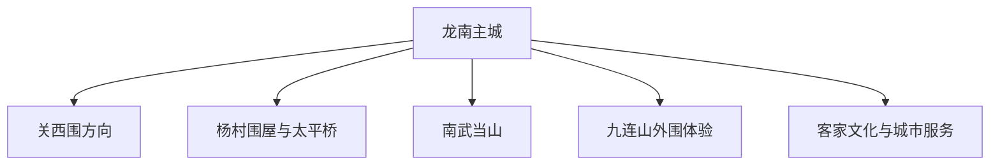
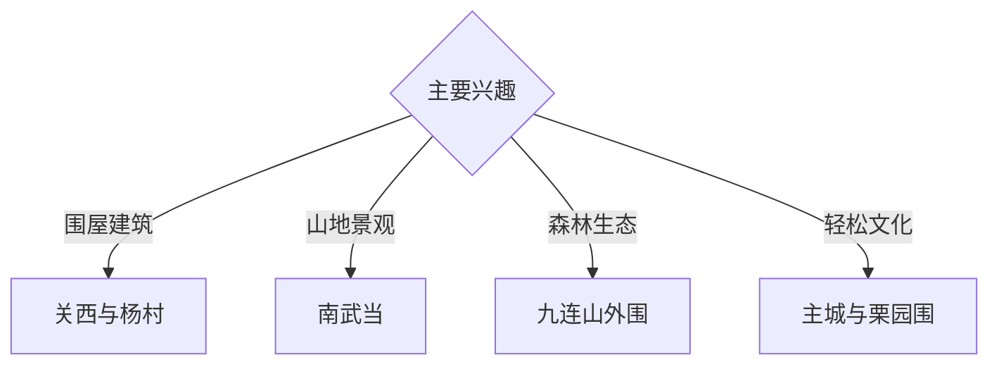

# 龙南旅行指南

龙南位于赣粤边界，以数量密集的客家围屋、关西围、南武当山、九连山生态和客家饮食形成旅行主线。固定快照中的 **Longnan / GeoNames 1802495** 对应龙南主城；围屋分布在多个村镇，适合选择代表性开放点，南武当与九连山方向分别安排。

## 城市速览

| 项目 | 信息 |
|---|---|
| 主线 | 主城—关西围—杨村围屋—南武当山—九连山外围 |
| 停留 | 围屋核心 2 天；山地生态另加 1 天 |
| 住宿 | 主城便于高铁与餐饮；关西、南武当或九连山正规住宿适合早晚 |
| 交通 | 高铁、公路便利，围屋村落和山地需公交、约车或自驾 |
| 季节 | 春秋舒适；夏季高温雷雨；汛期关注山洪和地质风险 |
| 预算 | 景区、车辆和乡村住宿是主要成本，围屋代表点可按兴趣取舍 |

## 城市格局与游览区域

主城承担高铁、住宿和综合服务；关西、杨村、南武当与九连山方向车程各异。围屋既是文物也可能仍有社区生活，参观以景区、产权人和村落公开范围为准；九连山自然保护区核心区、稀土矿业区和林业生产区执行严格边界。

## 主要景点

| 景点 | 区域 | 类型 | 核心体验 | 用时 | 环境 | 体力 | 研究价值 | 拥挤 | 优先级 |
|---|---|---|---|---:|---|---|---|---|---|
| 关西围景区 | 关西镇 | 客家围屋 | 方形围屋、宗族生活与防御性营造 | 半天 | 混合 | 低中 | 很高 | 节假日高 | A |
| 南武当山景区 | 武当镇 | 丹霞与山地 | 峰林、栈道与赣粤边界山水 | 1天 | 室外 | 高 | 高 | 旺季高 | A |
| 燕翼围与乌石围依法开放点 | 杨村镇 | 客家围屋 | 不同围屋形制、聚落与乡土建筑 | 半天 | 混合 | 低中 | 很高 | 低 | A |
| 太平桥依法开放区 | 杨村镇 | 古桥 | 客家交通、廊桥营造与河谷聚落 | 1小时 | 室外 | 低 | 高 | 低 | B |
| 栗园围景区 | 里仁方向 | 围屋与演艺 | 围屋群、客家民俗与夜间演艺 | 半天 | 混合 | 低 | 高 | 演出时中 | B |
| 九连山自然保护地外围正规体验 | 九连山方向 | 森林与生态 | 南岭森林、生物多样性与自然教育 | 1天 | 室外 | 中高 | 很高 | 预约性 | B |
| 龙南地方文博或客家文化展陈 | 主城区 | 博物馆 | 围屋谱系、客家迁徙与城市发展 | 2–3小时 | 室内 | 低 | 很高 | 低 | A |

## 美食与餐饮

龙南适合品尝客家酿豆腐、捶鱼、凤眼珍珠、酸酒鸭、米酒和米制小吃。主城选择最多，围屋村落偏团餐；点餐时确认辣度、酒酿、内脏、鱼刺和份量。自酿酒选择正规经营并控制饮用。

## 经典行程

### 围屋经典线
**路线**：地方展陈—关西围—村镇午餐—返城。**逻辑**：先建立围屋知识，再看代表性实物。**预约锚点**：景区与讲解。**休息**：关西镇。**删除条件**：时间不足时保留关西围。

### 杨村围屋线
**路线**：主城—燕翼围与乌石围公开点—太平桥—返程。**逻辑**：在同一方向比较建筑类型。**预约锚点**：各点开放和车辆。**休息**：杨村镇。**删除条件**：社区活动占用时尊重现场安排。

### 南武当山线
**路线**：主城—景区入口—依法开放栈道—返程。**逻辑**：独立一天承接山地强度。**预约锚点**：门票、景交和天气。**休息**：游客中心。**删除条件**：雷暴、强风或地质预警时顺延。

### 九连山生态线
**路线**：主城—保护地外围正规自然教育点—返程。**逻辑**：以授权活动观察森林生态。**预约锚点**：经营主体、管护与车辆。**休息**：正规服务点。**删除条件**：防火或保护封控时整段取消。

### 栗园围夜游线
**路线**：主城—栗园围公开区—正式演艺—返程。**逻辑**：把围屋空间与活态民俗组合。**预约锚点**：演出和夜间交通。**休息**：景区。**删除条件**：无演出时改白天围屋线。

### 亲子低体力线
**路线**：客家文化展陈—关西围低坡段—客家午餐。**逻辑**：减少山路并保留核心建筑。**预约锚点**：儿童讲解。**休息**：景区服务区。**删除条件**：疲劳时只保留展陈和一座围屋。

### 三日组合线
**路线**：首日关西围；次日杨村围屋；第三日南武当或九连山外围。**逻辑**：建筑与山地分日。**预约锚点**：第三日天气和车辆。**休息**：连续住主城或按方向换宿。**删除条件**：两天时删除第三日。

## 住宿区域

龙南主城适合高铁、餐饮和多方向出发；关西周边适合围屋早晚；南武当或九连山正规住宿适合山地自然线。订房核对消防、夜间交通、防潮、停车和恶劣天气退改。

## 市内交通

龙南东站是主要高铁入口，订票后核对城区接驳。主城用公交、出租车与网约车；关西、杨村、南武当和九连山提前确认城乡班次与返程。古村窄路按指定停车点进入，山路自驾关注落石与强降雨。

## 不同旅行者须知

建筑旅行者选择少量代表围屋并预约讲解；亲子与长者优先关西围和主城展陈；徒步者给南武当完整一天；自然旅行者使用管护认可的外围项目。居民私宅、文物非开放层、保护区核心区、稀土矿区、林业作业区和河道封控区保留明确限制。

## 行前核对

- 核对关西围、杨村围屋、栗园围和地方展陈开放。
- 核对南武当门票、景交、栈道和天气。
- 核对九连山自然教育活动、保护公告与防火要求。
- 核对龙南东站、城乡班次、夜间演艺返程和山路状态。

## 来源与更新记录

| 来源 | 支持内容 | 核验日期 |
|---|---|---|
| [龙南市政府：城市情况简介](https://www.jxln.gov.cn/lnzf/c103680/202301/454db4479e1d41cb906b5da171d1616f.shtml) | 围屋、南武当、九连山与城市旅游资源 | 2026-09-03 |
| [龙南市政府：关西围景区](https://www.jxln.gov.cn/lnzf/c104707/202507/019935d6eef14783a8b8ffe89ccadb94.shtml) | 关西围位置、建筑与文物属性 | 2026-09-03 |
| [GeoNames 1802495](https://www.geonames.org/1802495/) | Longnan 固定人口点与龙南主城位置 | 2026-09-03 |

