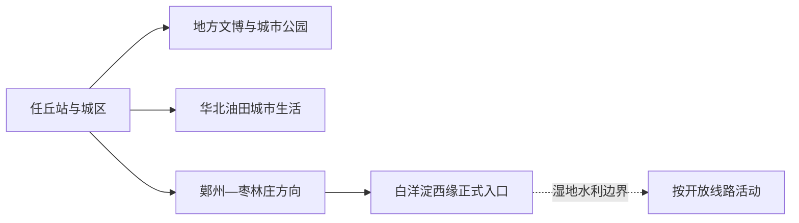
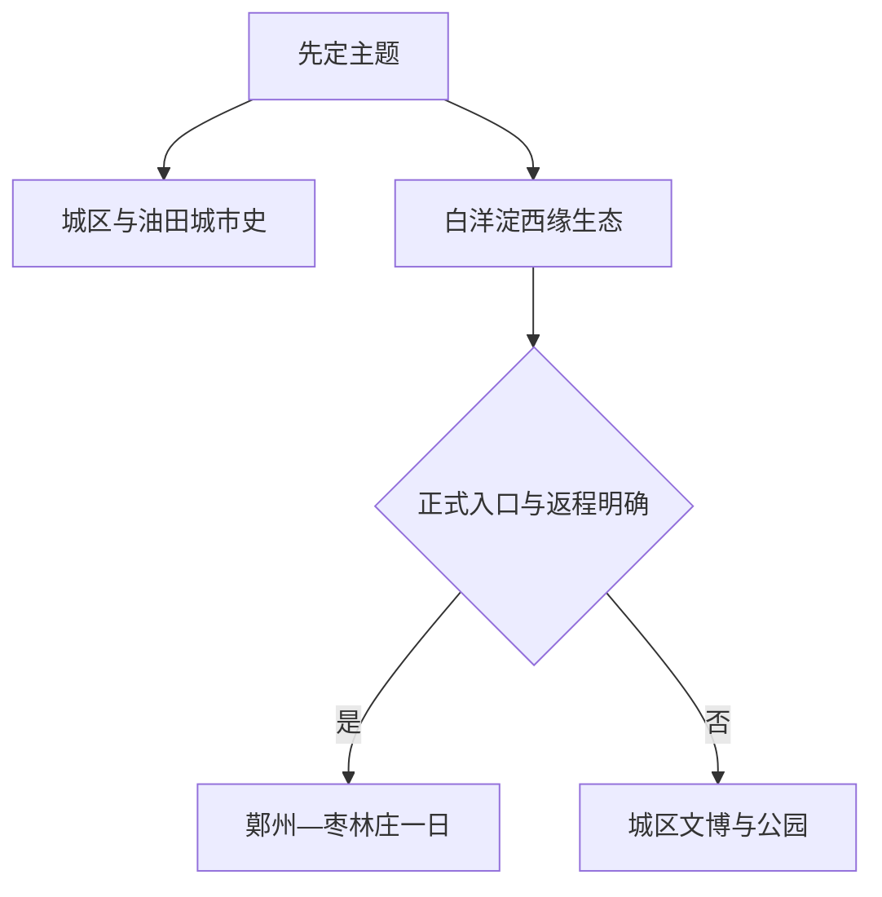

# 任丘旅行指南

任丘是一座油田工业城市，也拥有白洋淀西缘的水乡与湿地环境。旅行适合分成两条：城区用地方文博、华北油田城市史和公园理解现代任丘；鄚州—枣林庄方向只选正式开放的水乡、文化或湿地入口。白洋淀跨多个行政区域，任丘段不替代雄安新区安新等地的景区体系。

> 建议停留：城区 1 天；正式水乡或湿地线另留 1 天
> 关键词：华北油田、白洋淀西缘、鄚州、枣林庄、水乡、平原城市
> 体力：城区低至中等；湿地与乡村为中等
> 最近研究：2026-08-13

## 城市速览
| 项目 | 旅行信息 |
|---|---|
| 价值 | 对照油田新城与白洋淀西缘水乡 |
| 停留 | 1天城区，2天加正式水乡线 |
| 交通 | 任丘站、道路客运与市内车辆 |
| 季节 | 春秋舒适，夏季炎热多雨，冬季风冷 |
| 预算 | 城区平实，湿地车辆与活动另计 |
| 步行 | 城区平缓，湿地栈道受日晒与水位影响 |
| 无障碍 | 城区公共空间较易安排，乡村与湿地逐项确认；设施连续性需向官方确认 |
| 亲子 | 地方文博、公园、正式自然教育点 |
| 边界 | 油田生产区、水利设施、养殖塘和湿地核心区按管理范围进入 |
| 核心 | 核正式入口、水位、交通、场馆和返程 |

## 城市格局与游览区域
任丘市法定代码 `130982`，由沧州市代管。GeoNames `1797181` 与 Wikidata `Q425804` 的 `P1566` 精确对应。

| 区域 | 重点 | 安排 | 条件 |
|---|---|---|---|
| 任丘城区 | 文博、公园、油田城市生活 | 1天 | 场馆与公共交通 |
| 华北油田片区 | 工业城市观察 | 公共道路和正式展陈 | 生产区准入与拍摄 |
| 鄚州方向 | 地方历史、水乡聚落 | 半日至1天 | 开放、接待、返程 |
| 枣林庄—白洋淀西缘 | 水利、湿地与水乡 | 独立1天 | 水位、船线、保护管理 |

## 主要景点
| 名称 | 区域 | 类型 | 价值 | 时长 | 室内外 | 体力 | 无障碍 | 预约 | 优先级 |
|---|---|---|---|---:|---|---|---|---|---|
| 任丘地方博物馆或公共文化展陈 | 城区 | 文博 | 建立地方史与油田城市背景 | 1–3小时 | 室内 | 低 | 中至高 | 建议 | A |
| 任丘城市公园与公共空间 | 城区 | 公园 | 抵达日和日常城市观察 | 1–2小时 | 室外 | 低 | 中 | 通常无需 | B |
| 华北油田正式工业文化展陈 | 城区/油田 | 工业文化 | 理解能源工业与城市形成 | 1–3小时 | 室内 | 低 | 中 | 需要核对 | A |
| 鄚州公开历史文化节点 | 鄚州 | 古镇、地方史 | 补充白洋淀西缘聚落文化 | 2–4小时 | 混合 | 中 | 低至中 | 先核开放 | B |
| 枣林庄水利文化公开点 | 枣林庄 | 水利、湿地 | 理解白洋淀水系调度与生态关系 | 2–4小时 | 室外 | 中 | 低至中 | 建议 | B |
| 白洋淀西缘正式生态体验入口 | 市域东部 | 湿地、自然教育 | 观察芦苇、水鸟与水乡环境 | 半日至1天 | 室外 | 中 | 逐项确认 | 需要 | A |

## 美食与餐饮
| 类型 | 点法 | 注意 |
|---|---|---|
| 驴肉火烧 | 一人1份 | 含小麦，熟食注意储存 |
| 熏鱼或养殖水产 | 先问品种来源与价格 | 水产过敏，选择充分加热 |
| 芦苇荡周边家常菜 | 2人以上 | 不以“野生”宣传判断合法来源 |
| 北方面食 | 一人一份 | 小麦、鸡蛋和大豆常见 |

## 经典行程

### 一日经典
**路线**：地方文博 → 午餐 → 油田城市公共展陈或公园 → 城区晚餐。
- **串联逻辑**：围绕城市形成与日常生活。
- **预约锚点**：场馆和工业展陈。
- **休息安排**：午间室内。
- **时间不足时**：文博与公园。
### 两日
**第2天**：鄚州公开点 → 午餐 → 枣林庄或一处正式湿地入口 → 返回。
- **串联逻辑**：沿白洋淀西缘单一方向。
- **预约锚点**：接待、船线、讲解。
- **休息安排**：镇区午休，避开正午日晒。
- **时间不足时**：鄚州与湿地二选一。
### 三日深度
**第3天**：城区专题展陈 → 油田公共城市空间 → 地方餐饮。
- **适用条件**：有正式工业文化接待。
- **串联逻辑**：把工业专题独立出来。
- **预约锚点**：展陈、讲解、拍摄。
- **休息安排**：室内为主。
- **时间不足时**：并入第一天。
### 雨天
**路线**：地方文博 → 午餐 → 室内公共文化。
- **适用条件**：城市交通正常。
- **串联逻辑**：暂缓湿地水路。
- **预约锚点**：开馆。
- **休息安排**：室内。
- **时间不足时**：一馆。
### 亲子
**路线**：地方文博 → 午休 → 城市公园或正式自然教育短线。
- **适用条件**：天气与水域服务正常。
- **串联逻辑**：城市史加自然观察。
- **预约锚点**：课程、船线、救生。
- **休息安排**：防晒、防蚊、补水。
- **时间不足时**：公园短线。
### 长者与低体力
**路线**：车辆到文博 → 午餐 → 公园平缓段。
- **适用条件**：落实无台阶入口。
- **串联逻辑**：两个城区单点。
- **预约锚点**：轮椅、卫生间。
- **休息安排**：午间长休。
- **时间不足时**：文博一处。

## 住宿区域
| 区域 | 优势 | 取舍 | 适合 | 交通 |
|---|---|---|---|---|
| 任丘站—城区 | 抵离、餐饮、叫车方便 | 去湿地需车辆 | 首访 | 核车站上客区 |
| 油田生活区 | 城市生活与服务稳定 | 工业生产空间边界明显 | 工业史、商务 | 只走公共道路 |
| 鄚州方向 | 湿地线早出方便 | 房源与夜间交通少 | 自驾、生态 | 先落实住宿与返程 |

## 市内交通
| 场景 | 推荐 | 核对 |
|---|---|---|
| 铁路抵达 | 任丘站接公交或车辆 | 车次、末班、上客区 |
| 城区 | 公交、出租车、网约车 | 场馆入口与停车 |
| 鄚州/枣林庄 | 自驾或合规包车 | 正式入口、返程、村路 |
| 水上活动 | 管理方公布的持证船线 | 救生、水位、天气、返航 |

## 不同旅行者须知
| 旅行者 | 怎么选 | 重点 |
|---|---|---|
| 独行 | 城区、正式生态入口 | 返程和通信 |
| 亲子 | 文博、公园、自然教育 | 水域陪同、防蚊 |
| 长者 | 城区单点 | 台阶、座椅、卫生间 |
| 摄影 | 公共湿地入口、城市空间 | 鸟类距离、无人机、工业设施 |
| 自驾 | 城区与湿地分日 | 村路、停车、司机休息 |
| 预算有限 | 城区住宿与公共空间 | 湿地车辆与船费总价 |

## 行前核对
| 项目 | 时点 | 入口 |
|---|---|---|
| 场馆与生态入口 | 前一日 | [任丘市政府](https://www.renqiu.gov.cn/) |
| 湿地水位与防汛 | 前三日及当天 | [河北水利](https://slt.hebei.gov.cn/) |
| 天气 | 前三日 | [河北气象](https://he.cma.gov.cn/) |
| 铁路 | 购票与前一日 | [12306](https://www.12306.cn/) |
| 行政边界 | 跨城规划 | [民政部](https://dmfw.mca.gov.cn/xzqh/getList?code=130900&trimCode=false&maxLevel=3) |

## 来源与更新记录
### 主要来源
| 来源 | 支持内容 | 日期 |
|---|---|---|
| [任丘市政府](https://www.renqiu.gov.cn/) | 属地公告、场馆与交通核对入口 | 2026-08-13 |
| [河北省白洋淀生态环境治理资料](https://hbepb.hebei.gov.cn/) | 湿地、水质与保护动态入口 | 2026-08-13 |
| [河北省水利厅](https://slt.hebei.gov.cn/) | 白洋淀水系、防汛与水利管理 | 2026-08-13 |
| [GeoNames 1797181](https://www.geonames.org/1797181/) | 城市点 | 2026-08-13 |
| [Wikidata Q425804](https://www.wikidata.org/wiki/Q425804) | 实体与P1566 | 2026-08-13 |
| [行政区划130900](https://dmfw.mca.gov.cn/xzqh/getList?code=130900&trimCode=false&maxLevel=3) | 任丘130982与代管关系 | 2026-08-13 |
### 更新记录
| 日期 | 更新 |
|---|---|
| 2026-08-13 | 首次完成任丘旅行研究；按油田城区与白洋淀西缘分线，补充工业、水利、湿地和县级市边界 |
