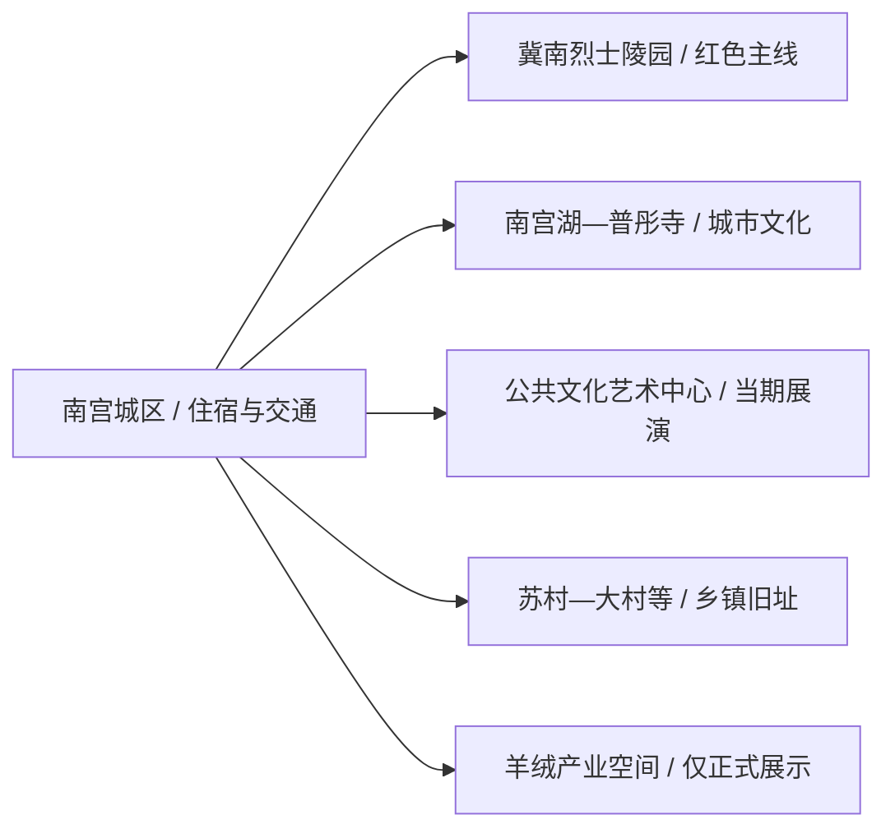
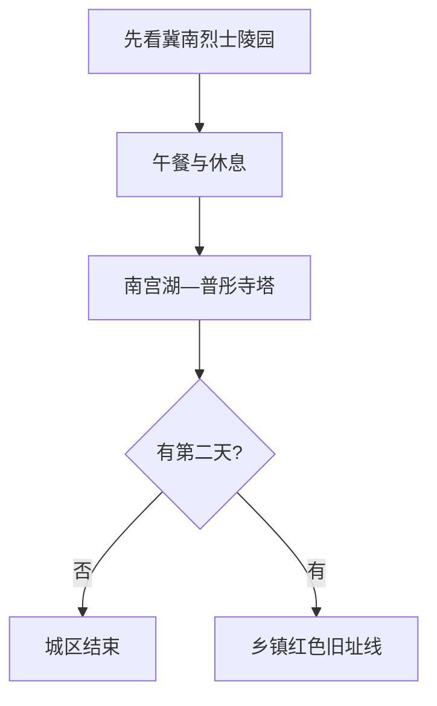

# 南宫旅行指南

南宫适合围绕“冀南红都”和普彤塔两条历史线旅行。先在冀南烈士陵园与革命斗争纪念馆理解抗战脉络，再去南宫湖—普彤寺片区看城市文化；乡镇旧址和羊绒产业安排在确认正式开放之后。

> 建议停留：城区 1 天；加入乡镇红色旧址为 2 天 
> 旅行关键词：冀南抗战、烈士陵园、普彤塔、南宫湖、羊绒产业 
> 无障碍说明：纪念馆、文化场馆和公园可优先询问坡道与轮椅；古塔寺院、旧址和乡村道路的设施连续性需向官方确认

## 城市速览

| 项目 | 旅行信息 |
|---|---|
| 主要旅行价值 | 冀南抗战史、普彤塔佛教文化、南宫湖城市公共空间与县级市生活 |
| 建议停留 | 1–2 天；红色旧址按开放和讲解组合 |
| 舒适季节 | 春秋适合步行；夏季避开正午，冬季关注大风、雾与结冰 |
| 预算特点 | 城区成本较低；乡镇车辆和预约讲解是主要增量 |
| 步行强度 | 城区低至中；古塔和乡镇旧址中等 |
| 天气风险 | 高温、雷雨、大风、雾霾、冬季道路结冰 |
| 独行旅行 | 城区适合独行，乡镇线先锁返程 |
| 亲子旅行 | 纪念馆与城市公园适合半日，讲解按年龄控制时长 |
| 长者与低体力 | 一座纪念馆加南宫湖平缓段，车辆分段 |
| 行前重点 | 陵园与场馆开放、讲解预约、寺塔参观、乡镇交通 |

## 城市格局与游览区域

南宫是邢台市代管的法定县级市，代码 `130581`。城区以冀南烈士陵园、南宫湖、普彤寺塔和公共文化设施为主要旅行节点；苏村、大村等乡镇分布革命旧址与文保点，产业园区集中羊绒、棉纺和装备制造。

| 区域 | 适合安排 | 怎么选择 | 时间尺度 |
|---|---|---|---|
| 冀南烈士陵园片区 | 陵园、纪念馆与抗战史 | 首访优先，预留安静参观时间 | 3–5 小时 |
| 南宫湖—普彤寺片区 | 公园、古塔寺院与城市文化 | 与陵园分成上下半日 | 3–5 小时 |
| 公共文化艺术中心 | 博物馆、剧院或当期展览演出 | 以开放公告和票务为准 | 1–3 小时 |
| 乡镇红色旧址 | 一二九师东进纵队等旧址 | 提前联系属地，车辆串联 | 1 天 |
| 产业园区 | 羊绒、棉纺与制造业 | 只参加企业或园区明确开放的展示 | 2–4 小时 |

GeoNames `1800065` 与 Wikidata `Q1014384` 的 `P1566` 精确对应，法定代码为 `130581`。固定点用于定位城区，市域边界以现行行政区划为准。

## 主要景点

### 城区主线

| 景点 | 区域 | 类型 | 主要看点 | 建议用时 | 室内外 | 体力 | 预约风险 | 天气影响 | 优先级 |
|---|---|---|---|---:|---|---|---|---|---|
| 冀南烈士陵园 | 城区 | 国家级烈士纪念设施、红色文化 | 纪念碑、烈士纪念与冀南抗战历史 | 2–3 小时 | 混合 | 中 | 高 | 中高 | A |
| 冀南革命斗争纪念馆 | 城区 | 革命历史纪念馆 | 冀南抗日根据地与地方革命史展陈 | 1.5–2.5 小时 | 室内 | 低 | 高 | 低 | A |
| 普彤寺—普彤塔开放区域 | 南宫湖片区 | 全国重点文保、宗教建筑 | 古塔、寺院历史与湖城空间关系 | 1.5–2.5 小时 | 混合 | 中 | 很高 | 中 | A |
| 南宫湖公园正式开放段 | 城区 | 城市公园、滨水 | 环湖公共空间、湖光塔影与城市休息 | 1–2 小时 | 室外 | 低 | 低 | 高 | B |
| 南宫市公共文化艺术中心当期开放场馆 | 城区 | 博物馆、剧院、文化馆 | 地方文化、尚小云艺术与公共展演 | 1–3 小时 | 室内 | 低 | 很高 | 低 | B |

### 乡镇红色旧址

| 景点 | 区域 | 类型 | 主要看点 | 建议用时 | 室内外 | 体力 | 预约风险 | 天气影响 | 优先级 |
|---|---|---|---|---:|---|---|---|---|---|
| 八路军一二九师东进纵队司令部旧址 | 市域乡镇 | 全国或省级文保、红色旧址 | 东进纵队活动与冀南抗战史 | 1–2 小时 | 混合 | 中 | 很高 | 中 | A |
| 冀鲁豫边区省委及冀南军区相关开放旧址 | 苏村、大村等方向 | 红色旧址群 | 根据地领导机关历史与乡村空间 | 半日至 1 天 | 混合 | 中 | 很高 | 高 | B |
| 南宫县学碑、镇水楼等当期开放文保点 | 城区及乡镇 | 石刻、古建 | 地方教育、水利和城市史 | 1–2 小时 | 室外为主 | 低至中 | 很高 | 高 | C |

冀南烈士陵园与其纪念馆按一个纪念设施群组织；南宫湖、公园、景观桥堤和普彤寺塔是相邻但管理不同的公共与文保空间。乡镇旧址只在管理方明确开放、具备接待条件时进入路线。

## 美食与餐饮

| 类型 | 怎么点 | 份量与过敏原 | 选择建议 |
|---|---|---|---|
| 南宫熏菜 | 切小份配主食，2–4 人共享 | 多含猪肉、蛋、淀粉和香料，可能含大豆、小麦 | 先问原料、保存与加热方式，独食少量尝试 |
| 饼卷肉、烧饼与面食 | 一人一份 | 含小麦、芝麻，肉馅和酱料可能含大豆 | 早餐就近选择，问清份量与辣度 |
| 冀南炖菜 | 2–4 人共享 | 肉类、豆制品、粉条和复合调味常见 | 先点小锅，过敏者逐项确认配料 |
| 羊肉菜肴 | 多人共享或一人小碗 | 羊肉、油脂与辛香料较集中 | 看清重量和计价方式，长途行车前控制份量 |

## 经典行程

### 一日经典路线

**路线**：冀南烈士陵园—纪念馆 → 午餐与休息 → 南宫湖公园短段 → 普彤寺塔开放区域

- **适用条件**：陵园、纪念馆与寺塔开放。
- **串联逻辑**：上午集中红色历史，下午转换到古塔与城市空间。
- **预约锚点**：纪念馆讲解、普彤寺塔参观与公共文化活动。
- **休息安排**：午间完整坐休，湖区只走平缓短段。
- **时间不足时**：保留陵园纪念馆与普彤塔，公园改为短停。

### 两日城市路线

**第 1 天**：陵园纪念馆 → 南宫湖—普彤寺塔 
**第 2 天**：公共文化艺术中心 → 午休 → 城区文保点或当期演出

- **适用条件**：第二日场馆或演出信息已确认。
- **串联逻辑**：第一天看两条核心历史，第二天补地方文化与城市生活。
- **预约锚点**：场馆、剧院、讲解和票务。
- **休息安排**：第二日下午只保留一个点。
- **时间不足时**：第二天只保留一座场馆。

### 三日深度路线

**第 1 天**：城区红色主线 
**第 2 天**：南宫湖、普彤寺塔与公共文化 
**第 3 天**：一二九师东进纵队司令部旧址 → 一个相邻正式开放旧址

- **适用条件**：乡镇旧址已联系，车辆和讲解落实。
- **串联逻辑**：从城区纪念体系延伸到历史发生地。
- **预约锚点**：旧址管理方、道路和返程。
- **休息安排**：乡镇正式接待点午休，下午提早回城。
- **时间不足时**：第三天只保留司令部旧址。

### 雨天路线

**路线**：冀南革命斗争纪念馆 → 午餐 → 公共文化艺术中心当期开放场馆

- **适用条件**：城区道路正常，场馆开放。
- **串联逻辑**：两处室内展陈构成历史与艺术线。
- **预约锚点**：场馆开放与团队接待。
- **休息安排**：午间坐休，下午不再增加湖区。
- **时间不足时**：只保留纪念馆。

### 亲子与低体力路线

**亲子路线**：纪念馆重点展厅 → 午休 → 南宫湖公园平缓段 
**低体力路线**：车辆到纪念馆 → 午休 → 普彤寺塔最近合规落客点后短游

- **减负方式**：乡镇旧址另成一天，湖区不做完整环湖。
- **预约锚点**：电梯、轮椅、讲解时长、落客点和卫生间。
- **休息安排**：场馆与住宿地承担主要休息。
- **时间不足时**：保留纪念馆，取消下午户外。

### 远郊路线

**路线**：南宫城区 → 一二九师东进纵队司令部旧址 → 冀南军区或边区省委当期开放旧址 → 城区

- **适用条件**：旧址接待、道路和往返车辆均已确认。
- **串联逻辑**：沿同一乡镇方向理解冀南根据地组织网络。
- **预约锚点**：管理方、讲解、停车和返程。
- **休息安排**：乡镇服务点午休，下午只保留一个旧址。
- **时间不足时**：只保留司令部旧址。

## 住宿区域

| 区域 | 优点 | 取舍 | 适合人群 |
|---|---|---|---|
| 南宫主城区 | 餐饮、场馆和车辆选择集中 | 到乡镇旧址仍需车辆 | 首访、短住、独行 |
| 南宫湖片区 | 公园与普彤寺塔方便 | 夜间活动与交通需核对 | 城市休闲、低体力 |
| 南宫东站或交通节点周边 | 到发方便 | 与核心景点仍需接驳 | 晚到早走 |
| 邢台联程 | 大交通与住宿选择更多 | 往返距离会压缩南宫时间 | 只做南宫一日线者 |

## 市内交通

- 南宫东站承担铁路到发，具体车次、停靠和接驳以 12306 与属地交通信息为准。
- 城区使用公交、出租车和短程车辆；陵园、南宫湖与文化中心之间可分段连接。
- 乡镇红色旧址适合自驾或合规包车，先确认完整地址和管理入口。
- 产业园区和物流道路以生产交通为主，游客车辆按正式参观安排进入。

## 不同旅行者须知

| 情况 | 怎么安排 | 重点核对 |
|---|---|---|
| 独行 | 住城区，旧址线使用预约车辆 | 返程、司机、讲解和信号 |
| 亲子 | 纪念馆与湖区短线 | 展陈内容、讲解时长、护栏和卫生间 |
| 长者与低体力 | 一馆一塔，车辆分段 | 轮椅、台阶、座椅和最近落客点 |
| 纪念设施参观 | 保持安静并按仪式空间游览 | 祭扫活动、团队接待、摄影与着装 |
| 产业主题旅行 | 选择园区或企业正式展示 | 预约、个人防护、生产线与商业摄影规则 |

纪念、文保与生产边界：陵园按纪念秩序参观，普彤塔和旧址依保护范围活动；羊绒、棉纺与装备制造厂区只有在企业明确接待时进入。

## 行前核对

| 项目 | 何时核对 | 官方入口 |
|---|---|---|
| 陵园、纪念馆与普彤寺塔 | 排行程时、到访前一日 | [南宫市人民政府](https://www.nangong.gov.cn/)及文旅公告 |
| 公共文化与演出 | 订票前、当天 | 南宫文广体旅部门与场馆 |
| 铁路和乡镇接驳 | 购票时、出发前一日 | [中国铁路 12306](https://www.12306.cn/)及交通部门 |
| 高温、大风、雷雨与结冰 | 出发前三日起每日 | [河北省气象局](http://he.cma.gov.cn/)及应急、交警信息 |
| 无障碍条件 | 预约与用车时 | 陵园、场馆、寺院、酒店和承运方 |

## 来源与更新记录

| 来源 | 支持内容 | 核验日期 |
|---|---|---|
| [南宫市人民政府：走进南宫](https://www.nangong.gov.cn/nangong) | 市情、普彤寺塔、陵园、湖区与产业背景 | 2026-08-13 |
| [南宫市政府：红色抗战文化](https://www.nangong.gov.cn/article/view/5057.htm) | 冀南抗战、烈士陵园与根据地历史 | 2026-08-13 |
| [南宫市政府：红色资源保护利用](https://www.nangong.gov.cn/article/view/168185.htm) | 陵园、纪念馆、东进纵队司令部与开放利用方向 | 2026-08-13 |
| [南宫市国土空间总体规划](https://info.nangong.gov.cn/main/file/2024-12-11/17339047941832c9286819396463e1810193b4c782473d0f.pdf) | 普彤塔、革命旧址、陵园与保护控制边界 | 2026-08-13 |
| [南宫市政府：南宫湖与文化艺术中心](https://info.nangong.gov.cn/content/11074/25465.html) | 普彤寺塔、南宫湖、尚小云大剧院与公共文化设施 | 2026-08-13 |
| [民政部行政区划查询](https://dmfw.mca.gov.cn/xzqh/getList?code=13&trimCode=true&maxLevel=3) | `130581` 及邢台代管关系 | 2026-08-13 |
| [GeoNames 1800065](https://www.geonames.org/1800065/nangong.html) | 固定南宫城市点 | 2026-08-13 |
| [Wikidata Q1014384](https://www.wikidata.org/wiki/Q1014384) | 法定南宫市实体与 `P1566=1800065` | 2026-08-13 |

| 日期 | 更新 |
|---|---|
| 2026-08-13 | 首次完成南宫市指南；建立冀南烈士陵园、南宫湖—普彤塔与乡镇红色旧址主线，补齐产业、文保、交通和标识粒度。 |
