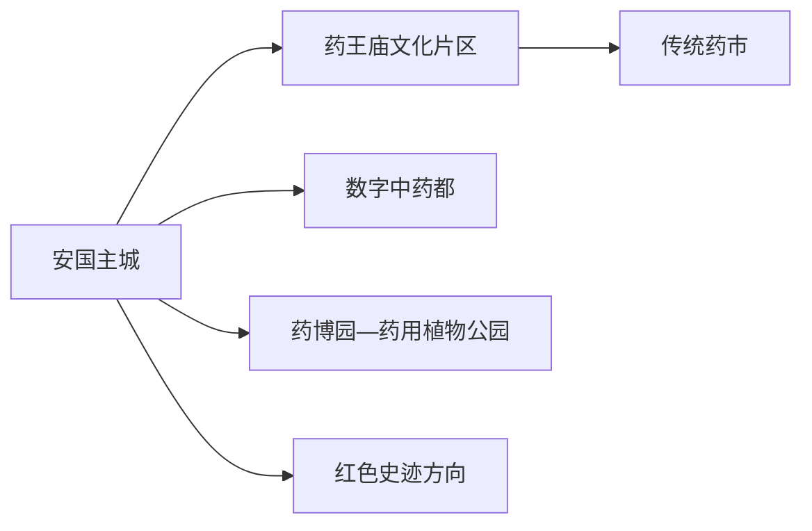
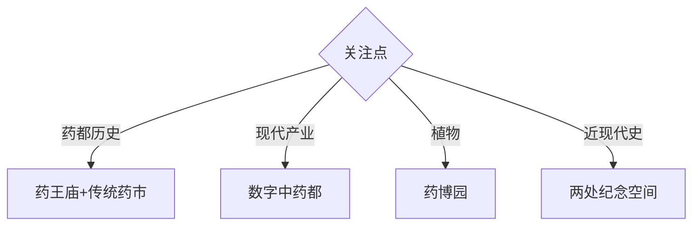

# 安国旅行指南

安国位于保定南部平原，以药王庙、传统药市、数字中药都和药用植物园构成鲜明的中医药文化旅行线。固定快照中的 **Anguo / GeoNames 1797401** 对应现行安国市；文化体验、商品交易与医疗决策需分别看待。

## 城市速览

| 项目 | 信息 |
|---|---|
| 主线 | 药王庙—药市—数字中药都—药博园 |
| 停留 | 主城1天；植物、红色史或活动主题另加1天 |
| 住宿 | 药王庙—主城商业区便于步行；汽车站周边便于抵离 |
| 交通 | 以公路客运和地面接驳为主，远端园区用公交或约车 |
| 风险 | 药材质量、医疗宣传、过敏、生产仓储与种植试验边界 |

## 城市格局与游览区域

药王庙及周边街区适合步行理解药都历史，数字中药都是现代交易与展陈空间，药博园偏向植物、农业和研学。三者的开放规则不同；交易市场适合观察行业，健康与用药选择交给正规医疗机构和药师。

## 主要景点

| 景点 | 区域 | 类型 | 核心体验 | 用时 | 环境 | 体力 | 研究价值 | 拥挤 | 优先级 |
|---|---|---|---|---:|---|---|---|---|---|
| 药王庙 | 主城 | 全国重点文物 | 药王信仰、古建筑与药市源流 | 2小时 | 混合 | 低 | 很高 | 节庆高 | A |
| 药王庙文化博物馆 | 主城 | 专题博物馆 | 中医药文化与安国药业史 | 1–2小时 | 室内 | 低 | 很高 | 团体时中 | A |
| 安国传统药市 | 主城 | 市场与非遗 | 药材商贸、行规与城市生活 | 1–2小时 | 室内 | 低 | 很高 | 交易时高 | A |
| 数字中药都公开区 | 城区 | 产业与商贸 | 现代交易、追溯与展陈 | 2–3小时 | 室内 | 低 | 高 | 展会时高 | A |
| 中医药文化博览园（药博园） | 城郊 | 植物与农业 | 药用植物、研学与季节花田 | 半天 | 室外 | 中 | 高 | 花期高 | A |
| 药用植物公园 | 城区近郊 | 科普公园 | 植物识别与公共休闲 | 1–2小时 | 室外 | 低中 | 中 | 周末中 | B |
| 毛主席视察纪念馆 | 城区 | 纪念馆 | 新中国药业发展史 | 1小时 | 室内 | 低 | 高 | 团体时中 | B |
| 晋察冀军区司令部旧址 | 县域 | 红色史迹 | 晋察冀根据地历史 | 半天 | 混合 | 中 | 高 | 团体时中 | B |

## 美食与餐饮

药膳、药茶与河北平原家常菜是安国常见体验。把药膳视作饮食文化项目，点单时说明过敏、孕期、慢性病和正在使用的药物；涉及治疗、停药、加药或保健品选择时，向医生或执业药师咨询。

## 经典行程

### 一日基础线
**路线**：药王庙—文化博物馆—午餐—传统药市—数字中药都公开区。**逻辑**：从历史走向现代交易。**预约锚点**：庙馆和市场开放。**休息**：药王庙周边。**删除条件**：展会限流时减少数字中药都停留。

### 药都历史线
**路线**：药王庙—文化博物馆—传统药市—老街公开段。**逻辑**：围绕信仰、行业与城市形成过程。**预约锚点**：讲解与开市时段。**休息**：主城餐饮区。**删除条件**：节庆客流过高时错峰。

### 现代产业线
**路线**：数字中药都展陈—公开交易区—正规检测或科普展示。**逻辑**：观察标准化、追溯与现代商贸。**预约锚点**：公开接待与展会。**休息**：园区服务区。**删除条件**：仅限专业观众时改药市。

### 药用植物线
**路线**：药博园—药用植物公园—返城。**逻辑**：把实物识别与产业背景相连。**预约锚点**：花期、园区开放和讲解。**休息**：游客服务点。**删除条件**：高温、雷雨或非适游季时缩短。

### 红色史迹线
**路线**：毛主席视察纪念馆—晋察冀军区司令部旧址。**逻辑**：分层理解根据地与药业发展史。**预约锚点**：两馆接待和车辆。**休息**：主城或镇区。**删除条件**：远端馆闭馆时只留主城馆。

### 亲子低体力线
**路线**：文化博物馆—午休—药用植物公园近入口段。**逻辑**：室内科普配轻量植物观察。**预约锚点**：研学活动。**休息**：馆内与公园座椅区。**删除条件**：高温时只留室内。

### 雨天线
**路线**：文化博物馆—传统药市—数字中药都。**逻辑**：围绕室内文化与产业空间。**预约锚点**：三处开放。**休息**：市场餐饮区。**删除条件**：强降雨积水时减少跨区移动。

## 住宿区域

药王庙至主城商业区适合步行、餐饮和夜间活动；客运站周边适合早晚公路抵离。前往药博园和远端红色史迹时，从主城当天往返更便于调整。

## 市内交通

安国以公路客运为主，主城可用公交、出租车和网约车。数字中药都、药博园及远端旧址的方向不同，出发前核对公交末班或约定返程；大型药交会期间为道路和停车预留时间。

## 不同旅行者须知

行业研究者优先药王庙、药市与数字中药都；亲子家庭选择博物馆和植物园；摄影者围绕药材交易和花期安排；行动不便者核对古建门槛、市场通道、园区接驳与卫生间。

## 行前核对

- 核对药王庙、博物馆、数字中药都、药博园的开放与活动安排。
- 购买药材选择持证渠道并留存品名、产地、批次和凭证，用药方案由医生或药师确认。
- 仓储物流、饮片加工、药材种植、试验田和居民院落按正式参观线路进入。

## 来源与更新记录

| 来源 | 支持内容 | 核验日期 |
|---|---|---|
| [河北省文物局：药王庙](https://wenwu.hebei.gov.cn/system/2023/10/16/030257948.shtml) | 药王庙位置、建筑体系与药业关系 | 2026-09-01 |
| [河北省文化和旅游厅：安国药市](https://whly.hebei.gov.cn/c/2012-12-21/558030.html) | 药王庙会、传统药市与商贸文化 | 2026-09-01 |
| [GeoNames 1797401](https://www.geonames.org/1797401/) | Anguo 固定人口点与位置 | 2026-09-01 |

| 日期 | 更新 |
|---|---|
| 2026-09-01 | 首次完成安国旅行研究；区分文化、交易、植物与医疗决策。 |
