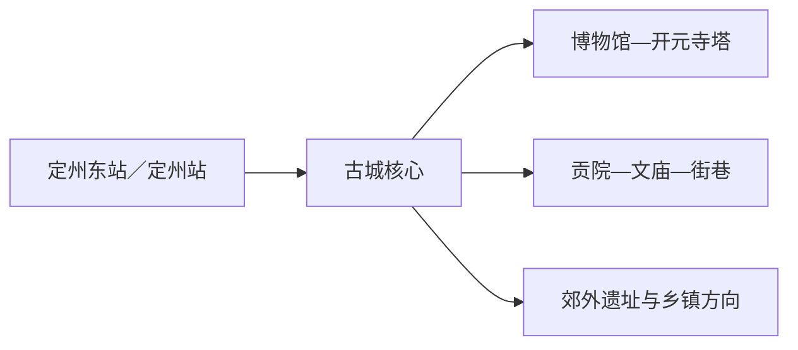
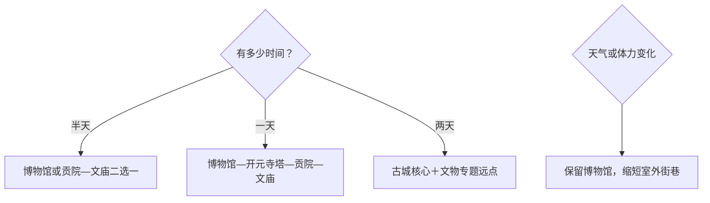

# 定州旅行指南

定州适合把一座河北平原古城读成连续的时间轴：先在博物馆看中山国、汉代玉器和塔基地宫文物，再步行到开元寺塔、贡院、文庙与古城街巷。核心区紧凑，首访用一天即可形成完整认识；第二天可留给遗址、乡镇或更慢的文物专题。

> 建议停留：1–2 天 
> 旅行关键词：中山文化、开元寺塔、贡院、古城步行 
> 主要体力：城区低至中等；古建台阶按开放范围调整 
> 最近研究：2026-08-12

## 城市速览

| 项目 | 旅行信息 |
|---|---|
| 主要旅行价值 | 在紧凑古城中串联博物馆、宋塔、清代贡院与文庙，理解定州从中山国、汉代郡国到州城的历史层次 |
| 建议停留 | 半天选博物馆或古建一组；1 天完成古城核心；2 天增加汉墓石刻或郊外专题 |
| 较舒适季节 | 春秋适合步行；夏季把室外段放在早晚，冬季注意低温、大风和结冰 |
| 预算特点 | 核心区交通成本低，主要支出来自住宿、餐饮和动态收费项目；远点车辆增加预算 |
| 步行强度 | 博物馆—开元寺塔—贡院—文庙适合分段步行；古建门槛、台阶和石板路需留意 |
| 主要天气风险 | 高温、雷雨、大风、寒潮和冬季结冰；文物建筑遇维护或恶劣天气可能调整开放区 |
| 独行旅行 | 核心区白天用餐和叫车方便，按一个室内馆加一组古建最稳妥 |
| 亲子旅行 | 博物馆适合先建立历史线索，古塔和古建参观按儿童体力缩短 |
| 长者与低体力旅行 | 以博物馆为锚点，车辆连接贡院或文庙，减少重复折返 |
| 无障碍信息 | 现代场馆可先咨询入口与电梯；古建院落的设施连续性需向官方确认 |

## 城市格局与游览区域

定州站、定州东站与古城核心是三个不同节点。古城内的博物馆、开元寺塔、贡院、文庙和晏阳初旧居相对集中，适合把车辆留在外围后分段步行；乡镇遗址与农业生产空间按独立方向安排。

| 区域 | 主要内容 | 游览特点 | 与其他区域的关系 |
|---|---|---|---|
| 中山东路核心 | 定州博物馆、开元寺塔 | 室内与地标相邻，适合作为首访起点 | 可步行接贡院、文庙和古城街巷 |
| 贡院—文庙片区 | 定州贡院、定州文庙、晏阳初旧居 | 古建院落集中，开放范围需逐处确认 | 与博物馆同日组合最顺 |
| 古城街巷 | 开元寺大街、宋街及公共空间 | 适合用餐、休息和观察城市生活 | 作为景点之间的连接段，不重复计作多个景区 |
| 郊外方向 | 汉墓石刻、遗址与乡镇专题 | 点位分散，宜车辆往返 | 放在第二天，并按开放和交通二选一 |

GeoNames `1812728` 是定州城市驻地点记录，Wikidata `Q645183` 与法定代码 `130682` 对应县级定州市。定州在河北省行政体系中为省直管县级市，地理上与保定市域联系紧密；旅行内容按定州市边界组织，保定主城和曲阳、安国等周边目的地另作跨城安排。

## 主要景点

### 古城核心

| 景点 | 区域 | 类型 | 主要看点 | 建议用时 | 室内外 | 体力 | 预约风险 | 天气影响 | 优先级 |
|---|---|---|---|---:|---|---|---|---|---|
| 定州博物馆 | 中山东路 | 综合博物馆 | 中山文化、汉代玉器、定瓷与塔基地宫出土文物 | 2–3 小时 | 室内 | 低 | 中；闭馆日、预约与临展需核 | 低 | A |
| 定县开元寺塔（料敌塔） | 博物馆附近 | 全国重点文物保护单位、宋塔 | 高大砖塔、宋代建筑与城市地标关系 | 1–1.5 小时 | 室外为主 | 低至中 | 高；保护工程与登临范围需核 | 中至高 | A |
| 定州贡院 | 草场胡同方向 | 清代科举建筑 | 魁阁号舍、大堂与科举空间布局 | 1–1.5 小时 | 室内外结合 | 低至中 | 中；开放区与讲解需核 | 中 | A |
| 定州文庙 | 文庙街方向 | 古建筑、儒学空间 | 庙学格局、古树与地方教育史 | 1–1.5 小时 | 室内外结合 | 低 | 中；活动与维修需核 | 中 | B |
| 晏阳初旧居 | 古城核心 | 名人旧居、教育史 | 平民教育与近现代地方社会史 | 0.5–1 小时 | 室内外结合 | 低 | 高；开放时段需单独确认 | 低 | B |
| 古城街巷公共空间 | 开元寺大街—宋街 | 街区、路线节点 | 古建之间的步行连接、餐饮与夜间城市氛围 | 1–2 小时 | 室外 | 低 | 低；活动和施工需核 | 高 | 路线节点 |

### 文物专题补充

| 景点 | 区域 | 类型 | 主要看点 | 建议用时 | 室内外 | 体力 | 预约风险 | 天气影响 | 优先级 |
|---|---|---|---|---:|---|---|---|---|---|
| 汉墓石刻馆方向 | 城区外缘 | 石刻、遗址专题 | 汉代墓葬石刻与地方历史补充 | 1–2 小时 | 室内外结合 | 低至中 | 高；开放、地址和接待方式需核 | 中 | B |
| 定州清真寺 | 城区 | 宗教建筑、全国重点文物保护单位 | 建筑格局与多元城市历史 | 0.5–1 小时 | 室内外结合 | 低 | 高；礼拜、参观和着装规则需核 | 低 | B |

开元寺塔正在持续进行保护研究和相关项目审批，选择时以“能看多少”而不是“必须登塔”为目标；塔体、壁画和施工区遵从现场开放边界。静志寺、净众院塔基地宫的代表性出土文物主要在博物馆理解，不把地下遗址位置当作自由进入的景点。

## 美食与餐饮

| 菜品或餐饮类型 | 常见区域 | 一个人用餐与常见份量 | 风味、过敏原与饮食限制 | 排队风险与替代方法 |
|---|---|---|---|---|
| 定州焖子 | 古城与居民区 | 小份适合一人，加热菜份量更大 | 常见肉类、淀粉和调味料；素食需问制作方式 | 正餐高峰在同片区找家常菜馆 |
| 定州手掰肠等熟食 | 市场、早餐与熟食店 | 可按重量购买，适合少量尝试 | 常含肉类、盐和香辛料，注意冷链与保存 | 选明码标价、现切现售的正规门店 |
| 牛肉罩饼／饼类 | 古城核心与车站周边 | 一碗通常可独立成餐 | 含牛肉、面筋；汤底和辣度可先问 | 午餐早到，或换同类面食 |
| 河北家常菜 | 古城和住宿集中区 | 热菜适合共享，一人可选盖饭或面食 | 常见小麦、大豆、花生、芝麻和肉类 | 用餐高峰避开主街热门店 |

## 经典行程

### 一日经典路线

**路线**：定州博物馆 → 开元寺塔外部与开放区 → 午餐休息 → 定州贡院 → 定州文庙 → 古城街巷

- **串联逻辑**：核心点位相对集中，先室内建立年代线，再看宋塔与清代科举建筑。
- **预约锚点**：优先确认博物馆、贡院、文庙和开元寺塔当日开放范围。
- **休息安排**：博物馆公共区或古城餐饮片区午休，下午减少折返。
- **时间不足时**：先删街巷夜游，再在贡院与文庙中二选一。

### 两日城市路线

**第 1 天**：博物馆 → 开元寺塔 → 古城街巷。\
**第 2 天**：贡院 → 文庙 → 晏阳初旧居或汉墓石刻专题。

- **串联逻辑**：首日聚焦中山文化与宋塔，次日转向教育史、科举与专题文物。
- **预约锚点**：第二天的旧居或石刻馆先确认接待方式。
- **休息安排**：两天都回古城核心用餐，避免为一个远点频繁换车。
- **时间不足时**：第二天保留贡院，删远点专题。

### 三日深度路线

**第 1 天**：博物馆与开元寺塔。\
**第 2 天**：贡院、文庙、旧居与街巷。\
**第 3 天**：选择一个正式开放的郊外遗址或乡镇文化点。

- **串联逻辑**：按“馆藏—城市遗存—市域现场”逐层展开，第三天只走一个方向。
- **预约锚点**：第三天的开放、讲解、车辆和返程最需先锁定。
- **休息安排**：郊外路线在正式游客服务点或乡镇餐饮休息。
- **时间不足时**：整段删除第三天，不压缩古城核心。

### 雨天路线

**路线**：定州博物馆 → 午餐 → 贡院或文庙的当日开放室内部分

- **适用条件**：普通降雨可执行；暴雨、大风或结冰时以场馆公告和交通状态为准。
- **预约锚点**：博物馆入馆与古建临时关闭信息。
- **休息安排**：馆内公共区和就近餐饮，减少露天等待。
- **时间不足时**：只保留博物馆。

### 亲子或低体力路线

**亲子路线**：定州博物馆重点展厅 → 午餐 → 开元寺塔外观 → 短段街巷。\
**低体力路线**：博物馆 → 车辆接驳贡院或文庙 → 就近休息。

- **减负方式**：亲子路线用展品和地标建立线索；低体力路线减少古建连走和重复过门槛。
- **预约锚点**：确认儿童入馆、无障碍入口、座椅和下客位置。
- **休息安排**：每个大点后安排室内休息或正餐。
- **时间不足时**：两类路线都保留博物馆，删第二处古建。

### 远郊一日路线

**路线**：定州城区 → 一个已确认开放的遗址／乡镇文化点 → 返回城区

- **适用条件**：已有明确开放入口、往返车辆和返程余量时采用。
- **预约锚点**：属地管理单位、讲解、停车和返程车辆。
- **休息安排**：城区用餐后出发，或在正规乡镇餐饮点休息。
- **时间不足时**：整段改为古城第二日，不临时赶远点。

## 住宿区域

| 区域 | 优点 | 缺点 | 适合人群 | 交通特点 |
|---|---|---|---|---|
| 古城核心 | 步行接博物馆和主要古建，餐饮方便 | 节假日停车、夜间活动和临街噪声需权衡 | 首访、文化旅行、短住 | 到两座铁路站仍需车辆 |
| 定州东站方向 | 高铁抵离方便，适合晚到早走 | 距古城核心需接驳 | 商务、跨城联程 | 先核实末班公交与夜间叫车 |
| 定州站—主城区 | 普速铁路与城市服务较均衡 | 与部分古建仍有距离 | 预算旅行、铁路抵达者 | 公交和出租连接古城 |

## 市内交通

| 场景 | 建议与取舍 | 行前需要重查的内容 |
|---|---|---|
| 铁路抵达 | 定州东站服务高铁，定州站服务普速；按车票完整站名选择接驳 | 车次、出站口、公交和末班车 |
| 古城核心 | 步行串联博物馆、塔、贡院和文庙，较远点用短途车辆 | 施工、活动管制和停车 |
| 市域远点 | 公交、正规客运或预约车辆适合第二天单方向往返 | 班次、接待入口、返程和天气 |
| 自驾 | 适合郊外点，核心区停车后步行更省力 | 停车、单行、节假日管制和充电 |

## 不同旅行者须知

| 旅行维度 | 可行条件 | 主要取舍 | 需额外核对 |
|---|---|---|---|
| 独行旅行 | 核心区白天服务完整 | 郊外点先锁返程 | 末班、夜间照明与叫车 |
| 亲子旅行 | 博物馆加一处地标最清晰 | 古建台阶和长时间讲解需减量 | 儿童预约、推车寄存、卫生间 |
| 长者或低体力旅行 | 场馆与车辆分段衔接 | 古建门槛、石板路和站内换乘 | 下客点、座椅、电梯、轮椅 |
| 无障碍需求 | 先向博物馆确认完整动线 | 历史建筑单点坡道不等于全程连续 | 设施连续性需向官方确认 |
| 摄影旅行 | 塔、古建与街巷题材集中 | 文物、宗教和展厅摄影规则优先 | 三脚架、闪光灯、无人机 |
| 预算有限 | 核心区步行并减少换宿 | 郊外车辆是主要增量成本 | 门票、优惠资格和交通总价 |
| 特殊天气 | 高温时早晚步行，雨雪天转室内 | 雷雨、大风与结冰会压缩古建段 | 气象预警、场馆闭馆和列车变化 |

## 行前核对

| 核对事项 | 为什么需要重查 | 建议核对时间 | 官方入口 |
|---|---|---|---|
| 博物馆开放 | 闭馆日、预约、临展和讲解会调整 | 排路线前及到访前一日 | [河北省文物局·定州博物馆](https://wenwu.hebei.gov.cn/system/2023/09/27/030253854.shtml) |
| 开元寺塔 | 文物保护工程可能改变开放区和登临安排 | 购票前及当天 | [河北省文物局](https://wenwu.hebei.gov.cn/system/2026/01/16/030372636.shtml) |
| 贡院、文庙与旧居 | 古建维修、活动和闭馆日会变化 | 到访前一日 | [定州市人民政府](https://www.dzs.gov.cn/) |
| 铁路与公交 | 班次、站点和末班会变化 | 购票前及当天 | [中国铁路12306](https://www.12306.cn/) |
| 天气 | 高温、雷雨、大风和结冰影响室外段 | 出发前三日及当天 | [河北省气象局](http://he.cma.gov.cn/) |

## 来源与更新记录

### 主要来源

| 来源 | 类型 | 支持内容 | 核验日期 |
|---|---|---|---|
| [河北省文物局：定州博物馆](https://wenwu.hebei.gov.cn/system/2023/09/27/030253854.shtml) | 省级文物主管部门 | 馆址、馆藏、展陈及与周边文物点关系 | 2026-08-12 |
| [河北省文物局：第一至六批全国重点文物保护单位简介](https://wenwu.hebei.gov.cn/system/2023/10/16/030257948.shtml) | 文物主管部门 | 开元寺塔、贡院及塔基地宫的属性与位置 | 2026-08-12 |
| [河北省文物局：开元寺塔保护项目批复](https://wenwu.hebei.gov.cn/system/2026/01/16/030372636.shtml) | 文物保护审批 | 保护工程与动态开放核对边界 | 2026-08-12 |
| [河北省文物局：开元寺塔实地考察](https://wenwu.hebei.gov.cn/system/2023/09/24/030252575.shtml) | 文物保护信息 | 塔体、壁画与持续保护背景 | 2026-08-12 |
| [Wikidata：Q645183](https://www.wikidata.org/wiki/Special:EntityData/Q645183.json) | 开放结构化数据 | 定州市实体与GeoNames交叉核验 | 2026-08-12 |
| [GeoNames：1812728](https://sws.geonames.org/1812728/about.rdf) | 开放地名数据 | 定州城市驻地点记录 | 2026-08-12 |
| [民政部行政区划代码查询](https://dmfw.mca.gov.cn/xzqh/getList?code=130682&trimCode=false&maxLevel=3) | 国家行政区划数据 | 法定代码130682 | 2026-08-12 |

### 更新记录

| 日期 | 更新内容 |
|---|---|
| 2026-08-12 | 首次完成定州城市指南，核验古城核心、文物保护边界、交通与标识粒度 |
