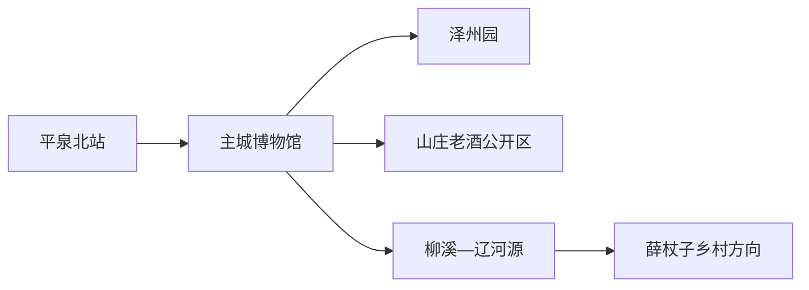
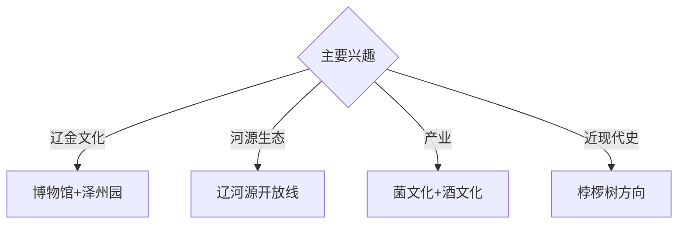

# 平泉旅行指南

平泉位于冀、辽、内蒙古交界的燕山山地，适合围绕辽金文物、契丹文化、辽河源生态和食用菌产业安排两天。固定快照中的 **Pingquan / GeoNames 2035465** 对应现行平泉市，本页以平泉北站—主城为住宿和交通中心。

## 城市速览

| 项目 | 信息 |
|---|---|
| 主线 | 平泉市博物馆—泽州园—辽河源方向 |
| 停留 | 主城1天；辽河源或乡村主题另加1天 |
| 住宿 | 平泉北站—主城便于高铁抵离；柳溪方向适合生态主题 |
| 交通 | 高铁、公路抵达主城，山地与乡村点位宜约车或自驾 |
| 风险 | 保护地开放边界、山洪雷雨、林火、工业与农业生产空间 |

## 城市格局与游览区域

主城集中博物馆、泽州园和生活服务，山庄老酒工业旅游区位于城郊。辽河源在柳溪镇山地，景区资质与保护区范围经历调整，行程以属地最新公布的入口和开放游线为准；薛杖子等乡村接待点适合与其同向组合。

## 主要景点

| 景点 | 区域 | 类型 | 核心体验 | 用时 | 环境 | 体力 | 研究价值 | 拥挤 | 优先级 |
|---|---|---|---|---:|---|---|---|---|---|
| 平泉市博物馆 | 主城 | 博物馆 | 辽金文物、地方考古与城市史 | 2–3小时 | 室内 | 低 | 很高 | 团体时中 | A |
| 泽州园与就日馆 | 主城 | 公园与展陈 | 契丹文化、菌文化与城市记忆 | 2小时 | 混合 | 低中 | 高 | 周末中 | A |
| 辽河源开放游览区 | 柳溪镇 | 山地生态 | 河源森林、地貌与契丹传说 | 半天至1天 | 室外 | 高 | 很高 | 节假日中 | A |
| 山庄老酒文化产业园公开区 | 城郊 | 工业旅游 | 酿造工艺、酒文化与产业史 | 2–3小时 | 混合 | 低中 | 高 | 团体时中 | A |
| 桲椤树纪念馆与公开史迹 | 南部乡村 | 红色史迹 | 战役史、纪念空间与乡村变化 | 半天 | 混合 | 中 | 高 | 团体时中 | B |
| 薛杖子乡村旅游公开区 | 柳溪方向 | 乡村体验 | 民宿、菌业与山村环境 | 2–3小时 | 混合 | 中 | 中 | 节假日中 | B |
| 瀑河正式滨水公园段 | 城区 | 滨水空间 | 河流治理与城市休闲 | 1–2小时 | 室外 | 低 | 中 | 傍晚中 | B |

## 美食与餐饮

食用菌、莜面、山野菜和承德北部家常菜最具地方辨识度。菌菇按品种、熟制方式和过敏情况选择，野生来源由正规餐饮经营者把关；酒文化体验安排指定驾驶人或公共交通，品饮与驾车分开。

## 经典行程

### 一日基础线
**路线**：平泉市博物馆—午餐—泽州园与就日馆—瀑河公开段。**逻辑**：先读历史，再看城市文化与河流。**预约锚点**：博物馆和就日馆开放。**休息**：主城商业区。**删除条件**：高温时缩短滨水段。

### 辽金文化线
**路线**：博物馆—泽州园—契丹主题公开展陈。**逻辑**：用文物、地方叙事和公园空间互证。**预约锚点**：馆舍讲解。**休息**：泽州园服务区。**删除条件**：展馆闭馆时保留公园和博物馆中的开放项。

### 辽河源生态线
**路线**：主城—属地公布入口—开放步道—返城。**逻辑**：完整一天观察河源山地。**预约锚点**：开放区域、接驳和返程。**休息**：游客服务点。**删除条件**：林火、雷雨、山洪或保护调整时取消。

### 工业文化线
**路线**：菌文化展陈—午餐—山庄老酒公开参观线。**逻辑**：串联两类本地产业。**预约锚点**：企业接待和讲解。**休息**：园区服务区。**删除条件**：生产安排暂停接待时改主城博物馆。

### 红色乡村线
**路线**：主城—桲椤树纪念馆—村内公开接待点—返城。**逻辑**：纪念史与乡村发展放在同一方向。**预约锚点**：纪念馆接待与车辆。**休息**：镇村公共服务点。**删除条件**：馆舍闭馆时改薛杖子乡村线。

### 亲子低体力线
**路线**：平泉市博物馆—午休—泽州园近入口段。**逻辑**：室内展陈配平缓公园。**预约锚点**：亲子活动。**休息**：馆内与公园座椅区。**删除条件**：强对流时只留室内。

### 雨天线
**路线**：平泉市博物馆—就日馆—正规产业展陈。**逻辑**：把移动压缩在主城与城郊。**预约锚点**：三处开放。**休息**：主城。**删除条件**：道路积水时提前返宿。

## 住宿区域

平泉北站—主城适合高铁抵离、博物馆和多方向换乘；柳溪镇及辽河源方向适合次日生态路线。山地住宿以持证经营、夜间道路、餐饮和预警响应能力筛选。

## 市内交通

平泉北站是主要铁路入口，主城用公交、出租车和网约车。辽河源、桲椤树和乡村点位跨距较大，提前核对城乡公交末班或预约返程；自驾沿公开道路通行，风电、矿业、酿造和菌业生产区按门禁进入。

## 不同旅行者须知

历史兴趣者优先博物馆与泽州园；生态旅行者给辽河源完整一天；亲子家庭选择博物馆和产业科普；行动不便者逐站确认山地接驳、坡度、馆舍电梯和卫生间。

## 行前核对

- 核对辽河源当前开放入口、保护范围、道路、天气和返程。
- 核对博物馆、就日馆、纪念馆及企业展陈的接待安排。
- 自然保护区、林地、河源核心区域、厂区和种植生产区沿正式游览路线进入。

## 来源与更新记录

| 来源 | 支持内容 | 核验日期 |
|---|---|---|
| [平泉市政府：特色文旅产业方案](https://www.pingquan.gov.cn/art/2022/3/21/art_5422_864964.html) | 博物馆、泽州园、辽河源、产业与红色乡村路线 | 2026-09-01 |
| [平泉市政府：辽河源建议答复](https://www.pingquan.gov.cn/art/2025/4/24/art_3185_1077500.html) | 景区资质变化、保护区调整与当前开放前提 | 2026-09-01 |
| [GeoNames 2035465](https://www.geonames.org/2035465/) | Pingquan 固定人口点与位置 | 2026-09-01 |

| 日期 | 更新 |
|---|---|
| 2026-09-01 | 首次完成平泉旅行研究；建立主城、辽河源、产业与红色乡村路线。 |
