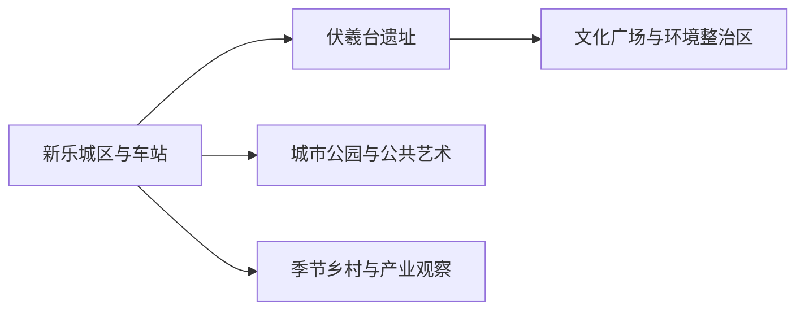
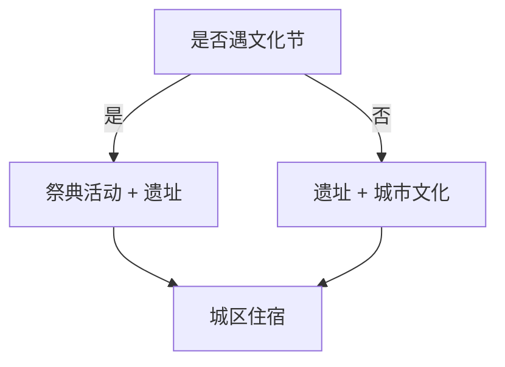

# 新乐旅行指南

新乐位于石家庄北部平原，旅行核心非常集中：伏羲台遗址、伏羲祭典与周边文化片区构成主线，城区公园、河北美术学院周边公共艺术和地方饮食用于补充。它更适合一至两天的文化专题，而不是把规划项目和产业园全部包装成景点。

> 建议停留：伏羲文化主线 1 天；增加城市文化与季节活动可住 1 晚
> 关键词：伏羲台、伏羲祭典、上古文化片区、平原城市、公共艺术
> 体力：低至中等，夏季日晒和节庆人流是主要负担
> 最近研究：2026-08-13

## 城市速览
| 项目 | 旅行信息 |
|---|---|
| 价值 | 以遗址、非遗祭典和城市文化理解伏羲文化当代表达 |
| 停留 | 1天主线，2天增加展览和公共艺术 |
| 交通 | 新乐站、新乐机场站等票面站名需核；市内用公交或车辆 |
| 季节 | 春季文化节最集中，夏季炎热，冬季注意大风 |
| 预算 | 公共空间较省，活动与讲解另计 |
| 步行 | 遗址片区较平缓但范围扩展后需分段 |
| 无障碍 | 新建广场较平缓，遗址与旧设施逐点确认；设施连续性需向官方确认 |
| 亲子 | 遗址、非遗活动和公共艺术适合 |
| 边界 | 伏羲文化项目的建设计划不等于当前开放 |
| 核心 | 核开放、活动、铁路与高温天气 |

## 城市格局与游览区域
新乐市法定代码 `130184`，由石家庄市代管。GeoNames `1812647` 与 Wikidata `Q1027327` 的 `P1566` 精确对应。

| 区域 | 重点 | 安排 | 条件 |
|---|---|---|---|
| 城区 | 住宿、餐饮、公园 | 基地 | 场馆开放 |
| 伏羲台片区 | 遗址、祭典、文化景观 | 半日至1天 | 文保与活动秩序 |
| 高校园区周边 | 公共艺术与城市文化 | 半日 | 只走公开区域 |
| 乡村方向 | 正式节庆、农业与手工艺 | 半日至1天 | 接待与生产边界 |

## 主要景点
| 名称 | 区域 | 类型 | 价值 | 时长 | 室内外 | 体力 | 无障碍 | 预约 | 优先级 |
|---|---|---|---|---:|---|---|---|---|---|
| 伏羲台遗址 | 伏羲台片区 | 遗址、文保 | 冀中史前至历史时期文化遗存 | 2–4小时 | 室外 | 低至中 | 中 | 建议核对 | A |
| 伏羲文化广场与环境整治区 | 同片区 | 公共文化 | 理解遗址展示与祭典空间 | 1–2小时 | 室外 | 低 | 中至高 | 活动另核 | A |
| 伏羲文化旅游节当期活动 | 同片区 | 非遗、节庆 | 观看国家级非遗伏羲祭典展演 | 半日至1天 | 混合 | 中 | 中 | 需要核对 | A |
| 新乐城市公园 | 城区 | 公园 | 抵达日和低体力缓冲 | 1–2小时 | 室外 | 低 | 中 | 通常无需 | B |
| 河北美术学院周边公开艺术空间 | 城区 | 公共艺术 | 观察艺术教育与城市环境 | 1–2小时 | 室外 | 低 | 中 | 校园另核 | B |
| 新乐地方公共文化场馆 | 城区 | 文化 | 结合当期展览补充地方背景 | 1–2小时 | 室内 | 低 | 中 | 建议 | B |

## 美食与餐饮
| 类型 | 点法 | 注意 |
|---|---|---|
| 羲宴蒸碗等地方宴席 | 多人分享或小份套餐 | 高盐高油，确认花生、大豆和小麦 |
| 饸饹、面食 | 一人一份 | 含小麦或荞麦，共锅需问 |
| 驴肉与熟食 | 小份拼盘 | 咸度高，确认来源与冷藏 |
| 平原家常菜 | 按人数少点 | 酱料含大豆、小麦 |

## 经典行程

### 一日经典
**路线**：伏羲台遗址 → 午餐 → 文化广场与公开展陈 → 城区。
- **串联逻辑**：围绕同一文化片区深入。
- **预约锚点**：遗址、展馆和活动。
- **休息安排**：午间避晒。
- **时间不足时**：只留伏羲台。
### 两日
**第2天**：城市公共文化场馆 → 午餐 → 公开艺术空间 → 城市公园。
- **串联逻辑**：从古代遗址转向当代文化。
- **预约锚点**：场馆与校园公开规则。
- **休息安排**：室内展览间休息。
- **时间不足时**：保留一馆一园。
### 节庆日
**路线**：提前到场 → 祭典展演 → 午休 → 遗址短线。
- **适用条件**：取得正式活动日程。
- **串联逻辑**：活动优先，遗址作为背景。
- **预约锚点**：交通、入场、座席。
- **休息安排**：避开人群高峰。
- **时间不足时**：只保留主仪程。
### 雨雪天
**路线**：地方室内场馆 → 午餐 → 雨雪减弱后广场短线。
- **适用条件**：道路正常。
- **串联逻辑**：室内优先。
- **预约锚点**：开馆。
- **休息安排**：室内取暖。
- **时间不足时**：一馆即可。
### 亲子
**路线**：遗址短线 → 午餐 → 公共艺术或公园。
- **适用条件**：天气温和。
- **串联逻辑**：历史观察加开放空间。
- **预约锚点**：研学活动。
- **休息安排**：午休、防晒。
- **时间不足时**：遗址短线。
### 长者与低体力
**路线**：车辆到遗址入口 → 平缓参观 → 午餐 → 城区公园。
- **适用条件**：近距离上下车。
- **串联逻辑**：车辆连接两个平缓点。
- **预约锚点**：轮椅、卫生间。
- **休息安排**：午间长休。
- **时间不足时**：遗址一处。

## 住宿区域
| 区域 | 优势 | 取舍 | 适合 | 交通 |
|---|---|---|---|---|
| 新乐站—城区 | 抵离、餐饮方便 | 去遗址需车辆 | 首访 | 核实际车站 |
| 伏羲台方向 | 节庆早到方便 | 夜间服务少 | 活动、摄影 | 先确认住宿资质 |
| 石家庄联程 | 选择多 | 当天往返受车次约束 | 短访 | 留返程缓冲 |

## 市内交通
| 场景 | 推荐 | 核对 |
|---|---|---|
| 铁路 | 按票面到站接车辆 | 站名、车次、末班 |
| 城区—伏羲台 | 公交、出租车或网约车 | 活动管制、返程 |
| 石家庄联程 | 铁路或公路 | 总耗时与夜间接驳 |
| 乡村 | 合规车辆直达确认接待点 | 村路、停车、生产活动 |

## 不同旅行者须知
| 旅行者 | 怎么选 | 重点 |
|---|---|---|
| 独行 | 城区住宿、遗址主线 | 返程与活动散场 |
| 亲子 | 遗址、节庆、公共艺术 | 高温与人流 |
| 长者 | 平缓入口、车辆接驳 | 座椅、卫生间 |
| 摄影 | 公共活动与遗址外观 | 文保、肖像、无人机 |
| 预算有限 | 石家庄联程或城区平价住宿 | 末班与交通总价 |
| 研究旅行 | 遗址和文保资料 | 现场拍摄与学术预约 |

## 行前核对
| 项目 | 时点 | 入口 |
|---|---|---|
| 遗址与活动 | 前一周、前一日 | [新乐市政府](https://www.xinle.gov.cn/) |
| 天气 | 前三日 | [河北气象](https://he.cma.gov.cn/) |
| 铁路 | 购票与前一日 | [12306](https://www.12306.cn/) |
| 行政边界 | 跨城规划 | [民政部](https://dmfw.mca.gov.cn/xzqh/getList?code=130100&trimCode=false&maxLevel=3) |

## 来源与更新记录
### 主要来源
| 来源 | 支持内容 | 日期 |
|---|---|---|
| [2026伏羲文化旅游节](https://www.xinle.gov.cn/columns/ddfcf040-ee42-4e8d-acdc-a8cb9bc0a886/202605/01/0a4b426f-0fae-4461-90b1-d7ac6567df01.html) | 祭典、活动与旅游节 | 2026-08-13 |
| [文旅提案答复](https://www.xinle.gov.cn/columns/388b91dc-3f4b-4779-984b-2b3f8de182c3/202512/25/7acaf6a6-a1ba-432b-a433-ea4459380c38.html) | 遗址整治、广场和开放项目状态 | 2026-08-13 |
| [全国重点文物资料](https://wenwu.hebei.gov.cn/doc/003/002/381/00300238175_091be6df.pdf) | 伏羲台位置与文物价值 | 2026-08-13 |
| [GeoNames 1812647](https://www.geonames.org/1812647/) | 城市点 | 2026-08-13 |
| [Wikidata Q1027327](https://www.wikidata.org/wiki/Q1027327) | 实体与P1566 | 2026-08-13 |
| [行政区划130100](https://dmfw.mca.gov.cn/xzqh/getList?code=130100&trimCode=false&maxLevel=3) | 新乐130184与代管关系 | 2026-08-13 |
### 更新记录
| 日期 | 更新 |
|---|---|
| 2026-08-13 | 首次完成新乐旅行研究；聚焦伏羲台遗址、祭典与城市文化，区分现行开放和规划建设 |
