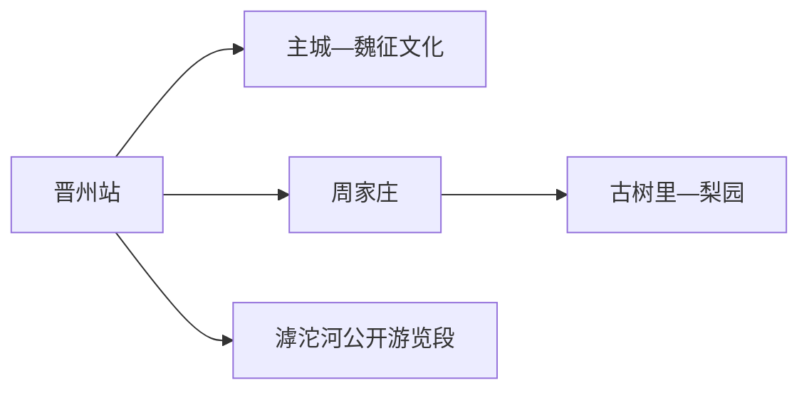
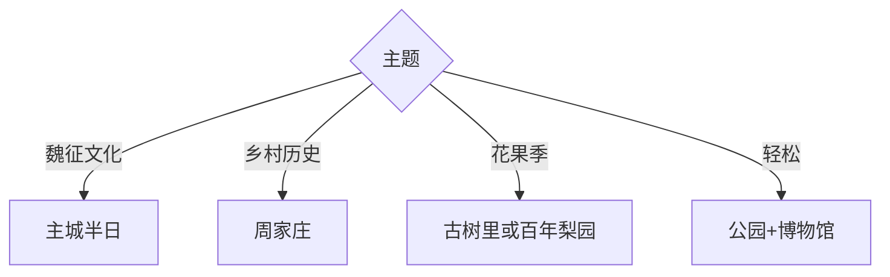

# 晋州旅行指南

晋州位于石家庄东部平原，旅行线索集中在魏征文化、周家庄集体经济史、鸭梨产业与滹沱河沿线。固定快照中的 **Jinzhou / GeoNames 1805336** 对应现行晋州市，本页以晋州主城为住宿和交通中心。

## 城市速览

| 项目 | 信息 |
|---|---|
| 主线 | 魏征文化园—周家庄农业特色观光园—古树里 |
| 停留 | 主城半日至1天；乡村与果园主题另加1天 |
| 住宿 | 晋州站—主城便于抵离；乡村活动宜当天往返 |
| 交通 | 铁路抵达主城，乡镇点位用公交、预约车或自驾 |
| 风险 | 高温雷雨、采摘季人流、临水空间与农业生产边界 |

## 城市格局与游览区域

主城适合完成城市史和魏征主题，周家庄、古树里及百年梨园分处乡村方向，花期、果期和接待日直接决定体验。滹沱河只选属地公布的公园、绿道与观景入口。

## 主要景点

| 景点 | 区域 | 类型 | 核心体验 | 用时 | 环境 | 体力 | 研究价值 | 拥挤 | 优先级 |
|---|---|---|---|---:|---|---|---|---|---|
| 魏征文化园 | 主城 | 人物文化 | 魏征生平与地方记忆 | 1–2小时 | 混合 | 低 | 高 | 周末中 | A |
| 魏征公园 | 主城 | 城市公园 | 城市休闲与人物主题 | 1小时 | 室外 | 低 | 中 | 傍晚中 | B |
| 鸭梨博物馆 | 主城近郊 | 产业展陈 | 鸭梨栽培、品牌与加工 | 1–2小时 | 室内 | 低 | 高 | 团体时中 | A |
| 周家庄农业特色观光园 | 周家庄 | 乡村与农业 | 集体经济史、田园与时令体验 | 半天 | 室外 | 中 | 很高 | 花果期高 | A |
| 周家庄乡人民公社纪念馆 | 周家庄 | 纪念馆 | 乡级核算历史与乡村社会 | 1小时 | 室内 | 低 | 很高 | 团体时中 | A |
| 古树里现代农业生态园 | 武邱村 | 农业园 | 古树、梨园与研学 | 2–3小时 | 室外 | 中 | 中 | 花果期高 | B |
| 百年梨园 | 北辛庄村 | 果园 | 老梨树与季节景观 | 1–2小时 | 室外 | 低中 | 中 | 花期高 | B |
| 滹沱河公开游览段 | 北部 | 滨水空间 | 河岸生态与平原景观 | 1–2小时 | 室外 | 中 | 中 | 周末中 | C |

## 美食与餐饮

晋州鸭梨、梨加工品、山楂及河北平原家常菜最具地方辨识度。采摘按园区当期品种、计价和开放地块选择；购买果品可比较产地、等级和包装，易损鲜果为返程预留防压空间。

## 经典行程

### 一日基础线
**路线**：魏征文化园—午餐—周家庄观光园与纪念馆。**逻辑**：人物史与乡村社会各占半日。**预约锚点**：两处场馆及园区接待。**休息**：主城或周家庄服务区。**删除条件**：接驳不足时保留主城。

### 魏征文化线
**路线**：魏征文化园—魏征公园—主城餐饮。**逻辑**：集中理解人物与地方关联。**预约锚点**：文化园开放。**休息**：公园座椅区。**删除条件**：高温时缩短室外段。

### 周家庄专题线
**路线**：纪念馆—观光园—村内公开接待空间。**逻辑**：先看历史，再观察当代乡村产业。**预约锚点**：纪念馆讲解和园区接待。**休息**：游客服务区。**删除条件**：大型活动或农忙限制接待时改期。

### 梨乡季节线
**路线**：鸭梨博物馆—古树里或百年梨园。**逻辑**：展陈与田野季相互证。**预约锚点**：花期、果期和采摘规则。**休息**：园区服务点。**删除条件**：非适游季只留博物馆。

### 滨水半日线
**路线**：主城—滹沱河正式入口—返城。**逻辑**：补充平原河流景观。**预约锚点**：开放段和返程车辆。**休息**：入口服务点。**删除条件**：暴雨、大风或水位管控时取消。

### 亲子低体力线
**路线**：鸭梨博物馆—午休—魏征公园近入口段。**逻辑**：室内科普配平缓公园。**预约锚点**：亲子活动。**休息**：馆内与主城商业区。**删除条件**：强对流时只留室内。

### 雨天线
**路线**：鸭梨博物馆—魏征文化园室内展陈—主城餐饮。**逻辑**：压缩城乡移动。**预约锚点**：馆舍开放。**休息**：每馆后坐休。**删除条件**：积水预警时提前返宿。

## 住宿区域

晋州站至主城商业区适合铁路抵离、餐饮和次日叫车。周家庄及果园主题以主城往返更灵活；确需乡村住宿时，以持证经营、夜间到达方式和次日返程为筛选条件。

## 市内交通

晋州站承担主要铁路抵离，主城可用公交和出租车。周家庄、武邱、北辛庄与滹沱河分处不同方向，先核对城乡公交末班；自驾在公共停车区停放，果园道路为农业生产通道时服从现场分流。

## 不同旅行者须知

历史兴趣者优先魏征文化园和周家庄纪念馆；亲子家庭选择鸭梨博物馆与开放农业园；摄影者围绕花期、果期和清晨光线安排；轮椅与婴儿车使用者逐站确认馆舍坡道、园区硬化路及卫生间。

## 行前核对

- 核对纪念馆、博物馆、农业园的开放日与团体接待安排。
- 核对梨花、采摘时段、城乡公交末班及高温雷雨预警。
- 农田、果园、灌渠和农机作业区按经营方划定的公开路线进入。

## 来源与更新记录

| 来源 | 支持内容 | 核验日期 |
|---|---|---|
| [晋州市政府：市情概况](https://www.jzs.gov.cn/columns/1500d800-57fd-47fe-907d-f03b8b9a7b68/202405/08/da52f391-866d-446d-9d18-4693d9f305cc.html) | 魏征、鸭梨、周家庄、非遗与场馆 | 2026-09-01 |
| [晋州市政府：乡村旅游建议答复](https://www.jzs.gov.cn/columns/5d2900f7-e98c-4b5e-8379-5c71ce3ea21a/202305/24/79387f8c-5727-467d-97f5-ab5e2199dec0.html) | 周家庄、古树里、梨园与滹沱河布局 | 2026-09-01 |
| [GeoNames 1805336](https://www.geonames.org/1805336/) | Jinzhou 固定人口点与位置 | 2026-09-01 |

| 日期 | 更新 |
|---|---|
| 2026-09-01 | 首次完成晋州旅行研究；建立人物、乡村与梨乡三条主线。 |
