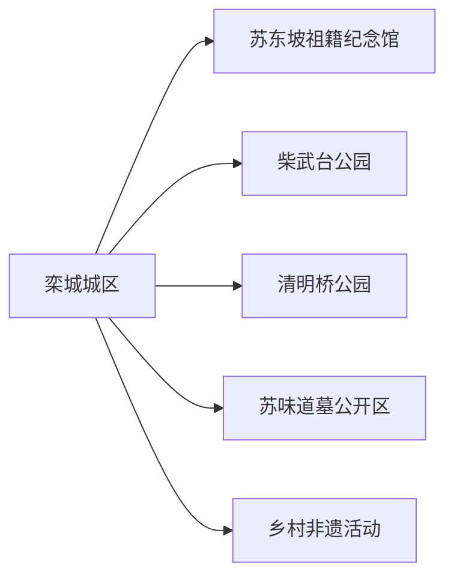
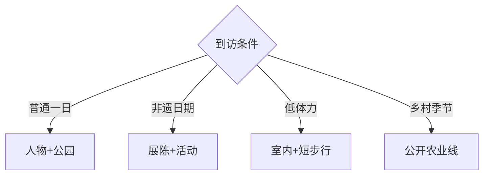

# 栾城旅行指南

栾城位于石家庄主城东南，旅行价值集中在苏氏文化、柴武台与清明桥等地方遗存，以及抬花杠、大蜡等节庆非遗。这里适合一至两天的近郊文化慢游：先看区级展陈，再按活动日期选择公园、古迹或乡村线路。

## 城市速览

| 项目 | 信息 |
|---|---|
| 主线 | 栾城城区—苏东坡祖籍纪念馆—柴武台—清明桥—非遗活动 |
| 停留 | 1天完成核心；遇正式节庆或乡村活动可住1晚 |
| 住宿 | 栾城城区适合交通与餐饮；石家庄主城也可当天往返 |
| 交通 | 石家庄南部以公交、出租车或自驾进入，各文化点按实际开放串联 |
| 风险 | 夏季高温雷雨、冬季风寒、活动客流、乡村道路与施工 |
| 边界 | 文物保护区、墓葬、农田、低空飞行活动和工业园按管理范围进入 |

## 城市格局与游览区域

固定 **Luancheng / GeoNames 1802204** 位于现行栾城区主城，本页用它定位旅行入口，并以栾城区实体 `Q1022935`、代码 `130111` 确定区级范围。城区文化点可通过短途车辆组合；苏味道墓、乡村非遗与农业活动要按具体村镇和日期进入。石家庄中心城区、赵县与正定的景点属于其他行政单元。

## 主要景点

| 景点 | 区域 | 类型 | 核心体验 | 用时 | 环境 | 体力 | 研究价值 | 拥挤 | 优先级 |
|---|---|---|---|---:|---|---|---|---|---|
| 苏东坡祖籍纪念馆 | 栾城城区 | 人物文化 | 苏氏谱系、苏味道与地方文化记忆 | 1.5–2.5小时 | 室内 | 低 | 很高 | 中 | A |
| 柴武台公园 | 城区 | 历史公园 | 汉代人物传说、城市遗址与公共绿地 | 1.5–2.5小时 | 室外 | 低至中 | 高 | 中 | A |
| 清明桥公园与保护点 | 城区 | 古桥公园 | 古桥遗存、水系与城市公共空间 | 1–2小时 | 室外 | 低 | 高 | 低 | B |
| 栾城区文化馆或非遗展陈 | 城区 | 公共文化 | 抬花杠、大蜡等地方非遗 | 1.5–2.5小时 | 室内 | 低 | 高 | 活动时高 | A |
| 苏味道墓公开参观范围 | 城郊 | 墓葬史迹 | 唐代人物、苏氏源流与文保环境 | 1–2小时 | 室外 | 低至中 | 很高 | 低 | B |
| 文庙大成殿公开范围 | 城区 | 古建筑 | 地方礼制建筑与文物保护 | 1–1.5小时 | 混合 | 低 | 高 | 低 | B |
| 人民公园或樱花公园 | 城区 | 城市公园 | 市民生活、季节花景与轻体力散步 | 1–2小时 | 室外 | 低 | 中 | 花期高 | C |
| 正式乡村非遗与农业活动 | 区内乡村 | 节庆农业 | 抬花杠、民俗表演或公开农事体验 | 半日至1天 | 混合 | 中 | 高 | 活动时高 | C |

## 美食与餐饮

栾城城区可选择熏鸡、烧饼、面食、饸饹和河北家常菜，节庆乡村则以正式摊位与接待点为主。点餐时确认肉类、汤底、花生芝麻和小麦过敏，外带熟食关注制作日期与冷藏条件；农业采摘按园区公开品种、计价和食品清洗要求体验。

## 经典行程

### 一日基础线
**路线**：苏东坡祖籍纪念馆—柴武台公园—清明桥。**逻辑**：用人物、历史与水系串起城区。**预约锚点**：纪念馆开放。**休息**：城区午餐。**删除条件**：高温时缩短公园。

### 苏氏文化线
**路线**：纪念馆—苏味道墓公开区—文庙大成殿。**逻辑**：按人物与地方文脉展开。**预约锚点**：文保点开放和讲解。**休息**：城区。**删除条件**：墓区关闭时保留馆内展陈。

### 城市公园线
**路线**：柴武台—清明桥—人民公园或樱花公园。**逻辑**：以低门槛公共空间观察城市生活。**预约锚点**：季节活动。**休息**：公园服务点。**删除条件**：雷雨或大风时转室内。

### 非遗活动线
**路线**：文化馆—抬花杠或大蜡正式活动—城区餐饮。**逻辑**：先了解技艺再看现场。**预约锚点**：活动日期、观众区和交通。**休息**：固定服务点。**删除条件**：活动取消时只看展陈。

### 乡村季节线
**路线**：城区—公开农业园或村级活动—返城。**逻辑**：以正式接待项目进入乡村。**预约锚点**：采摘、餐饮和返程。**休息**：园区服务区。**删除条件**：高温、雨雪或农忙管控时取消。

### 亲子文化线
**路线**：纪念馆—文化馆体验—柴武台短段。**逻辑**：展陈、动手和户外各留一段。**预约锚点**：课程年龄与名额。**休息**：馆内。**删除条件**：课程满额时改城市公园。

### 低体力线
**路线**：车辆到纪念馆—文化馆—清明桥近入口。**逻辑**：用车辆和室内座席降低步行。**预约锚点**：无障碍入口。**休息**：每站。**删除条件**：拥挤时只留两馆。

## 住宿区域

栾城城区适合早晚餐饮、公交和次日乡村线路；只做一日游时可住石家庄南部并按实际道路往返。订房时核对到栾城核心而非石家庄其他同名道路的距离、夜间公交、停车、隔音和活动日期。

## 市内交通

从石家庄主城进入栾城可用公交、出租车或自驾，具体线路与施工状态以当期信息为准。区内核心点距离不算极远，但开放时段并不一致；苏味道墓和乡村活动适合预先约车。机场或低空活动区只按公众通道与主办方安排接近。

## 不同旅行者须知

人物史兴趣者优先苏氏文化线；非遗旅行者按正式活动日期来访；亲子家庭选择文化馆课程和公园；长者采用一馆一园的慢节奏。墓葬封土、古桥结构、考古与修缮区域按文保边界观看，农业和工业生产空间以明确接待为准。

## 行前核对

- 核对纪念馆、文化馆、文庙、墓区和非遗活动的开放、预约与讲解。
- 核对石家庄往返公交、道路施工、高温雷雨、冬季冰雪和节庆分流。
- 乡村体验、低空活动和产业参访选择有主办方、保险与明确观众范围的项目。

## 来源与更新记录

| 来源 | 支持内容 | 核验日期 |
|---|---|---|
| [栾城区政府：魅力栾城](https://www.luancheng.gov.cn/columns/0754ddcb-54f9-477c-8b04-b4c644a34833/index.html) | 历史人物、清明桥、苏味道墓、柴武台与文庙 | 2026-09-01 |
| [栾城区政府：文化建设报告](https://www.luancheng.gov.cn/columns/97f4bed9-94f7-4b43-b238-8e909df99418/202109/14/84c4d27e-7ec4-45a0-8f30-664dc4911002.html) | 苏东坡祖籍纪念馆、公园与非遗项目 | 2026-09-01 |
| [栾城区文物保护单位清单](https://www.luancheng.gov.cn/columns/e8efb875-29e1-451d-8bf7-0bb13814ece1/201703/18/24899922-441e-4825-a18f-45a3bdd9f7c6.html) | 古桥、古建、墓葬与文保身份 | 2026-09-01 |
| [石家庄园林局：栾城公园](https://ylj.sjz.gov.cn/columns/6a6d55da-77ad-4a60-8534-ca0d875cd2df/201707/13/39cebc52-774b-4c8e-a599-d8b05020488b.html) | 城区公园与公共游憩 | 2026-09-01 |
| [GeoNames 1802204](https://www.geonames.org/1802204/) | Luancheng 固定人口点 | 2026-09-01 |
| [Wikidata Q1022935](https://www.wikidata.org/wiki/Q1022935) | 栾城区实体与跨库标识 | 2026-09-01 |

| 日期 | 更新 |
|---|---|
| 2026-09-01 | 首次完成栾城旅行研究；按苏氏文化、城市公园、非遗日期与乡村活动组织近郊路线。 |
