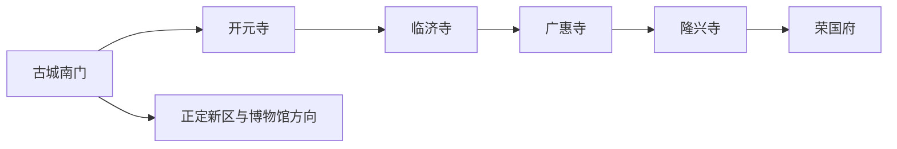
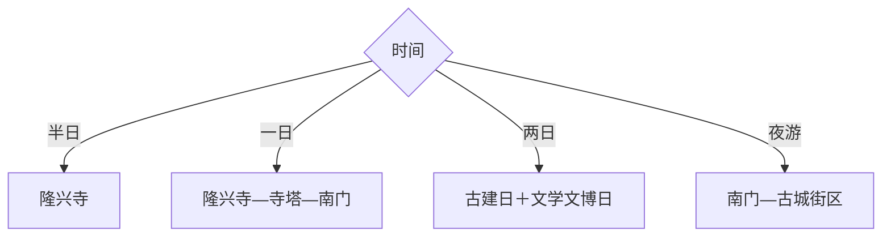

# 正定旅行指南

正定适合从石家庄出发做古城建筑密集型旅行：隆兴寺是核心，古城墙南门、开元寺、临济寺、天宁寺和广惠寺可按街区步行连接，荣国府提供文学影视主题。一天走精华，两天更适合细看寺塔与夜景。

## 城市速览

| 项目 | 信息 |
|---|---|
| 主线 | 隆兴寺—古城墙南门—开元寺—临济寺—天宁寺—广惠寺—荣国府 |
| 停留 | 古城精华1天；建筑与文博深读2天 |
| 住宿 | 古城内适合早晚步行，正定新区和石家庄适合交通联程 |
| 交通 | 石家庄市区乘公交或铁路到正定，再用步行、公交和网约车 |
| 风险 | 节假日客流、夏季高温、冬季风寒、古建消防与台阶 |
| 边界 | 宗教活动区、文物本体、修缮区、城墙边缘与演出后台按开放范围进入 |

## 城市格局与游览区域

固定 `Zhengding / GeoNames 1784712` 对应县城，本页以法定正定县 `Q197678` 组织。多座寺塔集中在古城范围，隆兴寺值得单留半日；新区文博与高铁枢纽在古城之外，按交通余量增加。

## 主要景点

| 景点 | 区域 | 类型 | 核心体验 | 用时 | 环境 | 体力 | 预约风险 | 天气影响 | 优先级 |
|---|---|---|---|---:|---|---|---|---|---|
| 隆兴寺 | 古城东部 | 古建筑群 | 宋代建筑、造像与寺院轴线 | 3–5小时 | 室内外 | 中 | 高 | 中 | A |
| 正定古城墙南城门 | 古城南部 | 城防遗产 | 城墙格局、古城轴线与夜景 | 1–3小时 | 室外 | 中 | 中 | 高 | A |
| 开元寺与须弥塔 | 古城 | 寺塔 | 唐宋遗存、塔与钟楼关系 | 1–2小时 | 室内外 | 低中 | 高 | 中 | A |
| 临济寺与澄灵塔 | 古城 | 寺塔 | 临济宗文化与古塔 | 1–2小时 | 室内外 | 低 | 高 | 中 | A |
| 天宁寺凌霄塔 | 古城 | 古塔 | 木构塔身与城市天际线 | 1–2小时 | 室外为主 | 低 | 高 | 高 | B |
| 广惠寺华塔 | 古城 | 古塔 | 造型独特的多宝塔观察 | 1–2小时 | 室外为主 | 低 | 高 | 高 | A |
| 正定县文庙 | 古城 | 文庙 | 古建尺度与地方教育史 | 1–2小时 | 室内外 | 低 | 高 | 中 | B |
| 荣国府与宁荣街 | 古城北部 | 文学影视 | 《红楼梦》场景、园林与演出 | 2–4小时 | 室内外 | 中 | 很高 | 中 | B |

## 美食与餐饮

古城可选正定八大碗、马家卤鸡、崩肝、饸饹和烧麦。组合菜先问份量，小吃适合分次尝试；热门街区在节假日提前错峰，正餐可在主街之外按明码标价与卫生条件选择。

## 经典行程

### 一日经典线
**路线**：隆兴寺—临济寺—广惠寺—南城门夜景。**逻辑**：先留足核心古建，再顺街区看寺塔。**预约锚点**：隆兴寺、各寺塔和城墙开放。**休息**：古城主街。**删除条件**：时间不足时保留隆兴寺与南门。

### 两日古建线
**路线**：首日隆兴寺—荣国府；次日开元寺—天宁寺—临济寺—广惠寺—文庙。**逻辑**：把大型建筑群和散点寺塔分开。**预约锚点**：场馆与讲解。**休息**：古城中心。**删除条件**：闭馆点按地理顺序跳过。

### 寺塔专题线
**路线**：开元寺须弥塔—天宁寺凌霄塔—临济寺澄灵塔—广惠寺华塔。**逻辑**：比较不同时代与结构。**预约锚点**：各点开放及内部参观范围。**休息**：临济寺周边。**删除条件**：高温时缩减为两塔。

### 文学影视线
**路线**：荣国府—宁荣街—古城街区—夜景。**逻辑**：把影视场景与真实古城分层理解。**预约锚点**：演出时段与活动。**休息**：荣国府服务点。**删除条件**：演出停演时压缩半日。

### 亲子认知线
**路线**：隆兴寺重点讲解—午休—南城门—短段街区。**逻辑**：用一处深读配一处空间观察。**预约锚点**：亲子讲解和卫生间。**休息**：午餐区。**删除条件**：高温时取消城墙段。

### 夜游线
**路线**：傍晚古城南门—主街—公开亮化寺塔外观。**逻辑**：避开午后高温并观察城址尺度。**预约锚点**：亮化、交通与返程。**休息**：主街。**删除条件**：大风、雨雪或临时管控时取消。

### 低体力线
**路线**：车辆到隆兴寺—午休—荣国府或南门二选一。**逻辑**：以两处落客方便的核心点减少转场。**预约锚点**：无障碍、轮椅和落客。**休息**：隆兴寺外。**删除条件**：台阶条件不合适时改平层展陈。

## 住宿区域

古城内适合清晨入寺和晚间步行；正定新区适合高铁、会展与现代酒店；石家庄市区适合把正定作为一日往返。古城住宿关注停车、隔音和步行距离，节假日提前确认退改。

## 市内交通

石家庄至正定可按出发位置比较公交、铁路与网约车。古城寺塔适合步行加短途公交，但隆兴寺、荣国府与南门不宜在高温下连续折返；自驾优先使用外围公共停车场，按古城交通组织步行进入。

## 不同旅行者须知

古建爱好者给隆兴寺半天；摄影者选择清晨寺塔与傍晚南门；亲子家庭少而深；低体力者两点组合。宗教仪式区、文物基座、修缮围挡、未开放城墙段和无人机管制区域保留明确限制。

## 行前核对

- 核对隆兴寺、荣国府、寺塔、文庙和城墙的预约、闭馆日与讲解。
- 核对古城交通管制、停车、夜间亮化、天气和返程班次。
- 古建内部按摄影、消防和文物保护规则参观，无人机依空域与景区规定申报。

## 来源与更新记录

| 来源 | 支持内容 | 核验日期 |
|---|---|---|
| [正定县旅游发展规划](https://www.zd.gov.cn/atm/7/20200706111321907.pdf) | 古城、隆兴寺、临济寺和文庙等文旅结构 | 2026-09-01 |
| [中国旅游报正定古城报道](https://www.ctnews.com.cn/paper/att/202402/20/a186c78d-da6e-4c60-b90d-567915f0a3c3.pdf) | 南门、隆兴寺与荣国府游览关系 | 2026-09-01 |
| [GeoNames 1784712](https://www.geonames.org/1784712/) | Zhengding 固定主城点 | 2026-09-01 |
| [Wikidata Q197678](https://www.wikidata.org/wiki/Q197678) | 正定县实体与跨库标识 | 2026-09-01 |

| 日期 | 更新 |
|---|---|
| 2026-09-01 | 首次完成正定旅行研究，按隆兴寺、寺塔、古城和文学场景组织。 |
