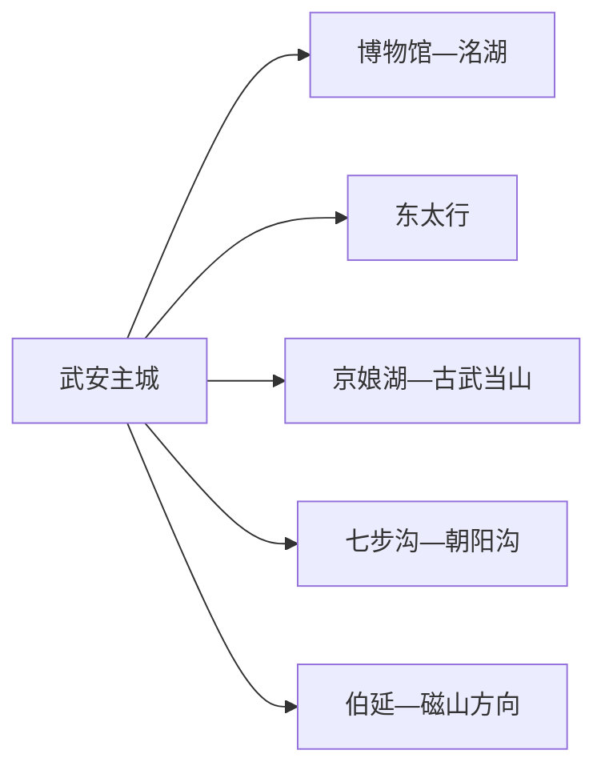
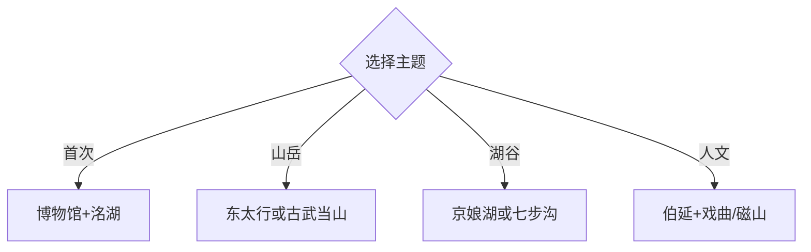

# 武安旅行指南

武安位于邯郸西部太行山东麓，东太行、京娘湖、七步沟等山水景区体量大，地方文博、磁山文化、冶铁矿业与平调落子又构成独立人文线。固定快照中的 **Wu’an / GeoNames 1791358** 对应现行武安市。

## 城市速览

| 项目 | 信息 |
|---|---|
| 主线 | 武安博物馆—东太行—京娘湖 |
| 停留 | 主城1天；每座大型山水景区各留1天 |
| 住宿 | 主城便于多方向换乘；西部景区周边适合连住 |
| 交通 | 铁路、公路抵达主城，山区宜景区接驳、预约车或自驾 |
| 风险 | 山洪雷雨、崖边栈道、水域项目、林火与矿业生产边界 |

## 城市格局与游览区域

主城适合地方史和抵离；西部太行山景区沿多条旅游公路展开，东太行、京娘湖、七步沟、古武当山分别是完整运营单元。伯延、磁山及楼上村偏向古镇、考古和戏曲，宜与大型景区分日。

## 主要景点

| 景点 | 区域 | 类型 | 核心体验 | 用时 | 环境 | 体力 | 研究价值 | 拥挤 | 优先级 |
|---|---|---|---|---:|---|---|---|---|---|
| 武安市博物馆 | 主城 | 博物馆 | 地方史、磁山文化与冶铁传统 | 2小时 | 室内 | 低 | 很高 | 团体时中 | A |
| 东太行景区 | 西部山地 | 山岳景区 | 丹霞地貌、绝壁栈道与云海 | 1天 | 室外 | 高 | 高 | 节假日高 | A |
| 京娘湖景区 | 活水方向 | 湖山景区 | 峡谷湖面、游船与山地传说 | 1天 | 混合 | 中高 | 高 | 节假日高 | A |
| 七步沟景区 | 西部山地 | 峡谷景区 | 湖谷、森林与季节活动 | 1天 | 室外 | 高 | 中 | 节假日高 | A |
| 古武当山景区 | 西部山地 | 山岳与宗教 | 山峰、步道与太极文化 | 1天 | 室外 | 高 | 高 | 节假日中 | B |
| 伯延古镇 | 南部 | 历史聚落 | 古街、民居与晋冀商贸记忆 | 半天 | 混合 | 中 | 高 | 活动时中 | B |
| 楼上村戏曲小镇 | 山区乡村 | 非遗与乡村 | 武安平调落子及乡村体验 | 半天 | 混合 | 中 | 高 | 演出时中 | B |
| 磁山文化相关遗址展陈 | 磁山方向 | 考古 | 新石器时代农业与聚落史 | 半天 | 混合 | 中 | 很高 | 团体时中 | B |
| 九龙山矿山生态修复公园 | 城区近郊 | 工业生态 | 矿业城市转型与生态修复 | 2–3小时 | 室外 | 中 | 高 | 周末中 | B |

## 美食与餐饮

武安拽面、小米、熏肉及太行山家常菜适合补充在地体验。山区餐饮点较分散，早餐后携带饮水；地方小米和农产品按产地、加工日期及包装信息选择。

## 经典行程

### 一日基础线
**路线**：武安市博物馆—午餐—九龙山矿山生态修复公园或洺湖公开段。**逻辑**：从地方史进入城市转型。**预约锚点**：博物馆开放。**休息**：主城商业区。**删除条件**：高温或大风时缩短公园段。

### 东太行线
**路线**：主城—东太行游客中心—景区推荐环线—返宿。**逻辑**：完整一天给山岳与栈道。**预约锚点**：索道、步道、接驳与末班。**休息**：景区服务站。**删除条件**：雷雨、大风、结冰或闭园时取消。

### 京娘湖线
**路线**：游客中心—当日开放游船或湖岸线—山地公开段。**逻辑**：湖面与峡谷组合。**预约锚点**：游船、步道和返程。**休息**：码头服务区。**删除条件**：大风、雷雨或水上项目停运时调整为陆路线。

### 七步沟线
**路线**：游客中心—峡谷湖区—开放森林步道—返宿。**逻辑**：以相对完整的沟谷景观为主。**预约锚点**：季节项目和末班接驳。**休息**：景区服务区。**删除条件**：山洪、积雪或闭园公告出现时取消。

### 太行人文线
**路线**：伯延古镇—楼上村公开展演—山区住宿或返城。**逻辑**：古镇生活连接地方戏曲。**预约锚点**：演出与接待。**休息**：镇村公共服务点。**删除条件**：无演出时只留伯延。

### 考古工业线
**路线**：武安博物馆—磁山方向公开展陈—九龙山修复公园。**逻辑**：从早期农业跨到现代矿业转型。**预约锚点**：遗址展陈接待。**休息**：主城或镇区。**删除条件**：遗址未开放时保留两处城市点。

### 雨天线
**路线**：武安博物馆—正规非遗展演—主城餐饮。**逻辑**：减少山区移动。**预约锚点**：馆舍和演出。**休息**：主城。**删除条件**：强降雨影响道路时留在住宿周边。

## 住宿区域

主城适合博物馆、交通和多个方向的首次选择；活水及西部景区周边适合连续两天山水路线。山区住宿以持证经营、景区接驳、夜间餐饮和预警响应能力筛选。

## 市内交通

武安站及公路客运承担抵离，主城可用公交和出租车。太行山景区距离远、弯道多，选择景区专线、预约车或自驾；连续游两座景区时在西部合适片区换宿更省折返。

## 不同旅行者须知

山岳徒步者按单景区完整一天安排；历史兴趣者优先博物馆、磁山与伯延；亲子家庭选择博物馆和规范景区短线；行动不便者逐景区确认接驳、索道、台阶、栈道及卫生间。

## 行前核对

- 核对景区开闭园、索道游船、步道、接驳和末班时间。
- 核对雷雨、大风、山洪、地质灾害、林火及冬季结冰预警。
- 自然保护区核心区、未开放山道、矿山采场、尾矿库、厂区和铁路专用线按明确边界通行。

## 来源与更新记录

| 来源 | 支持内容 | 核验日期 |
|---|---|---|
| [河北省文化和旅游厅：武安全域旅游](https://whly.hebei.gov.cn/c/2023-07-28/573222.html) | 四座主要景区、旅游路网、伯延与楼上村 | 2026-09-01 |
| [河北省文化和旅游厅：东太行百里画廊](https://whly.hebei.gov.cn/c/2025-10-20/582989.html) | 京娘湖、七步沟、古武当山与山地交通 | 2026-09-01 |
| [GeoNames 1791358](https://www.geonames.org/1791358/) | Wu’an 固定人口点与位置 | 2026-09-01 |

| 日期 | 更新 |
|---|---|
| 2026-09-01 | 首次完成武安旅行研究；将主城、人文和大型山水景区分日组织。 |
