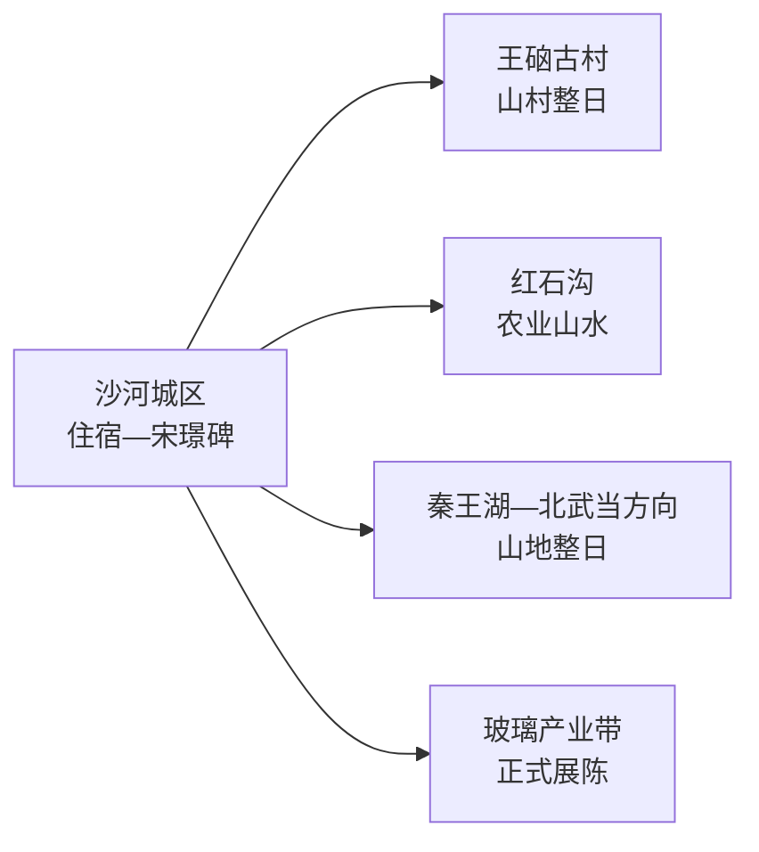
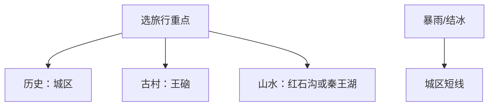

# 沙河旅行指南

沙河横跨城区、玻璃产业带和太行山西部。第一次来，城区用半天看宋璟碑与地方历史，山地整日从王硇古村、红石沟、秦王湖中选一条；玻璃主题只进入正式展陈或研学空间。

> 建议停留：2–3 天  
> 关键词：宋璟碑、太行山、王硇、红石沟、秦王湖、玻璃产业  
> 主要体力：城区低；西部山地中至高  
> 最近研究：2026-08-13

## 城市速览

| 项目 | 信息 |
|---|---|
| 主要价值 | 唐代碑刻、太行古村山水与玻璃工业城市观察 |
| 建议停留 | 1天城区+近郊；2天加西部山地；3天再选另一条远线 |
| 舒适季节 | 春秋山地较舒适；夏季防暴雨山洪；冬季防结冰 |
| 预算 | 城区低；远线车辆、景区项目和住宿增加支出 |
| 体力 | 古村石路、山地台阶和长距离接驳明显 |
| 风险 | 雷暴、山洪、落石、结冰、矿区和工业交通 |
| 独行 | 城区可自行；西部山区先定车辆 |
| 亲子 | 历史碑刻和农业园区适合；山地按体力选短线 |
| 低体力 | 城区与车辆可达景点为主 |
| 无障碍 | 城区可询问；古村与山地设施连续性需向官方确认 |

## 城市格局与游览区域

GeoNames `1796421` 是沙河城区居民点，关联薄聚居点实体 `Q28795045`；法定县级沙河市采用 `Q122007`、代码 `130582`，其 `P1566` 指向另一行政/城市记录 `1814088`。本页按法定市域组织，沙河由邢台市代管，但不属于邢台主城片区。

| 区域 | 内容 | 选择 | 边界 |
|---|---|---|---|
| 城区 | 宋璟碑、生活服务、铁路与机场衔接 | 抵达日 | 适合作基地 |
| 王硇—柴关 | 古村、石楼和太行山 | 完整一日 | 村道与山路按天气 |
| 红石沟 | 农业、乡村和山水景区 | 亲子或轻户外 | 经营区外农田属生产空间 |
| 秦王湖—西部山地 | 湖库、山景和景区 | 自驾山地日 | 水库设施、矿区和未开放山路有明确限制 |
| 玻璃产业区 | 工业发展与产品展示 | 仅正式展馆、企业接待 | 厂房、窑炉、堆场和专用线不作自由参观 |

## 主要景点

| 景点 | 片区 | 类型 | 看点 | 用时 | 环境 | 体力 | 预约 | 天气 | 优先级 |
|---|---|---|---|---|---|---|---|---|---|
| 宋璟碑 | 城区 | 文物碑刻 | 唐代碑刻、书法与地方史 | 1小时 | 混合 | 低 | 中 | 低 | A |
| 王硇古村 | 柴关方向 | 传统村落 | 石楼、街巷与太行村落景观 | 4–6小时 | 室外为主 | 中至高 | 高 | 高 | A |
| 红石沟休闲生态农场 | 西部 | 农业与乡村景区 | 农业景观、休闲项目和山地环境 | 4–6小时 | 室外 | 中 | 高 | 高 | B |
| 秦王湖景区 | 西部山区 | 湖库与山水 | 湖面、山谷和正式景区游线 | 4–6小时 | 室外 | 中 | 高 | 很高 | B |
| 北武当山或观音寨当期开放景区 | 西部山区 | 山岳景区 | 太行山体、步道和视野 | 5–7小时 | 室外 | 高 | 高 | 很高 | C |
| 正式玻璃文化展陈 | 城区或产业园 | 工业文化 | 玻璃工艺、产业史和产品展示 | 1–2小时 | 室内 | 低 | 高 | 低 | C |

## 美食与餐饮

| 类型 | 场景 | 份量 | 注意 | 选择 |
|---|---|---|---|---|
| 河北面食 | 早餐午餐 | 一人一份 | 小麦、肉臊和汤底 | 先选汤面或干拌 |
| 太行山农家菜 | 远线午餐 | 多人共享 | 猪肉、鸡肉、盐和油 | 明码标价后按人数点菜 |
| 腌肉、豆腐等乡村菜 | 古村 | 少量尝味 | 盐分与制作环境 | 选营业稳定餐馆 |
| 沙河小吃 | 城区 | 小份组合 | 坚果、芝麻、面粉 | 分次品尝 |

## 经典行程

### 一日经典
- **路线**：宋璟碑 → 城区午餐 → 正式玻璃文化展陈或城市公园。
- **串联逻辑**：历史与工业城市身份相连。
- **预约锚点**：玻璃展陈优先确认接待。
- **休息安排**：午餐后留长休。
- **时间不足时**：保留宋璟碑与城区餐饮。

### 两日组合
- **路线**：第1天城区；第2天王硇古村完整日。
- **串联逻辑**：城区与太行古村分日。
- **预约锚点**：车辆、村落接待和返程。
- **休息安排**：村内正式服务点午休。
- **时间不足时**：只走古村核心街巷。

### 三日深度
- **路线**：前两日按上；第3天红石沟或秦王湖二选一。
- **适用条件**：道路天气稳定。
- **预约锚点**：景区开放、项目、停车。
- **休息安排**：午间避晒。
- **时间不足时**：选离城区更近的一处。

### 雨雪天
- **路线**：城区文物展示 → 午餐 → 室内展陈。
- **适用条件**：城区道路正常。
- **预约锚点**：两处开放状态。
- **休息安排**：短途接驳。
- **时间不足时**：单点慢游。

### 亲子与低体力
- **路线**：宋璟碑短讲解 → 午餐 → 红石沟车辆可达活动或城区公园。
- **减负方式**：低体力优先城区；亲子按运营项目年龄选择。
- **预约锚点**：讲解、落客、卫生间。
- **休息安排**：每段设坐席休息。
- **时间不足时**：城区半日。

### 西部山地一日
- **路线**：王硇、秦王湖、北武当中选一处。
- **适用条件**：天气和道路稳定。
- **预约锚点**：入口、停车、返程。
- **休息安排**：正式服务点。
- **时间不足时**：按官方短线返回。

## 住宿区域

| 区域 | 优点 | 取舍 | 适合 | 建议 |
|---|---|---|---|---|
| 沙河城区 | 餐饮交通集中 | 山地需早出发 | 首次到访 | 选停车或叫车便利位置 |
| 西部乡村经营住宿 | 靠近古村山地 | 选择少、退改受季节影响 | 自驾摄影 | 核资质、供餐、取暖和返程 |

## 市内交通

沙河与邢台主城之间可联程，但住宿和远郊车辆按独立城市计算。邢台褡裢机场位于沙河境内，航班选择有限；铁路和公路通常更便于组合。

| 场景 | 做法 | 核对 |
|---|---|---|
| 铁路 | 按完整站名抵达沙河或邻近铁路站 | 车次、换乘、夜间接驳 |
| 航空 | 褡裢机场按实际执飞选择 | 航班、地面交通和延误 |
| 山地 | 自驾或正规包车 | 路况、油量、停车、末班 |

## 不同旅行者须知

| 人群 | 推荐 | 留意 | 核对 |
|---|---|---|---|
| 独行 | 城区基地 | 山区返程 | 车辆与信号 |
| 亲子 | 历史+正式农业景区 | 水库、机械、山路 | 项目年龄、护栏 |
| 长者低体力 | 城区短线 | 古村石路 | 落客、座椅、卫生间 |
| 工业兴趣 | 正式展陈 | 厂区安全边界 | 接待、拍摄、装备 |
| 户外 | 单一山地景区 | 暴雨、落石、火险 | 天气、道路、救援 |

## 行前核对

| 事项 | 原因 | 时间 | 入口 |
|---|---|---|---|
| 山地景区 | 开放与道路变化 | 前一日 | [沙河市人民政府](https://www.shaheshi.gov.cn/) |
| 机场 | 航线班期变化 | 购票前 | [中国民航局机场资料](https://www.caac.gov.cn/GYMH/MHGK/MYJC/HBDQ/HEBEI/202406/t20240605_224390.html) |
| 铁路 | 车次变化 | 购票前 | [12306](https://www.12306.cn/) |
| 天气 | 山洪、结冰、火险 | 前三日 | [河北省气象局](http://he.cma.gov.cn/) |

## 来源与更新记录

### 主要来源

| 来源 | 类型 | 支持内容 | 日期 |
|---|---|---|---|
| [沙河市旅发大会筹备通报](https://www.shaheshi.gov.cn/article/60/51204.html) | 市政府 | 王硇、秦王湖、红石沟及工业研学 | 2026-08-13 |
| [邢台市旅游规划](https://info.xingtai.gov.cn/main/file/2021-12-02/1638420837041402800a17d32921a115017d797df2b17496.pdf) | 市政府规划 | 沙河城区、红石沟、秦王湖和北武当空间 | 2026-08-13 |
| [邢台农业农村局：红石沟](https://nync.xingtai.gov.cn/topic_show.aspx?id=343) | 市级部门 | 农业景区与乡村旅游 | 2026-08-13 |
| [GeoNames 1796421](https://www.geonames.org/1796421/) | 开放数据 | 固定主城点 | 2026-08-13 |
| [Wikidata Q122007](https://www.wikidata.org/wiki/Q122007) | 开放数据 | 法定沙河市粒度 | 2026-08-13 |

### 更新记录

| 日期 | 更新内容 |
|---|---|
| 2026-08-13 | 首次完成沙河独立研究；按城区碑刻、太行古村、山水景区和正式工业展陈组织，补充矿区、水库、生产空间与交通边界。 |
