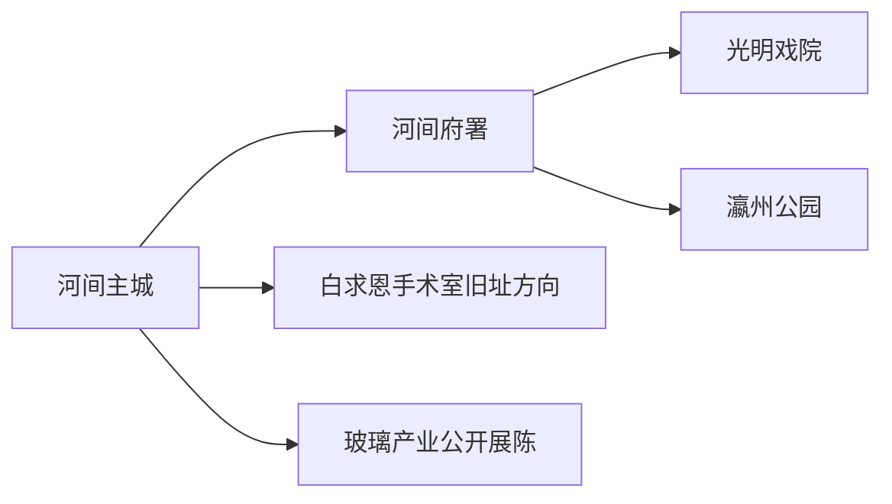
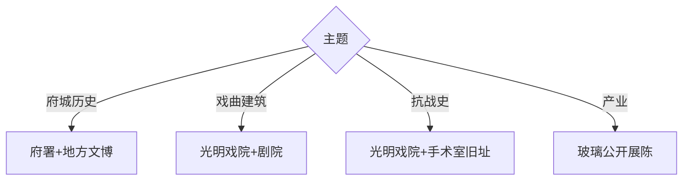

# 河间旅行指南

河间位于沧州西部冀中平原，河间府署、光明戏院、毛诗传承与冀中抗战史构成紧凑的一至两天文化路线。固定快照中的 **Hejian / GeoNames 1808614** 对应现行河间市，本页以瀛州路—老城为游览核心。

## 城市速览

| 项目 | 信息 |
|---|---|
| 主线 | 河间府署—光明戏院—瀛州公园 |
| 停留 | 主城1天；红色史或产业专题另加半天 |
| 住宿 | 府署—老城便于文化线；客运入口周边便于公路抵离 |
| 交通 | 以公路客运为主，主城景点用公交、出租车或步行 |
| 风险 | 文物开放、演出档期、宗教与纪念空间礼仪、工业生产边界 |

## 城市格局与游览区域

府署、光明戏院和老城公共空间构成主线，适合公交加步行。白求恩手术室旧址等红色史迹位于县域方向，提前确认接待；玻璃、电线电缆等产业空间只选择正式博物馆或企业开放线。

## 主要景点

| 景点 | 区域 | 类型 | 核心体验 | 用时 | 环境 | 体力 | 研究价值 | 拥挤 | 优先级 |
|---|---|---|---|---:|---|---|---|---|---|
| 河间府署 | 老城 | 历史建筑与展陈 | 府署制度、河间历史与诗经斋 | 2–3小时 | 混合 | 低中 | 很高 | 节假日高 | A |
| 光明戏院 | 老城 | 全国重点文物 | 近代剧场建筑与冀中革命史 | 1–2小时 | 室内 | 低 | 很高 | 演出时高 | A |
| 河间市博物馆或公共文化展陈 | 主城 | 博物馆 | 地方史、毛诗与民俗 | 1–2小时 | 室内 | 低 | 高 | 团体时中 | A |
| 瀛州公园 | 主城 | 城市公园 | 古城地名、园林与日常生活 | 1–2小时 | 室外 | 低 | 中 | 傍晚中 | B |
| 白求恩手术室旧址 | 县域 | 红色史迹 | 冀中抗战医疗史 | 1–2小时 | 混合 | 低 | 很高 | 团体时中 | B |
| 李多奎大剧院公开演出 | 主城 | 戏曲场馆 | 京剧与地方舞台艺术 | 2小时 | 室内 | 低 | 高 | 演出时高 | B |
| 尚德玻璃博物馆等正式产业展陈 | 城郊 | 工业文化 | 玻璃工艺、制造与产业史 | 1–2小时 | 室内 | 低 | 中 | 团体时中 | C |

## 美食与餐饮

河间驴肉火烧、饸饹面和冀中家常菜是常见选择。火烧可按肥瘦、现切和食量点单；肉类、面筋或芝麻过敏者提前说明，购买真空熟食时查看生产日期、储存条件和返程时长。

## 经典行程

### 一日基础线
**路线**：河间府署—午餐—光明戏院—瀛州公园。**逻辑**：从古代行政空间走向近代公共建筑。**预约锚点**：府署与戏院开放。**休息**：老城餐饮区。**删除条件**：戏院有专场活动时改市博物馆。

### 府城历史线
**路线**：地方文博—河间府署—诗经斋—老城公开街巷。**逻辑**：先建立地方史，再读府署展陈。**预约锚点**：讲解与最晚入场。**休息**：府署周边。**删除条件**：高温时缩短街巷段。

### 戏曲建筑线
**路线**：光明戏院—李多奎大剧院当期演出。**逻辑**：把历史剧场与当代舞台相连。**预约锚点**：戏院开放和演出票。**休息**：主城商业区。**删除条件**：无演出时保留建筑专题。

### 红色史迹线
**路线**：光明戏院—白求恩手术室旧址—返城。**逻辑**：围绕冀中抗战史组织。**预约锚点**：旧址接待与车辆。**休息**：主城或镇区。**删除条件**：远端旧址闭馆时只留戏院。

### 产业文化线
**路线**：府署—午餐—正式玻璃产业展陈。**逻辑**：古城文化配现代制造。**预约锚点**：企业或博物馆接待。**休息**：园区服务点。**删除条件**：生产安排暂停接待时改地方文博。

### 亲子低体力线
**路线**：地方文博—午休—府署短线。**逻辑**：两处文化展陈控制步行。**预约锚点**：亲子讲解。**休息**：馆内与府署服务区。**删除条件**：客流高时只留一处主馆。

### 雨天线
**路线**：地方文博—河间府署室内展陈—光明戏院。**逻辑**：围绕主城室内空间。**预约锚点**：三处开放。**休息**：老城。**删除条件**：积水预警时减少换点。

## 住宿区域

河间府署—老城适合历史文化、餐饮和夜间步行；主要公路客运入口周边适合早晚抵离。县域红色史迹可从主城当天往返，产业参观则按企业指定集合点选择住宿。

## 市内交通

河间以公路客运和地面交通为主，主城用公交、出租车和步行组合。远端旧址与产业园提前核对城乡公交末班或约车；遇演出和节庆，为老城停车与疏散预留时间。

## 不同旅行者须知

制度史兴趣者优先府署；建筑和戏曲爱好者组合光明戏院与当期演出；亲子家庭选择府署短线和地方文博；行动不便者核对古建门槛、戏院楼层和馆舍无障碍。

## 行前核对

- 核对府署、光明戏院、地方展陈的闭馆日、演出与最晚入场。
- 核对红色旧址、产业展陈的接待和返程交通。
- 文物内部空间、纪念场所、玻璃生产车间、仓储物流和居民院落按正式开放路线进入。

## 来源与更新记录

| 来源 | 支持内容 | 核验日期 |
|---|---|---|
| [河间府署：府署景点](https://hejianlvyou.cn/introduction/spot/) | 府署空间、展陈、诗经斋与游客服务 | 2026-09-01 |
| [河北省文物局：光明戏院](https://wenwu.hebei.gov.cn/doc/003/002/381/00300238175_091be6df.pdf) | 戏院建筑、历史价值与保护属性 | 2026-09-01 |
| [GeoNames 1808614](https://www.geonames.org/1808614/) | Hejian 固定人口点与位置 | 2026-09-01 |

| 日期 | 更新 |
|---|---|
| 2026-09-01 | 首次完成河间旅行研究；建立府城、戏曲建筑、红色史与产业路线。 |
