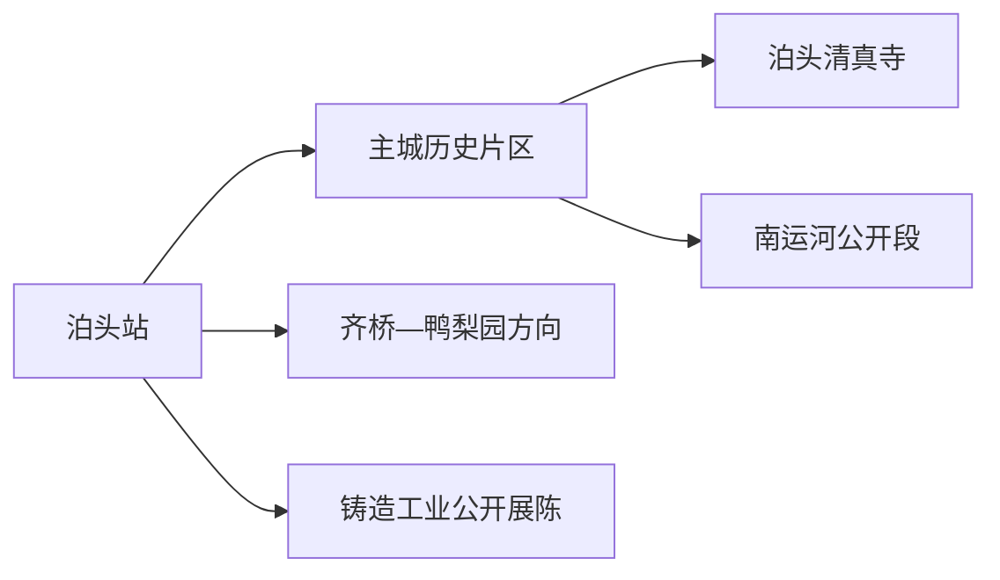
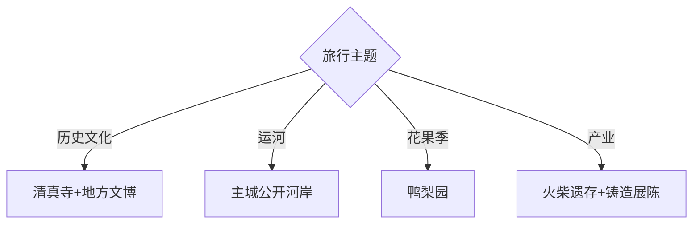

# 泊头旅行指南

泊头位于沧州西南部、南运河沿线，适合以泊头清真寺、运河商埠记忆、铸造与火柴工业史、鸭梨乡村景观组织一至两天。固定快照中的 **Botou / GeoNames 1816256** 对应现行泊头市。

## 城市速览

| 项目 | 信息 |
|---|---|
| 主线 | 泊头清真寺—地方文博—南运河公开段 |
| 停留 | 主城1天；梨园或工业文化另加半天至1天 |
| 住宿 | 泊头站—主城便于步行、餐饮和铁路抵离 |
| 交通 | 铁路抵达主城，乡镇与梨园用公交、约车或自驾 |
| 风险 | 宗教礼仪、运河水情、工业生产、果园农忙与活动开放状态 |

## 城市格局与游览区域

主城适合清真寺、地方史和运河公共空间，鸭梨园主要在乡镇农业区，花期与采摘期差异明显。泊头是铸造产业城市，工业体验以企业或主管部门正式公布的展陈和参观线为准。

## 主要景点

| 景点 | 区域 | 类型 | 核心体验 | 用时 | 环境 | 体力 | 研究价值 | 拥挤 | 优先级 |
|---|---|---|---|---:|---|---|---|---|---|
| 泊头清真寺 | 主城 | 全国重点文物与宗教场所 | 中式建筑与伊斯兰文化交融 | 1–2小时 | 混合 | 低 | 很高 | 礼拜时高 | A |
| 泊头市博物馆或地方展陈 | 主城 | 博物馆 | 运河、城市与产业历史 | 1–2小时 | 室内 | 低 | 高 | 团体时中 | A |
| 南运河正式开放公园段 | 主城 | 运河空间 | 商埠地理、河岸与城市生活 | 1–2小时 | 室外 | 低中 | 高 | 傍晚中 | A |
| 中共中央华北局城市工作部旧址 | 县域 | 红色史迹 | 解放战争时期城市工作史 | 1–2小时 | 混合 | 低 | 高 | 团体时中 | B |
| 鸭梨观光园公开接待区 | 齐桥等乡镇 | 农业景观 | 梨花、果期与梨业文化 | 半天 | 室外 | 中 | 中 | 花果期高 | B |
| 泊头火柴工业遗存公开区 | 主城 | 工业遗产 | 民族工业记忆与城市转型 | 1–2小时 | 混合 | 低中 | 高 | 活动时中 | B |
| 铸造产业正式展陈 | 城郊 | 工业旅游 | 铸造技术、产品与产业史 | 1–2小时 | 室内 | 低 | 中 | 团体时中 | C |

## 美食与餐饮

泊头火烧、鸭梨及运河沿线家常菜适合作为地方饮食线索。清真餐饮按店铺标识和个人需求选择；鲜梨与梨制品比较产地、等级、加工日期和储存方式，返程时做好防压。

## 经典行程

### 一日基础线
**路线**：地方文博—午餐—泊头清真寺—南运河公开段。**逻辑**：从城市史进入宗教建筑和运河空间。**预约锚点**：馆舍与清真寺接待。**休息**：主城商业区。**删除条件**：礼拜或活动期间缩短寺内参观。

### 宗教建筑线
**路线**：泊头清真寺—周边公开街巷—地方展陈。**逻辑**：先理解礼仪，再看城市多元文化。**预约锚点**：非礼拜参观时段。**休息**：主城。**删除条件**：宗教活动优先时改外观与博物馆。

### 运河城市线
**路线**：地方文博—南运河正式入口—公开河岸—主城餐饮。**逻辑**：把商埠史落到河岸空间。**预约锚点**：开放段和水情。**休息**：河岸公园服务点。**删除条件**：汛期、施工或大风时删河岸段。

### 梨乡季节线
**路线**：主城—鸭梨园公开接待区—乡镇午餐—返城。**逻辑**：围绕花期或采摘期安排。**预约锚点**：园区接待、计价与返程。**休息**：游客服务点。**删除条件**：非适游季改工业文化线。

### 工业记忆线
**路线**：火柴工业遗存公开区—铸造产业展陈。**逻辑**：比较两类工业与城市转型。**预约锚点**：企业或场馆接待。**休息**：主城。**删除条件**：生产安排暂停接待时只看公开展陈。

### 亲子低体力线
**路线**：地方文博—午休—南运河公园近入口段。**逻辑**：室内学习配平缓步行。**预约锚点**：亲子活动。**休息**：馆内与商业区。**删除条件**：高温时只留室内。

### 雨天线
**路线**：地方文博—正规工业展陈—主城餐饮。**逻辑**：压缩露天活动。**预约锚点**：两处接待。**休息**：主城。**删除条件**：积水预警时提前返宿。

## 住宿区域

泊头站至主城商业区适合铁路抵离、历史文化线和餐饮；乡镇梨园以主城当天往返更灵活。工业园周边住宿优先看持证经营、夜间交通和与公开参观入口的距离。

## 市内交通

泊头站是主要铁路入口，主城可用公交、出租车和步行。齐桥等梨园方向先核对城乡公交末班；自驾进入乡村和园区时使用公共停车区，运河堤防、车间和货运道路按管理标识通行。

## 不同旅行者须知

建筑兴趣者优先清真寺；产业研究者选择正式工业展陈；亲子家庭围绕博物馆与梨园季节活动；行动不便者核对宗教建筑门槛、馆舍无障碍和果园硬化路。

## 行前核对

- 核对清真寺参观时段、着装和礼仪要求，宗教活动期间以场所安排为准。
- 核对馆舍、旧址、果园和企业展陈的开放与预约。
- 运河管理区、果园生产区、铸造车间、仓储货场和火柴工业遗存按正式开放边界进入。

## 来源与更新记录

| 来源 | 支持内容 | 核验日期 |
|---|---|---|
| [北京市文化和旅游局：泊头清真寺](https://s.visitbeijing.com.cn/attraction/119165) | 清真寺性质、建筑与宗教活动属性 | 2026-09-01 |
| [河北省文物局：革命文物名录](https://wenwu.hebei.gov.cn/doc/003/002/623/00300262301_ec3f00da.pdf) | 华北局城市工作部旧址及法定保护属性 | 2026-09-01 |
| [GeoNames 1816256](https://www.geonames.org/1816256/) | Botou 固定人口点与位置 | 2026-09-01 |

| 日期 | 更新 |
|---|---|
| 2026-09-01 | 首次完成泊头旅行研究；建立宗教建筑、运河、梨乡与工业记忆路线。 |
