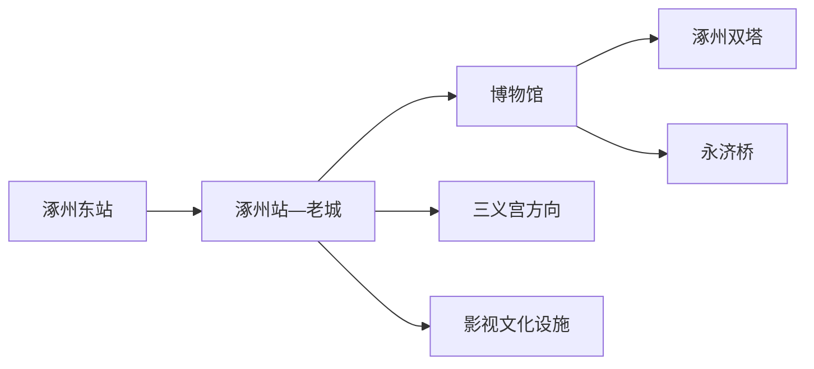
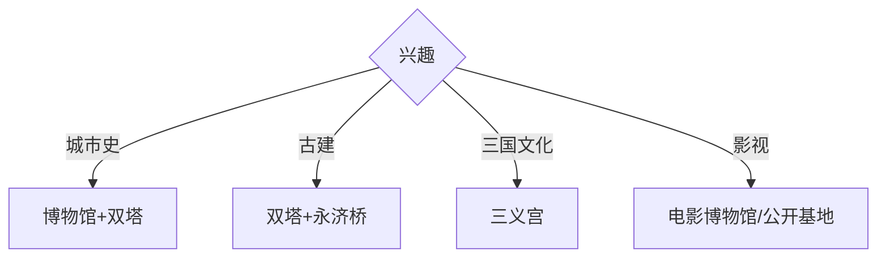

# 涿州旅行指南

涿州位于保定北部、北京西南方向，适合把涿州博物馆、双塔、永济桥与三义宫串成一至两天的范阳历史线。固定快照中的 **Zhuozhou / GeoNames 1783851** 对应现行涿州市；影视拍摄设施则按当期公开接待安排处理。

## 城市速览

| 项目 | 信息 |
|---|---|
| 主线 | 涿州博物馆—双塔—永济桥—三义宫 |
| 停留 | 主城1天；三义宫或影视文化另加半天至1天 |
| 住宿 | 涿州站—老城适合文物线；涿州东站适合高铁抵离 |
| 交通 | 两座铁路站服务不同片区，远端点位用公交或预约车 |
| 风险 | 河道汛期、文物保护、宗教礼仪、影视生产与临时封控 |

## 城市格局与游览区域

老城集中博物馆与双塔等历史线索，永济桥位于拒马河相关水系方向，三义宫在楼桑庙村方向。涿州东站与老城有明显距离；影视城及拍摄基地的运营和生产状态变化较快，只有公开售票或正式接待时纳入行程。

## 主要景点

| 景点 | 区域 | 类型 | 核心体验 | 用时 | 环境 | 体力 | 研究价值 | 拥挤 | 优先级 |
|---|---|---|---|---:|---|---|---|---|---|
| 涿州市博物馆 | 主城 | 博物馆 | 范阳地方史、文物与城市脉络 | 2小时 | 室内 | 低 | 很高 | 团体时中 | A |
| 涿州双塔 | 老城 | 古建筑 | 辽代塔影与老城地标 | 1小时 | 室外 | 低中 | 很高 | 周末中 | A |
| 永济桥 | 城北方向 | 古桥 | 石桥结构与水陆交通史 | 1–2小时 | 室外 | 低中 | 很高 | 周末中 | A |
| 三义宫 | 楼桑庙村 | 历史建筑 | 三国文化、庙宇与地方叙事 | 2小时 | 混合 | 低中 | 高 | 节假日高 | A |
| 老城历史街巷 | 双塔周边 | 城市观察 | 街巷尺度与地方生活 | 1–2小时 | 室外 | 低 | 中 | 早晚中 | B |
| 张飞庙相关公开文化空间 | 桃园方向 | 人物文化 | 三国民间记忆 | 1小时 | 混合 | 低 | 中 | 节庆中 | B |
| 涿州电影博物馆 | 主城工业旧址 | 专题博物馆 | 电影器材、生产史与旧厂更新 | 1–2小时 | 室内 | 低 | 高 | 活动时中 | B |
| 影视文化设施公开游览区 | 城郊 | 影视体验 | 场景、制作史与当期活动 | 半天 | 混合 | 中 | 中 | 活动时高 | C |

## 美食与餐饮

驴肉火烧、督亢面等华北平原餐食适合安排在老城或车站周边。现制熟食按出炉时间、储存条件和食量购买；跨城当天往返时把晚餐放在铁路站点附近更稳妥。

## 经典行程

### 一日基础线
**路线**：涿州市博物馆—午餐—涿州双塔—老城街巷。**逻辑**：以紧凑主城完成地方史框架。**预约锚点**：博物馆开放。**休息**：老城商业区。**删除条件**：高温时缩短街巷段。

### 古建专题线
**路线**：双塔—午餐—永济桥—返城。**逻辑**：用塔与桥理解城市历史交通。**预约锚点**：文物周边开放和车辆。**休息**：主城。**删除条件**：汛期或桥区管控时删永济桥。

### 三国文化线
**路线**：主城—三义宫—相关公开文化空间—返城。**逻辑**：围绕一条人物文化线展开。**预约锚点**：三义宫开放和返程。**休息**：镇村服务点。**删除条件**：大型民俗活动限流时错峰。

### 影视文化线
**路线**：电影博物馆—正式开放影视设施。**逻辑**：从生产史展陈进入场景体验。**预约锚点**：售票、活动与拍摄安排。**休息**：场馆服务区。**删除条件**：基地用于拍摄或暂停接待时只留博物馆。

### 老城半日线
**路线**：博物馆—双塔周边—地方餐饮。**逻辑**：适合高铁往返的短停留。**预约锚点**：馆舍最晚入场。**休息**：博物馆与餐饮店。**删除条件**：抵达较晚时只留双塔外观与餐饮。

### 亲子低体力线
**路线**：博物馆—午休—电影博物馆。**逻辑**：两处室内展陈减少步行。**预约锚点**：亲子活动和开放日。**休息**：馆内。**删除条件**：第二馆闭馆时改老城短线。

### 雨天线
**路线**：涿州市博物馆—电影博物馆—主城餐饮。**逻辑**：避开河岸与露天文物。**预约锚点**：两馆开放。**休息**：两馆之间。**删除条件**：暴雨积水预警时就近返宿。

## 住宿区域

涿州站—老城适合历史文化线和餐饮；涿州东站周边适合高铁早晚抵离。前往三义宫或城郊影视设施时，主城住宿便于重新安排接驳。

## 市内交通

涿州站与涿州东站距离较远，订票后围绕实际车站规划接驳。老城用公交、出租车和步行组合；永济桥、三义宫及城郊设施先核对公交末班或预约返程车。

## 不同旅行者须知

古建兴趣者优先双塔与永济桥；三国文化爱好者给三义宫半天；亲子家庭选择两座博物馆；行动不便者核对古桥路面、庙宇门槛、馆舍坡道及无障碍卫生间。

## 行前核对

- 核对博物馆、三义宫、电影博物馆的开放日和最晚入场。
- 核对两座铁路站、县域公交末班、汛期水情与影视设施接待。
- 文物保护范围、河道管理区、宗教内部空间和影视生产区按现场开放边界参观。

## 来源与更新记录

| 来源 | 支持内容 | 核验日期 |
|---|---|---|
| [涿州市政府：涿州双塔](https://www.zhuozhou.gov.cn/published/1686198010306.html) | 双塔及其城市名胜属性 | 2026-09-01 |
| [涿州市政府：三义宫](https://www.zhuozhou.gov.cn/published/1686198009791.html) | 三义宫位置与文化主题 | 2026-09-01 |
| [涿州市政府：涿州市简介](https://www.zhuozhou.gov.cn/published/1717407135880.html) | 城市概况与行政实体 | 2026-09-01 |
| [GeoNames 1783851](https://www.geonames.org/1783851/) | Zhuozhou 固定人口点与位置 | 2026-09-01 |

| 日期 | 更新 |
|---|---|
| 2026-09-01 | 首次完成涿州旅行研究；建立老城古建、三国文化与影视主题。 |
