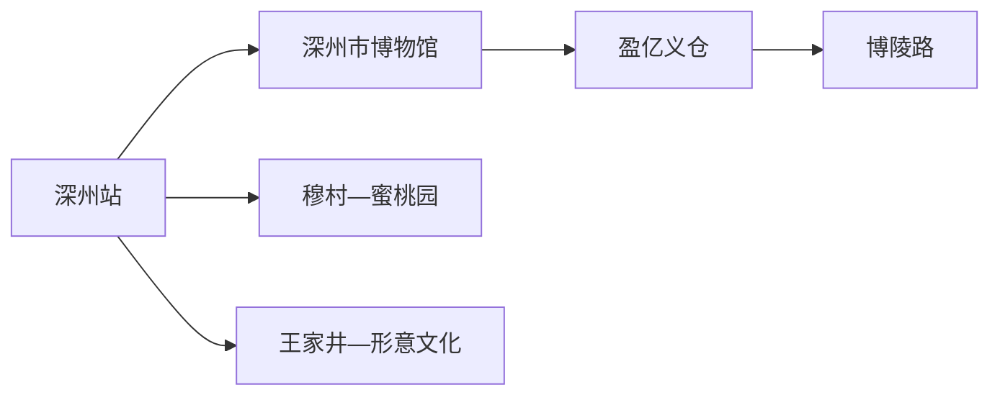
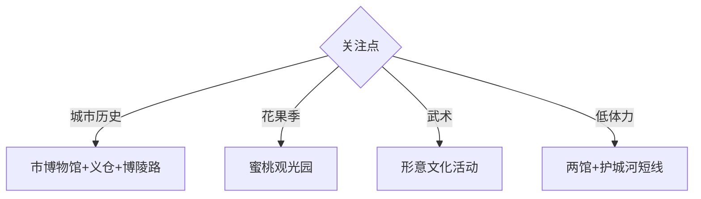

# 深州旅行指南

深州位于衡水西部平原，盈亿义仓、地方文博、蜜桃园与形意拳构成粮仓文化、农业季节和武术传承相结合的一至两天路线。固定快照中的 **Shenzhou / GeoNames 1795578** 对应现行深州市。

## 城市速览

| 项目 | 信息 |
|---|---|
| 主线 | 深州市博物馆—盈亿义仓—博陵路—蜜桃观光园 |
| 停留 | 主城1天；桃园或形意拳主题另加半天至1天 |
| 住宿 | 深州站—主城便于铁路抵离与多方向换乘 |
| 交通 | 铁路抵达主城，穆村等乡镇用公交、约车或自驾 |
| 风险 | 花果期客流、高温雷雨、古建保护、农忙与武术活动接待 |

## 城市格局与游览区域

主城集中博物馆、盈亿义仓和博陵路历史空间，适合公交与短程车辆。蜜桃观光园位于穆村方向，春季看花、夏秋看果；形意拳文化点位在王家井方向，活动与接待需提前确认。

## 主要景点

| 景点 | 区域 | 类型 | 核心体验 | 用时 | 环境 | 体力 | 研究价值 | 拥挤 | 优先级 |
|---|---|---|---|---:|---|---|---|---|---|
| 深州市博物馆 | 主城 | 博物馆 | 地方考古、革命史与非遗 | 2小时 | 室内 | 低 | 很高 | 团体时中 | A |
| 深州粮仓博物馆与盈亿义仓 | 主城 | 全国重点文物与专题馆 | 清代仓储建筑、赈济与粮食文化 | 2小时 | 混合 | 低 | 很高 | 团体时中 | A |
| 博陵路历史街区公开段 | 主城 | 历史街区 | 义仓、钱庄与近代城市肌理 | 1–2小时 | 室外 | 低 | 高 | 早晚中 | A |
| 深州蜜桃观光园 | 穆村方向 | 农业景区 | 桃花、采摘与蜜桃文化 | 半天 | 室外 | 中 | 高 | 花果期高 | A |
| 大德昌钱庄公开参观区 | 博陵路 | 近代建筑 | 深商历史与钱庄空间 | 1小时 | 混合 | 低 | 高 | 活动时中 | B |
| 形意拳文化公开展陈与活动 | 王家井方向 | 非遗与武术 | 形意拳源流、展演与交流 | 半天 | 混合 | 中 | 很高 | 活动时中 | B |
| 古护城河公共公园段 | 主城 | 滨水空间 | 古城格局与城市休闲 | 1–2小时 | 室外 | 低 | 中 | 傍晚中 | B |

## 美食与餐饮

深州蜜桃、酥糖、烧鸡及衡水平原家常菜适合组合体验。鲜桃按成熟度、品种、计价和运输距离选择，桃毛或核果过敏者做好防护；采摘后使用园区称重和包装服务。

## 经典行程

### 一日基础线
**路线**：深州市博物馆—午餐—粮仓博物馆与盈亿义仓—博陵路。**逻辑**：从地方通史进入仓储制度和城市街区。**预约锚点**：两馆开放。**休息**：博陵路餐饮区。**删除条件**：高温时缩短街区段。

### 粮仓历史线
**路线**：市博物馆—盈亿义仓—大德昌钱庄公开区。**逻辑**：串联地方史、粮仓和商业史。**预约锚点**：义仓与钱庄开放。**休息**：博陵路。**删除条件**：钱庄未开放时只看街区外部关系。

### 蜜桃季节线
**路线**：主城—蜜桃观光园公开入口—赏花或采摘区—返城。**逻辑**：围绕当季农业体验安排。**预约锚点**：花期、果期、计价和返程。**休息**：园区服务点。**删除条件**：非适游季改主城历史线。

### 形意文化线
**路线**：市博物馆非遗展陈—王家井正式活动点—返城。**逻辑**：先看背景，再观看规范展演或课程。**预约锚点**：活动、师资与接待。**休息**：镇区。**删除条件**：无公开活动时只留博物馆展陈。

### 古城休闲线
**路线**：博陵路—盈亿义仓—古护城河公共公园段。**逻辑**：用短距离观察古城与水系。**预约锚点**：义仓开放。**休息**：博陵路与公园座椅区。**删除条件**：暴雨或水情管控时删护城河。

### 亲子低体力线
**路线**：深州市博物馆—午休—粮仓博物馆。**逻辑**：两处室内展陈减少日晒和长距离移动。**预约锚点**：亲子讲解。**休息**：馆内。**删除条件**：一馆闭馆时加入护城河近入口段。

### 雨天线
**路线**：深州市博物馆—粮仓博物馆—正规非遗展陈。**逻辑**：保留主城室内主题。**预约锚点**：场馆开放。**休息**：两馆之间。**删除条件**：积水预警时提前返宿。

## 住宿区域

深州站—主城适合铁路抵离、两馆和餐饮；穆村方向适合桃花或采摘季早出发；王家井方向以活动主办方指定接待点为准。多数首次到访者住主城更便于调整。

## 市内交通

深州站承担主要铁路抵离，主城用公交、出租车和网约车。穆村、王家井与其他乡镇分处不同方向，先核对城乡公交末班；自驾在公共停车区停放，果园和村道按农忙分流通行。

## 不同旅行者须知

历史兴趣者优先市博物馆、义仓与博陵路；农业旅行者围绕花果季；武术爱好者预约正式展演或交流；行动不便者核对古建门槛、街区路面、馆舍无障碍和果园硬化路。

## 行前核对

- 核对两座博物馆、大德昌钱庄及形意拳活动的开放和预约。
- 核对蜜桃花期、采摘期、计价、城乡公交末班和高温雷雨。
- 古建筑保护范围、果园生产区、灌渠、农机道路和武术训练内部空间按正式接待路线进入。

## 来源与更新记录

| 来源 | 支持内容 | 核验日期 |
|---|---|---|
| [河北省文物局：深州市博物馆](https://wenwu.hebei.gov.cn/system/2024/03/04/030278966.shtml) | 地方史、馆藏、革命史与非遗展陈 | 2026-09-01 |
| [河北省文物局：深州盈亿义仓](https://wenwu.hebei.gov.cn/doc/003/002/381/00300238175_091be6df.pdf) | 义仓建筑、仓储制度与保护价值 | 2026-09-01 |
| [河北省文化和旅游厅：深州蜜桃旅游](https://whly.hebei.gov.cn/c/2025-04-29/580687.html) | 蜜桃园、花期活动与形意拳展示 | 2026-09-01 |
| [GeoNames 1795578](https://www.geonames.org/1795578/) | Shenzhou 固定人口点与位置 | 2026-09-01 |

| 日期 | 更新 |
|---|---|
| 2026-09-01 | 首次完成深州旅行研究；建立粮仓历史、蜜桃季节与形意文化路线。 |
