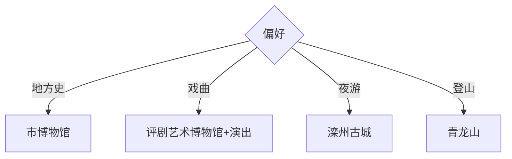

# 滦州旅行指南

滦州位于唐山东部，适合从滦州古城的文旅街区进入地方史，再以评剧、皮影、滦河与青龙山补足文化和自然层次。固定快照中的 **Luanzhou / GeoNames 1802187** 对应现行滦州市。

## 城市速览

| 项目 | 信息 |
|---|---|
| 主线 | 滦州博物馆—评剧艺术博物馆—滦州古城 |
| 停留 | 城市文化1天；青龙山或乡镇主题另加1天 |
| 住宿 | 古城周边便于夜游；新城与车站周边便于交通 |
| 交通 | 滦河站、滦县站按车次选择；远郊用预约车辆或自驾 |
| 风险 | 古城商业活动、临水空间、山地天气、文保与演出档期 |

## 城市格局与游览区域

滦州古城是近年建设运营的仿古文旅街区，适合看街区演艺和消费空间；地方历史与评剧研究优先进入博物馆。青龙山位于城外，单列半日至一天；两个铁路站服务方向不同，订票时同时核对终到站和住宿距离。

## 主要景点

| 景点 | 区域 | 类型 | 核心体验 | 用时 | 环境 | 体力 | 研究价值 | 拥挤 | 优先级 |
|---|---|---|---|---:|---|---|---|---|---|
| 滦州市博物馆 | 新城 | 博物馆 | 地方考古、历史与民俗 | 1–2小时 | 室内 | 低 | 很高 | 团体时中 | A |
| 滦州市评剧艺术博物馆 | 古城街道 | 专题博物馆 | 评剧百年、名家与互动展陈 | 1–2小时 | 室内 | 低 | 很高 | 活动时中 | A |
| 滦州古城 | 老城片区 | 文旅街区 | 仿古街巷、餐饮与当期演艺 | 2–4小时 | 混合 | 低中 | 中 | 节假日高 | A |
| 文峰塔及公开周边 | 古城片区 | 地标与公共空间 | 城市地标与片区眺望 | 1小时 | 室外 | 中 | 中 | 傍晚中 | B |
| 滦河公开滨水空间 | 城区 | 滨水公园 | 河流景观与城市休闲 | 1–2小时 | 室外 | 低中 | 中 | 傍晚中 | B |
| 青龙山景区 | 西北方向 | 山地景区 | 山地步道、宗教建筑与远眺 | 半天至1天 | 室外 | 高 | 中 | 节假日中 | B |
| 皮影与非遗公开展演 | 城区 | 非遗 | 冀东皮影、评剧与地方曲艺 | 1–2小时 | 室内 | 低 | 高 | 演出时高 | B |
| 老城地方生活街区 | 古城周边 | 城市观察 | 市场、饮食与日常生活 | 1–2小时 | 混合 | 低 | 中 | 早晚中 | C |

## 美食与餐饮

饹馇、棋子烧饼、花生制品及冀东家常菜是常见选择。古城餐饮更适合体验，日常市场更适合观察本地消费；点单时先核对分量、价格和营业时段，购买现制食品关注储存条件。

## 经典行程

### 一日基础线
**路线**：滦州市博物馆—午餐—评剧艺术博物馆—滦州古城夜游。**逻辑**：先建立史实，再体验文旅街区。**预约锚点**：两馆和演出公告。**休息**：古城餐饮区。**删除条件**：无夜间活动时提前结束。

### 博物馆线
**路线**：市博物馆—评剧艺术博物馆—非遗公开展演。**逻辑**：从地方通史进入戏曲专题。**预约锚点**：闭馆日与演出场次。**休息**：两馆之间。**删除条件**：演出停演时保留两馆。

### 古城体验线
**路线**：评剧艺术博物馆—古城街巷—文峰塔周边—夜间活动。**逻辑**：把展陈、街区和城市地标相连。**预约锚点**：当日活动与开放区域。**休息**：古城公共座椅区。**删除条件**：客流过高时错峰或只走外围。

### 青龙山线
**路线**：城区—青龙山游客入口—开放步道—返城。**逻辑**：单独完成山地主题。**预约锚点**：景区开放与返程。**休息**：游客服务点。**删除条件**：雷雨、林火、积雪或闭园时取消。

### 滦河半日线
**路线**：市博物馆—滦河正式公园入口—公开滨水段。**逻辑**：补充河流与城市关系。**预约锚点**：开放段和日落时间。**休息**：公园服务点。**删除条件**：暴雨、大风或水位管控时取消。

### 亲子低体力线
**路线**：评剧艺术博物馆—午休—古城短线。**逻辑**：互动展陈配平缓街区。**预约锚点**：亲子活动。**休息**：馆内与古城商业区。**删除条件**：高温时只留室内。

### 雨天线
**路线**：市博物馆—评剧艺术博物馆—室内演出或餐饮。**逻辑**：减少露天移动。**预约锚点**：场馆与演出。**休息**：两馆之间。**删除条件**：道路积水时提前返宿。

## 住宿区域

古城周边适合夜间活动和步行，滦河站、滦县站及新城周边适合铁路抵离和次日转场。订房时核对具体站名、到站时间和夜间接驳；青龙山可从城区当天往返。

## 市内交通

滦河站与滦县站不是同一站，选择车次时以实际停靠和目的片区为准。城区可用公交、出租车和网约车；青龙山等远端点位提前约车，并确认返程时间。

## 不同旅行者须知

地方史爱好者先到市博物馆；戏曲兴趣者围绕评剧馆和真实演出安排；亲子家庭选择互动展陈与古城短线；行动不便者核对馆舍无障碍、街区石板路及山地接驳。

## 行前核对

- 核对两座博物馆闭馆日、评剧或皮影演出档期与古城活动。
- 核对滦河站、滦县站车次，青龙山开放及返程车辆。
- 文物建筑、宗教空间、河道管理区和山林只沿正式开放路线参观。

## 来源与更新记录

| 来源 | 支持内容 | 核验日期 |
|---|---|---|
| [河北省文物局：滦州市评剧艺术博物馆](https://wenwu.hebei.gov.cn/system/2026/03/30/030379436.shtml) | 馆舍位置、展陈结构与体验功能 | 2026-09-01 |
| [北京市文化和旅游局：滦州古城](https://s.visitbeijing.com.cn/attraction/118629) | 古城文旅街区的建设定位与体验内容 | 2026-09-01 |
| [GeoNames 1802187](https://www.geonames.org/1802187/) | Luanzhou 固定人口点与位置 | 2026-09-01 |

| 日期 | 更新 |
|---|---|
| 2026-09-01 | 首次完成滦州旅行研究；区分地方史馆、评剧专题与古城运营街区。 |
