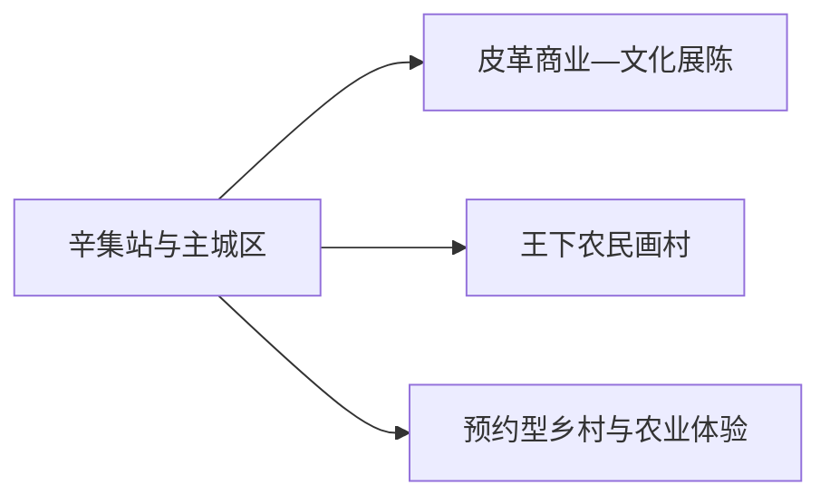
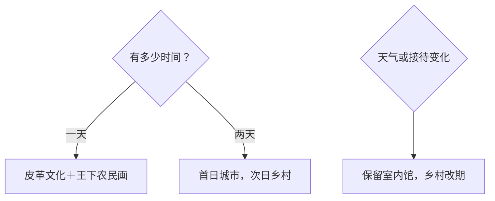

# 辛集旅行指南

辛集适合用一到两天认识华北平原上的皮革产业、农民画和县级市生活。首日可从皮革文化展陈进入城市，再到王下村看农民画；第二天按正式接待信息选择乡村文化或农业体验。产业园区以公开展馆和商业空间为入口，生产车间则按预约接待范围参观。

> 建议停留：1–2 天 
> 旅行关键词：皮革文化、农民画、平原乡村、产业体验 
> 主要体力：低至中等；乡村点位间以车辆衔接 
> 最近研究：2026-08-12

## 城市速览

| 项目 | 旅行信息 |
|---|---|
| 主要旅行价值 | 在明华皮毛文化博物馆、皮革商业空间与王下农民画村之间理解一座产业县级市 |
| 建议停留 | 1 天完成城市与农民画主线；2 天增加正式开放的乡村或农业体验 |
| 较舒适季节 | 春秋适合城乡移动；夏季早晚安排室外段，冬季注意寒风和道路结冰 |
| 预算特点 | 城区消费较平实，跨乡镇车辆和购物是主要弹性支出 |
| 步行强度 | 展馆和商业空间步行量低，乡村点位分散，以车辆换取体力余量 |
| 主要天气风险 | 高温、雷雨、大风、寒潮、雾和冬季结冰 |
| 独行旅行 | 城区容易用餐和叫车，乡村线先约返程车辆 |
| 亲子旅行 | 农民画和材料工艺适合观察体验，活动年龄与接待时间提前确认 |
| 长者与低体力旅行 | 采用单馆慢看、车辆直达和短距离商业空间组合 |
| 无障碍信息 | 新建场馆可先询问电梯、卫生间和下客点；设施连续性需向官方确认 |

## 城市格局与游览区域

辛集主城区承担住宿、餐饮和交通，皮革商业与展陈空间构成城市产业主线；王下村等乡村点位在城区外围，适合用半天单独往返。购物、展陈和生产参观是三种不同体验，安排时先确认入口性质。

| 区域 | 主要内容 | 游览特点 | 与其他区域的关系 |
|---|---|---|---|
| 主城区 | 住宿、餐饮、公共文化与城市生活 | 适合作为抵达和休息基地 | 与皮革商业空间可同日组合 |
| 皮革商贸片区 | 明华皮毛文化博物馆、皮革城与展销活动 | 室内为主，购物前先比较材质、售后和标价 | 与主城区衔接最方便 |
| 王下村方向 | 农民画展示、乡村文化 | 适合半日，活动和接待随时段变化 | 从城区车辆往返 |
| 其他乡村方向 | 梨园、农业与民俗活动 | 仅选择正式开放、明确接待的项目 | 放在第二天，不与多个远点赶场 |

固定 GeoNames `1788816` 是辛集主城的 `PPLA3` 居民点记录；法定县级辛集市使用代码 `130181`，Wikidata `Q1015480` 的 `P1566=1788811` 指向另一行政记录。页面以固定城市点承接队列，以法定代码界定市域，两类标识各司其职。

## 主要景点

### 城市与产业文化

| 景点 | 区域 | 类型 | 主要看点 | 建议用时 | 室内外 | 体力 | 预约风险 | 天气影响 | 优先级 |
|---|---|---|---|---:|---|---|---|---|---|
| 明华皮毛文化博物馆 | 皮革商贸片区 | 行业博物馆 | 皮毛加工史、材料、工艺与地方产业 | 1.5–2 小时 | 室内 | 低 | 中；开放与讲解需核 | 低 | A |
| 辛集国际皮革城公开区域 | 皮革商贸片区 | 商业与产业文化 | 产品类别、当代产业和展销空间 | 1.5–3 小时 | 室内 | 低 | 低；活动期另核 | 低 | B |
| 辛集公共文化场馆 | 主城区 | 文化馆／图书馆等 | 地方展览、公共阅读和临时活动 | 1–2 小时 | 室内 | 低 | 中；具体场馆与开放需核 | 低 | B |

### 乡村文化

| 景点 | 区域 | 类型 | 主要看点 | 建议用时 | 室内外 | 体力 | 预约风险 | 天气影响 | 优先级 |
|---|---|---|---|---:|---|---|---|---|---|
| 王下村农民画体验区 | 王下村 | 乡村文化、绘画 | 辛集农民画、创作空间与乡村生活 | 2–3 小时 | 混合 | 低至中 | 高；展室、活动和接待需核 | 中 | A |
| 正式开放的梨园或农业体验点 | 市域乡村 | 季节体验 | 花期、采摘、农事与平原景观 | 2–3 小时 | 室外 | 中 | 高；季节、收费与接待需核 | 高 | C |

皮革城是商业空间，博物馆是文化展陈，生产企业则需以明确的研学或参观接待为入口。购物可作为兴趣补充，不必占满首日；乡村项目先确认当天有人接待，再决定是否出城。

## 美食与餐饮

| 菜品或餐饮类型 | 常见区域 | 一个人用餐与常见份量 | 风味、过敏原与饮食限制 | 排队风险与替代方法 |
|---|---|---|---|---|
| 河北面食与饼类 | 主城区、车站周边 | 单人友好 | 小麦、芝麻、花生和肉馅需留意 | 早餐高峰换居民区同类店 |
| 驴肉、熏肉等熟食 | 市场与家常菜馆 | 可按重量少量购买 | 肉类、盐和香辛料；冷食注意保存 | 选明码标价、现切现售门店 |
| 平原家常菜 | 主城区 | 热菜适合共享，一人选小份或盖饭 | 常见大豆、花生、蛋、肉类 | 午餐错峰或选套餐 |
| 梨果与季节农产品 | 正规市场、乡村接待点 | 按需购买 | 留意清洗、保存及个体过敏 | 采摘前问成熟度和计价方式 |

## 经典行程

### 一日经典路线

**路线**：明华皮毛文化博物馆 → 皮革城公开区域 → 午餐 → 王下村农民画体验区

- **串联逻辑**：上午从产业历史到当代商业，下午转向地方视觉文化。
- **预约锚点**：博物馆、王下村展室和体验活动。
- **休息安排**：商业片区午餐长休，乡村活动中途安排坐休。
- **时间不足时**：保留博物馆和王下村，缩短购物段。

### 两日城市路线

**第 1 天**：博物馆 → 皮革商业片区 → 主城区。 
**第 2 天**：王下村 → 一个正式开放的乡村体验点。

- **串联逻辑**：把产业城市和乡村文化分日，减少来回折返。
- **预约锚点**：第二天接待人、车辆和活动时段。
- **休息安排**：第一天住主城区；第二天在明确服务点午休。
- **时间不足时**：第二天只保留王下村。

### 三日深度路线

**第 1 天**：城市产业文化。 
**第 2 天**：农民画与乡村文化。 
**第 3 天**：正式开放的农业体验或当期文化活动。

- **串联逻辑**：按产业、艺术、季节活动逐层展开，第三天保留弹性。
- **预约锚点**：第三天项目的开放、保险、收费和交通。
- **休息安排**：每天回主城区住宿，降低乡村接驳不确定性。
- **时间不足时**：整段删除第三天。

### 雨天路线

**路线**：明华皮毛文化博物馆 → 午餐 → 皮革城公开室内区域 → 正式开放的公共文化场馆

- **适用条件**：普通降雨；暴雨、雷电或道路积水时缩短移动。
- **串联逻辑**：以室内展陈和商业空间替代乡村户外体验。
- **预约锚点**：博物馆和公共文化场馆开放。
- **休息安排**：商业综合空间内分段坐休。
- **时间不足时**：只保留博物馆。

### 亲子或低体力路线

**亲子路线**：博物馆材料工艺展 → 午餐 → 王下村短时绘画体验。 
**低体力路线**：车辆直达博物馆 → 午餐 → 皮革城单一区域。

- **减负方式**：亲子线减少购物时长；低体力线减少城乡换乘和长距离展厅步行。
- **预约锚点**：儿童活动、无障碍入口、座椅与下客点。
- **休息安排**：每个主要点之间安排正餐或坐休。
- **时间不足时**：两类路线都保留博物馆，第二点按兴趣取舍。

### 远郊一日路线

**路线**：主城区 → 一个已确认接待的乡村／农业项目 → 王下村或直接返城

- **适用条件**：开放、天气、道路和返程车辆明确。
- **串联逻辑**：同方向只选一至两个点，把时间留给完整体验。
- **预约锚点**：接待人、活动内容、费用和返程。
- **休息安排**：在正规乡村接待点或回城区用餐。
- **时间不足时**：只走王下村半日线。

## 住宿区域

| 区域 | 优点 | 缺点 | 适合人群 | 交通特点 |
|---|---|---|---|---|
| 辛集站—主城区 | 抵离、餐饮和叫车方便 | 到乡村仍需车辆 | 首访、公共交通、短住 | 先核末班公交和到站接驳 |
| 皮革商贸片区 | 靠近博物馆、商业与展销活动 | 城市生活感相对弱，活动期可能拥挤 | 产业文化、购物、商务 | 适合首日步行与短途车 |
| 城区外围 | 停车和自驾出城方便 | 夜间餐饮选择较少 | 自驾、第二天乡村线 | 选靠近计划出城方向的位置 |

## 市内交通

| 场景 | 建议与取舍 | 行前需要重查的内容 |
|---|---|---|
| 铁路抵达 | 辛集站接入主城区；按票面完整站名安排接驳 | 车次、出站口、公交和夜间叫车 |
| 城区移动 | 公交、出租或网约车连接主城与皮革片区 | 班次、活动改道与上客点 |
| 乡村往返 | 预约车辆或核实城乡公交后再排活动 | 末班、返程、接待地址与道路 |
| 自驾 | 适合王下村和乡村方向，商业区停车后步行 | 停车、充电、节庆管制和恶劣天气 |

## 不同旅行者须知

| 旅行维度 | 可行条件 | 主要取舍 | 需额外核对 |
|---|---|---|---|
| 独行旅行 | 城区服务完整 | 乡村先锁返程 | 夜间交通、接待最低人数 |
| 亲子旅行 | 工艺与绘画互动清晰 | 控制展厅和购物时间 | 年龄、材料安全、卫生间 |
| 长者或低体力旅行 | 车辆直达单馆 | 乡村路面和站内换乘需留余量 | 电梯、座椅、下客点 |
| 无障碍需求 | 新建场馆优先咨询 | 单点设施不等于全程连续 | 设施连续性需向官方确认 |
| 购物旅行 | 正规商业空间便于比较 | 预算和时间上限先设定 | 材质标识、发票、售后和寄送 |
| 摄影旅行 | 农民画和产业空间题材鲜明 | 商业、展厅和乡村人物拍摄需征得同意 | 闪光灯、三脚架、商业拍摄 |
| 特殊天气 | 雨天可转室内 | 大风、雷雨和结冰影响乡村线 | 气象预警与道路状态 |

## 行前核对

| 核对事项 | 为什么需要重查 | 建议核对时间 | 官方入口 |
|---|---|---|---|
| 博物馆与活动 | 开放、讲解和团队接待会调整 | 排路线前及前一日 | [河北省文化和旅游厅：明华皮毛文化博物馆](https://hebwb.hebei.gov.cn/single/255/9074.html) |
| 农民画体验 | 展室、教师和活动时段并非每天相同 | 出发前三日 | [河北省文化和旅游厅：辛集农民画](https://whly.hebei.gov.cn/c/2012-12-21/558102.html) |
| 城乡交通 | 班次和返程会随日期变化 | 出发前一日及当天 | [中国铁路12306](https://www.12306.cn/) |
| 展销与购物 | 展会、营业和售后规则具有时效 | 到访前 | [辛集市人民政府相关发布](https://xy.xinji.gov.cn/article-details/qhddt/26eef2af-928a-4b11-9770-912f0caa5b4d) |
| 天气 | 高温、雷雨、大风和结冰影响乡村线 | 出发前三日及当天 | [河北省气象局](http://he.cma.gov.cn/) |

## 来源与更新记录

### 主要来源

| 来源 | 类型 | 支持内容 | 核验日期 |
|---|---|---|---|
| [辛集农民画资料](https://whly.hebei.gov.cn/c/2012-12-21/558102.html) | 河北省文化和旅游厅 | 农民画传统、王下村与文化属性 | 2026-08-12 |
| [明华皮毛文化博物馆](https://wenwu.hebei.gov.cn/system/2023/09/27/030253853.shtml) | 河北省文物局 | 行业博物馆属性与展陈方向 | 2026-08-12 |
| [皮革产业与旅游融合](https://whly.hebei.gov.cn/c/2019-11-25/559179.html) | 河北省文化和旅游厅 | 皮革城、产业文化与旅游关系 | 2026-08-12 |
| [辛集市当期文化旅游活动](https://xy.xinji.gov.cn/article-details/qhddt/96999c7d-ebbe-4026-be62-fb684b07d9f6) | 辛集市政府系统 | 城市文化、体验活动与乡村方向 | 2026-08-12 |
| [Wikidata Q1015480](https://www.wikidata.org/wiki/Special:EntityData/Q1015480.json) | 开放结构化数据 | 法定实体与 GeoNames 行政记录交叉核验 | 2026-08-12 |
| [GeoNames 1788816](https://sws.geonames.org/1788816/about.rdf) | 开放地名数据 | 固定主城居民点 | 2026-08-12 |
| [民政部行政区划代码查询](https://dmfw.mca.gov.cn/xzqh/getList?code=130181&trimCode=false&maxLevel=3) | 国家行政区划数据 | 法定代码 130181 | 2026-08-12 |

### 更新记录

| 日期 | 更新内容 |
|---|---|
| 2026-08-12 | 首次完成辛集指南，核验产业文化、农民画、城乡交通和标识粒度 |
