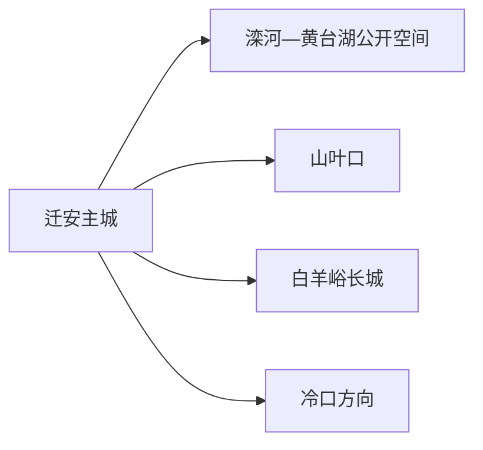
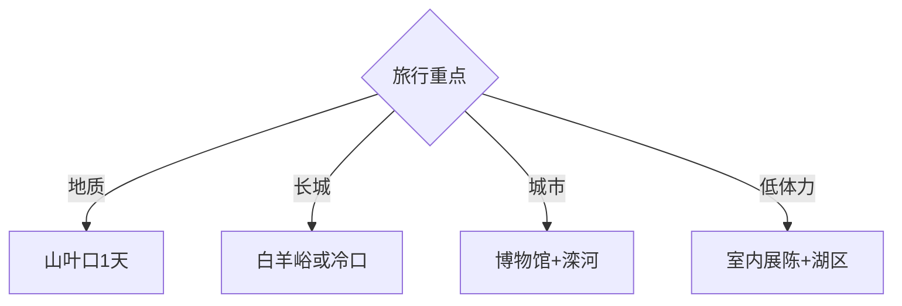

# 迁安旅行指南

迁安位于唐山东北部，滦河城市景观、山叶口古老地质、白羊峪长城与矿业城市史共同构成旅行结构。固定快照中的 **Qian’an / GeoNames 2035411** 对应现行迁安市，本页以主城为住宿和换乘中心。

## 城市速览

| 项目 | 信息 |
|---|---|
| 主线 | 主城—山叶口—白羊峪 |
| 停留 | 主城半日至1天；地质或长城主题各加1天 |
| 住宿 | 主城便于餐饮和多方向出发；景区周边适合早出发 |
| 交通 | 铁路与公路抵达，山地景区宜预约车辆或自驾 |
| 风险 | 山洪雷雨、落石、未开放长城、矿山生产区与饮用水源保护 |

## 城市格局与游览区域

主城与滦河公共空间适合抵离日；山叶口位于北部山地，以古老岩石和峡谷为主；白羊峪、冷口属于长城文化与保护重点方向。三条远端线分别安排，矿区道路和生产设施只按正式工业旅游接待进入。

## 主要景点

| 景点 | 区域 | 类型 | 核心体验 | 用时 | 环境 | 体力 | 研究价值 | 拥挤 | 优先级 |
|---|---|---|---|---:|---|---|---|---|---|
| 山叶口景区 | 北部山地 | 地质景区 | 太古岩石、峡谷与地貌科普 | 1天 | 室外 | 高 | 很高 | 节假日高 | A |
| 白羊峪长城旅游区 | 北部 | 长城景区 | 长城、山村与防御地形 | 半天至1天 | 室外 | 高 | 很高 | 节假日高 | A |
| 迁安市博物馆 | 主城 | 博物馆 | 地方考古、城市史与矿业线索 | 1–2小时 | 室内 | 低 | 高 | 团体时中 | A |
| 滦河生态公开空间 | 主城 | 滨水公园 | 河流治理与城市景观 | 1–2小时 | 室外 | 低中 | 中 | 傍晚中 | B |
| 黄台湖公开公园段 | 主城 | 湖区公园 | 湖面、绿道与城市休闲 | 1–2小时 | 室外 | 低 | 中 | 周末中 | B |
| 冷口长城正式开放段 | 冷口方向 | 长城遗产 | 关口、摩崖与历史交通 | 半天 | 室外 | 高 | 很高 | 中 | B |
| 迁安规划展馆等公共展陈 | 主城 | 城市展陈 | 工业城市转型与空间发展 | 1小时 | 室内 | 低 | 中 | 团体时中 | B |
| 乡村公开研学点 | 山区乡镇 | 乡村体验 | 长城村落与地方物产 | 2–3小时 | 混合 | 中 | 中 | 活动时中 | C |

## 美食与餐饮

建昌营馓子、徐流口豆片、蛤蟆吞蜜和饹馇可作为地方小吃线索。购买熟食先确认制作日期、储存温度和过敏原；山地一日线携带饮水和简餐，在游客服务区补给。

## 经典行程

### 一日基础线
**路线**：迁安市博物馆—午餐—滦河生态公开空间—黄台湖公园段。**逻辑**：先读城市，再看河流与更新。**预约锚点**：博物馆开放。**休息**：主城商业区。**删除条件**：高温或大风时缩短滨水段。

### 山叶口地质线
**路线**：主城—山叶口游客中心—开放地质步道—返城。**逻辑**：完整一天专注古老地质。**预约锚点**：票务、步道和返程。**休息**：游客中心。**删除条件**：雷雨、山洪、落石或闭园公告出现时取消。

### 白羊峪长城线
**路线**：游客入口—村落公开区—开放长城段—返城。**逻辑**：结合聚落与长城保护阅读。**预约锚点**：入口和开放线路。**休息**：景区服务区。**删除条件**：林火、积雪或封闭管理时取消。

### 冷口专题线
**路线**：主城—冷口正式接待点—摩崖或长城开放段—返城。**逻辑**：围绕关口交通史展开。**预约锚点**：属地开放和车辆。**休息**：镇区。**删除条件**：开放信息不完整时改白羊峪。

### 城市转型线
**路线**：博物馆—规划展陈—滦河公共空间。**逻辑**：串联考古、矿业与生态城市建设。**预约锚点**：两处展陈开放。**休息**：主城。**删除条件**：展馆闭馆时保留博物馆与公园。

### 亲子低体力线
**路线**：博物馆—午休—黄台湖近入口段。**逻辑**：室内学习配平缓步行。**预约锚点**：亲子活动。**休息**：馆内与商业区。**删除条件**：强对流时只留室内。

### 雨天线
**路线**：博物馆—规划展陈—地方餐饮。**逻辑**：把活动留在主城。**预约锚点**：馆舍最晚入场。**休息**：两馆之间。**删除条件**：道路积水时提前返宿。

## 住宿区域

主城适合首次到访及连续安排多个方向；山叶口或白羊峪周边住宿适合次日早入山。选择景区周边住宿时核对持证经营、餐饮、夜间道路和次日接驳。

## 市内交通

迁安有铁路和公路入口，主城用公交、出租车和网约车。山叶口、白羊峪、冷口分属不同山地方向，安排包车或自驾并预留返程；矿区重型车辆较多时选择公开旅游道路和白天时段。

## 不同旅行者须知

地质兴趣者把山叶口设为核心；长城爱好者在白羊峪与冷口中择一；亲子家庭以博物馆和规范景区短线为主；行动不便者确认景区接驳、坡度、台阶及卫生间。

## 行前核对

- 核对山叶口、白羊峪、冷口的开放入口、天气、票务与返程。
- 核对博物馆闭馆日、山区通信及自驾停车安排。
- 未开放长城、矿山采场、尾矿库、厂区、铁路专用线和水源保护区按管理边界通行。

## 来源与更新记录

| 来源 | 支持内容 | 核验日期 |
|---|---|---|
| [迁安市政府：迁安概况](https://www.qianan.gov.cn/content/74923.html) | 历史、矿业、河流、山叶口与白羊峪 | 2026-09-01 |
| [迁安市国土空间总体规划](https://www.qianan.gov.cn/main/file/2026-02-27/17721613225334028927d9c41c045205019c9d0bce251937.pdf) | 长城文化体系、白羊峪与冷口保护边界 | 2026-09-01 |
| [GeoNames 2035411](https://www.geonames.org/2035411/) | Qian’an 固定人口点与位置 | 2026-09-01 |

| 日期 | 更新 |
|---|---|
| 2026-09-01 | 首次完成迁安旅行研究；分开组织主城、地质与长城路线。 |
