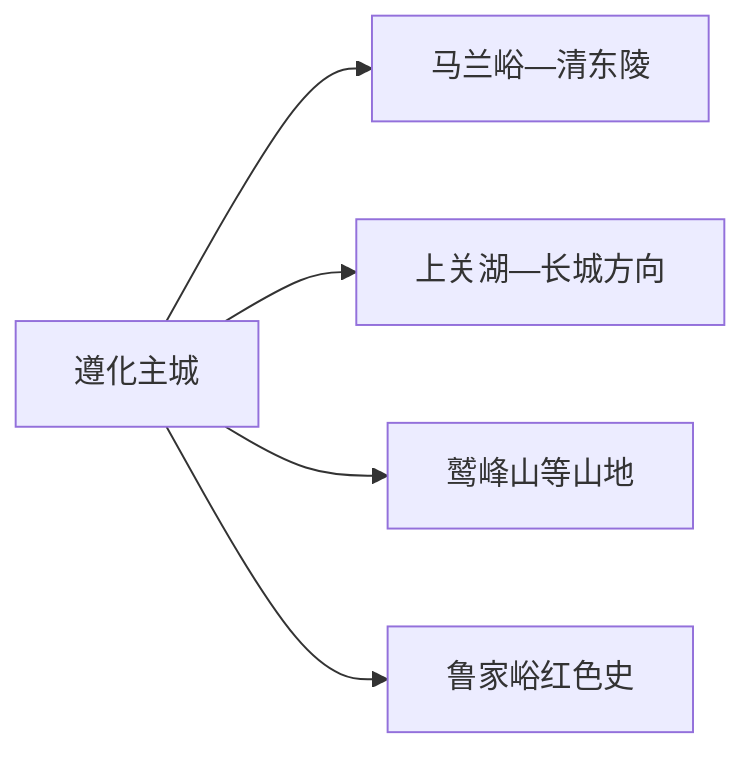
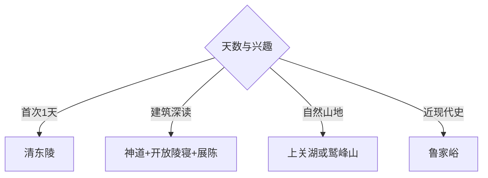

# 遵化旅行指南

遵化位于唐山北部燕山南麓，清东陵是核心，明长城、山地景区与冀东红色史构成延伸。固定快照中的 **Zunhua / GeoNames 2033058** 对应现行遵化市；清东陵距主城较远，适合单列完整一天。

## 城市速览

| 项目 | 信息 |
|---|---|
| 主线 | 清东陵—马兰峪—遵化主城 |
| 停留 | 清东陵1天；山地或红色主题再加1天 |
| 住宿 | 主城适合综合行程；陵区周边适合早入园 |
| 交通 | 公路抵达为主，远端点位宜预约车辆或自驾 |
| 风险 | 世界遗产保护、未开放长城、山洪雷雨、林火与墓园礼仪 |

## 城市格局与游览区域

清东陵是面积很大的世界遗产与景区组合，按当日开放陵寝和景区交通组织。上关湖、长城、山地景区和鲁家峪分处不同方向，各占半日至一天；主城承担住宿、餐饮和交通转换。

## 主要景点

| 景点 | 区域 | 类型 | 核心体验 | 用时 | 环境 | 体力 | 研究价值 | 拥挤 | 优先级 |
|---|---|---|---|---:|---|---|---|---|---|
| 清东陵 | 马兰峪 | 世界遗产 | 清代陵寝格局、建筑与石刻 | 1天 | 混合 | 中高 | 很高 | 节假日高 | A |
| 孝陵神道与公开陵区 | 清东陵 | 遗产片区 | 中轴、石像生与礼制空间 | 2–3小时 | 室外 | 中 | 很高 | 中高 | A |
| 裕陵等当日开放陵寝 | 清东陵 | 陵寝建筑 | 建筑装饰与陵寝制度 | 2–3小时 | 混合 | 中 | 很高 | 高 | A |
| 清东陵文物展陈 | 陵区 | 博物馆展陈 | 以文物补足遗产背景 | 1小时 | 室内 | 低 | 高 | 团体时高 | A |
| 上关湖 | 北部 | 湖泊景区 | 湖山与长城环境 | 半天 | 室外 | 中 | 中 | 周末中 | B |
| 鹫峰山 | 北部山地 | 山地景区 | 燕山地貌与森林步道 | 半天至1天 | 室外 | 高 | 中 | 周末中 | B |
| 明长城正式开放段 | 北部 | 长城遗产 | 山脊防御体系与关隘 | 半天 | 室外 | 高 | 很高 | 节假日中 | B |
| 鲁家峪抗战纪念空间 | 东部乡村 | 红色史迹 | 冀东抗战史与遗址 | 半天 | 混合 | 中 | 高 | 团体时中 | B |

## 美食与餐饮

京东板栗、饹馇及冀东家常菜适合作为地方饮食线索。板栗制品比较配料、保存方式和保质期；山地、陵区周边餐饮选择少，早餐后携带饮水，在正式服务区用餐并把垃圾带回收集点。

## 经典行程

### 一日基础线
**路线**：清东陵游客入口—孝陵神道—当日开放陵寝—展陈。**逻辑**：用完整一天理解遗产总体格局。**预约锚点**：门票、接驳和开放陵寝。**休息**：游客中心。**删除条件**：时间不足时减少陵寝数量。

### 陵寝建筑线
**路线**：神道—孝陵公开区—裕陵等开放单元—文物展陈。**逻辑**：从总体秩序进入建筑细节。**预约锚点**：地宫与展厅开放。**休息**：景区服务站。**删除条件**：维修单元按公告跳过。

### 主城轻量线
**路线**：主城公共文化空间—地方餐饮—城市公园。**逻辑**：用于抵离日缓冲。**预约锚点**：场馆开放。**休息**：主城商业区。**删除条件**：抵达过晚时直接入住。

### 湖山半日线
**路线**：主城—上关湖正式入口—返城。**逻辑**：在清东陵之外补充湖山环境。**预约锚点**：景区开放和返程车。**休息**：游客服务点。**删除条件**：雷雨、大风或水域管控时取消。

### 长城专题线
**路线**：官方开放入口—开放长城段—原路按指引返回。**逻辑**：围绕明确关隘阅读燕山防御体系。**预约锚点**：入口、线路和末班接驳。**休息**：入口服务区。**删除条件**：林火、降雨、结冰或封闭公告出现时取消。

### 红色史迹线
**路线**：主城—鲁家峪纪念空间—公开遗址点—返城。**逻辑**：专题理解冀东抗战史。**预约锚点**：纪念馆接待与车辆。**休息**：村级服务点。**删除条件**：展馆闭馆时保留主城方案。

### 雨天线
**路线**：清东陵当日开放室内展陈—主城公共文化空间。**逻辑**：减少山地和长距离步行。**预约锚点**：室内单元开放。**休息**：游客中心。**删除条件**：强降雨或地质灾害预警时留在主城。

## 住宿区域

遵化主城适合连续安排陵区、山地和红色主题；马兰峪及清东陵周边适合次日早入园。选择陵区住宿时核对持证经营、夜间餐饮、景区入口距离和返程车辆。

## 市内交通

遵化以公路抵达和县域地面接驳为主。清东陵、上关湖、鹫峰山与鲁家峪方向分散，预约车辆或自驾更易控制返程；山路夜间、雨雪和结冰条件下预留更大时间余量。

## 不同旅行者须知

建筑与历史兴趣者给清东陵完整一天；登山者选择正式开放景区；亲子家庭以神道、展陈和短距离开放单元为主；行动不便者提前确认景区接驳、无障碍入口、地宫台阶和卫生间。

## 行前核对

- 核对清东陵当日开放陵寝、门票、景区车与最晚返程。
- 核对长城和山地景区入口、林火、雷雨、积雪及道路预警。
- 世界遗产保护区、未开放陵寝、未开放长城、林地和墓园管理区按围栏与现场规定通行。

## 来源与更新记录

| 来源 | 支持内容 | 核验日期 |
|---|---|---|
| [河北省文化和旅游厅：河北省世界文化遗产](https://whly.hebei.gov.cn/c/2018-07-16/556514.html) | 清东陵位置、规模、陵寝体系与遗产等级 | 2026-09-01 |
| [文化和旅游部：清东陵文旅融合](https://www.mct.gov.cn/gtb/index.jsp?url=http%3A%2F%2Fwww.mct.gov.cn%2Fwhzx%2Fqgwhxxlb%2Fhb%2F202309%2Ft20230922_947423.htm) | 文物展陈、公益活动与当前文旅方向 | 2026-09-01 |
| [GeoNames 2033058](https://www.geonames.org/2033058/) | Zunhua 固定人口点与位置 | 2026-09-01 |

| 日期 | 更新 |
|---|---|
| 2026-09-01 | 首次完成遵化旅行研究；以清东陵为核心划分山地、长城与红色史方向。 |
