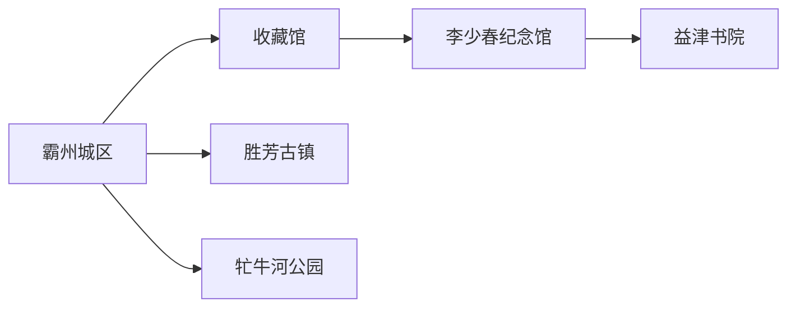
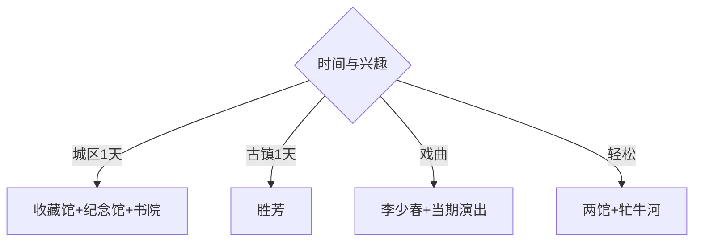

# 霸州旅行指南

霸州位于廊坊南部，城区文博、益津书院、李少春戏曲文化与东部胜芳古镇形成两个清晰片区。固定快照中的 **Bazhou / GeoNames 1816832** 对应现行霸州市，城区与胜芳之间按跨片区交通安排。

## 城市速览

| 项目 | 信息 |
|---|---|
| 主线 | 华夏民间收藏馆—李少春纪念馆—益津书院—胜芳古镇 |
| 停留 | 霸州城区1天；胜芳另留1天 |
| 住宿 | 霸州站—城区适合文博；胜芳适合古镇夜间与节庆 |
| 交通 | 多座铁路站服务不同方向，城区到胜芳需地面接驳 |
| 风险 | 古镇客流、灯会交通、河道水情、宗教礼仪与场馆更名开放 |

## 城市格局与游览区域

霸州城区集中文博、戏曲与书院，可用公交和短程车辆串联；胜芳位于东部，是独立的古镇与商贸生活片区，适合完整一天。铁路站名与线路较多，围绕实际到站安排住宿和接驳。

## 主要景点

| 景点 | 区域 | 类型 | 核心体验 | 用时 | 环境 | 体力 | 研究价值 | 拥挤 | 优先级 |
|---|---|---|---|---:|---|---|---|---|---|
| 华夏民间收藏馆与自行车专题展陈 | 霸州城区 | 博物馆 | 民俗、书画、自行车与城市收藏 | 2–3小时 | 室内 | 低 | 很高 | 团体时中 | A |
| 李少春纪念馆 | 霸州城区 | 纪念馆 | 京剧李派艺术与舞台生涯 | 1–2小时 | 室内 | 低 | 很高 | 团体时中 | A |
| 益津书院 | 霸州城区 | 书院与公共文化 | 书院历史、阅读与展陈 | 1–2小时 | 混合 | 低 | 高 | 活动时中 | A |
| 胜芳古镇 | 胜芳镇 | 古镇与生活街区 | 水乡商埠、民居、花会与地方生活 | 半天至1天 | 混合 | 中 | 很高 | 节庆高 | A |
| 胜芳博物馆与王家大院组合 | 胜芳镇 | 博物馆与民居 | 古镇史、民俗与近代建筑 | 2小时 | 混合 | 低中 | 高 | 节假日中 | A |
| 牤牛河历史文化公园 | 霸州城区 | 城市公园 | 河流、城市记忆与休闲 | 1–2小时 | 室外 | 低 | 中 | 傍晚中 | B |
| 龙泉寺等正式开放宗教空间 | 城区 | 宗教建筑 | 地方信仰与建筑环境 | 1小时 | 混合 | 低 | 中 | 法会时高 | C |

## 美食与餐饮

胜芳河蟹、小鱼贴饼子、素冒汤及冀中家常菜具有地方特点。河鲜按季节、时价和做法确认，过敏者说明甲壳类与共用锅具；古镇节庆日把正餐错开高峰，并准备城区同类餐馆作为替代。

## 经典行程

### 一日基础线
**路线**：华夏民间收藏馆—午餐—李少春纪念馆—益津书院。**逻辑**：在城区完成收藏、戏曲与书院文化。**预约锚点**：三馆开放。**休息**：城区商业区。**删除条件**：时间不足时先删书院后的延伸活动。

### 胜芳古镇线
**路线**：城区—胜芳游客服务中心—博物馆与王家大院—古镇公开街巷—返宿。**逻辑**：给古镇完整一天。**预约锚点**：馆舍、节庆交通和返程。**休息**：游客中心。**删除条件**：客流过高时缩短街巷并错峰。

### 戏曲文化线
**路线**：李少春纪念馆—午休—当期京剧或地方戏演出。**逻辑**：人物展陈连接真实舞台。**预约锚点**：演出票与场馆。**休息**：剧场周边。**删除条件**：无演出时加入收藏馆戏曲展陈。

### 书院文博线
**路线**：华夏民间收藏馆—益津书院—城区公共阅读空间。**逻辑**：收藏与阅读形成低体力文化日。**预约锚点**：两馆开放。**休息**：书院与商业区。**删除条件**：活动占场时保留收藏馆。

### 河城休闲线
**路线**：李少春纪念馆—牤牛河历史文化公园—地方餐饮。**逻辑**：室内文化配傍晚公园。**预约锚点**：纪念馆开放。**休息**：公园座椅区。**删除条件**：暴雨或水情管控时删公园。

### 亲子低体力线
**路线**：华夏民间收藏馆—午休—益津书院。**逻辑**：两处互动和阅读空间减少户外负担。**预约锚点**：亲子活动。**休息**：馆内。**删除条件**：一馆闭馆时改纪念馆。

### 雨天线
**路线**：华夏民间收藏馆—李少春纪念馆—室内演出。**逻辑**：集中城区室内活动。**预约锚点**：馆舍与演出。**休息**：场馆之间。**删除条件**：道路积水时就近返宿。

## 住宿区域

霸州站—城区适合文博、戏曲和普通铁路抵离；胜芳镇适合古镇夜游、灯会及次日早间街巷；高铁站周边适合纯中转。订房时以实际到站、首个景点和夜间返程为组合条件。

## 市内交通

霸州有多座铁路客运站，车票站名决定落点。城区内用公交、出租车和网约车；胜芳按跨片区行程预留往返，节庆日优先使用属地接驳和指定停车区。

## 不同旅行者须知

收藏与戏曲爱好者优先城区三馆；古镇兴趣者给胜芳完整一天；亲子家庭选择收藏馆和书院；行动不便者核对古镇路面、民居门槛、馆舍电梯和跨片区接驳。

## 行前核对

- 核对收藏馆当前名称、展区、闭馆日及李少春纪念馆、益津书院开放。
- 核对胜芳灯会、花会、场馆、道路分流和返程交通。
- 河道管理区、宗教内部空间、居民院落和古镇商业装卸区按现场开放边界通行。

## 来源与更新记录

| 来源 | 支持内容 | 核验日期 |
|---|---|---|
| [廊坊市政府：霸州沿线与景区提升](https://www.lf.gov.cn/Item/142003.aspx) | 收藏馆、纪念馆、益津书院、胜芳和牤牛河组合 | 2026-09-01 |
| [河北省文化和旅游厅：胜芳古镇](https://whly.hebei.gov.cn/c/2026-04-28/585012.html) | 商埠历史、王家大院、灯会与花会 | 2026-09-01 |
| [GeoNames 1816832](https://www.geonames.org/1816832/) | Bazhou 固定人口点与位置 | 2026-09-01 |

| 日期 | 更新 |
|---|---|
| 2026-09-01 | 首次完成霸州旅行研究；将城区文博与胜芳古镇分日组织。 |
