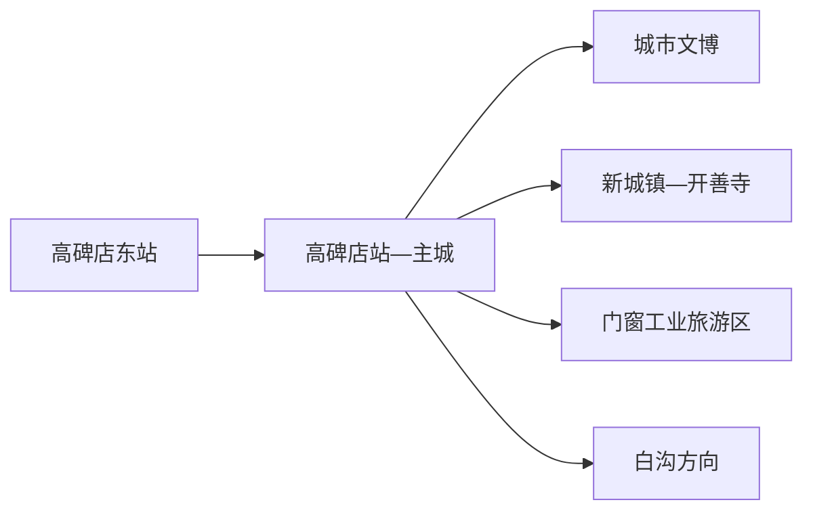
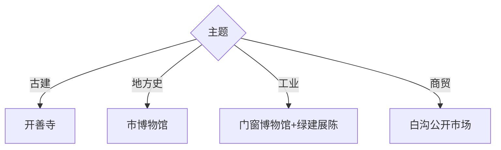

# 高碑店旅行指南

高碑店位于保定北部、北京与雄安之间，开善寺辽代木构是核心文化锚点，门窗节能工业、农产品商贸和督亢历史形成城市延伸。固定快照中的 **Gaobeidian / GeoNames 1810614** 对应现行高碑店市。

## 城市速览

| 项目 | 信息 |
|---|---|
| 主线 | 开善寺—城市文博—中国门窗博物馆 |
| 停留 | 主城与开善寺1天；工业或商贸主题另加半天 |
| 住宿 | 高碑店站适合老城；高碑店东站适合高铁抵离 |
| 交通 | 两座铁路站服务不同片区，开善寺与园区宜公交或约车 |
| 风险 | 文物开放、工业生产、市场物流、农业园接待与功能区边界 |

## 城市格局与游览区域

主城承担住宿、地方生活与交通转换，开善寺位于新城镇方向，门窗博物馆及节能建筑展陈属于工业旅游。白沟镇在法定区划上属高碑店市，现实中由白沟新城功能管理体系统筹较多事务；前往箱包商贸区时按具体地址和运营主体核对。

## 主要景点

| 景点 | 区域 | 类型 | 核心体验 | 用时 | 环境 | 体力 | 研究价值 | 拥挤 | 优先级 |
|---|---|---|---|---:|---|---|---|---|---|
| 开善寺 | 新城镇 | 全国重点文物 | 辽代木构、古建结构与彩塑 | 1–2小时 | 混合 | 低 | 很高 | 开放日中 | A |
| 高碑店市博物馆 | 主城 | 博物馆 | 督亢历史、地方文物与城市变迁 | 1–2小时 | 室内 | 低 | 很高 | 团体时中 | A |
| 中国门窗博物馆 | 城区产业园 | 工业博物馆 | 门窗技术、建筑节能与产业史 | 2小时 | 室内 | 低 | 高 | 团体时中 | A |
| 绿建科技公开展陈 | 城区产业园 | 工业旅游 | 超低能耗建筑与技术展示 | 1–2小时 | 室内 | 低 | 高 | 活动时中 | B |
| 北库小镇 | 城区 | 文旅商业 | 城市夜间消费与主题展陈 | 1–2小时 | 混合 | 低 | 中 | 周末中 | B |
| 杜村古梨园 | 乡村方向 | 农业景观 | 古梨树与季节田园 | 1–2小时 | 室外 | 低中 | 中 | 花果期高 | B |
| 白沟箱包商贸公开区 | 白沟方向 | 商贸与产业 | 箱包市场、设计与供应链观察 | 半天 | 室内 | 中 | 高 | 交易时高 | B |
| 国家登山训练基地公开展览区 | 城区 | 体育展陈 | 登山、攀岩与训练文化 | 1–2小时 | 室内 | 低 | 中 | 活动时中 | C |

## 美食与餐饮

高碑店豆腐丝、驴肉及河北平原家常菜较有代表性。市场和工业园周边餐饮更偏工作日节奏，古城镇点位选择较少；购买豆制品关注冷藏、生产日期和返程时间。

## 经典行程

### 一日基础线
**路线**：高碑店市博物馆—午餐—开善寺—返城。**逻辑**：先读地方史，再深看辽代木构。**预约锚点**：两处开放与开善寺预约。**休息**：主城或新城镇。**删除条件**：开善寺维护时改工业博物馆。

### 古建专题线
**路线**：主城—开善寺—新城镇公开街区—返城。**逻辑**：把充足时间给古建结构和环境。**预约锚点**：开放时段、限流与讲解。**休息**：镇区。**删除条件**：保护修缮或临时闭馆时改期。

### 工业旅游线
**路线**：中国门窗博物馆—绿建科技公开展陈—北库小镇。**逻辑**：从产业史进入当代建筑技术。**预约锚点**：企业接待和展馆开放。**休息**：园区服务区。**删除条件**：企业只接团体时保留公开博物馆。

### 白沟商贸线
**路线**：主城—白沟正式市场入口—公开展销区—返城。**逻辑**：专题观察箱包产业与商贸。**预约锚点**：市场营业和返程车辆。**休息**：市场公共服务区。**删除条件**：大型展会限流或交通拥堵时改期。

### 梨园季节线
**路线**：市博物馆—杜村古梨园公开接待区—返城。**逻辑**：地方史配季节农业景观。**预约锚点**：花期、果期和接待。**休息**：园区服务点。**删除条件**：非适游季只留博物馆。

### 亲子低体力线
**路线**：中国门窗博物馆—午休—城市公共文化空间。**逻辑**：室内科普与短距离移动。**预约锚点**：亲子活动。**休息**：馆内。**删除条件**：展馆闭馆时改市博物馆。

### 雨天线
**路线**：市博物馆—中国门窗博物馆—正规商业空间。**逻辑**：围绕室内展陈组织。**预约锚点**：两馆开放。**休息**：两馆之间。**删除条件**：积水或交通预警时提前返宿。

## 住宿区域

高碑店站—主城适合城市文化、餐饮和普通铁路；高碑店东站周边适合高铁早晚抵离。前往开善寺、白沟或工业园时，按第二天首个目的地选择住宿并确认接驳。

## 市内交通

高碑店站与高碑店东站相距较远，出发前确认实际到站。主城可用公交、出租车和网约车；开善寺、白沟、梨园及工业园分处不同方向，核对公交末班或提前约车。

## 不同旅行者须知

古建兴趣者优先开善寺；产业研究者选择门窗博物馆与白沟商贸；亲子家庭选择两座博物馆；行动不便者核对古建门槛、市场通道、馆舍无障碍及园区接驳。

## 行前核对

- 核对开善寺预约、限流、修缮与当日开放范围。
- 核对两座铁路站、企业展馆、白沟市场营业和返程交通。
- 工厂生产线、仓储物流、批发装卸区、训练场地、农田和果园按正式接待路线进入。

## 来源与更新记录

| 来源 | 支持内容 | 核验日期 |
|---|---|---|
| [高碑店市政府：市情概况](https://gaobeidian.gov.cn/ejmlgbdcon-26-12377.html) | 区位交通、开善寺与门窗产业 | 2026-09-01 |
| [高碑店市文广旅局：两天一夜休闲游](https://www.gaobeidian.gov.cn/xxgkcontent-888888027-33427.html) | 开善寺、门窗博物馆、北库小镇及地方饮食 | 2026-09-01 |
| [GeoNames 1810614](https://www.geonames.org/1810614/) | Gaobeidian 固定人口点与位置 | 2026-09-01 |

| 日期 | 更新 |
|---|---|
| 2026-09-01 | 首次完成高碑店旅行研究；分开组织古建、工业与白沟商贸路线。 |
