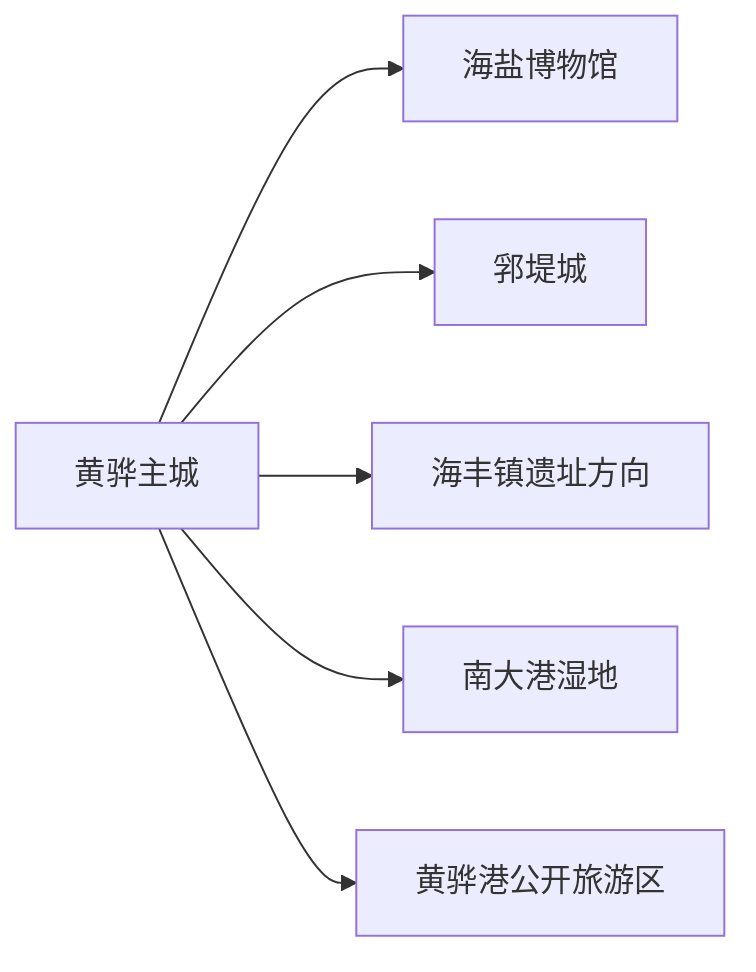
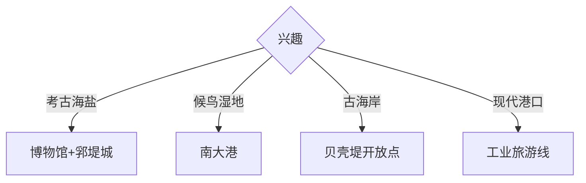

# 黄骅旅行指南

黄骅位于沧州东部渤海沿岸，海盐考古、郛堤城、古贝壳堤、南大港湿地与港口产业共同构成两至三天的滨海旅行结构。固定快照中的 **Huanghua / GeoNames 12361372** 对应现行黄骅市。

## 城市速览

| 项目 | 信息 |
|---|---|
| 主线 | 河北海盐博物馆—郛堤城—滨海湿地或港口公开线 |
| 停留 | 主城与遗址1天；湿地或海岸方向各加1天 |
| 住宿 | 黄骅主城便于文博和多方向出发；港城适合正式港区旅游 |
| 交通 | 公路抵达为主，湿地、遗址和港口宜约车或自驾 |
| 风险 | 自然保护地、候鸟季、风暴潮、港口生产、化工园区与行政管理边界 |

## 城市格局与游览区域

黄骅主城集中地方文博与住宿，郛堤城、海丰镇遗址分处城外。南大港和临港、港城等功能管理区位于黄骅法定市域内，但各有独立运营与管控体系；线路按具体景区、园区和游客入口组织，避免把整片海岸视作连续公共空间。

## 主要景点

| 景点 | 区域 | 类型 | 核心体验 | 用时 | 环境 | 体力 | 研究价值 | 拥挤 | 优先级 |
|---|---|---|---|---:|---|---|---|---|---|
| 河北海盐博物馆与黄骅市博物馆 | 主城 | 博物馆 | 海盐史、郛堤城考古与地方文化 | 2–3小时 | 室内 | 低 | 很高 | 团体时中 | A |
| 郛堤城遗址公园 | 城北 | 考古遗址 | 战国秦汉城址、瓮棺葬与湿地环境 | 半天 | 室外 | 中 | 很高 | 周末中 | A |
| 海丰镇遗址公开展示区 | 海岸方向 | 制盐遗址 | 古代制盐与海上交流线索 | 半天 | 室外 | 中 | 很高 | 团体时中 | A |
| 南大港湿地景区 | 南大港 | 湿地景区 | 候鸟、芦苇、水路与生态教育 | 半天至1天 | 室外 | 中 | 很高 | 候鸟季高 | A |
| 古贝壳堤正式开放点 | 沿海 | 地质与保护地 | 古海岸线、贝壳沉积与滨海演变 | 半天 | 室外 | 中 | 很高 | 中 | B |
| 聚馆古贡枣园公开区 | 聚馆方向 | 农业与古树 | 冬枣、古树和季节采摘 | 2–3小时 | 室外 | 低中 | 中 | 果期高 | B |
| 黄骅港工业旅游公开线 | 港城 | 工业旅游 | 能源港、港口机械与海运体系 | 半天 | 混合 | 中 | 高 | 团体时中 | B |

## 美食与餐饮

梭子蟹、海鱼、虾酱、冬枣和河北沿海家常菜较有代表性。海鲜点单时确认时价、重量、加工费和做法，过敏者说明甲壳类、贝类及共用锅具；冬枣按产地、成熟度和包装选择。

## 经典行程

### 一日基础线
**路线**：河北海盐博物馆—午餐—郛堤城遗址公园。**逻辑**：先看考古展陈，再进入遗址环境。**预约锚点**：博物馆和遗址开放。**休息**：主城。**删除条件**：高温或大风时缩短遗址户外段。

### 海盐考古线
**路线**：海盐博物馆—海丰镇遗址公开区—返城。**逻辑**：从展品与模型走向制盐遗址。**预约锚点**：遗址接待与车辆。**休息**：主城或正式服务点。**删除条件**：遗址维护时保留博物馆。

### 湿地观鸟线
**路线**：主城—南大港游客中心—开放观鸟或游船线—返宿。**逻辑**：完整一天给候鸟和湿地。**预约锚点**：开放区域、游船和返程。**休息**：游客中心。**删除条件**：大风、雷雨、候鸟保护或停航时按公告调整。

### 古海岸线
**路线**：主城—古贝壳堤正式入口—科普游线—返城。**逻辑**：专题理解渤海岸线演变。**预约锚点**：保护地开放点和向导。**休息**：入口服务区。**删除条件**：保护期、风暴潮或入口关闭时取消。

### 港口工业线
**路线**：主城—黄骅港指定集合点—正式工业旅游线—返宿。**逻辑**：在安全管理下观察现代港口。**预约锚点**：实名预约、接待批次和拍摄规则。**休息**：游客接待区。**删除条件**：生产调度或天气暂停接待时改博物馆。

### 亲子低体力线
**路线**：海盐博物馆—午休—郛堤城近入口展示段。**逻辑**：室内科普配短距离遗址观察。**预约锚点**：亲子讲解。**休息**：馆内与主城商业区。**删除条件**：高温时只留博物馆。

### 雨天线
**路线**：河北海盐博物馆—主城公共文化空间—地方餐饮。**逻辑**：避开湿地、海岸和港区。**预约锚点**：馆舍开放。**休息**：主城。**删除条件**：风暴潮或强降雨预警时留在住宿周边。

## 住宿区域

黄骅主城适合文博、考古与多方向安排；港城周边适合已确认的工业旅游和港区公务出行；南大港方向适合早晨观鸟。选择远端住宿时核对持证经营、晚餐和次日交通。

## 市内交通

黄骅以公路交通为主，主城可用公交、出租车和网约车。南大港、海丰镇、贝壳堤与黄骅港分处不同方向，优先约车或自驾并确认返程；港区重型车辆多，沿指定旅游道路和停车点通行。

## 不同旅行者须知

考古兴趣者优先博物馆、郛堤城与海丰镇；观鸟者围绕迁徙季和官方开放线安排；亲子家庭选择博物馆与湿地短线；行动不便者确认遗址地面、湿地接驳、游船登乘和卫生间。

## 行前核对

- 核对南大港湿地、贝壳堤保护地的开放区、候鸟季规则、游船与天气。
- 核对海丰镇、郛堤城及港口工业旅游的预约和返程。
- 自然保护区核心区、野生海岸、生产码头、煤炭装卸区、化工园区和仓储铁路按明确边界通行。

## 来源与更新记录

| 来源 | 支持内容 | 核验日期 |
|---|---|---|
| [河北省文物局：黄骅市博物馆](https://wenwu.hebei.gov.cn/system/2023/09/27/030253883.shtml) | 海盐、海丰镇与郛堤城考古展陈 | 2026-09-01 |
| [河北省文物局：郛堤城遗址](https://wenwu.hebei.gov.cn/system/2024/03/19/030281007.shtml) | 遗址价值、展示范围与湿地环境 | 2026-09-01 |
| [GeoNames 12361372](https://www.geonames.org/12361372/) | Huanghua 固定人口点与位置 | 2026-09-01 |

| 日期 | 更新 |
|---|---|
| 2026-09-01 | 首次完成黄骅旅行研究；区分主城考古、湿地、古海岸与港口工业路线。 |
