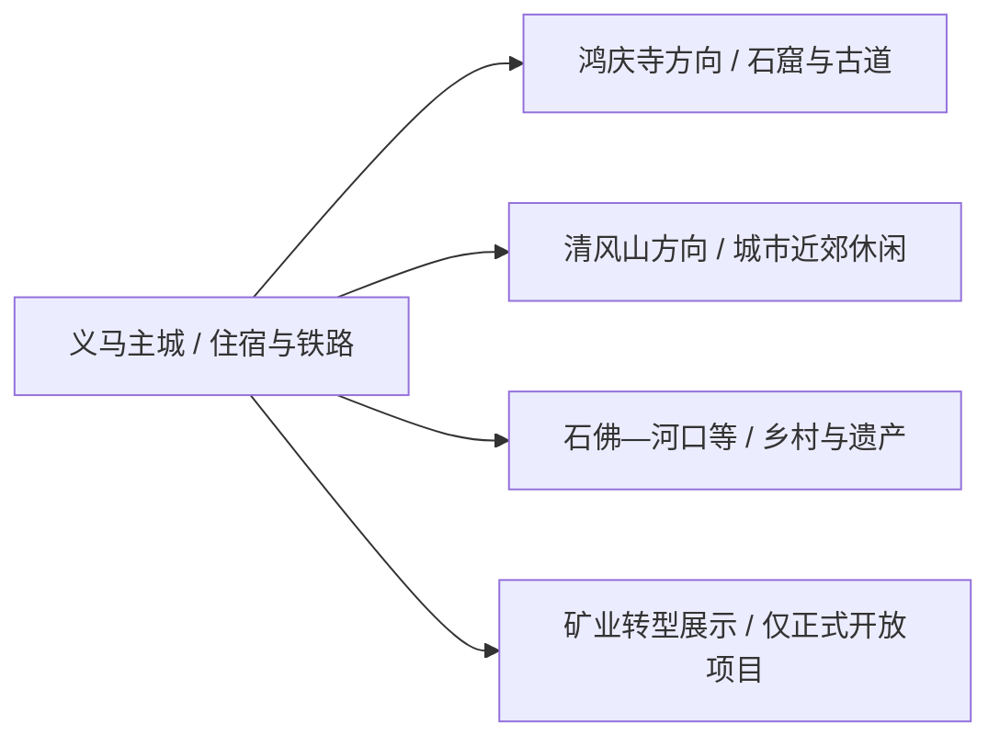
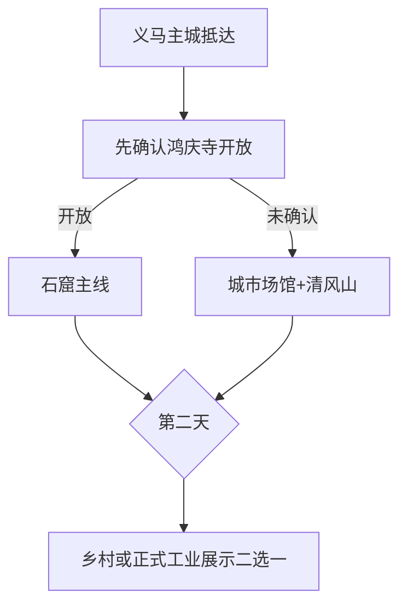

# 义马旅行指南

义马是一座紧凑的资源型小城，适合把鸿庆寺石窟作为文化主线，再用清风山、城市场馆或正式开放的矿业转型展示补足一天。它与三门峡、渑池和洛阳联程方便，到访前优先确认本地景点开放与接待信息。

> 建议停留：城区与鸿庆寺 1 天；加入乡村或工业转型主题为 2 天 
> 旅行关键词：鸿庆寺石窟、崤函古道、煤城转型、清风山、小城生活 
> 无障碍说明：城区现代公共设施可优先询问坡道和电梯；石窟、遗址、山地和工业遗产的设施连续性需向官方确认

## 城市速览

| 项目 | 旅行信息 |
|---|---|
| 主要旅行价值 | 鸿庆寺石窟与古驿道文化、资源型城市转型、近郊山地和乡村 |
| 建议停留 | 1–2 天；优先以城区和石窟主线为核心 |
| 舒适季节 | 春秋适合户外；夏季避开高温雷雨，冬季关注大风和结冰 |
| 预算特点 | 城区消费较低；车辆、讲解和跨城联程是主要增量 |
| 步行强度 | 城区低至中；石窟和清风山中高 |
| 天气风险 | 高温、雷雨、大风、山洪、冬季道路结冰 |
| 独行旅行 | 城区可独行，近郊先确认返程和接待 |
| 亲子旅行 | 城市展馆与短山地线优先，矿业主题只选正式开放项目 |
| 长者与低体力 | 一处场馆加鸿庆寺短线，车辆分段 |
| 行前重点 | 石窟开放、文保摄影、矿区边界、项目营业和返程交通 |

## 城市格局与游览区域

义马是三门峡市代管的法定县级市，代码 `411281`。城市沿陇海铁路和连霍通道展开，主城区承担住宿与公共服务；鸿庆寺、清风山、石佛等方向分布文保、山地和乡村项目，矿区与生态修复区交错。

| 区域 | 适合安排 | 怎么选择 | 时间尺度 |
|---|---|---|---|
| 义马主城 | 公共文化、城市公园、餐饮与住宿 | 作为抵离基地，留半日看城市转型 | 半日至 1 天 |
| 鸿庆寺方向 | 石窟、古道与文保主题 | 首访优先，提前确认开放与讲解 | 半日至 1 天 |
| 清风山方向 | 近郊山地与休闲 | 天气合适时安排短线 | 半日 |
| 石佛—河口等乡村 | 传统民居、乡村体验 | 选择正式接待点并提前预约 | 半日至 1 天 |
| 矿业空间 | 展览馆、修复展示或研学 | 只参加运营主体明确开放的项目 | 2–4 小时 |

GeoNames `1786676` 是固定库存中的义马主城点；法定实体为 Wikidata `Q1311267`、代码 `411281`，其 `P1566=1786672` 指向另一行政记录。两条 GeoNames 记录表达不同粒度，本页统一覆盖主城点与法定义马市。

## 主要景点

### 城区与文化主线

| 景点 | 区域 | 类型 | 主要看点 | 建议用时 | 室内外 | 体力 | 预约风险 | 天气影响 | 优先级 |
|---|---|---|---|---:|---|---|---|---|---|
| 义马市文化馆当期展览与活动 | 主城 | 公共文化 | 地方文化、非遗与城市转型主题活动 | 1–3 小时 | 室内 | 低 | 很高 | 低 | B |
| 鸿庆寺石窟正式开放区域 | 鸿庆寺方向 | 全国重点文保、石窟 | 佛教造像、崤函文化与石窟艺术 | 2–4 小时 | 混合 | 中高 | 很高 | 高 | A |
| 清风山正式开放休闲区 | 主城近郊 | 山地、城市休闲 | 山地步道、城市生态与远眺 | 2–4 小时 | 室外 | 中高 | 高 | 很高 | B |
| 城区公共公园代表段 | 主城 | 城市公园 | 资源型城市生态修复与日常生活 | 1–2 小时 | 室外 | 低 | 低 | 高 | B |

### 遗址、乡村与工业转型

| 景点 | 区域 | 类型 | 主要看点 | 建议用时 | 室内外 | 体力 | 预约风险 | 天气影响 | 优先级 |
|---|---|---|---|---:|---|---|---|---|---|
| 新安故城遗址当期开放展示点 | 市域东部 | 考古遗址 | 古城遗址与崤函通道历史 | 1–2 小时 | 室外 | 中 | 很高 | 高 | B |
| 石佛传统民居正式接待点 | 石佛社区方向 | 传统村落、乡村 | 民居、乡村文化与地方手工艺 | 2–4 小时 | 混合 | 中 | 很高 | 高 | C |
| 八一采煤队精神展览馆等正式开放场馆 | 市域矿业文化点 | 工业史、红色文化 | 煤炭工业史与城市精神 | 1–2 小时 | 室内 | 低 | 很高 | 低 | C |

鸿庆寺石窟按一处文保景区组织，造像与洞窟不拆点。北露天矿坑等区域同时存在生态修复、煤炭储备和生产设施，只有明确开放的展馆或研学线路可纳入行程。

## 美食与餐饮

| 类型 | 怎么点 | 份量与过敏原 | 选择建议 |
|---|---|---|---|
| 豫西烩面、浆面条 | 一人一碗 | 含小麦，汤底可能含羊肉、牛肉、豆制品 | 先问汤底和辣度，短行程在车站或住宿地附近解决 |
| 卤肉、烧鸡与地方熟食 | 多人分享或切小份 | 肉类、酱油与香料较集中 | 看清重量与价格，选择冷链和保存条件清楚的店 |
| 石子馍、烧饼等面点 | 小份作早餐或路餐 | 含小麦、芝麻和油脂 | 长途联程可带包装信息清楚的产品 |
| 乡村家常菜 | 2–4 人共享 | 野菜、腌制品、肉类与共锅接触需确认 | 只在正式接待点用餐，提前问营业与菜量 |

## 经典行程

### 一日经典路线

**路线**：义马市文化馆当期活动 → 午餐 → 鸿庆寺石窟正式开放区域 → 主城

- **适用条件**：石窟与场馆开放已确认。
- **串联逻辑**：先建立城市历史背景，再进入核心文保点。
- **预约锚点**：场馆闭馆日、石窟开放、讲解与摄影规则。
- **休息安排**：午餐后坐休，石窟参观按台阶分段。
- **时间不足时**：保留鸿庆寺石窟，场馆改为短访。

### 两日城市路线

**第 1 天**：义马市文化馆当期活动 → 鸿庆寺石窟 
**第 2 天**：清风山短线 → 午休 → 城区公共公园或正式工业展馆

- **适用条件**：第二日天气和展示项目开放。
- **串联逻辑**：文化遗产与城市转型各占一天。
- **预约锚点**：清风山开放、工业展馆接待和返程。
- **休息安排**：第二日午后选择一个低强度点。
- **时间不足时**：删除工业展馆，保留清风山短线。

### 三日深度路线

**第 1 天**：主城与鸿庆寺 
**第 2 天**：清风山与城市生态 
**第 3 天**：石佛传统民居或新安故城展示点二选一

- **适用条件**：第三日属地确认开放与接待。
- **串联逻辑**：石窟、转型生态和乡村遗产逐日展开。
- **预约锚点**：村落接待、遗址开放和车辆。
- **休息安排**：每天午后回到主城或车辆休息。
- **时间不足时**：删除第三天，不把乡村点塞进石窟日。

### 雨天路线

**路线**：义马市文化馆当期活动 → 午餐 → 正式开放的工业或红色主题展馆

- **适用条件**：城区道路和场馆正常。
- **串联逻辑**：集中室内项目，减少山地与遗址暴露。
- **预约锚点**：两馆开放和团队接待。
- **休息安排**：午间完整坐休，下午只设一个馆。
- **时间不足时**：只保留文化馆活动。

### 亲子与低体力路线

**亲子路线**：义马市文化馆当期活动 → 午休 → 清风山核心短线或城市公园 
**低体力路线**：车辆到义马市文化馆 → 午休 → 鸿庆寺最近合规落客点后短游

- **减负方式**：石窟台阶和山地不在同一天叠加。
- **预约锚点**：轮椅、台阶、落客点、卫生间和儿童安全。
- **休息安排**：住宿地午休，下午随时可缩短。
- **时间不足时**：保留文化馆活动，取消户外点。

### 远郊路线

**路线**：义马主城 → 石佛或河口方向正式接待点 → 新安故城当期开放展示点 → 主城

- **适用条件**：两处接待、道路和车辆均已落实。
- **串联逻辑**：沿同一方向理解村落与古道历史。
- **预约锚点**：村落联系人、遗址开放和返程。
- **休息安排**：正式接待点午休，下午提早回城。
- **时间不足时**：两处选一处。

## 住宿区域

| 区域 | 优点 | 取舍 | 适合人群 |
|---|---|---|---|
| 义马主城区 | 铁路、餐饮与生活服务集中 | 去近郊仍需车辆 | 首访、短住、独行 |
| 义马站周边 | 到发方便 | 夜间餐饮与步行环境需实地比较 | 晚到早走 |
| 三门峡或渑池联程 | 大交通选择较多 | 每日往返会压缩义马时间 | 只安排一日石窟线者 |
| 正式乡村住宿 | 接近特定体验 | 房量、交通与接待季节有限 | 已预约的乡村慢游 |

## 市内交通

- 义马站和义马西站的车次、功能与站址不同，按 12306 票面选择接驳。
- 主城以公交、出租车和短程车辆为主；鸿庆寺、清风山和乡村方向先核末段道路与返程。
- 与三门峡、渑池、洛阳联程时按跨城交通计算，并为换乘单独预留时间。
- 矿区铁路、货运道路和生产车辆通道按运营单位管理，旅游车辆走公开道路和正式入口。

## 不同旅行者须知

| 情况 | 怎么安排 | 重点核对 |
|---|---|---|
| 独行 | 住主城，近郊日预订往返车辆 | 司机、返程、信号和场馆联系 |
| 亲子 | 展馆与城市公园优先 | 年龄、台阶、护栏和工业研学资质 |
| 长者与低体力 | 一馆一文保点，车辆分段 | 轮椅、落客点、座椅和中途退出 |
| 文保摄影 | 石窟按现场规则拍摄 | 闪光灯、三脚架、触摸、临摹和商业用途 |
| 工业主题旅行 | 只选正式展馆或研学线 | 运营主体、保险、安全装备和生产边界 |

安全与生产边界：煤矿、煤炭储备、铁路专用线、边坡治理、矿坑水体和施工区保持生产或治理属性；鸿庆寺石窟和新安故城按文物保护范围参观。

## 行前核对

| 项目 | 何时核对 | 官方入口 |
|---|---|---|
| 鸿庆寺、场馆与乡村项目 | 排行程时、到访前一日 | [义马市人民政府](https://www.yima.gov.cn/)及文旅公告 |
| 铁路与近郊接驳 | 购票时、出发前一日 | [中国铁路 12306](https://www.12306.cn/)及交通部门 |
| 矿业展示与研学 | 预约前 | 运营主体、属地文旅与应急管理部门 |
| 雷雨、大风与结冰 | 出发前三日起每日 | [河南省气象局](http://ha.cma.gov.cn/)及交警、应急公告 |
| 无障碍条件 | 预约与用车时 | 场馆、景区、酒店和承运方 |

## 来源与更新记录

| 来源 | 支持内容 | 核验日期 |
|---|---|---|
| [义马市人民政府：国土空间总体规划](https://www.yima.gov.cn/group1/M00/05/96/CqDIKWhbs6OAPAzaAEQ48E-iqH8348.pdf) | 鸿庆寺、清风山、城区生态与矿业旅游布局 | 2026-08-13 |
| [义马市 2026 年政府工作报告](https://www.yima.gov.cn/14569/2026/5/2269912.html) | 鸿庆寺保护、石佛民居、红色与矿业展馆的当期状态 | 2026-08-13 |
| [民政部行政区划查询](https://dmfw.mca.gov.cn/xzqh/getList?code=41&trimCode=true&maxLevel=3) | `411281` 及三门峡代管关系 | 2026-08-13 |
| [GeoNames 1786676](https://www.geonames.org/1786676/yima.html) | 固定义马主城点 | 2026-08-13 |
| [Wikidata Q1311267](https://www.wikidata.org/wiki/Q1311267) | 法定义马市实体与 `P1566=1786672` | 2026-08-13 |

| 日期 | 更新 |
|---|---|
| 2026-08-13 | 首次完成义马市指南；建立鸿庆寺、清风山、乡村与工业转型分区，补齐文保、生产空间、交通和标识粒度。 |
