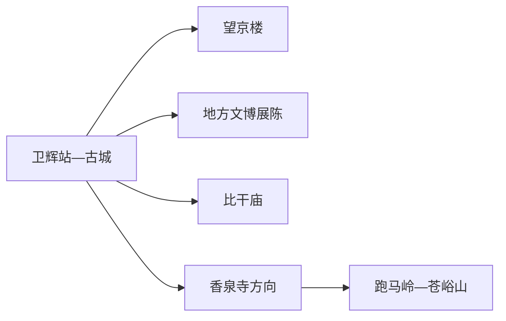
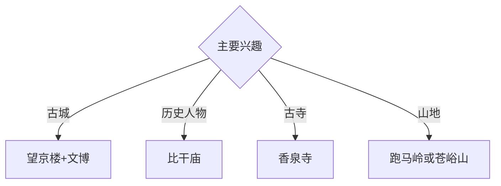

# 卫辉旅行指南

卫辉位于新乡北部，古卫州城、比干文化、望京楼和西北部太行山前景观构成城市主线。固定快照中的 **Weihui / GeoNames 1805031** 对应现行卫辉市；主城古迹、比干庙和山地方向宜按距离分组，八里沟与万仙山等深山核心景区归属辉县市。

## 城市速览

| 项目 | 信息 |
|---|---|
| 主线 | 卫辉古城—望京楼—比干庙—太行山前 |
| 停留 | 主城与比干庙1天；山地方向另加1天 |
| 住宿 | 卫辉主城便于铁路和古城步行；山地住宿按早入山选择 |
| 交通 | 铁路、公路抵达，远端宜城乡班车、约车或自驾 |
| 风险 | 古建保护、山洪林火、河道水情、采石与乡村生产边界 |

## 城市格局与游览区域

主城适合串联望京楼、古城公共街巷与地方展陈；比干庙位于城北方向，可与主城组合。香泉寺、跑马岭和苍峪山位于太行山前，适合单独安排；卫河河道、山林和采石生产区依正式开放边界进入。

## 主要景点

| 景点 | 区域 | 类型 | 核心体验 | 用时 | 环境 | 体力 | 研究价值 | 拥挤 | 优先级 |
|---|---|---|---|---:|---|---|---|---|---|
| 比干庙景区 | 城北方向 | 古建与名人纪念 | 比干文化、古柏与历代祭祀记忆 | 2–3小时 | 混合 | 低 | 很高 | 节假日中高 | A |
| 望京楼公开区 | 古城 | 古建筑 | 明代楼阁、卫州城格局与城市地标 | 1–2小时 | 混合 | 低中 | 很高 | 周末中 | A |
| 卫辉市博物馆或地方展陈 | 主城 | 博物馆 | 卫州历史、古城与地方文物 | 2小时 | 室内 | 低 | 高 | 团体时中 | A |
| 香泉寺公开区 | 西北山前 | 古寺与山地 | 石刻、古寺环境与太行山前地貌 | 半天 | 混合 | 中 | 高 | 节假日中 | B |
| 跑马岭正规游览区 | 西北山地 | 山地景区 | 山林、登高与太行山前视野 | 半天至1天 | 室外 | 高 | 高 | 旺季中 | B |
| 苍峪山正规游览区 | 山地方向 | 山地景区 | 峡谷、森林与乡村山景 | 半天至1天 | 室外 | 高 | 高 | 旺季中 | B |
| 卫河城市公开段 | 主城 | 河流与城市空间 | 河道治理、古城水系与居民生活 | 1–2小时 | 室外 | 低 | 中 | 傍晚中 | B |

## 美食与餐饮

卫辉杜记牛肉、烩菜、烧饼和豫北家常面食具有地方辨识度。古城与比干庙周边适合安排正餐，山地日准备饮水和简餐；乡村餐饮选择明码标价、证照和接待边界清晰的经营点。

## 经典行程

### 一日古城基础线
**路线**：地方展陈—午餐—望京楼公开区—古城公共街巷—卫河短线。**逻辑**：从文物进入卫州城空间。**预约锚点**：展馆与古建开放。**休息**：主城。**删除条件**：高温或河道管控时缩短卫河段。

### 比干文化线
**路线**：主城—比干庙—古柏与碑刻公开区—返城。**逻辑**：用建筑、碑刻和古树理解人物纪念传统。**预约锚点**：景区开放、讲解和车辆。**休息**：游客服务区。**删除条件**：祭典客流高时缩短停留。

### 望京楼古建线
**路线**：望京楼—古城公共空间—地方展陈—午餐—卫河。**逻辑**：围绕城市地标补足城池、水系与地方史。**预约锚点**：登临或内部开放。**休息**：古城商业区。**删除条件**：古建维护时改为外围观察和博物馆。

### 香泉寺山前线
**路线**：主城—香泉寺公开入口—古寺与石刻—山前观景—返城。**逻辑**：把宗教建筑放回太行山前环境。**预约锚点**：开放、道路和返程。**休息**：正规服务点。**删除条件**：雷雨、落石、林火或维护时取消山地延伸。

### 太行山地线
**路线**：主城—跑马岭或苍峪山正式入口—开放步道—返城。**逻辑**：一天只选择一处山地，控制车程和体力。**预约锚点**：运营、天气和车辆。**休息**：游客中心。**删除条件**：山洪、结冰、大风或林火预警时取消。

### 亲子低体力线
**路线**：地方展陈—午休—比干庙近入口线—主城公园。**逻辑**：室内地方史配可控古建观察。**预约锚点**：亲子讲解。**休息**：馆内与景区服务区。**删除条件**：儿童体力不足时只留主城。

### 雨天线
**路线**：地方展陈—午餐—正规文化馆—古城室内活动。**逻辑**：减少山路和河道暴露，保留城市史主题。**预约锚点**：馆舍开放。**休息**：主城。**删除条件**：强降雨影响道路时就近返宿。

## 住宿区域

卫辉站—主城适合铁路抵离、古城与比干庙路线；山前正规住宿适合早入景区。订房时核对合法经营、消防、夜间交通和恶劣天气响应能力。

## 市内交通

卫辉站与公路客运承担外部连接，主城用公交、出租车和网约车。比干庙、香泉寺、跑马岭与苍峪山提前确认城乡班次、景区接驳和返程；前往辉县景区按跨县行程另算时间。

## 不同旅行者须知

古建兴趣者优先望京楼与比干庙；山地旅行者选择一处完整游览；亲子家庭以地方展陈和比干庙短线为主；行动不便者确认古建台阶、景区接驳和卫生间。

## 行前核对

- 核对地方展陈、望京楼、比干庙、香泉寺和山地景区开放。
- 核对铁路、公路班次、天气、山洪林火、河道水情和返程。
- 古建修缮区、卫河工程区、森林防火区、采石区和农田按正式开放与生产边界进入。

## 来源与更新记录

| 来源 | 支持内容 | 核验日期 |
|---|---|---|
| [新乡市人社局：比干庙古侧柏与辉县白云寺古树](https://hrss.xinxiang.gov.cn/content/article/1237195) | 比干庙古柏和古建环境 | 2026-09-01 |
| [新乡市林业局：森林城市建设规划](https://lyj.xinxiang.gov.cn/zwgk/public/6638714/9515412.html) | 卫辉太行山前森林与生态空间 | 2026-09-01 |
| [GeoNames 1805031](https://www.geonames.org/1805031/) | Weihui 固定人口点与位置 | 2026-09-01 |

| 日期 | 更新 |
|---|---|
| 2026-09-01 | 首次完成卫辉旅行研究；建立古城、比干文化、古寺与山地路线。 |

