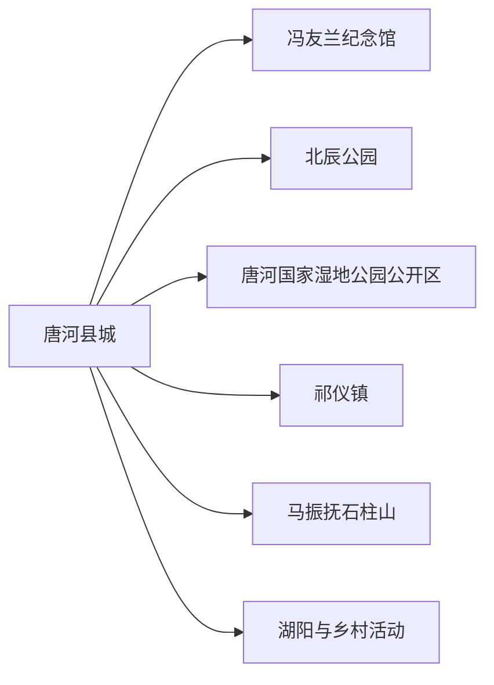
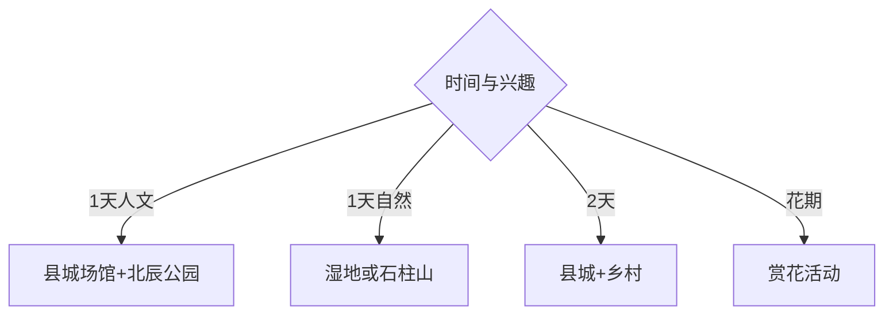

# 唐河旅行指南

唐河适合以县城公共文化、冯友兰故里、唐河湿地与石柱山乡野构成1—2天短途旅行。它不是高密度景点城市，行程质量取决于是否提前确认场馆和乡村点位开放；先选人文或自然主线，再增加赏花、露营等季节活动。

## 城市速览

| 项目 | 信息 |
|---|---|
| 主线 | 县城—冯友兰纪念馆—北辰公园—唐河湿地—祁仪—马振抚石柱山 |
| 停留 | 县城半日至1天；增加乡村自然线共2天 |
| 住宿 | 县城适合交通餐饮；乡村住宿适合单一活动并需预订 |
| 交通 | 从南阳等方向铁路或公路进入，远端乡镇用班车、合规包车或自驾 |
| 风险 | 河道水情、夏季高温雷雨、乡道夜行、露营消防与季节活动变动 |
| 边界 | 湿地保育区、河道行洪区、农业生产区、文物点和露营场地按开放范围进入 |

## 城市格局与游览区域

固定 **Tanghe / GeoNames 1793419** 对应南阳市唐河县，本页以实体 `Q1199064` 确定县域。县城可完成公共文化与滨河空间，祁仪、马振抚、湖阳等远端点位需要公路交通；乡村活动的开放频率低于成熟景区，出发前联系运营方更实用。

## 主要景点

| 景点 | 区域 | 类型 | 核心体验 | 用时 | 环境 | 体力 | 研究价值 | 拥挤 | 优先级 |
|---|---|---|---|---:|---|---|---|---|---|
| 冯友兰纪念馆 | 县城或祁仪相关场馆 | 人物纪念 | 哲学家生平、学术与地方文脉 | 1.5–3小时 | 室内 | 低 | 很高 | 低 | A |
| 唐河县博物馆或县级展陈 | 县城 | 地方文博 | 县史、考古与区域文化 | 1.5–3小时 | 室内 | 低 | 很高 | 低 | A |
| 北辰公园 | 县城 | 城市公园 | 滨水、公共活动与城市休闲 | 2–4小时 | 室外 | 低中 | 中 | 周末高 | B |
| 唐河国家湿地公园公开区 | 县域河流 | 湿地生态 | 河流、鸟类与生态修复 | 半日 | 室外 | 中 | 高 | 季节高 | A |
| 石柱山省级森林公园开放区域 | 马振抚镇 | 山林景观 | 山体、森林与乡野步行 | 半日至1天 | 室外 | 中高 | 高 | 节假日中 | B |
| 前庄正规露营地 | 马振抚镇 | 户外休闲 | 乡野露营与夜间活动 | 半日至1天 | 室外 | 中 | 中 | 节假日高 | C |
| 张心一相关红色展陈 | 毕店方向 | 红色文化 | 地方革命史与人物线索 | 1.5–3小时 | 室内 | 低 | 高 | 低 | B |
| 赏花活动公开点 | 县域乡村 | 季节农旅 | 油菜、芍药、桃花或银杏 | 半日 | 室外 | 低中 | 中 | 花季高 | C |

## 美食与餐饮

县城可选唐河凉粉、胡辣汤、烩面、烧鸡和南阳家常菜，乡镇适合按当日供应选择面食与农家菜。点凉粉和胡辣汤时说明辣度，团体菜先确认份量；赏花或露营日自备饮水，农产品从正规经营点购买。

## 经典行程

### 两日基础线
**路线**：县城文博—冯友兰纪念主题—北辰公园—次日湿地或石柱山。**逻辑**：先人文，再选一条自然方向。**预约锚点**：场馆、车辆与乡村开放。**休息**：县城。**删除条件**：天气不稳时保留室内场馆。

### 县城文化线
**路线**：县级展陈—冯友兰纪念馆—图书馆或诸葛书屋—北辰公园。**逻辑**：用公共文化空间理解地方。**预约锚点**：开馆与讲解。**休息**：县城商业区。**删除条件**：场馆闭馆时改滨河公共空间。

### 湿地观察线
**路线**：正式入口—科普展陈—公开步道—观鸟点。**逻辑**：沿河流生态而非追逐打卡点。**预约锚点**：开放、水情与观鸟季。**休息**：游客服务点。**删除条件**：汛情、大风或保育管控时取消。

### 石柱山乡野线
**路线**：马振抚镇—森林公园开放段—乡村用餐—返城。**逻辑**：完整留给山林与乡村。**预约锚点**：道路、开放、向导与返程。**休息**：镇区。**删除条件**：雷雨、火险或道路管控时改县城。

### 红色研学线
**路线**：县级展陈—毕店张心一相关开放点—乡村公共空间。**逻辑**：先在展馆建立史实，再到现场。**预约锚点**：接待、讲解与团体要求。**休息**：毕店镇。**删除条件**：纪念点未开放时只留县城展陈。

### 节令赏花线
**路线**：官方公布花点—村镇餐饮—县城返程。**逻辑**：按实时花情选择油菜、芍药、桃花或银杏之一。**预约锚点**：花情、停车与活动日期。**休息**：乡镇。**删除条件**：花期偏差或雨天泥泞时改公园。

### 低体力线
**路线**：县级展陈—冯友兰纪念主题场馆—车辆游北辰公园。**逻辑**：集中县城并用平路替代远线。**预约锚点**：无障碍与落客点。**休息**：场馆。**删除条件**：高温时只留室内。

## 住宿区域

县城适合铁路、公路、餐饮和医疗补给，是大多数旅行者的首选。祁仪、马振抚或湖阳方向的乡村住宿适合特定活动，需核对营业、热水、空调或供暖、消防、餐饮、信号和夜间返程。

## 市内交通

唐河站与县城公路客运承担主要进入交通，从南阳衔接更灵活。县城到各乡镇时间较长，班车按当日客运信息核对；包车明确合法运营、等待、乡道和返程费用。夜间乡道照明有限，日落前完成自然线路。

## 不同旅行者须知

人文兴趣者优先冯友兰与县级展陈；生态兴趣者选湿地公开区；亲子家庭选公园、展馆和季节花田；长者集中县城；露营者选择有管理、消防与卫生设施的正规场地。河道行洪区、湿地核心、林区封控段、农业作业区和未开放文物建筑保留明确限制。

## 行前核对

- 核对冯友兰纪念馆、县级场馆、湿地、石柱山、红色点位和花季活动的开放。
- 核对铁路与班车、乡道、暴雨水情、高温、防火、露营运营与返程车辆。
- 湿地按公开步道观察，露营使用正规场地，乡村拍摄和进入院落先征得同意。

## 来源与更新记录

| 来源 | 支持内容 | 核验日期 |
|---|---|---|
| [唐河县2026年政府工作报告](https://www.tanghe.gov.cn/2026/05-26/1407655.html) | 北辰公园、花季活动、露营与公共文化空间 | 2026-09-01 |
| [唐河县2025年政府工作报告](https://www.tanghe.gov.cn/2025/03-06/1193483.html) | 冯友兰、张心一、石柱山、湿地与乡村旅游 | 2026-09-01 |
| [GeoNames 1793419](https://www.geonames.org/1793419/) | Tanghe 固定人口点及坐标 | 2026-09-01 |
| [Wikidata Q1199064](https://www.wikidata.org/wiki/Q1199064) | 唐河县实体与跨库标识 | 2026-09-01 |

| 日期 | 更新 |
|---|---|
| 2026-09-01 | 首次完成唐河旅行研究，按县城文化、湿地、山林和季节乡村组织。 |
