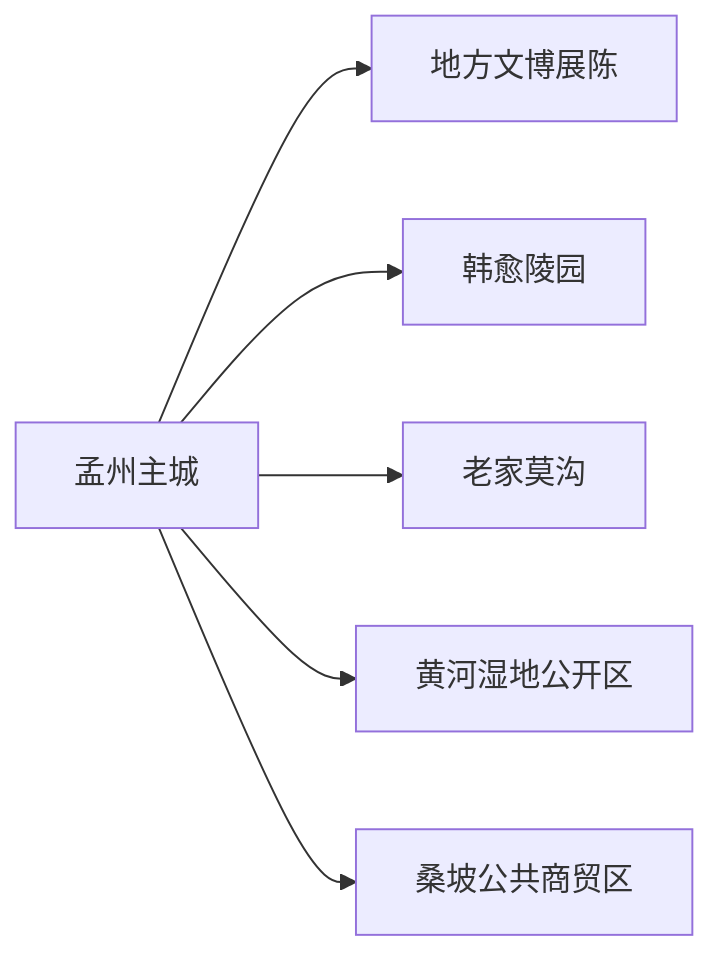
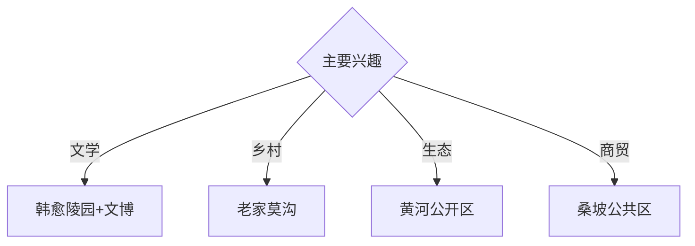

# 孟州旅行指南

孟州位于黄河北岸，韩愈文化、莫沟窑洞村落、黄河湿地和桑坡商贸社区构成历史、乡村与当代产业观察线。固定快照中的 **Mengzhou / GeoNames 1800684** 对应现行孟州市；主城、韩愈陵园、莫沟和沿黄方向适合按片区组合。

## 城市速览

| 项目 | 信息 |
|---|---|
| 主线 | 孟州文博—韩愈陵园—老家莫沟—沿黄生态 |
| 停留 | 主城与韩愈文化1天；乡村或沿黄另加1天 |
| 住宿 | 孟州主城便于公路换乘；莫沟正规住宿适合乡村慢游 |
| 交通 | 公路抵达为主，远端村落与黄河方向宜约车或自驾 |
| 风险 | 黄河水情、湿地保护、窑洞边坡、皮毛商贸生产与农田边界 |

## 城市格局与游览区域

主城集中住宿、餐饮和公共文化服务；韩愈陵园位于城郊，适合与文博组合。莫沟是独立乡村景区，沿黄湿地按保护与防汛开放安排；桑坡的公共商贸空间与皮毛加工、仓储生产空间分别管理。

## 主要景点

| 景点 | 区域 | 类型 | 核心体验 | 用时 | 环境 | 体力 | 研究价值 | 拥挤 | 优先级 |
|---|---|---|---|---:|---|---|---|---|---|
| 韩愈陵园公开区 | 城郊 | 名人纪念 | 韩愈生平、唐代文学与家族纪念 | 2–3小时 | 混合 | 低中 | 很高 | 节假日中 | A |
| 孟州市博物馆或地方展陈 | 主城 | 博物馆 | 河阳历史、黄河文化与地方文物 | 2小时 | 室内 | 低 | 高 | 团体时中 | A |
| 老家莫沟景区 | 西部乡村 | 窑洞村落 | 黄土窑洞、乡村公共空间与民俗 | 半天至1天 | 混合 | 中 | 高 | 节假日高 | A |
| 黄河湿地正式开放区 | 南部沿黄 | 湿地与河流 | 黄河地貌、候鸟与生态保护 | 半天 | 室外 | 低中 | 高 | 观鸟季中 | A |
| 源沟等正规乡村接待点 | 市域乡村 | 乡村旅游 | 田园、村落更新与地方生活 | 半天 | 混合 | 低 | 中 | 周末中 | B |
| 桑坡公共商贸体验区 | 桑坡方向 | 商贸与产业 | 电商、皮毛产品与村镇商业观察 | 2–3小时 | 混合 | 低 | 中 | 旺季高 | B |
| 城区河湖与公园公开段 | 主城 | 城市公园 | 城市日常、慢行与休憩 | 1–2小时 | 室外 | 低 | 中 | 傍晚中 | B |

## 美食与餐饮

孟州炒面、混浆绿豆凉粉、烧饼和豫北家常菜具有地方辨识度。莫沟与乡村点位在正规接待区用餐；桑坡购物关注材质、标签、价格与售后，餐饮与生产仓储路线分开。

## 经典行程

### 一日城市基础线
**路线**：地方展陈—午餐—韩愈陵园—主城公园。**逻辑**：从地方史进入韩愈文化与现代城市。**预约锚点**：展馆和陵园开放。**休息**：主城。**删除条件**：高温时缩短公园段。

### 韩愈文学线
**路线**：地方展陈—韩愈陵园—专题讲解—正规纪念空间。**逻辑**：用文献、墓园和地域背景理解韩愈。**预约锚点**：讲解与开放。**休息**：主城或陵园服务点。**删除条件**：纪念区维护时增加馆内内容。

### 莫沟乡村线
**路线**：主城—老家莫沟入口—窑洞公共区—午餐—村内公开体验—返城。**逻辑**：用半天至一天观察黄土村落更新。**预约锚点**：接待、活动和车辆。**休息**：景区服务区。**删除条件**：边坡维护或强降雨时缩短窑洞步行。

### 沿黄生态线
**路线**：主城—黄河湿地正式入口—观景或观鸟点—返城。**逻辑**：在保护边界内观察黄河生态。**预约锚点**：开放区、水情和车辆。**休息**：正规服务点。**删除条件**：洪水、大风、大雾或保护管控时取消。

### 桑坡商贸线
**路线**：主城—桑坡公共商贸区—产品展示—午餐—返城。**逻辑**：从公共商业空间理解特色产业。**预约锚点**：营业、车辆和正规展示接待。**休息**：商业服务区。**删除条件**：市场休市时改主城文博。

### 亲子低体力线
**路线**：地方展陈—午休—莫沟近入口公共区或城市公园。**逻辑**：室内地方史配可控乡村观察。**预约锚点**：亲子活动。**休息**：馆内和服务区。**删除条件**：儿童体力不足时只留主城。

### 雨天线
**路线**：地方展陈—午餐—正规文化馆—桑坡公共室内展示。**逻辑**：避开湿地和边坡，保留历史与产业主题。**预约锚点**：馆舍和商贸空间开放。**休息**：主城。**删除条件**：道路积水时就近返宿。

## 住宿区域

孟州主城适合公路抵离、餐饮和多方向换乘；莫沟正规住宿适合乡村慢游。乡村住宿按合法经营、消防、边坡安全、夜间道路和天气响应能力选择。

## 市内交通

孟州以公路交通为主，可从焦作、洛阳等方向衔接。主城用公交、出租车和网约车；韩愈陵园、莫沟、桑坡与沿黄点位提前确认城乡班次或预约返程。

## 不同旅行者须知

文学兴趣者优先韩愈陵园；乡村旅行者给莫沟半天以上；观鸟者按季节和湿地开放安排；购物者选择公共商贸区并保留票据，行动不便者确认窑洞坡道和卫生间。

## 行前核对

- 核对地方展陈、韩愈陵园、莫沟、沿黄开放区和桑坡商贸空间。
- 核对公路交通、黄河水情、湿地开放、乡村接待和返程。
- 黄河堤防与行洪滩区、湿地核心保护区、窑洞边坡维护区、皮毛加工仓储区和农田按正式开放与生产边界进入。

## 来源与更新记录

| 来源 | 支持内容 | 核验日期 |
|---|---|---|
| [孟州市“十四五”规划](https://www.mengzhou.gov.cn/2022/11-07/506343.html) | 韩愈文化、莫沟、源沟、黄河湿地与桑坡商贸 | 2026-09-01 |
| [焦作市文旅局：孟州景区与交通联动](https://wglj.jiaozuo.gov.cn/2026/01-01/590868.html) | 韩愈陵园、美丽源沟与孟州景区信息 | 2026-09-01 |
| [GeoNames 1800684](https://www.geonames.org/1800684/) | Mengzhou 固定人口点与位置 | 2026-09-01 |

| 日期 | 更新 |
|---|---|
| 2026-09-01 | 首次完成孟州旅行研究；建立韩愈文化、乡村、沿黄与商贸路线。 |
