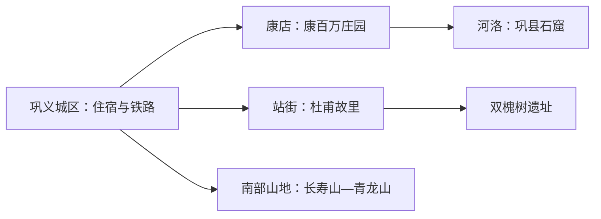
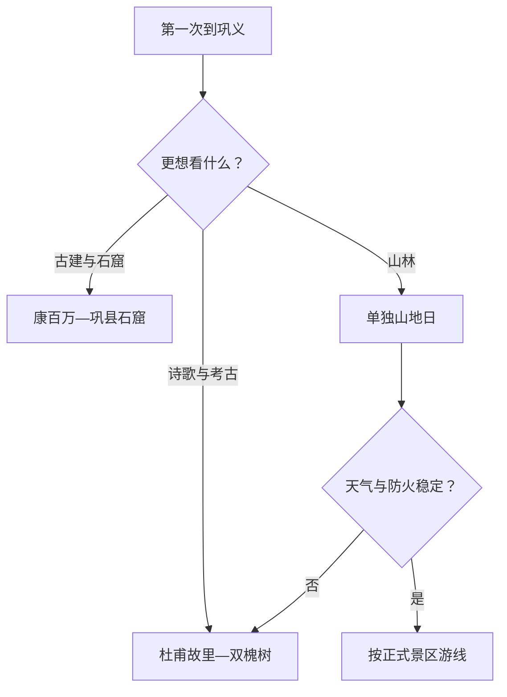

# 巩义旅行指南

巩义位于郑州与洛阳之间，黄河文明、北魏石窟、北宋皇陵、杜甫故里和豫商庄园构成最清晰的旅行线索。景点分散在城区、康店—河洛、站街和南部山地，适合以巩义城区住宿、每天选择一个方向。

## 城市速览

| 项目 | 信息 |
|---|---|
| 旅行主线 | 康百万庄园、巩县石窟、杜甫故里、北宋皇陵与双槐树遗址 |
| 建议停留 | 1 天选人文西线；2 天加入诗圣—考古线；山地另加 1 天 |
| 住宿基地 | 巩义城区便于铁路、餐饮和分方向出发 |
| 步行强度 | 文博中等；古建有门槛台阶；山地中至高 |
| 主要天气 | 暑热、暴雨、黄河水情、山洪地质风险和冬季冰雪 |
| 预约核心 | 景区开放、场馆讲解、县域车辆与返程 |
| 边界重点 | 石窟、陵区、考古工地、河滩和生产道路按开放游线进入 |
| 无障碍 | 古建与石窟连续性有限，先问落客、坡道、卫生间和轮椅 |

## 城市格局与游览区域

巩义是郑州市代管的县级市，法定代码 `410181`；GeoNames `1789897` 与 Wikidata `Q1359997` 对应城市实体。主城提供住宿和交通，康店—河洛方向集中庄园、石窟和黄河文化，站街方向连接杜甫故里与双槐树，南部山地适合单独安排。

| 区域 | 旅行价值 | 怎么安排 |
|---|---|---|
| 巩义城区 | 到达、住宿、宋陵展示点与市级服务 | 首访基地 |
| 康店—河洛 | 康百万庄园、巩县石窟与黄河沿线文化 | 留完整一日并锁定车辆 |
| 站街—河洛遗址带 | 杜甫故里、双槐树及当期开放考古展示 | 半日至一日 |
| 南部山地 | 竹林长寿山、青龙山等正式景区 | 天气稳定时独立一天 |

## 主要景点

| 景点 | 所在区域 | 类型 | 核心看点 | 建议用时 | 室内/室外 | 体力 | 预约难度 | 天气敏感度 | 适合旅程 |
|---|---|---|---|---|---|---|---|---|---|
| 康百万庄园 | 康店镇 | 古建筑与商业史 | 明清庄园空间、豫商经营与“留余”家训 | 2–4 小时 | 混合 | 中 | 中 | 中 | A |
| 巩县石窟 | 河洛镇 | 石窟与文物 | 北魏造像、礼佛图与石刻艺术 | 2–3 小时 | 混合 | 中 | 中高 | 中 | A |
| 杜甫故里 | 站街镇 | 文学与纪念地 | 杜甫生平、诗歌展陈与诞生窑 | 2–3 小时 | 混合 | 低至中 | 中 | 中 | A |
| 北宋皇陵开放展示点 | 城区及周边 | 陵寝与历史 | 陵区格局、石刻和宋代制度 | 1–3 小时 | 室外为主 | 中 | 高 | 高 | B |
| 双槐树遗址当期开放区 | 河洛镇方向 | 考古遗址 | 仰韶文化大型聚落与文明起源线索 | 2–3 小时 | 混合 | 中 | 高 | 高 | B |
| 竹林长寿山 | 竹林镇方向 | 山地与休闲 | 山林步道、季节景观与乡村休闲 | 5–8 小时 | 室外 | 中至高 | 中高 | 极高 | B |

石窟寺、宋陵和考古遗址都以文物部门公开入口为准；分散石刻与陵冢不按坐标自行寻找。黄河滩区、水利工程和矿业生产道路保留其管理用途。

## 美食与餐饮

| 类型 | 适合场景 | 份量 | 过敏与饮食提示 | 怎么选 |
|---|---|---|---|---|
| 烩面与羊肉汤 | 城区早餐或正餐 | 一人份为主 | 麸质、羊肉、香菜与辣油 | 先选清汤或小份，再自行加调味 |
| 水席类热菜 | 多人晚餐 | 多为共享 | 肉类、蛋、淀粉和胡椒 | 两人先问半份与菜量 |
| 胡辣汤与油饼 | 早餐 | 一人份 | 麸质、花生、芝麻与胡椒 | 选现制店并问辣度 |
| 山地农家菜 | 南部景区日 | 适合共享 | 野菜来源、菌类、肉类和共锅 | 选证照清楚、明码标价的经营点 |

## 经典行程

### 一日河洛人文路线

**路线**：康百万庄园 → 午餐 → 巩县石窟 → 城区返程

- **串联逻辑**：两处都在北部黄河方向，减少折返。
- **预约锚点**：两景区开放、讲解与往返车辆。
- **休息安排**：康店或城区完成午餐长休。
- **时间不足时**：按兴趣保留庄园或石窟一处。

### 两日文明与诗歌路线

**第 1 天**：康百万庄园—巩县石窟 
**第 2 天**：杜甫故里—双槐树遗址当期开放区

- **串联逻辑**：商业、佛教艺术、文学与史前文明分日理解。
- **预约锚点**：石窟、遗址开放及县域交通。
- **休息安排**：每天只走一条方向线。
- **时间不足时**：第二天保留杜甫故里。

### 宋陵与城区路线

**路线**：巩义博物馆或城区展陈 → 午餐 → 宋陵正式开放展示点

- **适用条件**：陵区公开入口和游线已经确认。
- **预约锚点**：场馆闭馆日、陵区开放范围与讲解。
- **休息安排**：正午在城区室内休息。
- **时间不足时**：只看一处有管理的展示点。

### 雨天路线

**路线**：杜甫故里室内展线 → 午餐 → 康百万庄园核心室内空间

- **适用条件**：普通降雨且道路开放；暴雨预警时留在城区。
- **预约锚点**：景区开放和跨镇车辆。
- **休息安排**：每处之间安排完整用餐。
- **时间不足时**：选择一处室内内容更完整的景区。

### 亲子路线

**路线**：杜甫故里 → 午休 → 双槐树遗址公开展陈

- **串联逻辑**：诗歌与考古各提供一个清晰学习主题。
- **预约锚点**：儿童讲解、展陈开放与卫生间。
- **休息安排**：户外段避开正午。
- **时间不足时**：保留杜甫故里。

### 低体力路线

**路线**：车辆到达康百万庄园 → 午餐长休 → 城区平缓公共空间

- **适用条件**：已确认落客点和古建台阶情况。
- **预约锚点**：轮椅、坡道、卫生间与返程。
- **休息安排**：只走庄园核心院落。
- **时间不足时**：删除城区补充段。

### 山地延伸路线

**路线**：城区早出发 → 竹林长寿山或青龙山一处正式景区 → 原路返回

- **适用条件**：天气、道路、防火和最晚离园稳定。
- **预约锚点**：准确入口、景交与返程。
- **休息安排**：使用游客服务点补给。
- **时间不足时**：整段删除，改走城区人文线。

## 住宿区域

| 区域 | 优点 | 取舍 | 适合人群 | 核对项 |
|---|---|---|---|---|
| 巩义城区 | 铁路、餐饮和叫车最方便 | 每条远线仍需车辆 | 首访、公共交通旅行 | 车站接驳、隔音、早餐和夜间入住 |
| 康店—河洛方向正规住宿 | 接近庄园和石窟 | 选择较少、返城需预排 | 自驾、摄影 | 合法经营、停车、供餐和退改 |
| 南部山地正规住宿 | 接近单一景区 | 天气与道路敏感 | 慢游、山地旅行 | 防火、供暖、通信和最晚到店 |

## 市内交通

| 场景 | 怎么做 | 行前核对 |
|---|---|---|
| 铁路到达 | 按票面选择巩义站或巩义南站，再转城区住宿 | 车次、站前接驳与夜间交通 |
| 跨镇景点 | 使用公交、出租或正规包车，每日同方向串联 | 班次、候车点、等候和返程 |
| 山地与遗址 | 自驾或正规车辆抵达公开入口 | 路况、停车、防火、预警与最晚离园 |
| 郑州或洛阳联游 | 把巩义作为独立住宿日或完整往返日 | 到发站、行李、末班与跨城耗时 |

## 不同旅行者须知

| 旅行者 | 推荐做法 | 重点核对 |
|---|---|---|
| 独行 | 住城区并提前锁定返程 | 偏远景点叫车、夜间交通和司机资质 |
| 亲子 | 选杜甫故里加一处考古展陈 | 儿童讲解、防晒、饮水和卫生间 |
| 长者与低体力 | 一天一处核心景点，车辆门到门 | 台阶、坡道、轮椅与座椅 |
| 摄影 | 石窟、古建和陵区分开安排 | 摄影规则、三脚架、日落返程与无人机 |
| 自驾 | 每日同一方向，白天完成山路 | 停车、雨雾、落石与疲劳驾驶 |

## 行前核对

- 巩义市政府文旅入口：景区开放、活动、讲解与旅游交通。
- 景区和文物部门：石窟、陵区、考古遗址的开放边界与拍摄规则。
- 河南气象、水利、林业和应急信息：高温、暴雨、黄河水情与山地风险。
- 中国铁路 12306：车次、完整站名与退改。

## 来源与更新记录

| 来源 | 支持内容 | 核验日期 |
|---|---|---|
| [巩义市人民政府：巩义旅游](https://www.gongyishi.gov.cn/jqjdtj/index.jhtml) | 康百万庄园、杜甫故里、巩县石窟与主要景区 | 2026-09-01 |
| [巩义市人民政府：巩义概况](https://www.gongyishi.gov.cn/gygk.jhtml) | 行政格局、历史文化与景区体系 | 2026-09-01 |
| [巩义文旅线路信息](https://www.gongyishi.gov.cn/gzdt/9647228.jhtml) | 人文景点串联关系与当期文旅方向 | 2026-09-01 |
| [Wikidata Q1359997](https://www.wikidata.org/wiki/Q1359997) | 巩义市实体对齐 | 2026-09-01 |
| [GeoNames 1789897](https://www.geonames.org/1789897/) | 固定巩义城市点 | 2026-09-01 |
| [河南省气象局](http://ha.cma.gov.cn/) | 气象预警 | 2026-09-01 |

| 日期 | 更新 |
|---|---|
| 2026-09-01 | 首次完成河洛人文、诗歌考古与山地方向研究，并明确文物、河滩和生产区域边界。 |
