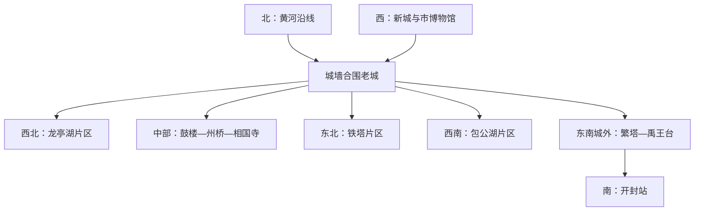

# 开封旅行指南

开封最值得看的，不只是北宋题材的园林和演出，而是一座古都怎样在黄河洪水、城市重建和考古发掘之间保存记忆：城墙、铁塔、繁塔仍立在地面，州桥与汴河遗址则把“城摞城”直接呈现在地下。古城内多数历史片区可以分段步行，但开封市博物馆在西部新城，黄河、朱仙镇和兰考更需要独立往返。初访可用 2 天完成古城与博物馆，增加大型主题园或县域方向时宜安排 3—4 天。

> 建议停留：2—3 天；增加主题园或远郊时 3—4 天 
> 旅行关键词：北宋都城、城摞城、古塔、城墙、汴河考古、夜市 
> 主要体力：中等步行；城墙、古塔台阶和大型主题园可升至较高 
> 最近研究：2026-07-30

## 城市速览

| 项目 | 旅行信息 |
|---|---|
| 主要旅行价值 | 以开封市博物馆建立城市历史时间轴，在城墙、铁塔、繁塔和传统街区观察地面遗存，再由州桥及汴河遗址理解北宋东京城、大运河与“城摞城”；宋文化主题园适合看当代演绎，但不替代真实文物与考古遗址 |
| 行政与研究边界 | 开封市法定行政区划代码为 `410200`，辖龙亭、顺河回族、鼓楼、禹王台、祥符五区和杞县、通许县、尉氏县、兰考县四县；本页以中心城区为主体，只把朱仙镇、兰考和黄河方向作为独立出行示例，不表示四县已经分别完成研究 |
| 建议停留 | 1 天只能选择古城中轴或一座大型主题园；2 天可加入市博物馆和两组古城片区；3 天可完整安排主题园或朱仙镇；兰考、黄河沿线及其他县域方向各自另留半天至一天 |
| 较舒适季节 | 春秋通常更适合长时间步行；春季可能有大风和扬尘，盛夏炎热且强降雨集中，冬季寒冷干燥。秋季菊花活动增加城市辨识度，也会显著推高客流和住宿压力 |
| 预算特点 | 古城公共街区和部分公共文化空间有利于控制支出；大型主题园、分散景区门票、演出、游船、讲解和跨县交通是主要增量。不要把一日内多个收费园区都列为必选 |
| 步行强度 | 古城地势总体平坦，但景点入口并不都在同一条步行线上；城墙、龙亭台基、古塔周边和大型园区包含台阶或长距离。夏季无遮阴路段会放大体力消耗 |
| 预约特点 | 开封市博物馆、州桥考古展示、热门主题园与演出均应查看官方入口；各景区的门票、演出和夜游可能分别管理，不能凭一张联票名称推断全部内容 |
| 主要天气风险 | 盛夏高温、短时强降雨、雷电和城市积水；春季大风与扬尘；冬季低温、道路结冰和大雾。黄河沿线还须服从防汛、河道管理和临时封闭 |
| 独行旅行 | 灌汤包、汤类、炒凉粉等容易按一人份点单；鲤鱼焙面、套四宝等宴席菜份量大。夜间从夜市返回和远郊末段交通应提前确认 |
| 亲子旅行 | 市博物馆、城墙短段和主题园可按年龄组合；考古遗址、古塔台阶、密集演出和夜间大客流需要持续看护，一天不宜叠加两个大型园区 |
| 长者与低体力旅行 | 采用“一个室内主项目＋一个短距离街区”的半日结构；龙亭、城墙、铁塔和繁塔不要默认可避开全部台阶，古城内优先乘车跨片区 |
| 无障碍信息 | 现有公开资料不足以证明车站、街道、景区入口和全部展区之间连续无障碍；轮椅通行、电梯、坡道、无障碍卫生间及陪同规则均**需向官方确认** |

## 城市格局与游览区域

开封中心城区的旅行骨架是“城墙合围的老城＋西部新城”。老城内，龙亭湖与大型宋文化园集中在西北，鼓楼—书店街—州桥—大相国寺构成中部生活与历史轴，铁塔在东北，包公湖在西南；繁塔和禹王台位于东南方向，已经偏离多数初访者的连续步行范围。开封市博物馆则在郑开大道沿线的新城，不能按“老城博物馆”安排。

下图只表示相对方向和换乘关系，不代表距离或开放入口。老城内部也应按片区分段，而不是沿城墙或中轴一次走完。

| 区域 | 主要内容 | 游览特点 | 与其他区域的关系 |
|---|---|---|---|
| 龙亭湖片区 | 龙亭景区、清明上河园、天波杨府、中国翰园碑林及湖岸空间 | 多个独立运营园区密集相邻，但票务、演出和入口并不相通；选一至两项即可 | 向南可接宋都御街、书店街和鼓楼；向东北去铁塔仍宜短途乘车 |
| 鼓楼—书店街 | 鼓楼地标、书店街、夜市和传统商业街巷 | 适合午餐、傍晚与短距离步行；节假日和夜间人流密集 | 北接龙亭中轴，南接州桥和大相国寺，可作为老城转场与休息区 |
| 州桥—大相国寺 | 州桥及汴河遗址、大相国寺、御街中轴南段 | 考古遗址与宗教建筑主题清晰；州桥开放边界受保护展示工程影响 | 可与鼓楼连续安排；去包公湖、城墙或铁塔不宜全部靠步行 |
| 包公湖片区 | 包公祠、开封府、延庆观及湖岸 | 包公文化展示、道教建筑和水岸空间并存；部分景区含较多复原展示 | 位于老城西南，可与大梁门城墙或州桥组合，不与龙亭湖误作同一水域 |
| 城墙环线 | 大梁门、大南门等开放段及环城公园 | 城墙是一个线性文物项目；只选一段登城和一段城下公园，不把城门重复计数 | 西段便于衔接新城和包公湖，南段靠近开封站，完整环行不适合普通一日游 |
| 铁塔—顺河片区 | 铁塔景区、河南大学明伦校区周边、双龙巷及顺河街巷 | 铁塔是核心文物；校园是否对外开放不能预设，街区适合短段补充 | 在老城东北，与龙亭湖隔着一段城市道路，和繁塔分处城市两端 |
| 繁塔—禹王台 | 繁塔、禹王台公园及东南部历史环境 | 更偏文物和地方历史，客流通常不同于西北大型园区；往返与开放需单查 | 位于东南方向，可与开封站到发日组合；不要与铁塔因“二塔”主题硬拼成步行线 |
| 西部新城 | 开封市博物馆、市民公共文化设施及宋城路站方向 | 室内设施集中、道路尺度较大，适合首日建立城市时间轴 | 到古城西门需再乘车；开封北站更偏西北，不能与宋城路站混淆 |

开封市域还包括广阔的黄河沿线和县域平原。祥符区的朱仙镇在主城西南，木版年画和历史名镇主题适合独立半天至一天；兰考在市域东部，焦裕禄纪念园及黄河治理文化适合铁路往返的一日路线。杞县、通许县和尉氏县均为独立县域目的地，不应因为同属开封市就并入古城景点清单；前往尉氏西南方向时还要核对郑州航空港相关管理边界与实际道路。黄河方向只进入有管理、明确开放的展示或公共空间，堤防、险工、滩区和封闭水源地不能当作自由观景区。

## 主要景点

优先级用于分配时间：**A** 为初访核心，**B** 为按兴趣补充，**C** 为远郊、主题性较强或通常需要独立半天以上的目的地。鼓楼、书店街、车站和湖岸可作为路线节点，不单独计入景点完成率。同一城墙的不同城门、同一园区的内部建筑和同一遗址的多个探方只按一个项目记录。

### 古城、考古与都城轴线

| 景点 | 区域 | 类型 | 主要看点 | 建议用时 | 室内外 | 体力 | 预约风险 | 天气影响 | 优先级 |
|---|---|---|---|---:|---|---|---|---|---|
| 龙亭景区 | 龙亭湖东岸 | 古迹与园林 | 北宋皇城遗址背景、龙亭大殿台基、湖区与城市中轴；景区内部殿台和园林作为一个项目 | 2—3 小时 | 混合 | 中；主殿台阶明显 | 中至高 | 中至高 | A |
| 州桥及汴河遗址 | 中山路—自由路一带 | 考古遗址 | 御街与汴河交会、唐宋至明清地层、桥与河道叠压关系，是理解“城摞城”和大运河的关键窗口 | 1—2 小时 | 室内外混合，以实际展示为准 | 低至中 | 高；开放受保护工程影响 | 中 | A |
| 大相国寺 | 州桥以东南 | 宗教建筑 | 古都寺院传统、殿宇与佛教艺术；现存建筑和宗教活动应与北宋原貌想象分开理解 | 1.5—2.5 小时 | 混合 | 低至中 | 中 | 中 | A |
| 山陕甘会馆 | 书店街西侧 | 会馆与雕刻建筑 | 明清商帮会馆、木石砖雕与开封商业史，尺度紧凑，适合补充北宋之外的城市层次 | 1—1.5 小时 | 混合 | 低至中 | 中 | 中 | B |
| 包公湖历史文化片区 | 老城西南 | 纪念景区与湖区 | 包公祠、开封府及湖岸构成包公文化主题；两处为不同景区，时间有限时择一，不把复原建筑当作北宋原构 | 2—4 小时 | 混合 | 中 | 中 | 中至高 | B |
| 开封城墙 | 老城外围 | 城墙与线性遗产 | 现存明清城墙体系、城门与环城公园；选大梁门、大南门等一个已开放段即可 | 1.5—3 小时 | 户外为主 | 中至高；登城有台阶 | 中 | 高 | A |

### 古塔、街区与历史环境

| 景点 | 区域 | 类型 | 主要看点 | 建议用时 | 室内外 | 体力 | 预约风险 | 天气影响 | 优先级 |
|---|---|---|---|---:|---|---|---|---|---|
| 铁塔景区 | 老城东北 | 古塔与公园 | 北宋琉璃砖塔、塔身造像与铁塔湖周边；塔和公园作为一个景区项目，不把园内节点拆分计数 | 1.5—2.5 小时 | 户外为主 | 中；近塔和局部台阶 | 中 | 高 | A |
| 繁塔景区 | 禹王台区、老城东南 | 古塔与佛教建筑 | 开封现存年代更早的宋代佛塔、塔砖造像与音乐图像；邻近禹王台可顺路短停，但不重复列项 | 1.5—2.5 小时 | 混合 | 中；台阶与旧建筑门槛 | 中 | 中至高 | A |
| 书店街—鼓楼 | 老城中部 | 历史街区与路线节点 | 传统商业街巷、夜间餐饮和从龙亭到州桥的中段休息区 | 1—2 小时 | 户外为主 | 低至中 | 低 | 高 | 路线节点 |
| 双龙巷历史文化街区 | 老城东北 | 历史街区 | 近代民居、街巷尺度和刘青霞相关城市记忆；适合与铁塔组合 | 1—2 小时 | 混合 | 低至中 | 低至中 | 中至高 | B |

### 博物馆、主题园与远郊

| 景点 | 区域 | 类型 | 主要看点 | 建议用时 | 室内外 | 体力 | 预约风险 | 天气影响 | 优先级 |
|---|---|---|---|---:|---|---|---|---|---|
| 开封市博物馆 | 西部新城、郑开大道 | 综合博物馆 | 从先秦大梁、北宋东京到近现代开封的地方史，兼有书画、石刻、朱仙镇木版年画等专题，是建立城市时间轴的最佳起点 | 2.5—4 小时 | 室内 | 低至中 | 高 | 低 | A |
| 清明上河园 | 龙亭湖西岸 | 宋文化主题园 | 以《清明上河图》为线索的当代场景、演出和非遗展示；园区与夜间大型演出按一个主题园项目理解 | 半天至一整天 | 混合 | 中至高 | 高 | 高 | B；表演与主题园兴趣者可升为 A |
| 万岁山武侠城 | 老城西北外缘 | 演艺主题园 | 武侠题材、民俗和高密度演出；价值主要在当代演艺体验，不作为宋代文物遗址 | 半天至一整天 | 混合 | 中至高 | 高 | 高 | B |
| 朱仙镇 | 祥符区、主城西南 | 历史名镇与非遗 | 木版年画、古镇历史、岳飞庙及运河文化；不同场馆和商业园区开放不可互相推断 | 半天至一天，另计往返 | 混合 | 中 | 中 | 中至高 | C |
| 兰考焦裕禄纪念园 | 兰考县 | 纪念地与地方史 | 焦裕禄纪念馆、陵墓和治沙治涝治碱历史；兰考县城及沿黄点位不作为同一园区内部项目 | 2—3 小时，另计铁路与县内交通 | 混合 | 低至中 | 中；团体活动时较高 | 中 | C |
| 开封黄河沿线开放点 | 主城北部及兰考等沿黄区域 | 河流景观与水利文化 | 下游“悬河”、堤防工程、黄河治理与城市兴衰关系；只选官方开放展示点或有管理步道 | 半天至一天 | 户外为主 | 中 | 中至高 | 很高 | C |

铁塔和繁塔分处城市东北与东南，是两处独立古塔；“两塔一日”更适合文物专题旅行，不是最省转场的初访路线。州桥及汴河遗址是持续保护利用的考古项目，若现场未开放，仍可用开封市博物馆的相关展陈和中轴线地理关系理解它，不应翻越围挡或进入施工区。

## 美食与餐饮

开封餐饮适合按“早餐汤食—午间面点—晚间小吃或豫菜合餐”安排。鼓楼、书店街、西司和老河大周边都能找到地方风味，但夜市更适合比较多种小份，不等于每样都必须尝。严重过敏、乳糜泻、纯素或宗教饮食需求者，应直接确认汤底、馅料、共用油锅和操作台；“不辣”“清真”“素食”解决的是不同问题。

| 菜品或餐饮类型 | 常见区域 | 一个人用餐与常见份量 | 风味、过敏原与饮食限制 | 排队风险与替代方法 |
|---|---|---|---|---|
| 灌汤小笼包 | 鼓楼、书店街及全城面点店 | 一笼通常适合一人正餐或两人分享；先问个数，再决定是否加汤菜 | 面皮含小麦，传统肉馅多含猪肉、葱姜和高汤；汤汁很烫，儿童和长者先开口散热 | 热门老字号高峰排队明显；选择现包现蒸、标明馅料和价格的同类店，不必跨城追一家 |
| 鲤鱼焙面 | 豫菜馆、宴席餐厅 | 多为整鱼配细面，通常适合 3—5 人分享，独行者先问小份或改点鱼片类菜 | 含鱼类和细刺，焙面含小麦；糖醋汁可能含大豆、小麦和较多糖油 | 排队或人数不足时改点其他豫菜，不为“必吃”勉强浪费整鱼 |
| 套四宝 | 传统豫菜馆 | 禽肉层层套制，制作和份量都偏宴席，通常适合多人预订分享 | 含多种禽肉和浓汤，酱料可能含小麦、大豆、芝麻及料酒；严格素食和清淡饮食不适合 | 不是常规快餐，先确认是否供应和最小份量；改用两道小份豫菜更适合普通行程 |
| 桶子鸡 | 熟食店、老城餐饮与外带档口 | 可按份或重量购买，适合两人以上分享；独行者先买小份切片 | 咸香、卤制，含鸡肉和多种香料；关注钠含量、骨头及共用案板 | 选择明示称重和保存条件的正规熟食店，炎热天气不长时间携带 |
| 羊肉汤、羊双肠等汤食 | 顺河、居民区早餐及汤馆 | 一碗汤配饼即可成餐；内脏类风味强，可先从普通羊肉汤开始 | 含羊肉或内脏、盐和香料，饼含小麦；清真需求须看经营者明示，不能只凭菜名判断 | 早餐时段翻台快；胃口轻或不能接受内脏时改鸡蛋汤、粥或普通面食 |
| 炒凉粉 | 夜市、小吃街与简餐店 | 一盘可作单人小吃或两人分享，注意不要与多种主食重复点 | 常见蒜、辣椒、酱油和淀粉；酱油可能含小麦与大豆，摊位共锅情况需询问 | 夜市热门摊排队时选同一区域明火现炒、价格公示的替代摊 |
| 杏仁茶、花生糕与红薯泥 | 夜市、糕点铺和特产店 | 适合小份尝味或带走，先看包装和保质条件 | “杏仁茶”配方可能含杏仁或其他坚果、芝麻和糖；花生糕含花生，红薯泥常含糖油，严重坚果过敏者不试吃来源不明样品 | 不以免费试吃代替配料确认；选择有完整标签的包装产品，现制甜品少量购买 |
| 夜市组合 | 鼓楼、西司、老河大等夜间餐饮区 | 每人先选一份主食和一至两种共享小吃，避免连续购买大份 | 油炸、烧烤、坚果、芝麻、乳蛋和共用器具交叉接触常见；肠胃敏感者优先熟食热食 | 节假日晚间拥挤，先看明码标价和食品保存条件；过密时改去周边正规餐馆，不把夜市当唯一晚餐方案 |

## 经典行程

### 一日经典路线

**路线**：龙亭景区 → 宋都御街—书店街午餐 → 鼓楼短停 → 州桥及汴河遗址 → 大相国寺

- **组合理由**：路线大体沿老城中轴由北向南推进，从皇城背景进入商业街巷、汴河交会点和寺院文化，减少来回折返；各段之间仍应根据体力使用短途公交或出租车。
- **预约锚点**：先确认龙亭入园和州桥开放；州桥未开放时，把考古内容改到开封市博物馆的另一个半日，不在现场等待。
- **休息区域**：龙亭游客服务区、书店街和鼓楼周边室内餐饮、大相国寺附近正规餐馆。
- **时间不足时**：先删鼓楼停留，再将书店街缩成午餐节点；仍不足时在州桥和大相国寺中按“考古”或“宗教建筑”兴趣二选一。

### 两日城市路线

**第 1 天**：开封市博物馆 → 新城午餐与休息 → 大梁门城墙短段 → 包公湖片区 
**第 2 天**：龙亭景区 → 书店街—鼓楼 → 州桥及汴河遗址 → 大相国寺；体力充足且铁塔开放时，傍晚改乘车去铁塔，不再加包公湖

- **组合理由**：第一天处理“城市时间轴＋城墙与西南老城”，第二天集中北宋都城中轴；市博物馆和老城不强行徒步相连。
- **预约锚点**：第一天以市博物馆为主，第二天以龙亭和州桥实际开放为主。不要把主题园演出塞进两日遗产路线的空隙。
- **休息区域**：市博物馆观众服务区、新城商业设施、包公湖周边和书店街餐饮区；每天下午安排一次完整坐休。
- **时间不足时**：第一天先删包公湖第二个收费景区，只留城墙短段；第二天按一日路线删减，并放弃铁塔加项。

### 三日深度路线

**第 1 天**：开封市博物馆 → 大梁门城墙 → 包公湖片区 
**第 2 天**：龙亭景区 → 中轴线 → 州桥及汴河遗址 → 大相国寺或山陕甘会馆 
**第 3 天**：按兴趣选择清明上河园完整日、铁塔—双龙巷—繁塔文物专题，或朱仙镇远郊日，三者不混排

- **组合理由**：前两天先分清城市史、真实遗存和考古关系，第三天再选择当代宋文化演绎、古塔专题或县域非遗，阅读层次更清楚。
- **预约锚点**：第三天若选主题园，以门票和重点演出为锚点；选古塔线则分别确认铁塔、繁塔开放；选朱仙镇先锁定往返交通。
- **休息区域**：主题园使用游客中心和室内演出间隔；古塔线在中间安排长午休；朱仙镇以有管理的游客服务区为主。
- **时间不足时**：整段删除第三天远郊或主题园，不把它压缩进离开日上午；古塔线只保留铁塔或繁塔之一。

### 雨天路线

**路线**：开封市博物馆 → 同片区室内午餐与长休息 → 山陕甘会馆或大相国寺二选一

- **适用条件**：普通降雨且道路、场馆正常开放。暴雨、雷电、积水预警或交通管制时，只保留住宿地附近的一座室内场馆。
- **预约锚点**：市博物馆是主锚点；下午项目必须在出发前再次确认开放和下客位置。
- **休息区域**：市博物馆服务区和新城室内餐饮；进入老城后不把临时檐下或考古围挡当作避雨处。
- **时间不足时**：直接删除下午跨城移动；城墙、龙亭台基、铁塔、繁塔、湖岸和黄河沿线全部留待天气稳定时。

### 亲子或低体力路线

**亲子路线**：开封市博物馆 → 午餐和午休 → 清明上河园短时段或书店街—鼓楼短线二选一 
**低体力路线**：开封市博物馆 → 长午休 → 山陕甘会馆或大相国寺 → 车辆接驳至鼓楼外观短停

- **减负方式**：亲子路线一天只保留一个需要长时间注意力的主项目，主题园不追全场演出；低体力路线避开城墙登城、龙亭主殿台阶和两塔连走，跨片区直接乘车。
- **预约锚点**：市博物馆；如增加主题园，应先问婴儿车、儿童票、寄存、演出年龄与夜场离园规则。轮椅和行动辅助设备通行均需逐处确认。
- **休息区域**：市博物馆固定座位、午餐场所和住宿地午休优先；下午每完成一个小点就评估是否返回。
- **时间不足时**：先删下午项目，再缩短市博物馆专题展，只保留一条城市史基本陈列；不要用加快步速补时间。

### 远郊一日路线

**朱仙镇路线**：开封主城 → 朱仙镇有管理的游客服务点 → 木版年画或历史名镇展陈 → 岳飞庙等已开放文物点 → 原路返回 
**兰考路线**：铁路到兰考对应车站 → 焦裕禄纪念园 → 县城午餐 → 焦桐或黄河治理主题点位择一 → 铁路返回

- **组合理由**：朱仙镇位于祥符区西南，适合非遗与古镇主题；兰考在市域东部，适合近现代纪念与黄河治理主题。两条路线方向相反，不能同日组合。
- **预约锚点**：朱仙镇先确认展馆、景区和返程交通；兰考先锁定铁路票面站名、焦裕禄纪念园开放及县内接驳。
- **休息区域**：只使用正式开放的游客中心、纪念馆和正规餐饮；黄河堤防、滩区、封闭水源地和无人管理村道不作休息点。
- **时间不足时**：整段删除远郊日，不把兰考、朱仙镇或黄河沿线塞进半天；杞县、通许县和尉氏县也应各按独立县域旅行重新研究。

## 住宿区域

| 区域 | 优点 | 缺点 | 适合人群 | 交通特点 |
|---|---|---|---|---|
| 鼓楼—书店街 | 餐饮、夜市和老城中轴方便，步行可接州桥、大相国寺与龙亭南向路线 | 夜间人流、叫卖和交通噪声较明显，车辆下客和老楼电梯条件差异大 | 初访、重视晚餐与古城氛围、愿意早出避开客流者 | 到多数古城片区方便；去市博物馆、开封北站和黄河仍需乘车 |
| 龙亭湖—西关 | 靠近龙亭、清明上河园和西北主题园，早晚入园节奏好 | 节假日客流和房价波动大，大型活动散场拥堵 | 主题园、演出、亲子和计划夜游者 | 到中轴可向南移动；去铁塔、开封站和新城不宜全部步行 |
| 包公湖—迎宾路 | 到包公湖、城墙西南段和老城西侧较平衡，环境相对开阔 | 到龙亭湖和铁塔仍有距离，部分道路夜间步行体验一般 | 两日遗产线、偏好安静、低体力短途乘车者 | 向西可接新城与市博物馆，向东进入州桥片区 |
| 西部新城—宋城路站方向 | 靠近市博物馆和较新的城市设施，道路与客房选择通常更现代 | 古城氛围弱，晚间返回老城要额外用车 | 市博物馆优先、商务到发、偏好新设施和较安静住宿者 | 宋城路站、郑开大道与古城西侧之间移动方便；铁路班次另查 |
| 开封站南侧 | 普速铁路到发与离城方便，去大南门和繁塔方向较顺 | 站前交通、噪声和道路施工变化较多，离龙亭湖较远 | 早晚列车、短住或以繁塔—禹王台为重点者 | 票面须写“开封站”；到古城北部仍需公交或出租车 |
| 开封北站周边 | 高速铁路到发方便，适合早班或晚到 | 位于城市西北，距老城核心、市博物馆和夜市均有转场 | 高铁中转、只住一晚和携带大件行李者 | 不能把“开封北站”与“开封站”“宋城路站”混用，订房前核对真实进站距离 |

## 市内交通

开封旅行交通的第一原则是看清票面站名。开封站、开封北站和宋城路站服务不同铁路线路与城市片区；兰考一日游还可能涉及兰考站或兰考南站。古城内部以公交、出租车或网约车和分段步行为主，郑开城际铁路不能代替老城内的短距离交通。

| 场景 | 建议与取舍 | 行前需要重查的内容 |
|---|---|---|
| 从开封站到达 | 车站在老城南侧，适合大南门、繁塔方向和传统市中心住宿；携带行李时直接使用公交或正规出租车 | 站前综合交通工程、进出站口、公交站位、施工围挡和上客点 |
| 从开封北站到达 | 高速铁路站位于城市西北，去龙亭湖和新城可乘公交或出租车；到鼓楼仍是一段跨城移动 | 到发车次、公交线路、末班、节假日临时接驳和出租车排队区 |
| 从宋城路站到达 | 靠近西部新城，适合市博物馆及新城住宿；列车服务受运行图影响，不假定全天高频 | 12306 票面车站、当日车次、出入口和至市博物馆或古城的接驳 |
| 航空到达 | 多数航空旅客经郑州新郑国际机场，再以铁路、机场巴士或公路方式到开封 | 航站楼、机场至开封的实际班次、末班、行李规则和夜间抵达方案 |
| 古城跨片区 | 龙亭湖、中轴、铁塔、包公湖和城墙各自成组；两组之间优先公交或短途出租车，保留体力给馆内与登城 | 公交改线、道路管制、景区上下客点和大型活动散场交通 |
| 片区内步行 | 书店街—鼓楼—州桥可分段连续行走；龙亭湖周边园区入口相邻但不互通 | 步行街临时管控、考古施工、湖岸维护、共享交通禁停与夜间照明 |
| 骑行 | 平原地形适合短距离骑行，但古城景区门口、夜市和节假日人群中应下车推行 | 共享单车运营边界、禁停区、临时交通管理和跨市骑行限制；不把郑开大道夜骑当常规旅行交通 |
| 自驾 | 远郊、县域和携带儿童装备时较灵活；古城核心停车和拥堵成本高，节假日可优先外围停车换乘 | 限行、停车预约、临时换乘停车场、景区道路和黄河堤防通行规定 |
| 前往兰考或其他县域 | 兰考优先比较铁路；朱仙镇、杞县、通许县和尉氏县按客运、合规包车或自驾分别研究 | 车站名称、县际客运班次、返程末班、托管边界、道路施工和极端天气 |

## 不同旅行者须知

| 旅行维度 | 可行条件 | 主要取舍 | 需额外核对 |
|---|---|---|---|
| 独行旅行 | 市博物馆、古城中轴和一人份小吃容易组合；住宿在鼓楼或新城都能形成清晰路线 | 宴席菜不宜勉强点大份，远郊和夜间不依赖临时拼车 | 夜市返回、县域末班、单人份量和住宿前台时间 |
| 亲子旅行 | 市博物馆、木版年画体验和主题园可按年龄选择；每半天一个主项目 | 古塔、城墙、湖岸和密集演出需要持续看护，婴儿车并非处处可通行 | 未成年人预约、身高或年龄规则、寄存、母婴室、演出音量和夜场离园 |
| 长者或低体力旅行 | 市博物馆＋短距离会馆或寺院最容易减负，跨片区用车 | 放弃完整环城、两塔连走和大型园区全覆盖；龙亭主殿与登城台阶可能无法避开 | 路缘高差、电梯、座椅、最短入口、人工协助和接驳车 |
| 无障碍需求 | 优先大型公共博物馆，并在预约前取得场馆确认 | 有电梯或坡道不等于车站到展厅、古街到景区全程连续可达 | 无障碍入口、卫生间、轮椅借用、陪同、古建门槛、坡度及景区设备停运；资料不足时明确“需向官方确认” |
| 摄影旅行 | 城墙、铁塔、繁塔、龙亭湖和传统街巷提供不同尺度；清晨与傍晚更利于避开强光和人流 | 古城道路狭窄，不能为机位阻挡通行；考古遗址和宗教场所拍摄受规则限制 | 三脚架、闪光灯、无人机、商业拍摄、演出版权和校园开放规定 |
| 预算有限 | 以市博物馆、公共街区、城下公园和一座重点收费景区组成行程 | 主题园、夜间大型演出、游船和多景区联票会迅速增加支出 | 免费预约名额、优惠资格、联票包含范围和退改规则 |
| 晚出发或紧凑行程 | 只选鼓楼—书店街—州桥中轴或市博物馆单馆半日 | 不加铁塔—繁塔跨城、不临时去黄河或县域；夜市不能替代白天文博开放 | 最晚入场、闭馆日、夜间交通、行李寄存和住宿接待 |
| 高温、雨季或寒冷 | 高温采用“早晚户外＋午间室内”，普通降雨以市博物馆为主 | 暴雨雷电时取消城墙、古塔、湖岸、主题园长距离户外和黄河沿线；结冰时不登城 | 气象预警、城市积水、景区关闭、防汛命令、道路结冰和退改政策 |

宗教场所内保持安静，依现场标识决定能否拍摄，不触碰文物、法器或宗教活动用品。考古工地和文物维修区的围挡代表保护边界，不因“能看到入口”就可以进入。黄河下游河势、滩区和水位会变化，任何非官方“野生观景点”都不能替代有管理的开放空间。

## 行前核对

| 核对事项 | 为什么需要重查 | 建议核对时间 | 官方入口 | 不符合预期时 |
|---|---|---|---|---|
| 开封市博物馆预约、闭馆日和展厅 | 预约系统、证件支持、团队活动、临展和限流会调整 | 确定日期后、出发前一日和当天 | [开封市博物馆官方渠道说明](https://www.kaifeng.gov.cn/kfsrmzfwz/whty/pc/content/content_1873557496836997120.html) | 不购买所谓付费代约；无名额时改古城文物线或调整到另一日 |
| 州桥及汴河遗址开放边界 | 考古发掘、保护棚、展示工程和施工围挡可能改变入口与可见范围 | 排路线时、出发前一日和到场前 | [开封市文化广电和旅游局：州桥—古汴河项目进度](https://wgl.kaifeng.gov.cn/kfswhgdhlyj/swgljqtwj/pc/content/content_1933460053916323840.html) | 改市博物馆相关展陈和中轴地理观察，不绕行围挡 |
| 龙亭、铁塔、繁塔和城墙 | 各景区分属不同运营与保护单位，维修、活动和恶劣天气可导致局部关闭 | 购票前、前一日和当天 | [龙亭景区](http://www.kfltjq.com/)、开封文旅及各景区官方公告 | 只保留确认开放的一处古迹；不由一个景区公告推断其他景区 |
| 清明上河园、万岁山等主题园 | 日场、夜场、演出、联票、座位和退改规则变化频繁 | 购票前、入园前一日和当天 | 各主题园官方网站、官方公众号和票务公告 | 以一项重点演出或半日园区为上限；演出取消时不临时叠加其他园 |
| 古城交通与活动管制 | 菊花文化活动、节假日、马拉松、施工和大客流会调整公交、停车及步行区 | 出发前一周、前一日和当天 | [开封市人民政府交通信息](https://www.kaifeng.gov.cn/kfsrmzfwz/cggjtl/pc/list.html)及开封公交官方渠道 | 在古城外围下车或停车，缩短跨片区路线；不照搬往年专线编号 |
| 开封站、开封北站、宋城路站与兰考车站 | 站名不能互换，运行图、进站口和施工会变化 | 购票时、前一日和出发当天 | [中国铁路 12306](https://www.12306.cn/) | 立即按票面站名重算市内交通；时间不足时取消抵达日景点 |
| 高温、暴雨、雷电、大风、大雾和结冰 | 户外古迹、湖岸、演出、铁路公路和城市排水都可能受影响 | 出发前 3 日及每日早晨 | [中国天气网河南站](https://henan.weather.com.cn/)与开封应急、防汛公告 | 户外改室内；暴雨、雷电或结冰时不登城、不近水、不赶远郊 |
| 黄河沿线开放与防汛管理 | 黄河下游河势、调水调沙、防汛和堤防工程管理具有强时效性 | 计划沿黄日前、前一日和当天 | [水利部黄河水利委员会](http://www.yrcc.gov.cn/)及开封河务、防汛部门 | 改市区文博线；不进入滩区、险工、封闭水源地或被管控堤段 |
| 朱仙镇、兰考及其他县域交通 | 展馆开放、县际客运、铁路车次和返程末班变化较快 | 订房或购票前、前一日和当天 | 属地政府、景区、客运站与 12306 | 保留一个县域核心点；返程无法锁定时整段取消 |
| 无障碍连续路线 | 单个设施信息不能证明跨道路、古建门槛、台阶和景区接驳连续可达 | 预约前直接联系每个场馆，出发当天复核 | 场馆、景区、车站和公交客服 | 缩成单馆路线并预约人工协助；无法确认时不进入城墙、古塔和大型园区深处 |
| 餐厅、夜市、份量和过敏原 | 摊位与门店营业、菜单、配方、共锅和食品保存条件变化快 | 排入餐单前和点单时 | 经营者现场明示、市场监管和夜市管理方公告 | 换原料说明更清楚的正规餐厅；严重过敏时不接受含糊答复 |
| 入境、签证与证件预约 | 只影响跨境旅行者；规则随国籍、证件、口岸和预约系统调整 | 订票前及出发前 | [国家移民管理局](https://www.nia.gov.cn/)及场馆人工客服 | 提前准备中文地址和有效证件；小程序不支持护照时咨询人工登记 |

## 来源与更新记录

### 标识与行政边界说明

本页 `geonames_id` 使用 GeoNames 城市居民点记录 `1804879`，用于定位开封中心城市，不代表开封市完整法定行政边界。Wikidata 官方 API 中 `Q208471` 的中文标签为“开封市”，描述为河南省地级市；其 `P1566` 为 `1804879`，`P13971` 为 `410200`。这组映射只说明城市实体、居民点和行政代码之间的对应关系，不能证明杞县、通许县、尉氏县或兰考县的城市页已经完成。

开封市现行法定范围按五区四县理解；中心城区旅行则主要围绕城墙内老城、西部新城及相邻片区。祥符区朱仙镇、兰考县、杞县、通许县、尉氏县和黄河沿线都需要另算往返与属地规则。尉氏县西南部涉及郑州航空港相关管理安排时，应以出发前最新的省级区划、托管公告和道路管理信息为准，不凭旅游地图颜色判断管辖。

### 主要来源

| 来源 | 类型 | 支持内容 | 核验日期 |
|---|---|---|---|
| [开封市“十四五”文化旅游融合发展规划](https://www.kaifeng.gov.cn/kfsrmzfwz/zxgh/1769546695224918016/XQm5tiUl.pdf) | 市政府规划文件 | 北宋东京城、城墙、黄河、大运河、“两塔一桥”、古城片区、县域文旅与代表饮食的结构性关系 | 2026-07-30 |
| [开封市历史文化名城保护名录](https://www.kaifeng.gov.cn/kfsrmzfwz/tzgg/1768115858696634368/EWVE1D0L.pdf) | 市政府保护名录 | 城墙、铁塔、繁塔、历史街巷、朱仙镇和非物质文化遗产的保护身份与属地 | 2026-07-30 |
| [开封市住房和城乡建设局：古城更新与保护答复](https://zfhcxjsj.kaifeng.gov.cn/kfszfhcxjsjwz/zfhcxjsjszxzd/pc/content/content_1833744764109242368.html) | 市级主管部门 | 城墙合围老城约 13 平方公里、“城墙—中轴—水系”空间骨架及保护更新原则 | 2026-07-30 |
| [河南省文物考古研究院：州桥汴河遗址考古发掘](https://www.hnswwkgyjy.cn/NewsView.php?News_ID=1165) | 省级考古机构 | 州桥东侧汴河遗址位置、考古合作单位、河道与河岸发掘及大运河研究价值 | 2026-07-30 |
| [开封市文化广电和旅游局：州桥—古汴河项目进度](https://wgl.kaifeng.gov.cn/kfswhgdhlyj/swgljqtwj/pc/content/content_1933460053916323840.html) | 市级文旅主管部门 | 州桥—古汴河运河遗产区保护利用项目仍属建设项目，开放状态必须动态核对 | 2026-07-30 |
| [开封市龙亭景区](http://www.kfltjq.com/) | 景区官网 | 龙亭景区正式名称、位置、服务入口与动态公告 | 2026-07-30 |
| [禹王台区人民政府：繁塔景区](https://www.yuwangtai.gov.cn/kfsywtqwz/c00349/pc/content/content_1891396651195613184.html) | 属地政府与景区资料 | 繁塔位置、北宋佛塔属性、文物身份及塔砖乐舞造像价值 | 2026-07-30 |
| [顺河回族区人民政府：开封铁塔](https://www.shunhequ.gov.cn/kfsshhzqwz/c00173/pc/content/content_1876531828957724672.html) | 属地政府 | 祐国寺塔（铁塔）的年代、琉璃塔身、文物保护身份及铁塔公园管理边界 | 2026-07-30 |
| [开封市博物馆官方渠道说明](https://www.kaifeng.gov.cn/kfsrmzfwz/whty/pc/content/content_1873557496836997120.html) | 场馆与市政府 | 博物馆免费参观、预约渠道、限流和防范第三方付费代约；具体规则临行重查 | 2026-07-30 |
| [河南省文化和旅游厅：开封市博物馆六十年](https://hct.henan.gov.cn/2022/09-27/2614177.html) | 省级文旅主管部门 | 市博物馆地方文化展示、朱仙镇木版年画研究与公共教育定位 | 2026-07-30 |
| [清明上河园](https://www.qingmings.com/) | 景区官网 | 主题园正式入口、演出、票务和动态公告；本页不固化具体场次与票价 | 2026-07-30 |
| [开封市人民政府：2024 年菊花文化节交通信息](https://www.kaifeng.gov.cn/kfsrmzfwz/cggjtl/pc/content/content_1869185757393657856.html) | 市政府交通信息 | 开封站、宋城路站、开封北站与古城各片区的相对衔接；往年线路只用于核对空间，不沿用班次 | 2026-07-30 |
| [开封市交通运输基本情况](https://www.kaifeng.gov.cn/kfsrmzfwz/cggjtl/pc/content/content_1868959246203953152.html) | 市级交通主管信息 | 铁路、公路、公交、县域道路与市区—祥符—杞县—通许—尉氏—兰考交通结构 | 2026-07-30 |
| [河南省文化和旅游厅：开封黄河文化与朱仙镇木版年画](https://hct.henan.gov.cn/2020/09-15/1767175.html) | 省级文旅主管部门 | 开封与黄河关系、朱仙镇木版年画的工艺和地域文化背景 | 2026-07-30 |
| [国家林业和草原局：焦桐常青映初心](https://www.forestry.gov.cn/lyj/1/lcdt/20260705/679321.html) | 国家主管部门 | 焦裕禄纪念园在兰考县城的定位、焦桐与治沙记忆 | 2026-07-30 |
| [中国天气网：开封气候背景](https://www.weather.com.cn/cityintro/101180801.shtml) | 中国气象局公共气象服务 | 豫东平原、暖温带季风气候及黄河与城市防汛背景；逐日天气另查 | 2026-07-30 |
| [开封市防汛应急预案](https://www.kaifeng.gov.cn/kfsrmzfwz/yjya/1774601234563006464/Hxv60TsC.pdf) | 市级应急文件 | 城市内涝、黄河和河道防汛的职责与应急背景 | 2026-07-30 |
| [水利部黄河水利委员会](http://www.yrcc.gov.cn/) | 流域管理机构 | 黄河防汛、河道管理、调水调沙和临时风险公告入口 | 2026-07-30 |
| [中国铁路 12306](https://www.12306.cn/) | 铁路官方 | 开封站、开封北站、宋城路站及兰考相关车站的实时车次和票面站名 | 2026-07-30 |
| [GeoNames：Kaifeng](https://www.geonames.org/1804879/kaifeng.html) | 开放地名数据 | 城市居民点记录 `1804879` 与中国—河南—开封层级定位 | 2026-07-30 |
| [Wikidata API：Q208471](https://www.wikidata.org/w/api.php?action=wbgetentities&ids=Q208471&props=labels%7Cdescriptions%7Cclaims&languages=zh%7Cen&format=json) | 官方结构化数据 API | 开封市实体、`P1566=1804879`、`P13971=410200` 与标签描述的独立核验 | 2026-07-30 |

### 更新记录

| 日期 | 更新内容 |
|---|---|
| 2026-07-30 | 首次完成城墙合围老城—西部新城格局、北宋都城遗产与主题园区分层、龙亭—铁塔—繁塔—州桥—市博物馆空间关系、五区四县及黄河边界、餐饮份量与过敏原、可删减路线、三座铁路站、体力与无障碍证据边界及官方来源研究 |
