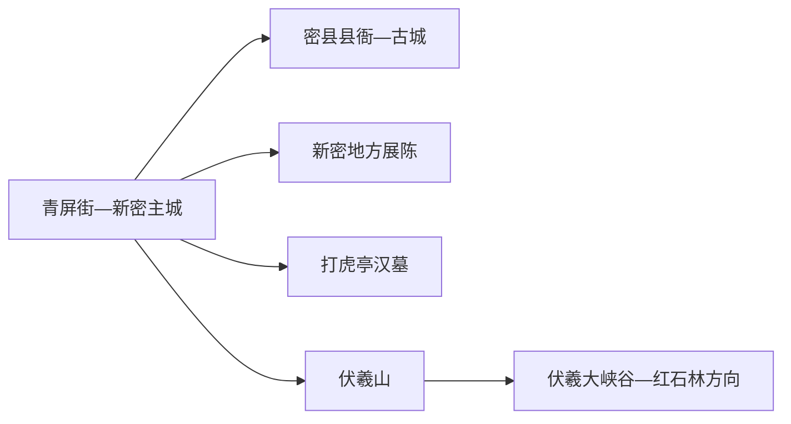
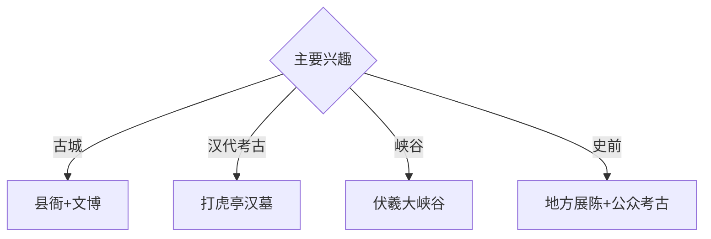

# 新密旅行指南

新密位于郑州西南浅山丘陵带，伏羲山红石峡谷、密县县衙与古城、打虎亭汉墓和早期聚落遗址构成自然与考古双线。固定快照中的 **Qingpingjie / GeoNames 1800433** 对应新密主城青屏街一带；主城古迹、伏羲山和牛店方向适合分日安排。

## 城市速览

| 项目 | 信息 |
|---|---|
| 主线 | 新密古城—密县县衙—打虎亭汉墓—伏羲山 |
| 停留 | 主城1天；伏羲山或考古远线另加1天 |
| 住宿 | 新密主城便于换乘；伏羲山正规住宿适合早入峡谷 |
| 交通 | 郑州都市圈公路衔接，远端景区宜旅游交通、约车或自驾 |
| 风险 | 峡谷山洪、崖壁项目、古墓保护、煤矿采掘与乡村道路 |

## 城市格局与游览区域

主城承担住宿、餐饮和古城历史线；打虎亭汉墓位于牛店方向，按文物部门开放安排参观。伏羲山是西北部独立山地组团，峡谷与高空体验项目分别核对运营；考古工作区、矿山生产区和未开放山径依边界进入。

## 主要景点

| 景点 | 区域 | 类型 | 核心体验 | 用时 | 环境 | 体力 | 研究价值 | 拥挤 | 优先级 |
|---|---|---|---|---:|---|---|---|---|---|
| 密县县衙与新密古城公开区 | 主城 | 古建筑与街区 | 县治制度、古城格局与地方生活 | 半天 | 混合 | 低 | 很高 | 节假日中 | A |
| 打虎亭汉墓公众开放区 | 牛店方向 | 古墓葬 | 汉代画像石、壁画与墓葬制度 | 2–3小时 | 室内 | 低 | 很高 | 开放日中 | A |
| 伏羲大峡谷 | 伏羲山 | 峡谷景区 | 红色砂岩、溪谷与地质观察 | 1天 | 室外 | 高 | 高 | 旺季高 | A |
| 红石林等伏羲山正规游线 | 伏羲山 | 山地景区 | 岩柱、山脊视野与管理型体验 | 半天至1天 | 室外 | 中高 | 高 | 旺季高 | A |
| 新密市博物馆或地方展陈 | 主城 | 博物馆 | 新密史前文化、汉墓与城市史 | 2小时 | 室内 | 低 | 高 | 团体时中 | B |
| 超化寺公开区 | 超化方向 | 古寺与古树 | 佛教建筑、碑刻与地方文化 | 2–3小时 | 混合 | 低中 | 高 | 节假日中 | B |
| 李家沟等考古公众活动点 | 市域考古方向 | 史前遗址 | 旧石器—新石器过渡与聚落考古 | 半天 | 室外 | 中 | 很高 | 开放日中 | B |

## 美食与餐饮

新密虾尾、炒凉粉、烩面和豫中家常菜具有地方辨识度。山地日准备饮水和简餐，在正规游客服务区补给；乡村餐饮按证照、价格和接待能力选择。

## 经典行程

### 一日城市基础线
**路线**：地方展陈—午餐—密县县衙—古城公共街巷。**逻辑**：从通史进入县治与城市空间。**预约锚点**：展馆和县衙开放。**休息**：主城。**删除条件**：古建维护时增加馆内展陈。

### 打虎亭汉墓线
**路线**：主城—打虎亭汉墓公众入口—讲解—牛店正规接待点—返城。**逻辑**：集中理解汉代墓葬艺术。**预约锚点**：开放、讲解和车辆。**休息**：游客服务点。**删除条件**：文物保护或维护安排暂停开放时改地方展陈。

### 伏羲峡谷线
**路线**：主城或山地住宿—伏羲大峡谷入口—公开峡谷线—返程。**逻辑**：给红石峡谷完整一天。**预约锚点**：门票、景交和末班。**休息**：游客中心。**删除条件**：山洪、雷雨、落石或步道维护时取消。

### 红石林山地线
**路线**：伏羲山正规入口—红石林公开线—观景点—返程。**逻辑**：把山脊与地质观察集中处理。**预约锚点**：项目运营和天气。**休息**：景区服务区。**删除条件**：大风、结冰或高空项目停运时改近入口线。

### 史前考古线
**路线**：地方展陈—李家沟等公众活动点—考古解说—返城。**逻辑**：用馆藏和现场理解聚落演变。**预约锚点**：官方开放日和讲解。**休息**：正规公众服务点。**删除条件**：考古工作期未开放时只留馆内内容。

### 亲子低体力线
**路线**：地方展陈—午休—县衙近入口线—主城公园。**逻辑**：室内知识配短距离古建观察。**预约锚点**：亲子讲解。**休息**：馆内和主城。**删除条件**：儿童体力不足时缩短古城步行。

### 雨天线
**路线**：地方展陈—午餐—县衙室内开放单元—正规文化馆。**逻辑**：避开峡谷与山路，保留城市史主线。**预约锚点**：馆舍开放。**休息**：主城。**删除条件**：强降雨积水时就近返宿。

## 住宿区域

青屏街—主城适合公路抵离、古城与多方向换乘；伏羲山附近正规住宿适合连续山地游。订房时核对合法经营、消防、夜间道路、停车和恶劣天气响应能力。

## 市内交通

新密通过公路与郑州主城衔接，主城用公交、出租车和网约车。打虎亭、超化、伏羲山及考古点位提前确认城乡班次、景区接驳和返程；山地日留足道路管控缓冲。

## 不同旅行者须知

考古兴趣者优先打虎亭与地方展陈；山地旅行者给伏羲山完整一天；亲子家庭选择县衙与博物馆；行动不便者确认汉墓通道、古建台阶、景交和卫生间。

## 行前核对

- 核对县衙、地方展陈、打虎亭汉墓、伏羲山和考古活动开放。
- 核对天气、山洪林火、景区交通、高空项目和返程。
- 古墓与考古工作区、矿井采掘区、崖壁施工区、森林防火区和农田按正式开放与生产边界进入。

## 来源与更新记录

| 来源 | 支持内容 | 核验日期 |
|---|---|---|
| [新密市政府：旅游景点](https://www.xinmi.gov.cn/zjxm01/8648195.jhtml) | 伏羲山、打虎亭汉墓、密县县衙与城市自然格局 | 2026-09-01 |
| [新密市全域旅游产业发展规划](https://xm.jiceng.zhengzhou.gov.cn/attachment/%E6%96%B0%E5%AF%86%E5%B8%82%E5%85%A8%E5%9F%9F%E6%97%85%E6%B8%B8%E4%BA%A7%E4%B8%9A%E5%8F%91%E5%B1%95%E8%A7%84%E5%88%92.pdf?PZ43tX9zSQd4-IMAMrkTdQjVD8foEoO3ihRP6n7IjjRgFp-WIQ6RiqwfxWHUN-9Pqhzsi_aeQwDS9OZZQC487qUEs9Lmr_cc=) | 古城、考古与伏羲山分区 | 2026-09-01 |
| [GeoNames 1800433](https://www.geonames.org/1800433/) | Qingpingjie 固定人口点与主城位置 | 2026-09-01 |

| 日期 | 更新 |
|---|---|
| 2026-09-01 | 首次完成新密旅行研究；建立古城、汉墓、峡谷与史前考古路线。 |

