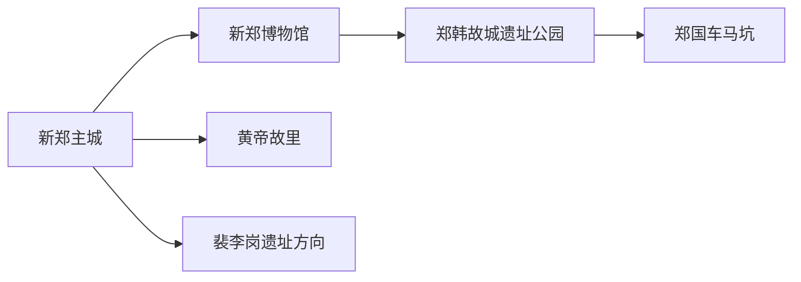
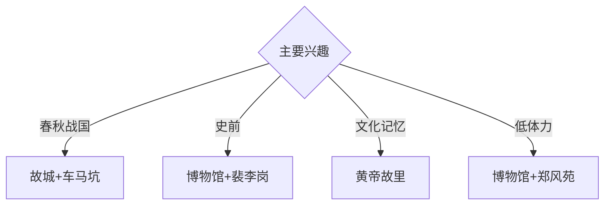

# 新郑旅行指南

新郑位于郑州南部，郑韩故城、郑国车马坑、黄帝文化和裴李岗考古构成从史前到战国的高密度历史路线。固定快照中的 **Xinzheng / GeoNames 1788466** 对应现行新郑市；机场与航空港功能区的管理边界需和新郑法定市域、主城旅行范围分别核对。

## 城市速览

| 项目 | 信息 |
|---|---|
| 主线 | 新郑博物馆—郑韩故城—郑国车马坑—黄帝故里 |
| 停留 | 主城历史1–2天；裴李岗或乡村考古另加1天 |
| 住宿 | 新郑主城适合文博；机场周边适合早晚航班 |
| 交通 | 郑州都市圈轨道、公路与航空衔接，遗址间宜公交或约车 |
| 风险 | 遗址保护、祭典客流、机场与航空港管理、考古工作区边界 |

## 城市格局与游览区域

新郑博物馆、黄帝故里、郑韩故城城墙和车马坑集中在主城及近郊，可用一至两天细读。裴李岗遗址位于市域南部乡村，公众参观按考古与保护安排；郑州机场和航空港区承担交通与产业功能，不把其生产、保税或飞行区视为公共景点。

## 主要景点

| 景点 | 区域 | 类型 | 核心体验 | 用时 | 环境 | 体力 | 研究价值 | 拥挤 | 优先级 |
|---|---|---|---|---:|---|---|---|---|---|
| 新郑市博物馆 | 主城 | 博物馆 | 裴李岗、郑韩故城与地方文物 | 2–3小时 | 室内 | 低 | 很高 | 团体时中 | A |
| 郑韩故城国家考古遗址公园公开区 | 主城 | 考古遗址 | 城墙、都城格局与城市叠合 | 半天 | 室外 | 中 | 很高 | 节假日中 | A |
| 郑国车马坑遗址博物馆 | 主城近郊 | 遗址博物馆 | 春秋墓葬、车马遗存与礼制 | 2–3小时 | 室内 | 低 | 很高 | 团体时中高 | A |
| 黄帝故里景区 | 主城 | 文化景区 | 黄帝文化、祭祀空间与城市记忆 | 2小时 | 混合 | 低 | 高 | 祭典时高 | A |
| 裴李岗遗址公众开放点 | 南部乡村 | 史前遗址 | 新石器聚落、农业与考古 | 半天 | 室外 | 中 | 很高 | 开放日中 | B |
| 欧阳修公园及纪念空间 | 城区 | 名人纪念 | 北宋文学与地方文化 | 1–2小时 | 混合 | 低 | 高 | 周末中 | B |
| 郑风苑与溱水河公开段 | 主城 | 遗址公园与湿地 | 故城墙、水系和市民生活 | 1–2小时 | 室外 | 低 | 高 | 傍晚中 | B |

## 美食与餐饮

枣制品、烩面、胡辣汤和豫中家常菜最具辨识度。红枣产品关注糖分和保质期；祭典与节庆期间提前错峰用餐。机场转场日按航站楼、酒店和主城实际距离安排餐饮。

## 经典行程

### 一日历史基础线
**路线**：新郑市博物馆—午餐—郑国车马坑—郑韩故城公开段。**逻辑**：先读通史，再进入春秋都城和墓葬。**预约锚点**：两馆和遗址公园开放。**休息**：主城。**删除条件**：时间不足时保留博物馆与车马坑。

### 郑韩故城深读线
**路线**：博物馆—车马坑—城墙遗址公园—郑风苑—溱水河。**逻辑**：用文物、城墙和水系重建都城空间。**预约锚点**：讲解和开放段。**休息**：郑风苑。**删除条件**：高温时缩短城墙步行。

### 黄帝文化线
**路线**：黄帝故里—午餐—地方文化展陈—主城历史街区。**逻辑**：区分文化记忆、祭典与考古证据。**预约锚点**：景区活动和客流。**休息**：主城商业区。**删除条件**：大型祭典管控时改文博线。

### 裴李岗考古线
**路线**：主城—裴李岗公众开放点—考古解说—返城。**逻辑**：把农业起源放回遗址环境。**预约锚点**：开放日、讲解和车辆。**休息**：正规公众服务点。**删除条件**：考古工作或保护安排未开放时改博物馆。

### 文学城市线
**路线**：欧阳修公园—市博物馆—午餐—郑风苑公开段。**逻辑**：用文学、文物和城市公园组合低强度路线。**预约锚点**：纪念空间开放。**休息**：主城。**删除条件**：强对流时只留室内。

### 亲子研学线
**路线**：市博物馆—午休—车马坑—郑风苑短线。**逻辑**：室内文物配可视化遗址。**预约锚点**：亲子讲解。**休息**：两馆与公园。**删除条件**：儿童体力不足时取消公园延伸。

### 雨天线
**路线**：市博物馆—午餐—车马坑遗址博物馆—正规室内文化空间。**逻辑**：以室内证据保留历史主线。**预约锚点**：馆舍开放。**休息**：主城。**删除条件**：道路积水时就近返宿。

## 住宿区域

新郑主城适合文博与遗址路线；机场航站楼周边适合早晚航班；郑州市区适合跨城联程。订房时核对实际行政地址、到航站楼时间和主城交通。

## 市内交通

新郑机场、郑州都市圈轨道与公路承担外部连接，主城用公交、出租车和网约车。遗址点位之间距离不同，提前核对公共交通与返程；航班日留足安检、航空港道路和天气缓冲。

## 不同旅行者须知

考古兴趣者至少留两天；亲子家庭优先市博物馆和车马坑；祭典参与者按官方预约与安检进入；行动不便者确认遗址公园路面、馆舍电梯和无障碍卫生间。

## 行前核对

- 核对博物馆、车马坑、故城公园、黄帝故里和裴李岗公众开放。
- 核对祭典客流、机场航班、轨道运营、天气和遗址间交通。
- 考古工作区、故城保护范围、机场飞行区、保税与物流生产区按正式边界进入。

## 来源与更新记录

| 来源 | 支持内容 | 核验日期 |
|---|---|---|
| [河南省文物局：郑韩故城保护利用](https://wwj.henan.gov.cn/2023/11-20/2850334.html) | 故城、车马坑、郑风苑与溱水河关系 | 2026-09-01 |
| [河南省政府：研学旅游线路](https://www.henan.gov.cn/2020/07-24/1745005.html) | 黄帝故里、郑韩故城、车马坑与博物馆主题 | 2026-09-01 |
| [GeoNames 1788466](https://www.geonames.org/1788466/) | Xinzheng 固定人口点与位置 | 2026-09-01 |

| 日期 | 更新 |
|---|---|
| 2026-09-01 | 首次完成新郑旅行研究；建立郑韩故城、史前、黄帝文化与亲子路线。 |
