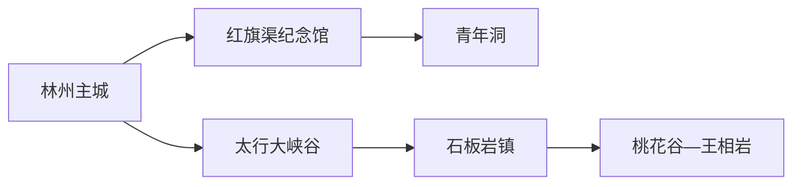
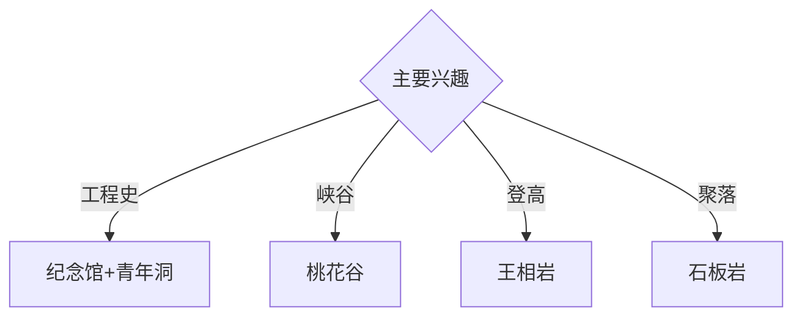

# 林州旅行指南

林州位于太行山东麓，红旗渠工程遗产、太行大峡谷、石板岩镇与山地村落共同形成鲜明的峡谷城市结构。固定快照中的 **Linzhou / GeoNames 1803327** 对应现行林州市；红旗渠与太行大峡谷分属不同游览方向，适合分别安排完整一天。

## 城市速览

| 项目 | 信息 |
|---|---|
| 主线 | 红旗渠纪念馆—青年洞—太行大峡谷—石板岩 |
| 停留 | 主城与红旗渠1天；太行大峡谷1–2天 |
| 住宿 | 林州主城便于综合换乘；石板岩适合连续山地行程 |
| 交通 | 公路抵达为主，景区宜用旅游交通、约车或自驾 |
| 风险 | 峭壁栈道、山洪落石、林火、渠线工程和乡村道路 |

## 城市格局与游览区域

主城承担住宿、交通和地方展陈；红旗渠纪念馆与青年洞构成工程史主线。太行大峡谷、石板岩、桃花谷和王相岩位于西部太行山地，景点间高差与车程明显；渠线维护区、崖壁施工点和未开放山径依管理边界进入。

## 主要景点

| 景点 | 区域 | 类型 | 核心体验 | 用时 | 环境 | 体力 | 研究价值 | 拥挤 | 优先级 |
|---|---|---|---|---:|---|---|---|---|---|
| 红旗渠纪念馆 | 任村方向 | 工程史博物馆 | 红旗渠建设史、太行山水利与集体记忆 | 2–3小时 | 室内 | 低 | 很高 | 团体时高 | A |
| 红旗渠青年洞景区 | 任村方向 | 工程遗产 | 渠线、隧洞与太行崖壁工程 | 半天 | 混合 | 中高 | 很高 | 节假日高 | A |
| 太行大峡谷景区 | 石板岩方向 | 山地峡谷 | 峡谷地貌、森林、瀑布与村落 | 1–2天 | 室外 | 高 | 很高 | 旺季高 | A |
| 桃花谷公开游线 | 太行大峡谷 | 峡谷景区 | 溪谷、瀑布与分层岩壁 | 半天 | 室外 | 中高 | 高 | 旺季高 | A |
| 王相岩公开游线 | 太行大峡谷 | 山岳景区 | 峭壁、登高与太行山视野 | 半天至1天 | 室外 | 高 | 高 | 旺季中高 | A |
| 石板岩镇公共街区 | 西部山地 | 山地聚落 | 石板民居、写生文化与山地生活 | 2–3小时 | 混合 | 低中 | 高 | 周末中高 | B |
| 林州市博物馆或地方展陈 | 主城 | 博物馆 | 地方历史、红旗渠与太行文化 | 2小时 | 室内 | 低 | 高 | 团体时中 | B |

## 美食与餐饮

烩菜、皮渣、手擀面、小米饭和太行山家常菜具有地方辨识度。石板岩住宿集中区适合解决早晚餐，旺季提前确认营业与用餐时段；山地日准备饮水、简餐和电解质补给。

## 经典行程

### 一日红旗渠基础线
**路线**：主城—红旗渠纪念馆—午餐—青年洞公开线—返城。**逻辑**：先理解工程背景，再到渠线现场观察。**预约锚点**：两处开放、讲解和景区交通。**休息**：纪念馆与青年洞服务区。**删除条件**：大风、落石或渠线维护时保留纪念馆。

### 红旗渠工程深读线
**路线**：纪念馆常设展—工程节点解说—青年洞—公开渠线观景点。**逻辑**：按选线、施工、通水和维护顺序理解工程。**预约锚点**：专题讲解和接驳。**休息**：正规游客服务点。**删除条件**：团队时段拥挤时缩短户外节点。

### 桃花谷峡谷线
**路线**：石板岩—桃花谷入口—溪谷公开线—返镇。**逻辑**：用半天至一天观察峡谷水系与岩层。**预约锚点**：门票、景交和末班。**休息**：游客中心。**删除条件**：强降雨、山洪或步道维护时取消。

### 王相岩登高线
**路线**：石板岩—王相岩入口—开放登高线—观景点—返镇。**逻辑**：把高强度攀升集中在一天。**预约锚点**：开放、天气和返程。**休息**：景区服务点。**删除条件**：雷雨、结冰、大风或体力不足时改石板岩慢游。

### 石板岩聚落线
**路线**：镇区公共街巷—正规写生与展陈空间—午餐—近镇公开步道。**逻辑**：从民居和生活理解太行聚落。**预约锚点**：展陈、住宿和返程。**休息**：镇区。**删除条件**：道路管控时保留镇内步行。

### 亲子低体力线
**路线**：红旗渠纪念馆—午休—青年洞近入口公开段或主城公园。**逻辑**：室内工程叙事配短距离现场观察。**预约锚点**：亲子讲解与接驳。**休息**：馆内和服务区。**删除条件**：儿童体力不足时只留纪念馆。

### 雨天线
**路线**：红旗渠纪念馆—午餐—林州地方展陈—主城公共文化空间。**逻辑**：避开峡谷与崖壁，保留工程和地方史。**预约锚点**：馆舍开放。**休息**：主城。**删除条件**：强降雨影响道路时就近返宿。

## 住宿区域

林州主城适合公路抵离、红旗渠和多方向换乘；石板岩镇适合连续两天游览太行大峡谷。山地住宿按合法经营、消防、夜间道路、停车和恶劣天气响应能力选择。

## 市内交通

林州以公路交通为主，可从安阳等方向衔接。主城用公交、出租车和网约车；红旗渠、青年洞、石板岩与峡谷景点提前确认景区交通、城乡班次和末班返程。

## 不同旅行者须知

工程史兴趣者优先纪念馆与青年洞；徒步者把桃花谷和王相岩分日；亲子家庭选择纪念馆与短线；行动不便者提前确认景交、栈道台阶、坡度和无障碍卫生间。

## 行前核对

- 核对红旗渠纪念馆、青年洞、太行大峡谷各游线和石板岩接待。
- 核对天气、山洪林火、景区交通、道路管控和末班返程。
- 渠线工程区、崖壁施工区、森林防火区、矿山与农田按正式开放和门禁边界进入。

## 来源与更新记录

| 来源 | 支持内容 | 核验日期 |
|---|---|---|
| [河南省文旅厅：红旗渠教育实践基地](https://hct.henan.gov.cn/2023/03-25/2713562.html) | 红旗渠纪念馆、研学设施与工程文化 | 2026-09-01 |
| [河南省政府英文网：红旗渠与太行大峡谷](https://english.henan.gov.cn/2020/07-04/1579432.html) | 林州两条核心旅游主线 | 2026-09-01 |
| [GeoNames 1803327](https://www.geonames.org/1803327/) | Linzhou 固定人口点与位置 | 2026-09-01 |

| 日期 | 更新 |
|---|---|
| 2026-09-01 | 首次完成林州旅行研究；建立红旗渠、峡谷、登高与聚落路线。 |
