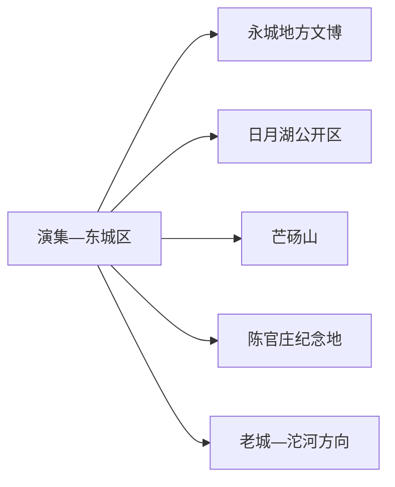
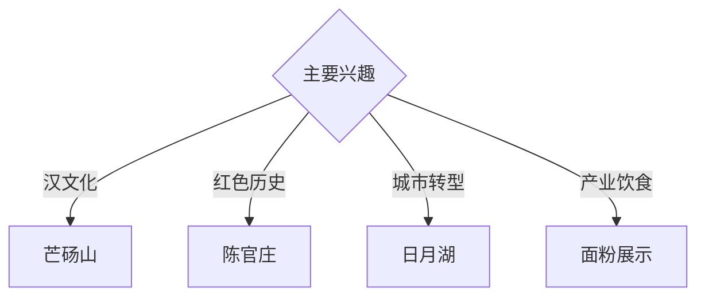

# 永城旅行指南

永城位于豫鲁苏皖交界，芒砀山汉文化、陈官庄淮海战役纪念地、日月湖矿区生态修复与面粉产业构成历史、红色和转型城市线。固定快照中的 **Yanji / GeoNames 10303676** 对应永城东城区演集一带；芒砀山位于北部，需要独立一天。

## 城市速览

| 项目 | 信息 |
|---|---|
| 主线 | 永城文博—芒砀山—陈官庄—日月湖 |
| 停留 | 城区1天；芒砀山1天；红色主题另加半天 |
| 住宿 | 东城区便于综合服务；芒山镇正规住宿适合早入景区 |
| 交通 | 高铁、公路与地方铁路衔接，远端宜公交、约车或自驾 |
| 风险 | 汉墓保护、矿井与沉陷治理、湖区水域、粮食加工生产边界 |

## 城市格局与游览区域

东城区集中住宿、交通和日月湖，老城与沱河方向保留传统城市空间。芒砀山在市域北部，汉墓群与文化景点按景区体系游览；陈官庄另成红色主题。生产矿井、采空沉陷治理区和粮食加工厂依门禁管理。

## 主要景点

| 景点 | 区域 | 类型 | 核心体验 | 用时 | 环境 | 体力 | 研究价值 | 拥挤 | 优先级 |
|---|---|---|---|---:|---|---|---|---|---|
| 芒砀山旅游区 | 芒山镇 | 汉墓与山地景区 | 梁国王陵、汉代礼制与豫东山地 | 1天 | 混合 | 中高 | 很高 | 旺季高 | A |
| 永城市博物馆或地方展陈 | 东城区 | 博物馆 | 汉文化、地方考古与城市发展 | 2–3小时 | 室内 | 低 | 很高 | 团体时中 | A |
| 淮海战役陈官庄纪念地 | 陈官庄方向 | 红色纪念 | 战役史、烈士纪念与区域交通 | 半天 | 混合 | 低 | 很高 | 纪念日高 | A |
| 日月湖景区公开区 | 东城区 | 湖泊与生态修复 | 采煤沉陷区治理、城市湖景与慢行 | 2–3小时 | 室外 | 低 | 高 | 傍晚中 | A |
| 芒砀山汉代礼制建筑基址公开区 | 芒山镇 | 考古遗址 | 礼制建筑、遗址保护与汉代国家观念 | 1–2小时 | 室外 | 低中 | 很高 | 团体时中 | B |
| 老城与沱河公共空间 | 西城区 | 城市街区与河流 | 传统城市、河流与居民生活 | 2小时 | 室外 | 低 | 中 | 傍晚中 | B |
| 正规面粉产业展示或食品体验 | 市域产业点 | 产业与饮食 | 小麦加工、食品产业与县域经济 | 2小时 | 室内 | 低 | 中 | 团体时中 | B |

## 美食与餐饮

永城面食、薛湖牛肉水煎包、豆粥和豫东家常菜具有地方辨识度。面粉及食品体验选择正规展厅、门店和加工透明的产品；芒砀山日提前准备饮水和简餐。

## 经典行程

### 一日城市基础线
**路线**：地方展陈—午餐—日月湖—东城区公共空间。**逻辑**：从城市史进入矿区修复与现代生活。**预约锚点**：展馆和湖区开放。**休息**：东城区。**删除条件**：高温或大风时缩短湖岸段。

### 芒砀山汉文化线
**路线**：城区或芒山住宿—景区入口—汉墓公开单元—礼制建筑基址—返程。**逻辑**：给汉代考古与山地完整一天。**预约锚点**：门票、讲解、景交和墓室开放。**休息**：游客中心。**删除条件**：墓室维护时保留地面遗址与展陈。

### 陈官庄红色线
**路线**：城区—陈官庄纪念馆与陵园公开区—专题讲解—返城。**逻辑**：以现场史料理解淮海战役。**预约锚点**：馆舍、纪念活动和车辆。**休息**：纪念地服务区。**删除条件**：大型纪念活动管控时错峰。

### 日月湖转型线
**路线**：地方展陈—日月湖公开步道—生态修复解说点—城市夜景。**逻辑**：观察资源型城市的空间修复。**预约锚点**：湖区活动和天气。**休息**：湖区商业服务点。**删除条件**：水域管控或强对流时缩短。

### 老城沱河线
**路线**：西城区公共街巷—地方文化点—午餐—沱河正式滨水段。**逻辑**：补足新城之外的传统城市与河流生活。**预约锚点**：文化点开放。**休息**：老城商业区。**删除条件**：河道水情高时取消滨水段。

### 亲子产业线
**路线**：地方展陈—午休—正规面粉科普或食品体验—日月湖短线。**逻辑**：用考古、粮食和生态修复串联城市。**预约锚点**：企业接待。**休息**：展厅和湖区。**删除条件**：接待暂停时增加馆内活动。

### 雨天线
**路线**：地方展陈—午餐—陈官庄纪念馆—正规食品展示空间。**逻辑**：以室内历史与产业内容减少天气影响。**预约锚点**：馆舍和企业开放。**休息**：城区。**删除条件**：道路积水时就近返宿。

## 住宿区域

演集—东城区适合交通、餐饮与城区路线；芒山镇正规住宿适合早入芒砀山。订房时核对合法经营、消防、夜间交通和节假日景区接驳。

## 市内交通

永城北站、永城站与公路客运服务不同方向，订票后核对实际站点。城区用公交、出租车和网约车；芒砀山、陈官庄与产业点提前确认城乡班次、景交和返程。

## 不同旅行者须知

汉代考古兴趣者给芒砀山完整一天；红色主题旅行者优先陈官庄；亲子家庭选择文博、日月湖与正规食品科普；行动不便者确认墓室台阶、景交和无障碍卫生间。

## 行前核对

- 核对地方展陈、芒砀山墓室、陈官庄、日月湖与产业接待。
- 核对铁路站点、景交、节假日客流、湖区天气和返程。
- 汉墓保护区、考古工作区、生产矿井、沉陷治理区、粮食加工车间和水域按正式开放与生产边界进入。

## 来源与更新记录

| 来源 | 支持内容 | 核验日期 |
|---|---|---|
| [河南省政府：芒砀山](https://english.henan.gov.cn/2020/07-12/1706365.html) | 芒砀山位置与汉文化旅游资源 | 2026-09-01 |
| [河南省民政厅：淮海战役陈官庄纪念馆](https://mzt.henan.gov.cn/2014/06-03/543392.html) | 陈官庄纪念地属性、位置与展陈 | 2026-09-01 |
| [商丘市政府采购：芒砀山景区管理](https://shangqiu.zfcg.henan.gov.cn/cmsweb81e27e/ycs/rootfiles/2025/09/17/c017d80190eb49ea99fc205124807266.pdf) | 芒砀山现行景区管理主体 | 2026-09-01 |
| [GeoNames 10303676](https://www.geonames.org/10303676/) | Yanji 固定人口点与永城东城区位置 | 2026-09-01 |

| 日期 | 更新 |
|---|---|
| 2026-09-01 | 首次完成永城旅行研究；建立汉文化、红色、转型与产业路线。 |
