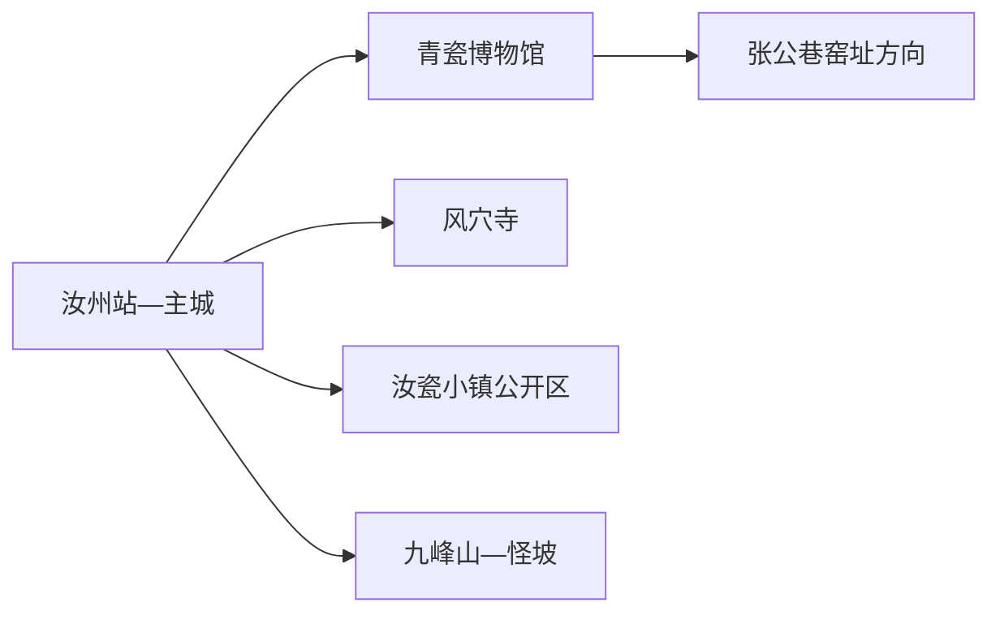
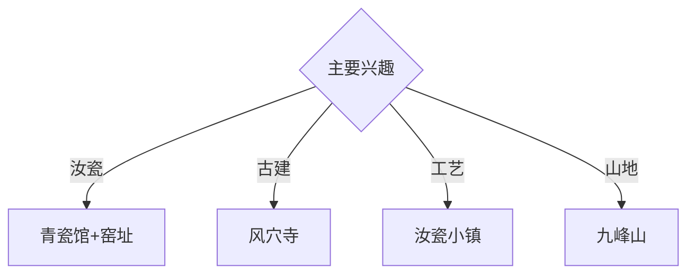

# 汝州旅行指南

汝州位于河南中西部，汝瓷、风穴寺古建筑、张公巷窑址和汝河城市空间构成文化主线，九峰山与怪坡提供山地延伸。固定快照中的 **Ruzhou / GeoNames 1803359** 对应现行汝州市；首访适合安排两天，一天读汝瓷，一天看古寺或山地。

## 城市速览

| 项目 | 信息 |
|---|---|
| 主线 | 汝州青瓷博物馆—张公巷窑址—风穴寺 |
| 停留 | 主城1天；风穴寺或九峰山另加1天 |
| 住宿 | 汝州站—主城便于文博；山地住宿按早入景区选择 |
| 交通 | 铁路、公路抵达，远端景区宜公交、约车或自驾 |
| 风险 | 古建与窑址保护、山洪林火、陶瓷生产区和乡村道路 |

## 城市格局与游览区域

青瓷博物馆、城市公园与汝瓷公共展陈集中在主城东部；风穴寺位于东北风穴山。九峰山、怪坡等山地方向距离更远，适合单独一天；窑址和生产工坊按考古、文物与企业公开安排进入。

## 主要景点

| 景点 | 区域 | 类型 | 核心体验 | 用时 | 环境 | 体力 | 研究价值 | 拥挤 | 优先级 |
|---|---|---|---|---:|---|---|---|---|---|
| 汝州青瓷博物馆 | 汝东新区 | 专题博物馆 | 汝窑、张公巷窑与中国青瓷谱系 | 2–3小时 | 室内 | 低 | 很高 | 团体时中 | A |
| 风穴寺景区 | 城东北 | 古寺与山地 | 多朝代建筑、塔林与三教文化 | 半天至1天 | 混合 | 中高 | 很高 | 节假日中高 | A |
| 张公巷窑址公开展陈 | 主城 | 考古遗址 | 北宋官窑考古与制瓷技术 | 2小时 | 混合 | 低 | 很高 | 开放日中 | A |
| 汝瓷小镇公开区 | 城郊 | 产业与非遗 | 汝瓷工艺、展陈与正规体验 | 半天 | 混合 | 低 | 高 | 节假日中 | A |
| 汝州文庙公开区 | 主城 | 古建筑 | 州学、礼制与地方教育史 | 1–2小时 | 混合 | 低 | 高 | 团体时中 | B |
| 九峰山景区 | 山地方向 | 山地景区 | 峰林、森林与伏牛山东缘地貌 | 1天 | 室外 | 高 | 高 | 旺季中 | B |
| 怪坡景区 | 风穴寺方向 | 地貌体验 | 坡地视觉、科普与城郊休闲 | 2–3小时 | 室外 | 低中 | 中 | 节假日中 | B |

## 美食与餐饮

汝州粉皮、浆面条、卤肉和豫西家常菜具有地方辨识度。汝瓷茶器体验按正规工坊和食品接触安全标准选择；购买陶瓷时确认作者、工艺、包装和运输。山地日准备饮水和简餐。

## 经典行程

### 一日汝瓷基础线
**路线**：青瓷博物馆—午餐—张公巷窑址公开展陈—汝瓷小镇。**逻辑**：从文物与考古进入当代工艺。**预约锚点**：三处开放和工坊体验。**休息**：汝东新区。**删除条件**：窑址未开放时增加博物馆常设展。

### 风穴寺古建线
**路线**：主城—风穴寺入口—寺院建筑—塔林公开线—返城。**逻辑**：完整半天至一天读多朝代古建。**预约锚点**：开放、讲解和车辆。**休息**：景区服务区。**删除条件**：雷雨、林火、结冰或古建维护时缩短山地段。

### 汝瓷工艺线
**路线**：青瓷博物馆—正规工坊—午餐—汝瓷小镇展陈。**逻辑**：比较考古标本与当代烧造。**预约锚点**：工坊接待和体验。**休息**：小镇商业区。**删除条件**：生产安排暂停接待时保留公共展陈。

### 州城文脉线
**路线**：汝州文庙—地方历史展陈—午餐—汝河公共空间。**逻辑**：补足汝瓷之外的州城历史。**预约锚点**：文庙与展馆开放。**休息**：主城。**删除条件**：高温时取消滨水延伸。

### 九峰山山地线
**路线**：主城—九峰山入口—开放登山线—返城。**逻辑**：给伏牛山东缘完整一天。**预约锚点**：门票、接驳和末班。**休息**：游客中心。**删除条件**：山洪、雷雨、结冰或林火预警时取消。

### 亲子低体力线
**路线**：青瓷博物馆—午休—正规汝瓷体验—中央公园短线。**逻辑**：室内文物配动手工艺。**预约锚点**：亲子课程。**休息**：馆内与公园。**删除条件**：体验暂停时增加博物馆讲解。

### 雨天线
**路线**：青瓷博物馆—午餐—汝瓷小镇室内展陈—正规工坊。**逻辑**：以室内陶瓷主题减少天气影响。**预约锚点**：馆舍和工坊开放。**休息**：新区。**删除条件**：道路积水时就近返宿。

## 住宿区域

汝州站—主城适合铁路抵离、文博和多方向换乘；风穴寺或九峰山附近正规住宿适合早入山。山地住宿按合法经营、消防、夜间道路和天气响应能力选择。

## 市内交通

汝州站、汝州南站服务不同铁路方向，订票后核对实际到发站。主城用公交、出租车和网约车；风穴寺、九峰山、怪坡与工坊提前确认城乡公交末班或预约返程。

## 不同旅行者须知

陶瓷兴趣者至少留一天给博物馆与工坊；古建兴趣者给风穴寺完整半天；亲子家庭优先青瓷馆与正规体验；行动不便者确认寺院台阶、山地接驳和馆舍无障碍设施。

## 行前核对

- 核对青瓷博物馆、张公巷窑址、风穴寺、汝瓷小镇和山地景区开放。
- 核对铁路站点、工坊接待、山地天气、景区交通和返程。
- 考古工作区、古建修缮区、陶瓷生产窑炉、矿山与林地按正式开放和门禁边界进入。

## 来源与更新记录

| 来源 | 支持内容 | 核验日期 |
|---|---|---|
| [平顶山市文旅局：风穴寺](https://wglj.pds.gov.cn/contents/12520/445772.html) | 风穴寺位置、建筑、塔林与开放 | 2026-09-01 |
| [平顶山市文旅局：汝州青瓷博物馆](https://wglj.pds.gov.cn/contents/12520/447064.html) | 汝瓷、窑口、馆址与开放 | 2026-09-01 |
| [GeoNames 1803359](https://www.geonames.org/1803359/) | Ruzhou 固定人口点与位置 | 2026-09-01 |

| 日期 | 更新 |
|---|---|
| 2026-09-01 | 首次完成汝州旅行研究；建立汝瓷、风穴寺、州城与山地路线。 |
