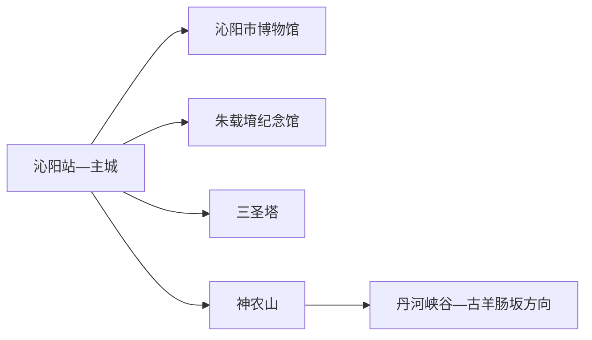
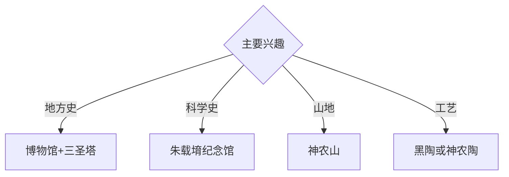

# 沁阳旅行指南

沁阳位于太行山南麓，神农山、怀庆府历史、朱载堉音乐科学遗产和三圣塔等古迹构成山地与人文双线。固定快照中的 **Qinyang / GeoNames 1797557** 对应现行沁阳市；主城文博与北部神农山适合分别安排。

## 城市速览

| 项目 | 信息 |
|---|---|
| 主线 | 沁阳博物馆—朱载堉纪念馆—三圣塔—神农山 |
| 停留 | 主城1天；神农山另加1天 |
| 住宿 | 沁阳主城便于铁路、公路和多方向换乘 |
| 交通 | 铁路、公路抵达，北部山地宜景区交通、约车或自驾 |
| 风险 | 山洪落石、林火、古建保护、采石矿区与陶瓷生产边界 |

## 城市格局与游览区域

主城适合串联博物馆、朱载堉纪念馆与三圣塔；神农山位于北部太行山地，需要独立一天。丹河峡谷、古羊肠坂与乡村古建按官方开放和道路条件选择，工业窑炉、矿区和未开放山径依管理边界进入。

## 主要景点

| 景点 | 区域 | 类型 | 核心体验 | 用时 | 环境 | 体力 | 研究价值 | 拥挤 | 优先级 |
|---|---|---|---|---:|---|---|---|---|---|
| 沁阳市博物馆 | 主城 | 博物馆 | 怀庆府地域史、古建与地方文物 | 2–3小时 | 室内 | 低 | 很高 | 团体时中 | A |
| 朱载堉纪念馆 | 主城 | 名人专题馆 | 律学、历学、音乐与科学史 | 2小时 | 室内 | 低 | 很高 | 团体时中 | A |
| 神农山景区 | 北部山地 | 山岳景区 | 太行峰林、白皮松与神农文化 | 1天 | 室外 | 高 | 很高 | 旺季高 | A |
| 三圣塔公开区 | 主城 | 古塔 | 金代砖塔、城市文脉与古建观察 | 1小时 | 室外 | 低 | 高 | 周末中 | A |
| 曹谨纪念馆 | 主城 | 名人纪念 | 水利治理、海峡文化与地方记忆 | 1–2小时 | 室内 | 低 | 高 | 团体时中 | B |
| 盆窑黑陶小镇或神农陶公开体验 | 市域乡村 | 非遗与工艺 | 黑陶、制陶技艺与正规体验 | 半天 | 混合 | 低 | 高 | 节假日中 | B |
| 丹河峡谷正式开放段 | 北部 | 峡谷与水系 | 太行峡谷、河流与交通地理 | 半天至1天 | 室外 | 中高 | 高 | 旺季中 | B |

## 美食与餐饮

怀府闹汤驴肉、怀府小车牛肉、烩面和豫北家常菜具有地方辨识度。山地日准备饮水与简餐；陶艺体验选择公开工坊，餐饮与产品购买核对价格、来源和运输。

## 经典行程

### 一日城市基础线
**路线**：沁阳市博物馆—午餐—朱载堉纪念馆—三圣塔。**逻辑**：从地方通史进入科学与古建。**预约锚点**：两馆和古塔开放。**休息**：主城。**删除条件**：时间不足时保留博物馆与朱载堉纪念馆。

### 朱载堉科学史线
**路线**：朱载堉纪念馆—专题讲解—午餐—朱载堉墓或相关公开纪念点。**逻辑**：集中理解音乐律学与历算。**预约锚点**：讲解和纪念点开放。**休息**：主城。**删除条件**：墓区维护时只留馆内内容。

### 神农山山地线
**路线**：主城—神农山入口—景交—开放登山线—返程。**逻辑**：给太行山地完整一天。**预约锚点**：门票、景交和末班。**休息**：游客中心。**删除条件**：山洪、雷雨、结冰、落石或林火预警时取消。

### 怀庆古建线
**路线**：沁阳博物馆—三圣塔—午餐—当期开放的古建或纪念馆。**逻辑**：以馆藏为背景辨认地方古建。**预约锚点**：各点开放。**休息**：主城。**删除条件**：修缮时改室内专题展。

### 丹河峡谷线
**路线**：主城—丹河峡谷正式入口—公开观景段—返城。**逻辑**：观察太行山水与古道地理。**预约锚点**：道路、水情和车辆。**休息**：正规服务点。**删除条件**：强降雨、落石或道路管控时取消。

### 亲子工艺线
**路线**：市博物馆—午休—朱载堉科普—正规陶艺体验。**逻辑**：用文物、声学和动手工艺组合低强度研学。**预约锚点**：亲子讲解和工坊。**休息**：馆内与体验点。**删除条件**：工坊暂停接待时增加馆内活动。

### 雨天线
**路线**：市博物馆—午餐—朱载堉纪念馆—曹谨纪念馆。**逻辑**：用三个室内主题覆盖地方史、科学与水利。**预约锚点**：馆舍开放。**休息**：主城。**删除条件**：道路积水时就近返宿。

## 住宿区域

沁阳站—主城适合铁路、公路抵离和多方向换乘；神农山附近正规住宿适合早入山。山地住宿按合法经营、消防、夜间道路和天气响应能力选择。

## 市内交通

沁阳站和公路客运承担外部连接，主城用公交、出租车和网约车。神农山、丹河峡谷、工艺村与乡村古建提前核对城乡班次、景交和返程。

## 不同旅行者须知

科学史兴趣者优先朱载堉纪念馆；古建兴趣者以博物馆为信息基点；山地旅行者给神农山完整一天；行动不便者确认景交、古塔外围路面和馆舍无障碍设施。

## 行前核对

- 核对市博物馆、朱载堉纪念馆、三圣塔、神农山与工艺体验开放。
- 核对铁路、山地天气、景交、峡谷水情和返程。
- 古建修缮区、森林防火区、峡谷河道、矿山采石区和陶瓷生产窑炉按正式开放与生产边界进入。

## 来源与更新记录

| 来源 | 支持内容 | 核验日期 |
|---|---|---|
| [沁阳市政府：沁阳旅游](https://www.qinyang.gov.cn/qygk/qyly/) | 神农山、博物馆、朱载堉纪念馆、三圣塔与陶艺点 | 2026-09-01 |
| [沁阳市政府：朱载堉墓](https://www.qinyang.gov.cn/2021/03-15/319478.html) | 朱载堉纪念与墓区位置关系 | 2026-09-01 |
| [GeoNames 1797557](https://www.geonames.org/1797557/) | Qinyang 固定人口点与位置 | 2026-09-01 |

| 日期 | 更新 |
|---|---|
| 2026-09-01 | 首次完成沁阳旅行研究；建立地方史、科学、山地与工艺路线。 |

