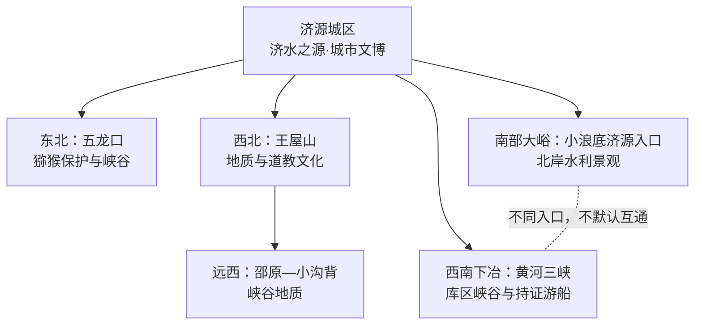
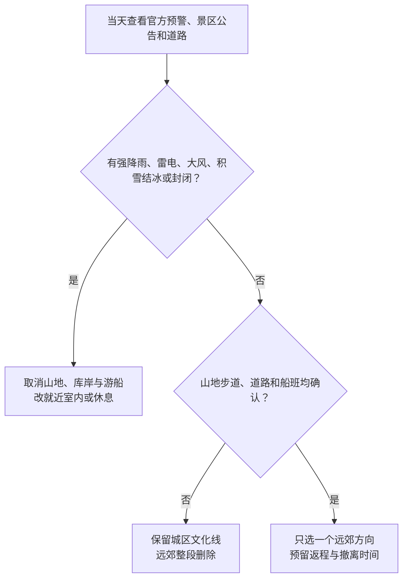

# 济源旅行指南

济源是河南省直辖的县级市，也是全域建设的国家产城融合示范区；示范区管委会与市政府“一个机构、两块牌子”，不因此产生另一座法定城市。旅行空间从济水之源与城市文博展开，向东北五龙口、西北王屋山、远西小沟背和南部黄河分别延伸。山地与黄河方向相距较远，首次到访宜把每个方向当作独立一日，不用“焦作近郊”或“洛阳小浪底”替代济源自己的入口和返程核对。

> 建议停留：2–4 天；城区 1 天，每个山地或黄河方向另留完整 1 天 
> 旅行关键词：济水之源、王屋山、太行猕猴、黄河水利、峡谷地质、豫西北小吃 
> 主要体力：中等至较高；山地景区有坡道、台阶和较长内部接驳 
> 最近研究：2026-08-12

## 城市速览

| 项目 | 旅行信息 |
|---|---|
| 主要旅行价值 | 在济水之源理解济源地名与古代祭水传统，在王屋山、小沟背看太行—中条山地质与峡谷，在五龙口认识太行猕猴保护，再从济源北岸入口理解小浪底与黄河三峡的水利和库区景观 |
| 建议停留 | 1 天可完成城区文化线；2 天增加一个山地或黄河方向；3–4 天可再选王屋山、五龙口、小沟背、小浪底或黄河三峡中的一至两个完整方向 |
| 较舒适季节 | 春秋通常更适合城区与山地步行；夏季高温、强降雨和山洪风险增加，冬季山地可能积雪、结冰或临时关闭 |
| 预算特点 | 整体中等；城区公共文化成本较低，主要支出来自远郊往返、景区票务与内部交通，多个远点并排会显著增加车辆成本 |
| 步行强度 | 城区低至中等；王屋山、小沟背、五龙口和黄河峡谷均可能包含坡道、台阶、栈道或接驳，不能按平地公园估算 |
| 主要天气风险 | 春季大风和干燥，夏季高温、雷电、短时强降雨、山洪与库岸风险，秋季降温快，冬季山路积雪和结冰 |
| 独行旅行 | 城区点餐和叫车较方便；远郊必须提前锁定正规交通与返程，不依赖陌生拼车或临时揽客船只 |
| 亲子旅行 | 济水之源、公共文化场馆和有明确服务设施的景区可组合；山地、猕猴活动和临水空间需严格看护，不投喂、不脱离开放游线 |
| 长者与低体力旅行 | 城区公共文化优先，每半天一个主项目；山地日须确认索道、观光车、最近落客点和仍不可避免的台阶 |
| 无障碍信息 | 图书馆等部分城市公共文化设施有无障碍停车、卫生间、电梯和轮椅服务的官方记录；山地景区、古建院落和船舶上下客的连续性不能据此类推，须逐点确认 |

## 城市格局与游览区域

济源法定行政代码为 `419001`，是河南省直辖县级市。市域现有 5 个街道、11 个镇；国家产城融合示范区是功能管理与建设体系，不能替代法定市名、行政代码或旅行属地。城区、王屋山、五龙口、小沟背以及黄河南岸相望的库区并非连续游览带。

| 区域 | 主要内容 | 游览特点 | 与其他区域的关系 |
|---|---|---|---|
| 济水—北海—沁园城区 | 济水之源文化旅游区、济渎庙、城市博物馆与公共文化设施 | 历史与城市服务最集中，适合作为到达日和天气备选 | 与所有远郊都需车辆连接；不把示范区办公、产业园当景点 |
| 五龙口方向 | 五龙口景区、太行猕猴自然保护主题 | 东北向独立山地日；猕猴活动、山路和景区接驳受天气影响 | 不与王屋山或黄河方向硬拼 |
| 王屋—邵原方向 | 王屋山、小沟背·银河峡 | 西北与远西两个梯度，均需完整白天；小沟背往返更长 | 可连续住宿后分两日，不宜同日完成两座完整景区 |
| 大峪—小浪底方向 | 黄河小浪底水利枢纽济源侧正式旅游区 | 济源北岸入口，生产工程与游客开放区边界清楚 | 与洛阳孟津方向是不同属地和入口，不能默认跨坝通行 |
| 下冶—黄河三峡方向 | 黄河三峡景区、库区峡谷与正式游船 | 西南向独立黄河日，水位、风力、船班和道路影响大 | 不因同属小浪底库区就与大峪入口算作同一景点 |

王屋山国家地质公园、太行山猕猴与黄河湿地等保护地均有法定或管理边界；景区开放只覆盖其中明确许可的游客区域。大坝、发电设施、检修道路、港区、矿山、选矿厂和货运铁路属于持续运行的生产空间，不能因临近景区或具有工业景观而进入。

## 主要景点

优先级用于安排时间：**A** 为首访核心，**B** 为按兴趣补充，**C** 为远郊、季节性或通常需要独立半天以上的目的地。同一景区内部的峰、洞、瀑布、索道站和观景台只计一个完整项目；开放边界以运营方当日公告为准。

### 城区与东北方向

| 景点 | 区域 | 类型 | 主要看点 | 建议用时 | 室内外 | 体力 | 预约风险 | 天气影响 | 优先级 |
|---|---|---|---|---:|---|---|---|---|---|
| 济水之源文化旅游区 | 济水城区 | 古建、园林与城市文化 | 济渎庙、济水源流文化及同一旅游区内的园林和公共空间；内部节点按一个项目游览 | 3–5 小时 | 室内外混合 | 中 | 中 | 中至高 | A |
| 济源市博物馆 | 城区 | 地方综合博物馆 | 济源历史、考古与地方文化展陈；临展、闭馆日和入馆规则动态核对 | 2–3 小时 | 室内 | 低 | 中 | 低 | B |
| 五龙口景区 | 五龙口镇 | 山地峡谷、猕猴保护主题 | 太行山峡谷地貌和猕猴种群观察；不投喂、不追逐，服从保护与安全管理 | 5–7 小时，另计往返 | 室外为主 | 中至高 | 中至高 | 高 | A |

### 西部山地与黄河方向

| 景点 | 区域 | 类型 | 主要看点 | 建议用时 | 室内外 | 体力 | 预约风险 | 天气影响 | 优先级 |
|---|---|---|---|---:|---|---|---|---|---|
| 王屋山景区 | 王屋镇 | 山岳、地质与文化景区 | 王屋山地质景观、愚公文化和当日开放的登山游线；全景区只计一次 | 6–8 小时，另计往返 | 室外为主 | 高 | 高 | 高 | A |
| 小沟背·银河峡景区 | 邵原镇 | 峡谷、地质景观 | 远西峡谷、溪流与地质遗迹；雨后水情、落石与道路状态决定能否成行 | 6–8 小时，另计往返 | 室外 | 高 | 高 | 高 | C |
| 黄河小浪底水利枢纽济源侧旅游区 | 大峪镇方向 | 水利工程、黄河景观 | 济源北岸正式游客区内的水利工程认知与库区景观；不进入生产、检修和非开放坝区 | 5–7 小时，另计往返 | 室外为主 | 中 | 高 | 高 | A |
| 黄河三峡景区 | 下冶镇 | 库区峡谷、游船与山水 | 小浪底库区峡谷地貌和正式运营游线；是否乘船取决于水位、风力、船班与个人晕船条件 | 5–7 小时，另计往返 | 室外为主 | 中至高 | 高 | 高 | B |

“小浪底”既可指跨市域水利工程和库区，也可指不同属地的旅游入口。本页只承担大峪镇等济源侧正式开放单元；洛阳孟津方向应按当地入口、票务和交通安排，不能把两侧门票、停车场或道路当作互通。黄河三峡位于下冶方向，是另一完整景区，也不作为小浪底内部子景点重复计算。

## 美食与餐饮

济源饮食以小麦主食、汤食、牛羊肉和街头面点为主。城区居民区与成熟商业街更适合早餐、简餐和晚餐，远郊景区周边应先确认营业、食材和返程，不把农家乐招牌当作稳定开放承诺。

| 菜品或餐饮类型 | 常见区域 | 一个人用餐与常见份量 | 风味、过敏原与饮食限制 | 排队风险与替代方法 |
|---|---|---|---|---|
| 鸡蛋不翻 | 城区早餐摊点与小吃店 | 单份可作点心，配汤或其他主食更完整 | 常含鸡蛋、面粉和食用油；乳、芝麻、花生及共用器具逐店确认 | 早餐时段可能售完；换同类现做面点，不追单一摊位 |
| 肉夹火烧与小凹馍 | 城区成熟餐饮区 | 一至两个适合独行，先问大小和肉量 | 含小麦，夹肉常见猪肉或牛羊肉；清真、素食和用油不能只凭名称判断 | 用餐高峰排队；改选配料明示的普通烧饼、馍店 |
| 清真牛肉丸与牛肉汤 | 城区牛羊肉餐馆 | 一碗汤或丸子配馍可成餐 | 牛肉、骨汤、小麦、香辛料常见；“清真”须看具体餐厅资质与现场管理 | 早餐午餐高峰较忙；选标识与菜单清楚的正规餐馆 |
| 炒面、烩面与捞面条 | 全城普通面馆 | 一碗通常可成餐，可要求少油少辣 | 含小麦；肉汤、鸡蛋、蒜、辣椒、芝麻油和共用锅具常见 | 替代面馆多，优先选择能说明汤底和配料者 |
| 土馍、土炒馍与绿豆酥 | 正规特产店、非遗集市 | 适合少量尝鲜或携带，先看净含量与保质期 | 常含小麦、糖、油脂，糕点可能含蛋、乳、芝麻或坚果 | 节会摊位并非常设；优先买标签和生产信息完整的产品 |

严格素食、无麸质、严重过敏或清真饮食者，应书面说明不可食用的肉类、酒料、蛋奶、花生芝麻与交叉接触要求；政府美食名录只能证明地方代表性，不能替代餐厅当日配方和认证。

## 经典行程

### 一日经典路线

**路线**：济水之源文化旅游区 → 城区午餐与坐休 → 济源市博物馆 → 城市公共文化区短停

- **适用条件**：适合首次到访、无意当天跑远郊，且核心场馆正常开放的旅行者。
- **串联逻辑**：先从济水与古建理解城市身份，再用博物馆补齐地方史，全日留在城区减少换乘。
- **预约锚点**：先确认济水之源旅游区与博物馆开放日、入口和最晚入场。
- **休息安排**：午餐放在城区成熟餐饮区；大型院落结束后完整坐休再进馆。
- **时间不足时**：删除公共文化区短停，博物馆只看核心展陈；不把远郊塞进半日。

### 两日城市路线

**第 1 天**：济水之源文化旅游区 → 济源市博物馆 
**第 2 天**：济源城区 → 王屋山景区 → 原路返回或使用已核验的属地住宿

- **适用条件**：第二天天气、景区开放和往返交通均明确；低体力者可把王屋山换成五龙口的短线方案。
- **串联逻辑**：第一天完成城市文化，第二天整段交给一座山地景区，不在东西方向往返折返。
- **预约锚点**：第一天锁定场馆；第二天锁定景区票务、内部交通和返程车辆。
- **休息安排**：王屋山只在正式服务区休息和补给，午后保留长休息并预留下山余量。
- **时间不足时**：山地整段删除，改为城区单馆和休整；不缩短返程安全余量。

### 三日深度路线

**第 1 天**：济水之源与城市文博 
**第 2 天**：王屋山或小沟背二选一完整山地日 
**第 3 天**：小浪底济源侧或黄河三峡二选一完整黄河日

- **适用条件**：连续三天中山地、库区天气和交通均可用，并能接受两天中高强度户外。
- **串联逻辑**：城市、山地、黄河各占一天；每个完整景区只选择一次，避免把不同入口误作一条环线。
- **预约锚点**：分别锁定第二天景区内部交通、第三天游客入口或持证船班及每天返程。
- **休息安排**：第二、三天都在官方服务区安排午餐和坐休，住宿尽量减少跨城搬运行李。
- **时间不足时**：优先删除第三天黄河日或第二天远西小沟背，不把两个远郊压成一日。

### 雨天路线

**路线**：济源市博物馆 → 城区室内午餐与长休息 → 图书馆或其他确认开放的公共文化场馆

- **适用条件**：只适用于普通降雨和道路正常；暴雨、雷电、山洪、大风、积雪结冰或官方封闭时留在住宿地附近。
- **串联逻辑**：以室内场馆和短途车辆转场替代山地、库岸、游船和古建院落长走。
- **预约锚点**：先确认一座主场馆，第二处只在开放和交通仍有余量时保留。
- **休息安排**：使用场馆固定座椅和正规室内餐饮，每次转场前重查预警与道路。
- **时间不足时**：删除第二馆；极端天气不以雨具、自驾或“景区尚未通知”作为继续户外的理由。

### 亲子或低体力路线

**亲子路线**：济源市博物馆精选展厅 → 室内午餐与午休 → 济水之源文化旅游区短线 
**低体力路线**：车辆直达济水之源最近开放入口 → 核心古建与短段园林 → 城区公共文化场馆坐休 → 返回住宿地

- **适用条件**：亲子按年龄和天气删减；低体力者须确认落客点、轮椅、卫生间、座椅和古建门槛。
- **串联逻辑**：两条路线都只保留城区；不把山地、猕猴观察、船舶或库岸当作轻松附加项。
- **预约锚点**：确认儿童证件、婴儿车、寄存和场馆活动；低体力者逐点确认无障碍连续性。
- **休息安排**：中午至少完整坐休一次，下午只留一个可随时退出的短项目。
- **时间不足时**：亲子删除下午古建；低体力路线只保留一个入口清楚的场馆或园区。

### 远郊一日路线

**路线**：济源城区 → 五龙口景区正式入口 → 当日开放游线 → 济源城区

- **适用条件**：适合能完成中高强度山地步行、接受猕猴活动边界且已确认正规往返交通的人。
- **串联逻辑**：五龙口位于东北独立方向，往返和完整景区共同占用一日，不再加入王屋山或黄河景区。
- **预约锚点**：票务、开放游线、景区交通、道路、返程车辆和天气同时确认。
- **休息安排**：只在正式服务点停留，不携食靠近猕猴、不在保护区边缘野餐。
- **时间不足时**：整段删除，改城区文化线；不追赶未确认的末班车或走非开放山路。

## 住宿区域

| 区域 | 优点 | 缺点 | 适合人群 | 交通特点 |
|---|---|---|---|---|
| 济水—北海城区 | 靠近古建、日常餐饮和成熟城市服务 | 去王屋山、五龙口和黄河仍需长距离车辆 | 首访、公共交通优先、只住一处的人 | 适合作为各方向共同基点，订房时核对到济源站实际距离 |
| 沁园—文化公共区 | 接近公共文化设施和城市新区服务，环境通常较开阔 | 与老城古建不是完整步行圈 | 亲子、低体力、偏好较新住宿的人 | 依靠公交或叫车连接济水核心和车站 |
| 王屋镇方向 | 便于次日较早进入王屋山，减少城区往返 | 住宿、餐饮和夜间交通选择少，季节波动大 | 连续安排王屋山与西部方向、自驾或包车者 | 必须确认住宿资质、晚到接待、充电与第二天道路 |
| 黄河景区周边正规住宿 | 可减少小浪底或黄河三峡清晨往返 | 两景区并非同一入口，周边服务不能互相替代 | 已锁定单一黄河方向且希望慢游的人 | 按大峪或下冶具体属地订，不按“黄河边”模糊搜索 |

不推荐未经核验的具体酒店。需要无障碍客房、电梯、儿童床、深夜入住或车辆到门时，应直接确认道路落客点到客房的连续路线；山地民宿还要核对消防、合法经营、夜间道路和极端天气退改。

## 市内交通

济源站是当前铁路到发和城市接驳的主要铁路锚点。济源东站仍属于在建高铁项目语境，不能作为现役客运站制定行程。济源没有可直接替代铁路或公路门户的定期民航客运机场；经郑州或洛阳机场中转时，应按当日航班、铁路和道路重新拼接。

| 场景或枢纽 | 建议与取舍 | 行前需要重查的内容 |
|---|---|---|
| 济源站到达 | 使用公交、出租或网约进入城区；票面站名与站前上客点优先于地图简称 | 车次、站房出入口、公交首末班、施工和夜间运力 |
| 高铁规划信息 | 呼南高铁济源段及济源东站未作为现役到达锚点；不据规划工期预订接驳 | 只以 12306 实际可售车次和官方投运公告为准 |
| 城区跨片区 | 公交适合不赶预约，合规叫车适合携行李或减少步行 | 线路、站位、支付、节假日绕行与恶劣天气运力 |
| 城乡旅游与农村客运 | 交通部门曾公布通往五龙口、小浪底、黄河三峡、王屋山和小沟背的线路，但具体班次具有时效性 | 是否运营、发车地点、回程末班、停靠点与景区入口距离 |
| 山地与黄河远郊 | 多人、亲子或低体力者可考虑合规包车或自驾，必须先锁定返程 | 运营资质、保险、道路、停车、景区内部交通、船班和天气退改 |
| 航空中转 | 通常经郑州或洛阳的民用机场再转铁路或公路，不假定存在直达机场巴士 | 航班、机场到站交通、末班衔接、行李和跨城退改 |
| 自驾 | 对分散远郊更灵活，但山路、库岸道路和景区停车受天气与活动影响 | 道路施工、临时管制、充电、停车预约、结冰、山洪和水位 |

## 不同旅行者须知

| 旅行维度 | 可行条件 | 主要取舍 | 需额外核对 |
|---|---|---|---|
| 独行旅行 | 城区单馆、小吃和合规叫车容易组合 | 远郊返程与山地安全的不确定性较高 | 末班、景区救援、手机号覆盖、住宿前台与紧急联络 |
| 亲子旅行 | 城区文化线和服务明确的景区短线可按年龄选择 | 山地台阶、临水、猕猴和长车程不能同日叠加 | 儿童票、推车、母婴室、动物接触规则和救援点 |
| 长者或低体力旅行 | 每半天一个核心，以车辆跨片区可显著减负 | 古建门槛、山地台阶、上下船和景区换乘仍会累积体力 | 最近落客点、索道观光车、电梯、座椅、卫生间和陪同政策 |
| 无障碍需求 | 城市图书馆等部分公共文化设施有较具体官方信息 | 单馆设施不代表古建、山地、站前道路和游船连续可达 | 无障碍停车、入口坡道、电梯、卫生间、轮椅和疏散路径 |
| 摄影旅行 | 城市古建、正式观景台和开放步道有稳定题材 | 保护区、文物、猴群、无人机和商业拍摄规则严格 | 禁拍、三脚架、无人机空域、野生动物干扰与水利设施安保 |
| 预算有限 | 城区公共文化、普通小吃与公交可控制成本 | 远郊省门票也不等于省交通，多个方向成本叠加快 | 免费预约、公交运营、优惠资格与景区内部交通 |
| 晚出发或紧凑行程 | 只保留济水之源或博物馆之一 | 不应傍晚才进入山地、库区或依赖不确定返程 | 最晚入场、末班、夜间上客点与住宿入住 |
| 特殊天气 | 普通雨天改室内；高温减少正午步行 | 暴雨、山洪、积雪、结冰、大风和水位可直接关闭景区或船班 | 河南气象、应急、交通、景区和水利运营方公告 |
| 保护与生产边界 | 只进正式景区、游客中心、开放步道和持证船舶 | 保护核心区、大坝生产区、矿厂、专用铁路、检修路均不开放 | 现场围栏、景区公告、保护地管理和水利安保要求 |
| 严格饮食限制 | 选择配料明示、资质清楚的正规餐馆 | 小麦、蛋、肉汤、芝麻花生和共用油锅普遍 | 清真资质、过敏原、酒料、共用器具和食品标签 |

## 行前核对

| 核对事项 | 为什么需要重查 | 建议核对时间 | 官方入口 |
|---|---|---|---|
| A 级景区目录与开放 | 景区等级不能证明当天开放，检修、活动与天气会改变入口和游线 | 排路线前、前一日及当天 | [济源市文化广电和旅游局 A 级景区名录](https://wglj.jiyuan.gov.cn/14204/15220/19023/19035/t993787.html)及各景区官方渠道 |
| 济水之源与城市场馆 | 古建维修、闭馆日、团队活动、预约和最晚入场会变化 | 排路线和到访前一日 | [济源市人民政府旅游概览](https://www.jiyuan.gov.cn/shiqing/jygk/ly/)及场馆官方渠道 |
| 王屋山、五龙口与小沟背 | 山路、索道或观光车、步道、积雪、落石和森林防火影响大 | 订车前、前三日、前一日及当天 | [济源市文化广电和旅游局](https://wglj.jiyuan.gov.cn/)及景区官方公告 |
| 小浪底济源侧 | 观瀑季、预约、停车、接驳、道路管控和游客区服务会动态调整；枢纽防汛与调度另服从管理部门要求 | 排线前及当天 | [济源市政府：小浪底景区游客服务与安全保障](https://www.jiyuan.gov.cn/zwyw/zwyw_22093/t1003847.html)及属地、管理部门当期公告 |
| 黄河三峡游船 | 水位、风力、船班、持证运营和个人晕船条件决定可行性 | 购票前、前一日及到场当天 | 景区官方渠道及[济源市文化广电和旅游局](https://wglj.jiyuan.gov.cn/) |
| 铁路与济源东站状态 | 运行图会变；规划、在建站不能按现役站使用 | 购票时、前一日及当天 | [中国铁路 12306](https://www.12306.cn/)；[济源市政府高铁建设信息](https://jiyuan.gov.cn/shizf/xwfbh/t993401.html) |
| 城区公交和景区客运 | 线路、发车点、票制、首末班和节假日调整快 | 出发前一周、前一日及乘车前 | [济源市交通运输局](https://jtysj.jiyuan.gov.cn/)及其[景区线路答复](https://jtysj.jiyuan.gov.cn/14199/17036/18914/t963436.html) |
| 天气、道路和自然风险 | 山区与库区对强降雨、大风、积雪和结冰敏感 | 出发前三日及每日早晨 | [河南省气象局](http://ha.cma.gov.cn/)及济源应急、交通、景区公告 |
| 无障碍连续路线 | 单点有设施不等于车站、道路、古建、山地和船舶全程可达 | 预约、订房和订交通前 | [济源公共文化设施信息](https://www.jiyuan.gov.cn/zwyw/zwyw_22093/t904140.html)及各运营方客服 |
| 餐饮、非遗集市与活动 | 营业、配方、摊位、展演和节会日期频繁变化 | 排入路线前及当天 | [济源特色小吃](https://www.jiyuan.gov.cn/shiqing/jygk/tsxc/)及商家、主办方官方渠道 |

## 来源与更新记录

### 主要来源

| 来源 | 类型 | 支持内容 | 核验日期 |
|---|---|---|---|
| [民政部河南省行政区划接口](https://dmfw.mca.gov.cn/xzqh/getList?code=41&trimCode=true&maxLevel=3) | 国家政府数据 | 济源市法定代码 `419001` 与县级市层级 | 2026-08-12 |
| [济源市人民政府：市情概览](https://www.jiyuan.gov.cn/shiqing/index.html) | 县级市政府 | 市域尺度、人口、镇街数量及示范区管委会与市政府关系 | 2026-08-12 |
| [济源市人民政府：行政区划](https://www.jiyuan.gov.cn/shiqing/jygk/xzqh/) | 县级市政府 | 5 个街道、11 个镇及其现行名称 | 2026-08-12 |
| [济源市人民政府：旅游概览](https://www.jiyuan.gov.cn/shiqing/jygk/ly/) | 县级市政府 | 王屋山、五龙口、济渎庙、小浪底、黄河三峡等资源与空间关系 | 2026-08-12 |
| [济源市文化广电和旅游局：A 级景区名录](https://wglj.jiyuan.gov.cn/14204/15220/19023/19035/t993787.html) | 文旅主管部门 | 各主要景区等级、属地与正式名称，用于去重和入口判断 | 2026-08-12 |
| [济源市人民政府：五龙口](https://www.jiyuan.gov.cn/shiqing/jplyjq/t993870.html) | 县级市政府 | 五龙口方位、景观与太行猕猴保护主题 | 2026-08-12 |
| [济源市交通运输局：景区客运线路答复](https://jtysj.jiyuan.gov.cn/14199/17036/18914/t963436.html) | 交通主管部门 | 通往主要景区的公共交通可能性；历史班次不作永久时刻表 | 2026-08-12 |
| [济源市政府：呼南高铁济源段信息](https://jiyuan.gov.cn/shizf/xwfbh/t993401.html) | 县级市政府 | 济源东站仍处建设语境，济源站是当前铁路锚点 | 2026-08-12 |
| [济源市人民政府：气候](https://www.jiyuan.gov.cn/shiqing/jygk/qh/) | 县级市政府 | 温带季风气候与四季旅行风险 | 2026-08-12 |
| [济源市人民政府：特色小吃](https://www.jiyuan.gov.cn/shiqing/jygk/tsxc/) | 县级市政府 | 鸡蛋不翻、火烧、面食、牛肉丸、土馍等地方饮食线索 | 2026-08-12 |
| [王屋山国家地质公园登记公告](https://jiyuan.gov.cn/zwgk/jczwgk/gggs_27013/t1002404.html) | 自然资源主管部门 | 地质公园范围与保护单元，不等同全域游客开放 | 2026-08-12 |
| [济源自然保护区管理文件](https://www.jiyuan.gov.cn/zwgk/zcwjk/jzb1/t814401.html) | 县级市政府 | 太行山猕猴、黄河湿地等保护边界及生产开发限制 | 2026-08-12 |
| [济源市政府：小浪底景区游客服务与安全保障](https://www.jiyuan.gov.cn/zwyw/zwyw_22093/t1003847.html) | 县级市政府 | 济源小浪底景区游客中心、预约购票、停车接驳、客流和安全保障的当前信息 | 2026-08-12 |
| [济源市政府：小浪底水利枢纽日常运维与防汛](https://www.jiyuan.gov.cn/zwyw/zwyw_22093/t1003905.html) | 县级市政府 | 枢纽由管理中心持续运维并承担防洪减灾；不据此推定生产区向游客开放 | 2026-08-12 |
| [济源市公共文化设施信息](https://www.jiyuan.gov.cn/zwyw/zwyw_22093/t904140.html) | 县级市政府 | 博物馆、图书馆等公共文化设施与无障碍设施线索 | 2026-08-12 |
| [中国铁路 12306](https://www.12306.cn/) | 铁路运营服务 | 现役到发站、车次、检票与退改动态核对 | 2026-08-12 |
| [河南省气象局](http://ha.cma.gov.cn/) | 气象主管部门 | 高温、强降雨、大风、雨雪和预警入口 | 2026-08-12 |
| [GeoNames：Jiyuan 城市点 1805012](https://sws.geonames.org/1805012/about.rdf) | 开放地名结构化数据 | 项目固定城市点、坐标与父级记录 | 2026-08-12 |
| [Wikidata API：Q997623](https://www.wikidata.org/w/api.php?action=wbgetentities&ids=Q997623&props=labels%7Cdescriptions%7Cclaims&languages=zh%7Cen&format=json) | 开放结构化数据 API | 济源县级市、法定代码 `419001` 与精确 `P1566=1805012` | 2026-08-12 |

### 标识符与范围说明

本页以法定济源市为内容范围。民政部固定清单和 Wikidata `Q997623` 均以 `419001` 标识河南省直辖县级市；示范区管委会是省政府派出机构，并与市政府实行“一个机构、两块牌子”，这属于管理体系，不创建另一法定城市，也不把济源并入焦作或洛阳。

项目固定 GeoNames `1805012` 是坐标约为北纬 35.08912、东经 112.58815 的 `P.PPLA2` 济源城市点，Wikidata `Q997623` 的 `P1566` 在核验日与之精确匹配。GeoNames 城市点用于定位，不等同行政边界；市域旅行范围仍依据法定代码、济源市政府区划和具体景区属地。小浪底跨市域，济源页只描述济源侧正式入口，洛阳侧应另查属地信息。

### 更新记录

| 日期 | 更新内容 |
|---|---|
| 2026-08-12 | 首次完成济水城区、王屋—邵原、五龙口和黄河方向研究；明确济源省直管县级市与产城融合示范区关系、小浪底两侧入口、黄河三峡去重、保护地与生产设施边界，并核对法定代码 `419001`、GeoNames `1805012` 与 Wikidata `Q997623` |
