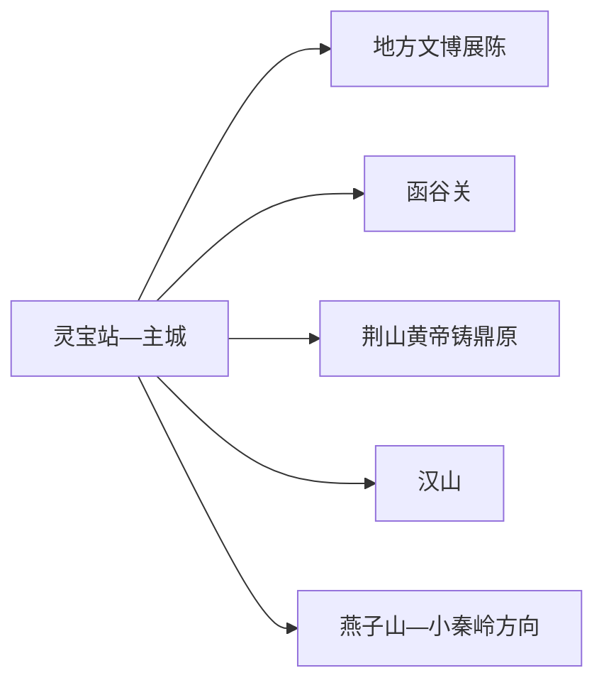
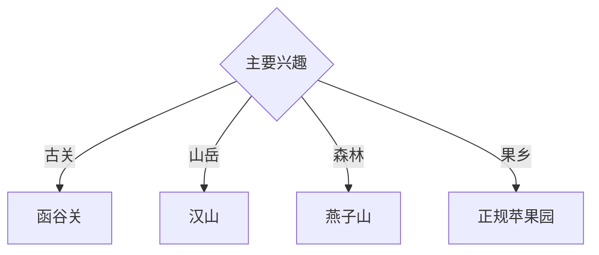

# 灵宝旅行指南

灵宝位于豫陕晋交界的黄河南岸，函谷关历史、秦岭北麓山地、黄帝铸鼎文化与苹果产业形成古关、山林和果乡三条线。固定快照中的 **Lingbao / GeoNames 1809289** 对应现行灵宝市；函谷关、汉山、燕子山和小秦岭方向距离明显，适合一天一处。

## 城市速览

| 项目 | 信息 |
|---|---|
| 主线 | 灵宝文博—函谷关—汉山—燕子山 |
| 停留 | 主城与函谷关1天；每条山地另加1天 |
| 住宿 | 灵宝主城便于铁路与公路；山地住宿按早入景区选择 |
| 交通 | 高铁、普铁和公路抵达，远端宜景区交通、约车或自驾 |
| 风险 | 山洪林火、索道停运、小秦岭矿区、黄河水情与果园生产 |

## 城市格局与游览区域

主城承担住宿、换乘和地方展陈；函谷关位于东北方向，可与主城组合。汉山、燕子山和小秦岭山地分属不同方向并受季节开放影响；黄金矿山、尾矿设施、森林保护区和果园生产区依正式边界进入。

## 主要景点

| 景点 | 区域 | 类型 | 核心体验 | 用时 | 环境 | 体力 | 研究价值 | 拥挤 | 优先级 |
|---|---|---|---|---:|---|---|---|---|---|
| 函谷关历史文化旅游区 | 函谷关镇 | 关隘与历史景区 | 古关交通、老子文化与秦汉史 | 半天至1天 | 混合 | 中 | 很高 | 节假日高 | A |
| 灵宝市博物馆或地方展陈 | 主城 | 博物馆 | 弘农历史、函谷关与地方考古 | 2小时 | 室内 | 低 | 高 | 团体时中 | A |
| 汉山旅游区 | 故县方向 | 秦岭山地 | 峰林、森林、登高与索道 | 1天 | 室外 | 高 | 高 | 旺季中高 | A |
| 燕子山风景区 | 阳平方向 | 森林景区 | 森林、山地生态与康养步道 | 1天 | 室外 | 高 | 高 | 旺季中 | A |
| 荆山黄帝铸鼎原公开区 | 阳平镇方向 | 文化遗址 | 黄帝文化、祭祀记忆与塬地景观 | 半天 | 室外 | 低中 | 高 | 节庆时高 | B |
| 黄河与函谷关东寨正规游览区 | 北部沿黄 | 河流与乡村 | 黄河地貌、村落与关隘外缘 | 半天 | 室外 | 低中 | 中 | 周末中 | B |
| 正规苹果园或果业展示点 | 寺河等果乡 | 农业体验 | 高山苹果、果业技术与季节采摘 | 半天 | 混合 | 低 | 高 | 采摘季中高 | B |

## 美食与餐饮

灵宝肉夹馍、羊肉汤、甑糕和苹果制品具有地方辨识度。果园采摘进入正式经营区并确认品种、价格和快递；登山日准备饮水、简餐与保暖防雨装备。

## 经典行程

### 一日历史基础线
**路线**：地方展陈—午餐—函谷关公开区—返城。**逻辑**：先读弘农通史，再进入古关地理。**预约锚点**：展馆、景区与演出。**休息**：函谷关游客中心。**删除条件**：时间不足时保留函谷关核心线。

### 函谷关深读线
**路线**：景区展陈—关楼与古道公开段—老子文化空间—东寨正规游览点。**逻辑**：从交通、军事和思想史多层理解古关。**预约锚点**：开放、讲解和演出时刻。**休息**：景区服务区。**删除条件**：古道维护时保留核心建筑与展陈。

### 汉山登高线
**路线**：主城—汉山入口—索道或开放登山线—观景点—返程。**逻辑**：给秦岭山地完整一天。**预约锚点**：景区、索道、天气和末班。**休息**：游客中心。**删除条件**：索道检修、雷雨、结冰、落石或林火预警时取消。

### 燕子山森林线
**路线**：主城—燕子山入口—森林公开线—返程。**逻辑**：以较慢节奏观察秦岭北麓生态。**预约锚点**：开放、天气和车辆。**休息**：正规服务点。**删除条件**：闭园、林火或强降雨时取消。

### 黄帝文化线
**路线**：主城—荆山黄帝铸鼎原公开区—文化展陈—返城。**逻辑**：区分文化记忆、祭祀活动与考古证据。**预约锚点**：开放与活动客流。**休息**：景区服务区。**删除条件**：大型活动管控时改主城文博。

### 果乡亲子线
**路线**：地方展陈—午休—正规苹果园—果业科普与采摘。**逻辑**：用城市历史和季节农业组合低体力行程。**预约锚点**：果园接待和采摘期。**休息**：经营者服务区。**删除条件**：非采摘期或天气不适时改果业展销空间。

### 雨天线
**路线**：地方展陈—午餐—函谷关室内展陈—正规文化馆。**逻辑**：压缩山地暴露并保留古关主题。**预约锚点**：馆舍和景区开放。**休息**：主城或函谷关。**删除条件**：道路积水时就近返宿。

## 住宿区域

灵宝站—主城适合铁路、公路和多方向换乘；函谷关或山地入口附近正规住宿适合早游。山地住宿按合法经营、消防、夜间道路和天气响应能力选择。

## 市内交通

灵宝西站与灵宝站服务不同铁路方向，订票后核对站点。主城用公交、出租车和网约车；函谷关、汉山、燕子山、铸鼎原与果乡提前确认城乡班次、索道或预约返程。

## 不同旅行者须知

历史兴趣者优先函谷关；山地旅行者把汉山与燕子山分日；亲子家庭选择文博与正规果园；行动不便者确认景交索道、古道坡度和卫生间。

## 行前核对

- 核对地方展陈、函谷关、汉山、燕子山、铸鼎原与果园接待。
- 核对铁路站点、山地闭园公告、索道、天气、水情和返程。
- 小秦岭矿山与尾矿区、森林保护区、黄河堤防、古道修缮区和果园生产区按正式开放与生产边界进入。

## 来源与更新记录

| 来源 | 支持内容 | 核验日期 |
|---|---|---|
| [灵宝市政府：公共旅游](https://www.lingbao.gov.cn/16473/0000/subList-1.html) | 函谷关、汉山、燕子山当期开放公告入口 | 2026-09-01 |
| [灵宝市政府：汉山旅游区](https://www.lingbao.gov.cn/16031/615870144/1273993.html) | 汉山位置、山地属性与服务设施 | 2026-09-01 |
| [GeoNames 1809289](https://www.geonames.org/1809289/) | Lingbao 固定人口点与位置 | 2026-09-01 |

| 日期 | 更新 |
|---|---|
| 2026-09-01 | 首次完成灵宝旅行研究；建立古关、山岳、森林与果乡路线。 |

