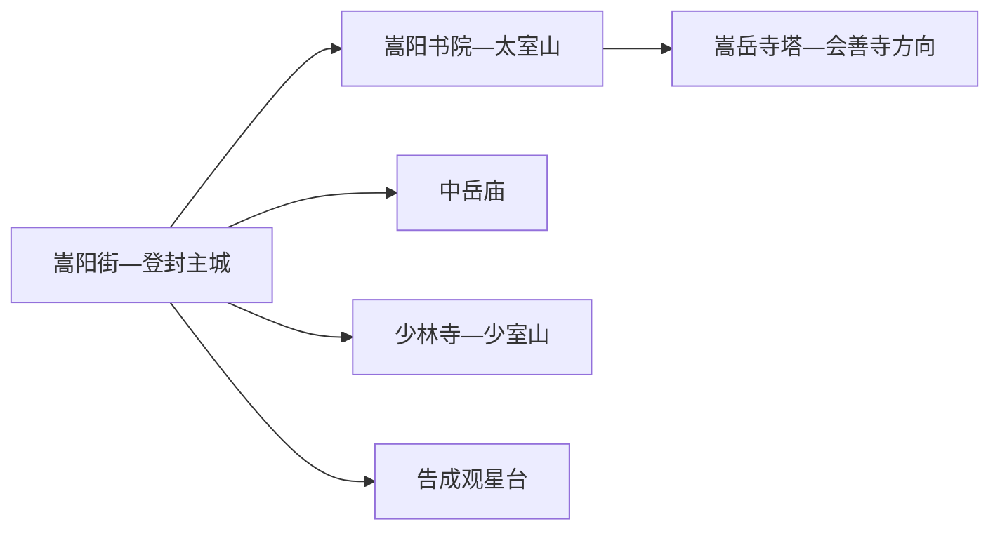
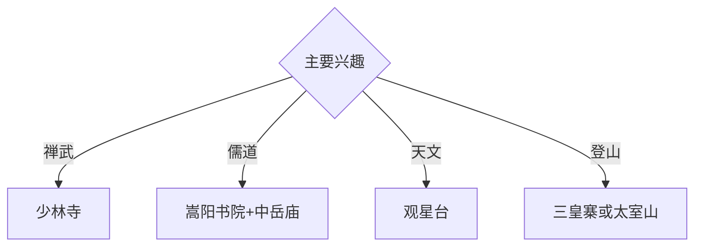

# 登封旅行指南

登封位于嵩山腹地，少林寺、嵩阳书院、中岳庙、观星台等“天地之中”历史建筑群，与太室山、少室山地质景观共同构成高密度文化目的地。固定快照中的 **Songyang / GeoNames 1813016** 对应登封主城嵩阳街一带；世界遗产的8处11项分散在多个方向，需要按片区安排。

## 城市速览

| 项目 | 信息 |
|---|---|
| 主线 | 少林寺—嵩阳书院—中岳庙—观星台 |
| 停留 | 文化基础2天；增加三皇寨或深度世遗需3–4天 |
| 住宿 | 登封主城便于三方向换乘；少林方向适合早入景区 |
| 交通 | 郑州、洛阳公路衔接，景区间用旅游交通、公交或约车 |
| 风险 | 世界遗产保护、山地天气、武术演出时刻、景交末班与宗教礼仪 |

## 城市格局与游览区域

主城位于太室山与少室山之间，是住宿和换乘基点。少林寺、嵩阳书院—太室山、中岳庙和告成观星台分属不同片区；“天地之中”是成组世界遗产，行程按片区组合，同时尊重每处文物的独立开放与保护范围。

## 主要景点

| 景点 | 区域 | 类型 | 核心体验 | 用时 | 环境 | 体力 | 研究价值 | 拥挤 | 优先级 |
|---|---|---|---|---:|---|---|---|---|---|
| 少林寺景区公开区 | 少室山 | 寺院与世界遗产 | 常住院、塔林、禅武文化与山地环境 | 半天至1天 | 混合 | 中高 | 很高 | 旺季很高 | A |
| 嵩阳书院 | 太室山南麓 | 书院与世界遗产 | 理学、古树、碑刻与书院教育 | 2–3小时 | 混合 | 低中 | 很高 | 节假日高 | A |
| 中岳庙 | 主城东部 | 道教建筑与世界遗产 | 五岳祭祀、院落轴线与古柏 | 2–3小时 | 混合 | 低 | 很高 | 节假日中高 | A |
| 观星台与周公测景台 | 告成镇 | 天文遗产 | 圭表测影、历法与“天地之中”理念 | 2–3小时 | 混合 | 低 | 很高 | 团体时中 | A |
| 嵩岳寺塔公开区 | 太室山方向 | 古塔与世界遗产 | 北魏砖塔、佛教建筑与山地空间 | 2–3小时 | 室外 | 中 | 很高 | 节假日中 | B |
| 三皇寨正规游线 | 少室山 | 山岳景区 | 峭壁、地质构造与登高视野 | 1天 | 室外 | 高 | 高 | 旺季高 | B |
| 登封历史博物馆或地方展陈 | 主城 | 博物馆 | 嵩山文明、世界遗产与地方考古 | 2小时 | 室内 | 低 | 高 | 团体时中 | B |

## 美食与餐饮

登封烧饼、刀削面、烩面和嵩山素食具有地方辨识度。寺院周边餐饮尊重宗教场所秩序，景区与主城价格、营业时段不同；登山日准备饮水、简餐和电解质补给。

## 经典行程

### 一日文化基础线
**路线**：嵩阳书院—午餐—中岳庙—主城地方展陈。**逻辑**：用儒、道与城市史建立嵩山框架。**预约锚点**：两处景区和展馆开放。**休息**：主城。**删除条件**：时间不足时保留书院与中岳庙。

### 少林禅武线
**路线**：主城—少林景区入口—常住院—塔林—正式演出或公共展陈—返程。**逻辑**：把宗教、建筑与武术放在同一片区理解。**预约锚点**：门票、景交和演出时刻。**休息**：游客中心。**删除条件**：客流高或活动调整时取消演出延伸。

### 太室山文教线
**路线**：嵩阳书院—嵩岳寺塔公开区—会善寺当期开放单元—返城。**逻辑**：沿太室山阅读书院和佛教建筑。**预约锚点**：各遗产点开放和车辆。**休息**：书院服务区。**删除条件**：山路维护或恶劣天气时只留书院。

### 观星台天文线
**路线**：主城—告成观星台—周公测景台—官方科普讲解—返城。**逻辑**：集中理解测影、历法与中心观念。**预约锚点**：开放、讲解和交通。**休息**：告成镇。**删除条件**：场地维护时改主城文博主题。

### 三皇寨登山线
**路线**：正式入口—景交或索道—开放山脊线—原路或管理线路返程。**逻辑**：给少室山地质景观完整一天。**预约锚点**：天气、索道、景交和末班。**休息**：正规服务点。**删除条件**：雷雨、大风、结冰、落石或林火预警时取消。

### 亲子研学线
**路线**：地方展陈—嵩阳书院—午休—观星台。**逻辑**：用教育史和可视化天文原理连接两处遗产。**预约锚点**：亲子讲解与车辆。**休息**：书院和告成服务点。**删除条件**：儿童体力不足时取消主城延伸。

### 雨天线
**路线**：地方展陈—午餐—嵩阳书院室内开放单元—正规武术展演。**逻辑**：压缩山地暴露并保留文化主线。**预约锚点**：馆舍和演出。**休息**：主城。**删除条件**：强降雨影响道路时就近返宿。

## 住宿区域

登封主城适合嵩阳、中岳、少林和告成多方向换乘；少林方向正规住宿适合早入景区。山地住宿按合法经营、消防、夜间交通和恶劣天气响应能力选择。

## 市内交通

登封主要通过公路连接郑州、洛阳等城市。主城用公交、出租车和网约车；少林、三皇寨、观星台与太室山各自核对入口、景交和末班，世界遗产点之间按车程安排。

## 不同旅行者须知

世界遗产兴趣者至少留两天；登山者把三皇寨与太室山分日；亲子家庭优先书院和观星台；行动不便者确认景交、古建门槛、山地台阶和无障碍卫生间。

## 行前核对

- 核对少林、嵩阳、中岳、观星台、嵩岳寺塔和山地游线开放。
- 核对天气、客流预约、景交索道、演出时刻和返程。
- 世界遗产保护区、宗教生活区、考古工作区、森林防火区和崖壁施工区按正式开放边界进入。

## 来源与更新记录

| 来源 | 支持内容 | 核验日期 |
|---|---|---|
| [登封市政府：美景登封](https://www.dengfeng.gov.cn/mjdf/index.jhtml) | 少林寺、嵩阳书院、中岳庙、观星台与山地景点 | 2026-09-01 |
| [登封市政府：走进“天地之中”](https://www.dengfeng.gov.cn/twwh/7741170.jhtml) | 世界遗产8处11项及天文、书院价值 | 2026-09-01 |
| [GeoNames 1813016](https://www.geonames.org/1813016/) | Songyang 固定人口点与主城位置 | 2026-09-01 |

| 日期 | 更新 |
|---|---|
| 2026-09-01 | 首次完成登封旅行研究；建立禅武、儒道、天文与山地路线。 |

