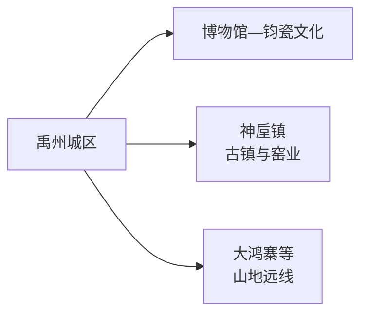
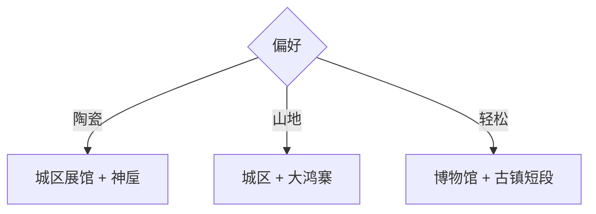

# 禹州旅行指南

禹州最适合围绕两条线选择：城区用博物馆和钧瓷展陈建立历史背景，神垕方向用完整一天看钧瓷生产、古镇和窑址。大鸿寨等山地方向再单独加一天。

> 建议停留：城区 1 天；神垕 1 天；山地另留 1 天 
> 旅行关键词：钧瓷、神垕古镇、夏文化、中医药、山地 
> 无障碍说明：现代场馆可询问电梯与轮椅；古镇坡道、窑址和山地步道的设施连续性需向官方确认

## 城市速览
| 项目 | 旅行信息 |
|---|---|
| 主要旅行价值 | 钧瓷文化、神垕古镇、地方历史与伏牛山余脉 |
| 建议停留 | 2–3 天 |
| 舒适季节 | 春秋适合古镇和山地，夏季避开高温强对流 |
| 预算特点 | 城区平实，神垕体验、车辆和山地票务增加预算 |
| 步行强度 | 城区低至中，神垕中等，山地高 |
| 天气风险 | 高温、雷雨、山洪、冬季结冰和森林火险 |
| 独行旅行 | 城区方便，神垕提前锁返程 |
| 亲子旅行 | 博物馆和合规钧瓷体验适合分日 |
| 长者与低体力 | 场馆加古镇主街短段 |
| 行前重点 | 场馆、窑址开放、体验预约、山地天气和交通 |

## 城市格局与游览区域
禹州是许昌代管的县级市，代码 `411081`。固定 GeoNames `1785566` 是城区点；法定实体 `Q1344848` 的 `P1566=1785569` 连接另一记录，二者用途不同。

| 区域 | 主要内容 | 行动建议 | 时间 |
|---|---|---|---|
| 禹州城区 | 博物馆、钧瓷展陈、城市生活 | 作为住宿与交通基地 | 1 天 |
| 神垕镇 | 古镇、窑址、钧瓷生产文化 | 完整一天，先预约体验 | 1 天 |
| 山地方向 | 大鸿寨等正式景区 | 天气稳定时独立安排 | 1 天 |
| 产业空间 | 钧瓷、中药材、煤炭和建材 | 只参加明确接待项目 | 预约制 |

## 主要景点
### 城区与神垕
| 景点 | 区域 | 类型 | 主要看点 | 建议用时 | 室内外 | 体力 | 预约风险 | 天气影响 | 优先级 |
|---|---|---|---|---:|---|---|---|---|---|
| 禹州市博物馆 | 城区 | 博物馆 | 地方史、夏文化线索、钧瓷与文物 | 2–3 小时 | 室内 | 低 | 高 | 低 | A |
| 中国钧瓷文化园或当期开放钧瓷展馆 | 城区 | 陶瓷、展陈 | 钧瓷工艺、器物与产业史 | 2–3 小时 | 室内 | 低 | 高 | 低 | A |
| 神垕古镇 | 神垕 | 古镇、产业文化 | 窑业街巷、传统建筑与当代生产生活 | 3–5 小时 | 混合 | 中 | 中 | 中高 | A |
| 钧官窑址博物馆或正式开放窑址 | 神垕方向 | 考古、陶瓷 | 窑址、烧造史与保护展示 | 1.5–3 小时 | 混合 | 中 | 高 | 中 | A |
| 合规钧瓷体验项目 | 神垕 | 手工体验 | 拉坯、施釉或工艺讲解 | 1–2 小时 | 室内 | 低至中 | 很高 | 低 | B |

### 山地与远线
| 景点 | 区域 | 类型 | 主要看点 | 建议用时 | 室内外 | 体力 | 预约风险 | 天气影响 | 优先级 |
|---|---|---|---|---:|---|---|---|---|---|
| 大鸿寨正式开放景区 | 鸠山方向 | 山地、森林 | 山地步道、森林与季节景观 | 1 天 | 室外 | 高 | 高 | 很高 | B |
| 禹州森林植物园或城市公园代表段 | 城区近郊 | 公园 | 城市休息和植物观察 | 1.5–3 小时 | 室外 | 低至中 | 低 | 高 | C |

神垕古镇作为一个完整古镇单元安排，街巷、窑炉、店铺和体验统一规划；窑址保护区与生产厂区按实际开放入口参观。

## 美食与餐饮
| 类型 | 怎么点 | 份量与过敏原 | 选择建议 |
|---|---|---|---|
| 禹州焖子 | 可作小份凉菜或热菜 | 常含淀粉、肉汤、蒜和辣椒 | 先问制作和份量 |
| 粉条、杂炣与地方汤食 | 单人一碗 | 汤底可能含牛羊肉、内脏和小麦 | 明确汤底与辣度 |
| 烩面与家常豫菜 | 单人主食或多人共享 | 小麦、花生、大豆和肉类 | 在城区或神垕成熟餐饮区选择 |
| 中药材相关饮品 | 少量尝试 | 药食同源不等于适合所有人 | 有慢性病或用药时先咨询医生 |

## 经典行程

### 一日经典路线
**路线**：禹州市博物馆 → 城区午餐 → 钧瓷文化展馆 → 城市公园短段
- **串联逻辑**：用两座场馆建立禹州与钧瓷背景。
- **预约锚点**：博物馆和钧瓷展馆。
- **休息安排**：午餐和下午茶留在城区。
- **时间不足时**：只保留博物馆与一座钧瓷展馆。

### 两日城市路线
**第 1 天**：城区经典路线 
**第 2 天**：神垕古镇 → 窑址或合规体验二选一 → 神垕晚餐
- **串联逻辑**：从展陈走向真实窑业城镇。
- **预约锚点**：窑址开放和体验时段。
- **休息安排**：古镇主街和游客服务点。
- **时间不足时**：保留古镇和一个核心场馆。

### 三日深度路线
**第 1 天**：城区 
**第 2 天**：神垕 
**第 3 天**：大鸿寨正式开放线路
- **串联逻辑**：历史、产业和山地分日。
- **预约锚点**：第三天景区开放与车辆。
- **休息安排**：景区服务点分段休息。
- **时间不足时**：删除第三天。

### 雨天路线
**路线**：博物馆 → 午餐 → 钧瓷展馆或预约体验
- **适用条件**：城市道路正常。
- **串联逻辑**：全部使用室内锚点。
- **预约锚点**：体验和场馆临时开放。
- **休息安排**：城区餐饮区。
- **时间不足时**：保留博物馆。

### 亲子或低体力路线
**亲子路线**：博物馆 → 午休 → 合规钧瓷体验 
**低体力路线**：车辆到博物馆 → 午休 → 神垕主街短段
- **减负方式**：每天一座核心场馆，古镇少走支巷。
- **预约锚点**：体验年龄、轮椅、电梯和落客点。
- **休息安排**：场馆和主街服务点。
- **时间不足时**：只保留博物馆或体验之一。

### 远郊路线
**路线**：大鸿寨或神垕二选一
- **适用条件**：天气、道路和返程明确。
- **串联逻辑**：山地与产业古镇各自完整成日。
- **预约锚点**：景区、场馆和车辆。
- **休息安排**：游客中心或镇区。
- **时间不足时**：改为城区场馆线。

## 住宿区域
| 区域 | 优点 | 取舍 | 适合人群 |
|---|---|---|---|
| 禹州城区 | 食宿、交通和场馆方便 | 去神垕仍需公路接驳 | 首访、短住 |
| 神垕镇正式住宿 | 便于早晚看古镇 | 选择少于城区 | 陶瓷深度、摄影 |
| 山地景区周边 | 便于早起 | 运营季节和餐饮有限 | 山地旅行 |

## 市内交通
- 禹州城区与许昌、郑州方向按铁路或公路实际班次组合。
- 前往神垕和山地方向，提前确认城乡客运、景区车辆或合规包车返程。
- 陶瓷厂区、矿区和货运道路按生产管理通行，只进入正式接待线路。

## 不同旅行者须知
| 情况 | 怎么安排 | 重点核对 |
|---|---|---|
| 独行 | 住城区，神垕日锁返程 | 末班与叫车范围 |
| 亲子 | 场馆加短时体验 | 高温窑炉、工具和材料安全 |
| 长者与低体力 | 车辆到主入口，古镇短游 | 台阶、坡道、卫生间 |
| 陶瓷购买 | 先问作者、工艺、瑕疵和物流 | 价格、证书、包装与退换 |
| 山地 | 早出早回 | 雷雨、防火、结冰和通信 |

## 行前核对
| 项目 | 何时核对 | 官方入口 |
|---|---|---|
| 博物馆、神垕和钧瓷场馆 | 出发前一周及前一日 | [禹州市人民政府](https://www.yuzhou.gov.cn/)及文旅公告 |
| 山地开放与森林火险 | 出发前三日及当天 | 禹州应急、林业和景区公告 |
| 铁路、城乡客运 | 购票时及前一日 | [中国铁路 12306](https://www.12306.cn/)及交通部门 |
| 高温、雷雨与地灾 | 出发前三日起每日 | [中国气象局](https://www.cma.gov.cn/) |

## 来源与更新记录
| 来源 | 支持内容 | 核验日期 |
|---|---|---|
| [禹州市人民政府](https://www.yuzhou.gov.cn/) | 市情、文旅与动态入口 | 2026-08-13 |
| [禹州市 2024 年统计公报](https://www.yuzhou.gov.cn/jczwgkbzhgfhml/031001/031001029/031001029004/031001029004001/20250520/a64ca9b5-ab76-453f-b614-891c69ca8f09.html) | 钧陶瓷产业、公共场馆、气候与旅游基础 | 2026-08-13 |
| [民政部行政区划代码查询](https://dmfw.mca.gov.cn/xzqh/getList?code=41&trimCode=true&maxLevel=3) | `411081` 县级市层级 | 2026-08-13 |
| [GeoNames 1785566](https://www.geonames.org/1785566/yuzhou.html) | 固定城区点 | 2026-08-13 |
| [Wikidata Q1344848](https://www.wikidata.org/wiki/Q1344848) | 法定实体与 `P1566=1785569` | 2026-08-13 |

| 日期 | 更新 |
|---|---|
| 2026-08-13 | 首次完成禹州市指南；建立城区、神垕和山地三层路线。 |
