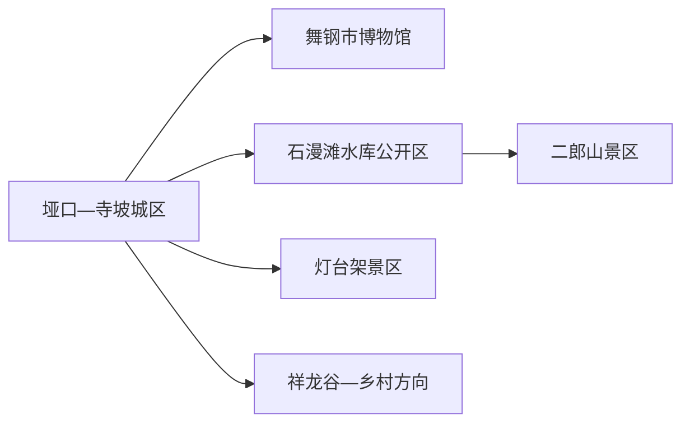
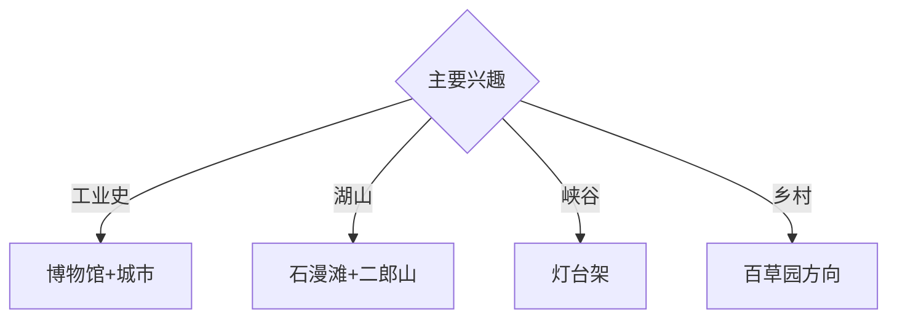

# 舞钢旅行指南

舞钢位于伏牛山东缘，石漫滩水库、二郎山与灯台架山地、冶铁博物馆和现代钢铁城市共同构成“山水林城”的旅行结构。固定快照中的 **Wugang / GeoNames 1791271** 对应河南省舞钢市，与湖南武冈分开管理。

## 城市速览

| 项目 | 信息 |
|---|---|
| 主线 | 舞钢博物馆—石漫滩—二郎山—灯台架 |
| 停留 | 城区与湖区1天；每条山地另加1天 |
| 住宿 | 垭口—寺坡城区便于综合换乘；景区住宿按早入山需求选择 |
| 交通 | 公路抵达为主，景区间宜约车或自驾 |
| 风险 | 水库管理、山洪林火、钢铁生产区、矿山与乡村道路 |

## 城市格局与游览区域

垭口—寺坡集中住宿、博物馆和城市服务，石漫滩水库与二郎山相邻但按各自入口游览；灯台架与祥龙谷是独立山地组团。钢铁厂、矿区和水库工程设施按生产与安全门禁管理。

## 主要景点

| 景点 | 区域 | 类型 | 核心体验 | 用时 | 环境 | 体力 | 研究价值 | 拥挤 | 优先级 |
|---|---|---|---|---:|---|---|---|---|---|
| 舞钢市博物馆 | 垭口 | 博物馆 | 冶铁文化、地方史与工业城市 | 2–3小时 | 室内 | 低 | 很高 | 团体时中 | A |
| 石漫滩水库正式游览区 | 寺坡方向 | 湖泊与水利 | 水库地理、城市湖景与水利史 | 半天 | 室外 | 低中 | 高 | 周末中 | A |
| 二郎山景区 | 石漫滩方向 | 山地景区 | 湖山视野、森林步道与民俗活动 | 1天 | 室外 | 高 | 高 | 旺季中高 | A |
| 灯台架景区 | 杨庄方向 | 山地峡谷 | 峡谷、瀑布、森林与地质 | 1天 | 室外 | 高 | 很高 | 旺季中 | A |
| 祥龙谷正式游线 | 南部山地 | 峡谷景区 | 山谷、溪流与森林生态 | 半天至1天 | 室外 | 高 | 高 | 旺季中 | B |
| 舞钢城市滨湖公园公开段 | 城区 | 城市公园 | 山水林城格局与居民生活 | 1–2小时 | 室外 | 低 | 中 | 傍晚中 | B |
| 百草园等正规乡村体验点 | 市域乡村 | 农旅 | 药草、田园与乡村休闲 | 半天 | 混合 | 低中 | 中 | 节假日中 | B |

## 美食与餐饮

舞钢热豆腐、山野菜、库区鱼和豫西南家常菜具有地方辨识度。水库鱼选择正规餐馆和合法来源；野生菌与药草由正规经营者把关。山地日准备饮水、简餐和防晒防雨装备。

## 经典行程

### 一日城市湖区线
**路线**：舞钢市博物馆—午餐—石漫滩公开观景区—城市滨湖公园。**逻辑**：从冶铁史进入水库与现代城市。**预约锚点**：博物馆和水库开放。**休息**：寺坡商业区。**删除条件**：高温或大风时缩短湖岸段。

### 二郎山湖山线
**路线**：城区—二郎山入口—开放登山线—湖景观景点—返城。**逻辑**：完整一天处理湖山高差。**预约锚点**：门票、接驳和末班。**休息**：景区服务区。**删除条件**：山洪、雷雨、结冰或林火预警时取消。

### 灯台架峡谷线
**路线**：城区—灯台架入口—峡谷公开线—瀑布或观景点—返城。**逻辑**：集中观察山地峡谷。**预约锚点**：道路、景交和返程。**休息**：游客中心。**删除条件**：强降雨、落石或步道维护时取消。

### 祥龙谷森林线
**路线**：城区—祥龙谷正式入口—森林溪谷—返城。**逻辑**：以较慢节奏完成独立自然主题。**预约锚点**：开放、天气和车辆。**休息**：正规服务点。**删除条件**：林火、洪水或道路管控时取消。

### 冶铁城市线
**路线**：市博物馆—城市公共工业记忆点—午餐—滨湖公园。**逻辑**：在公共空间理解工业城市形成。**预约锚点**：博物馆讲解。**休息**：城区。**删除条件**：露天点维护时增加室内展陈。

### 亲子低体力线
**路线**：市博物馆—午休—石漫滩近入口公开段—正规乡村体验。**逻辑**：室内工业史配平缓湖岸。**预约锚点**：亲子活动和农旅接待。**休息**：馆内与服务区。**删除条件**：强对流时只留室内。

### 雨天线
**路线**：市博物馆—午餐—主城公共文化馆—正规室内体验。**逻辑**：避开山路并保留城市主题。**预约锚点**：馆舍开放。**休息**：城区。**删除条件**：道路积水时就近返宿。

## 住宿区域

垭口—寺坡城区适合公路抵离、餐饮和多方向换乘；二郎山周边正规住宿适合早入山。山地与乡村住宿按合法经营、消防、夜间道路和天气响应能力选择。

## 市内交通

舞钢以公路交通为主，外部可从平顶山、漯河等方向衔接。城区用公交、出租车和网约车；二郎山、灯台架、祥龙谷与乡村点位提前确认城乡公交末班或预约返程。

## 不同旅行者须知

工业兴趣者优先博物馆；山地旅行者把二郎山与灯台架分开；亲子家庭选择博物馆和湖区；行动不便者确认景区接驳、山地台阶、滨湖步道和卫生间。

## 行前核对

- 核对博物馆、石漫滩、二郎山、灯台架、祥龙谷与乡村接待。
- 核对公路班次、水情、山洪林火、景区交通和返程。
- 水库大坝与泄洪设施、钢铁厂、矿山、林地和农田按正式开放与门禁边界进入。

## 来源与更新记录

| 来源 | 支持内容 | 核验日期 |
|---|---|---|
| [平顶山市文旅局：舞钢市博物馆](https://wglj.pds.gov.cn/contents/12528/261624.html) | 冶铁文化、馆址与展陈 | 2026-09-01 |
| [平顶山市政府：市情简介](https://rsj.pds.gov.cn/contents/22427/679033.html) | 二郎山、灯台架、祥龙谷与山水林城格局 | 2026-09-01 |
| [GeoNames 1791271](https://www.geonames.org/1791271/) | Wugang 固定人口点与位置 | 2026-09-01 |

| 日期 | 更新 |
|---|---|
| 2026-09-01 | 首次完成舞钢旅行研究；建立工业、湖山、峡谷与乡村路线。 |
