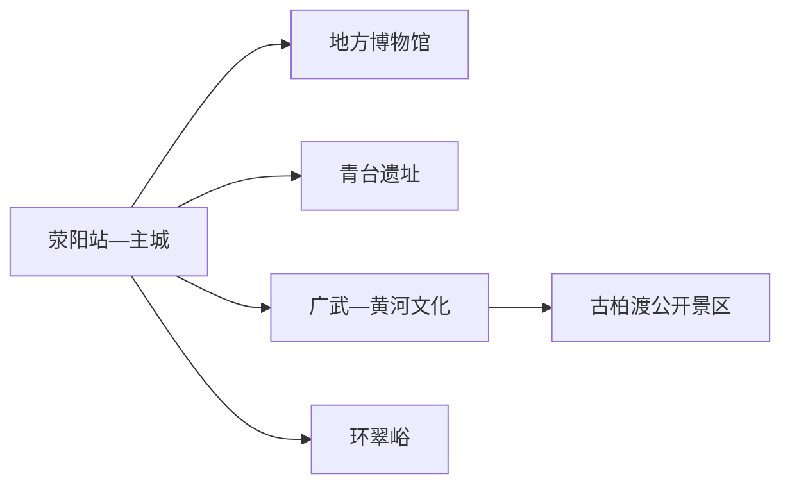
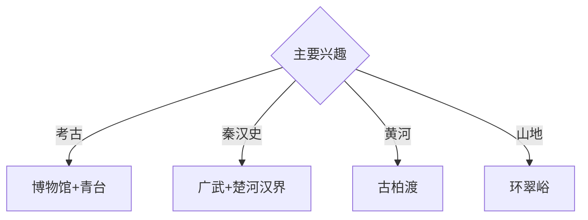

# 荥阳旅行指南

荥阳位于郑州西部，青台与小双桥等考古遗址、楚河汉界相关地景、黄河丘陵和环翠峪山地构成城市周边的历史与自然路线。固定快照中的 **Xingyang / GeoNames 1788911** 对应现行荥阳市；主城、黄河方向和南部山地需要分日安排。

## 城市速览

| 项目 | 信息 |
|---|---|
| 主线 | 荥阳博物馆—青台遗址—广武黄河文化—环翠峪 |
| 停留 | 主城1天；黄河或山地各另加1天 |
| 住宿 | 荥阳主城便于铁路与公路；郑州住宿适合跨城联程 |
| 交通 | 郑州都市圈轨道、公路与铁路衔接，远端宜约车或自驾 |
| 风险 | 考古开放日、黄河水情、山洪林火、采石与农业生产边界 |

## 城市格局与游览区域

主城承担住宿和地方展陈；青台遗址的公众开放依考古安排而变化。广武与古柏渡位于北部黄河丘陵，环翠峪位于南部山地，两条远线方向相反；郑州市区景点不纳入荥阳城市页。

## 主要景点

| 景点 | 区域 | 类型 | 核心体验 | 用时 | 环境 | 体力 | 研究价值 | 拥挤 | 优先级 |
|---|---|---|---|---:|---|---|---|---|---|
| 荥阳市博物馆或地方展陈 | 主城 | 博物馆 | 史前考古、郑氏文化与城市史 | 2小时 | 室内 | 低 | 高 | 团体时中 | A |
| 青台遗址公众开放活动区 | 广武方向 | 考古遗址 | 仰韶文化、北斗九星与丝织考古 | 半天 | 室外 | 中 | 很高 | 开放日高 | A |
| 广武古城与楚河汉界公开区 | 北部 | 历史地景 | 秦汉战争地理、黄河台地与古城 | 半天 | 室外 | 中 | 高 | 节假日中 | A |
| 古柏渡黄河文化旅游区 | 黄河南岸 | 黄河景区 | 黄河地貌、渡口文化与管理型体验 | 半天至1天 | 室外 | 中 | 高 | 旺季高 | B |
| 环翠峪风景名胜区 | 南部山地 | 山地景区 | 峡谷、森林与嵩山北麓地貌 | 1天 | 室外 | 高 | 高 | 旺季中 | A |
| 刘禹锡墓及公开纪念空间 | 城郊 | 名人纪念 | 唐代文学、墓园与地方文化 | 1–2小时 | 室外 | 低 | 高 | 节假日中 | B |
| 索河正式滨水公园段 | 主城 | 城市公园 | 河流治理、城市慢行与日常生活 | 1–2小时 | 室外 | 低 | 中 | 傍晚中 | B |

## 美食与餐饮

烩面、焖子、柿子与豫中家常菜具有地方辨识度。黄河鱼选择正规餐馆和合法来源；果园采摘进入经营者正式接待区。山地日自备饮水和简餐，夏季补充防晒与电解质。

## 经典行程

### 一日历史基础线
**路线**：地方展陈—午餐—刘禹锡纪念空间—索河公园。**逻辑**：用文物、文学与城市水系建立框架。**预约锚点**：博物馆和纪念空间开放。**休息**：主城。**删除条件**：高温时缩短滨水段。

### 青台考古线
**路线**：主城—青台遗址公众入口—考古解说—返城。**逻辑**：按官方开放日理解史前聚落。**预约锚点**：开放活动、讲解和车辆。**休息**：公众服务区。**删除条件**：考古作业或保护安排未开放时改博物馆。

### 广武秦汉线
**路线**：广武古城—楚河汉界公开点—午餐—黄河台地观景—返城。**逻辑**：把战争史放回地形。**预约锚点**：点位开放和车辆。**休息**：广武镇。**删除条件**：大风、道路管控或能见度低时缩短台地段。

### 古柏渡黄河线
**路线**：正式游客入口—黄河文化展陈—公开体验项目—返城。**逻辑**：在受管理空间观察黄河。**预约锚点**：项目运营、水情和返程。**休息**：游客中心。**删除条件**：洪水、大风或项目停运时取消亲水活动。

### 环翠峪山地线
**路线**：主城—环翠峪入口—开放峡谷与森林线—返城。**逻辑**：完整一天体验南部山地。**预约锚点**：门票、接驳和末班。**休息**：景区服务区。**删除条件**：山洪、雷雨、结冰或林火预警时取消。

### 亲子低体力线
**路线**：地方展陈—午休—青台科普活动或索河近入口段。**逻辑**：室内知识配可控户外观察。**预约锚点**：亲子活动。**休息**：馆内与主城。**删除条件**：青台未开放时只留主城。

### 雨天线
**路线**：地方展陈—午餐—正规文化馆—城市室内活动。**逻辑**：压缩移动并保留历史主线。**预约锚点**：馆舍开放。**休息**：主城。**删除条件**：强降雨积水时就近返宿。

## 住宿区域

荥阳主城适合铁路、公路和多方向换乘；郑州市区适合跨城联程，但每日往返需计入通勤。山地住宿按合法经营、消防、夜间交通和天气响应能力选择。

## 市内交通

荥阳站、郑州西站及都市圈交通服务不同出行方向，订票后核对实际站点。主城用公交、出租车和网约车；广武、古柏渡、青台与环翠峪提前核对城乡公交末班或预约返程。

## 不同旅行者须知

考古兴趣者围绕官方开放日安排青台；历史兴趣者优先广武；亲子家庭选择博物馆与科普活动；行动不便者确认遗址路面、黄河景区接驳、山地台阶和卫生间。

## 行前核对

- 核对青台公众开放、地方展陈、广武、古柏渡和环翠峪运营。
- 核对铁路站点、黄河水情、山地天气、景区交通和返程。
- 考古工作区、黄河滩区、河道工程区、矿山采石区、林地和农田按正式开放边界进入。

## 来源与更新记录

| 来源 | 支持内容 | 核验日期 |
|---|---|---|
| [河南省文物局：青台遗址公众开放](https://wwj.henan.gov.cn/2025/05-06/3154736.html) | 青台遗址、考古价值与开放活动 | 2026-09-01 |
| [荥阳市政府：环翠峪风景名胜区介绍](https://www.xingyang.gov.cn/lyjt/4601278.jhtml) | 环翠峪位置、山地环境与人文景观 | 2026-09-01 |
| [GeoNames 1788911](https://www.geonames.org/1788911/) | Xingyang 固定人口点与位置 | 2026-09-01 |

| 日期 | 更新 |
|---|---|
| 2026-09-01 | 首次完成荥阳旅行研究；建立考古、秦汉、黄河与山地路线。 |
