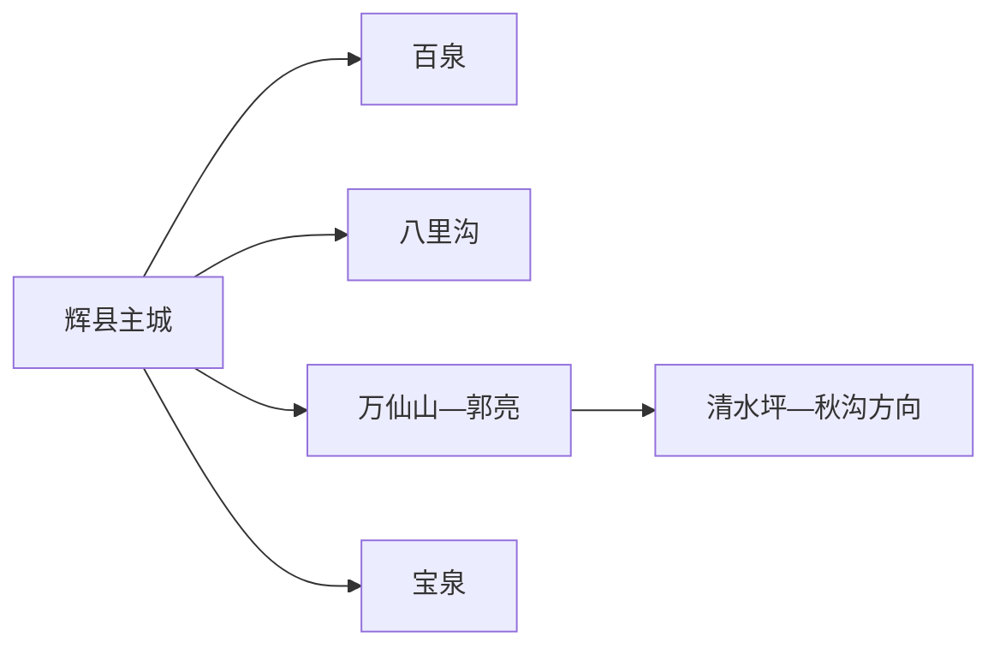
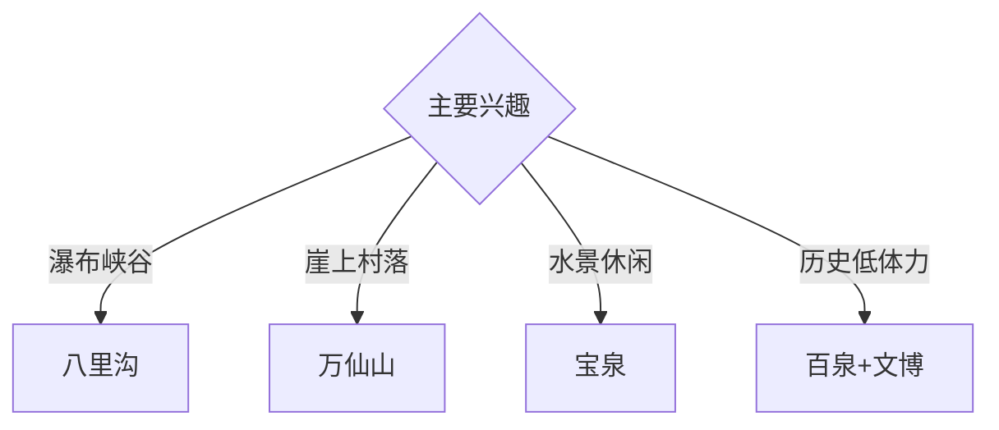

# 辉县旅行指南

辉县位于新乡西北部南太行山前，八里沟、万仙山、宝泉等峡谷景区与百泉历史水系构成“主城文脉—南太行山地”双线。固定快照中的 **Huixian / GeoNames 1806787** 对应现行辉县市；大型山地景区相距较远，一天集中游览一处更稳妥。

## 城市速览

| 项目 | 信息 |
|---|---|
| 主线 | 百泉—八里沟—万仙山—宝泉 |
| 停留 | 主城半天至1天；每处大型山地1天 |
| 住宿 | 辉县主城便于换乘；景区入口住宿适合早入山 |
| 交通 | 从新乡经公路抵达，景区宜旅游专线、约车或自驾 |
| 风险 | 峭壁公路、山洪落石、林火、景交末班和村落生产边界 |

## 城市格局与游览区域

主城承担住宿、换乘、百泉与地方展陈；八里沟、万仙山和宝泉分别拥有独立入口与景交体系。清水坪、秋沟、齐王寨等山地村落与景区另成方向，按正规接待和开放道路安排；挂壁公路、崖壁施工与林区管理边界保持清晰。

## 主要景点

| 景点 | 区域 | 类型 | 核心体验 | 用时 | 环境 | 体力 | 研究价值 | 拥挤 | 优先级 |
|---|---|---|---|---:|---|---|---|---|---|
| 八里沟景区 | 南太行 | 山地峡谷 | 瀑布、峡谷、岩壁与森林 | 1天 | 室外 | 高 | 很高 | 旺季高 | A |
| 万仙山景区 | 西北山地 | 山地与村落 | 郭亮洞、崖上村落与太行地貌 | 1天 | 混合 | 高 | 很高 | 旺季高 | A |
| 宝泉旅游度假区公开游线 | 西部山地 | 峡谷与水景 | 峡谷、瀑潭与管理型游线 | 1天 | 室外 | 中高 | 高 | 旺季高 | A |
| 百泉景区公开区 | 主城西北 | 历史园林与水系 | 泉群、卫源庙与地方水文化 | 2–3小时 | 混合 | 低 | 很高 | 节假日中 | A |
| 辉县市博物馆或地方展陈 | 主城 | 博物馆 | 共城历史、南太行与地方文物 | 2小时 | 室内 | 低 | 高 | 团体时中 | B |
| 清水坪正规接待区 | 南太行 | 山村与自然 | 山水村落、露营休闲与周边景区联动 | 半天至1天 | 室外 | 中 | 高 | 周末中 | B |
| 秋沟或齐王寨正规游览区 | 西北山地 | 峡谷与乡村 | 峡谷森林、山村与低密度山景 | 1天 | 室外 | 高 | 高 | 旺季中 | B |

## 美食与餐饮

烩菜、擀面皮、红焖羊肉和豫北山地家常菜具有地方辨识度。景区日提前准备饮水和简餐，旺季在游客中心或正规村落接待点用餐；山货购买关注来源、保存和明码标价。

## 经典行程

### 一日城市基础线
**路线**：地方展陈—午餐—百泉公开区—主城公共空间。**逻辑**：先建立地方史与水系框架，再进入南太行。**预约锚点**：展馆和百泉开放。**休息**：主城。**删除条件**：高温或水域维护时缩短户外段。

### 八里沟峡谷线
**路线**：主城或景区住宿—八里沟入口—景交—瀑布峡谷公开线—返程。**逻辑**：给核心峡谷完整一天。**预约锚点**：门票、景交和末班。**休息**：游客中心与服务点。**删除条件**：山洪、雷雨、落石或步道维护时取消。

### 万仙山村落线
**路线**：景区入口—景交—郭亮洞公开段—郭亮村公共区—返程。**逻辑**：把道路工程、崖壁地貌与村落放在同一空间理解。**预约锚点**：景交、道路和住宿。**休息**：正规游客服务区。**删除条件**：大雾、结冰、落石或道路管控时缩短。

### 宝泉水景线
**路线**：宝泉游客中心—景交—峡谷与水景公开线—返程。**逻辑**：用管理型游线完成较稳定的峡谷体验。**预约锚点**：门票、项目运营和返程。**休息**：游客中心。**删除条件**：洪水、大风或项目停运时取消亲水段。

### 山村慢游线
**路线**：清水坪或秋沟正规入口—村落公共空间—近村公开步道—返程。**逻辑**：以低密度村落观察替代大型景区节奏。**预约锚点**：接待、道路和车辆。**休息**：正规经营点。**删除条件**：防火、降雪或道路管控时取消。

### 亲子低体力线
**路线**：地方展陈—午休—百泉近入口公开段—主城公园。**逻辑**：室内地方史配平缓水系观察。**预约锚点**：亲子讲解。**休息**：馆内和百泉服务区。**删除条件**：儿童体力不足时只留主城。

### 雨天线
**路线**：地方展陈—午餐—正规文化馆—主城室内活动。**逻辑**：避开峡谷和山路，保留地方文化主线。**预约锚点**：馆舍开放。**休息**：主城。**删除条件**：强降雨影响道路时就近返宿。

## 住宿区域

辉县主城适合从新乡衔接、补给和多景区换乘；八里沟、万仙山等入口附近正规住宿适合早入山。山地住宿按合法经营、消防、夜间道路、停车和天气响应能力选择。

## 市内交通

辉县以公路交通为主，可从新乡站、新乡东站等方向换乘。主城用公交、出租车和网约车；各大型景区分别核对旅游专线、景交、入口位置和末班，跨景区日留足返程缓冲。

## 不同旅行者须知

山地旅行者按八里沟、万仙山、宝泉一天一处；历史兴趣者优先百泉与地方展陈；亲子家庭选择百泉或管理型短线；行动不便者确认景交、台阶、栈道和无障碍卫生间。

## 行前核对

- 核对八里沟、万仙山、宝泉、百泉及山村接待与景交运营。
- 核对天气、山洪林火、道路、门票预约、景交末班和返程。
- 挂壁公路行车区、崖壁施工区、森林防火区、河道工程区和农田按正式开放边界进入。

## 来源与更新记录

| 来源 | 支持内容 | 核验日期 |
|---|---|---|
| [新乡市文旅局：清水坪乡村旅游](https://ct.xinxiang.gov.cn/ggfw/xcly/136169.html) | 清水坪及万仙山、秋沟、齐王寨周边关系 | 2026-09-01 |
| [新乡市林业局：森林城市建设规划](https://lyj.xinxiang.gov.cn/zwgk/public/6638714/9515412.html) | 辉县南太行森林与生态空间 | 2026-09-01 |
| [GeoNames 1806787](https://www.geonames.org/1806787/) | Huixian 固定人口点与位置 | 2026-09-01 |

| 日期 | 更新 |
|---|---|
| 2026-09-01 | 首次完成辉县旅行研究；建立百泉、峡谷、崖上村落与山村路线。 |

