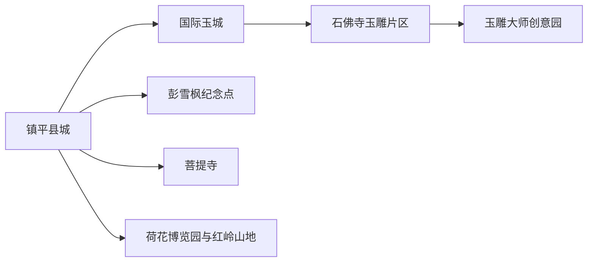
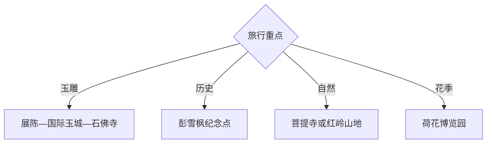

# 镇平旅行指南

镇平适合以玉雕产业与红色文化为主线，再加入山地和季节农旅：县城、石佛寺镇、国际玉城与玉雕大师创意园组成工艺线，彭雪枫纪念点适合历史主题，菩提寺、荷花博览园和红岭山地用于第二天。

## 城市速览

| 项目 | 信息 |
|---|---|
| 主线 | 镇平县城—国际玉城—石佛寺镇—玉雕大师创意园—彭雪枫纪念—菩提寺 |
| 停留 | 玉雕文化1天；增加历史或山地共2天 |
| 住宿 | 县城适合综合交通，石佛寺适合早逛市场 |
| 交通 | 从南阳乘铁路或公路进入，县城与石佛寺用公交、网约车或预约车 |
| 风险 | 玉石消费信息差、市场拥挤、夏季高温、山路与季节性园区 |
| 边界 | 玉雕车间生产区、仓储区、文保空间、宗教活动区和山林封控段按开放范围进入 |

## 城市格局与游览区域

固定 `Zhenping / GeoNames 1784617` 对应镇平县主城，本页以法定镇平县 `Q197741` 组织。玉雕交易与制作点集中在县城至石佛寺走廊；菩提寺和山地农旅点距离更远，宜分日。

## 主要景点

| 景点 | 区域 | 类型 | 核心体验 | 用时 | 环境 | 体力 | 预约风险 | 天气影响 | 优先级 |
|---|---|---|---|---:|---|---|---|---|---|
| 国际玉城 | 县城与石佛寺走廊 | 玉雕商贸 | 玉器品类、工艺与市场观察 | 3–5小时 | 室内为主 | 中 | 中 | 低 | A |
| 石佛寺镇玉雕市场公开区 | 石佛寺镇 | 产业街区 | 玉雕产业链、商铺与地方技艺 | 3–6小时 | 室内外 | 中 | 高 | 中 | A |
| 玉雕大师创意园 | 石佛寺方向 | 工艺展示 | 当代玉雕创作与作品展陈 | 2–4小时 | 室内 | 低 | 高 | 低 | A |
| 镇平县博物馆或玉文化展陈 | 县城 | 地方文博 | 地方历史与玉文化背景 | 1.5–3小时 | 室内 | 低 | 很高 | 低 | A |
| 彭雪枫纪念馆及故居公开区 | 县域 | 红色文化 | 生平、地方革命史与纪念空间 | 2–4小时 | 室内外 | 低中 | 高 | 中 | B |
| 菩提寺 | 老庄镇方向 | 古寺与山林 | 寺院建筑、古树与山地环境 | 半日至1天 | 室内外 | 中高 | 高 | 很高 | B |
| 中原荷花博览园 | 遮山镇方向 | 农旅园区 | 荷花物候、田园与摄影 | 2–5小时 | 室外 | 中 | 很高 | 很高 | B |
| 红岭山地运动公园公开项目 | 山地片区 | 户外运动 | 骑行、步道或当期山地项目 | 半日至1天 | 室外 | 高 | 很高 | 极高 | C |

## 美食与餐饮

县城和石佛寺可选镇平烧鸡、浆面条、胡辣汤、烩面与南阳家常菜。市场日先安排早餐再逛；玉器选购与餐饮分账，避免把购物返佣纳入路线判断。山地日自备水并确认乡镇供餐。

## 经典行程

### 一日经典线
**路线**：县级展陈—国际玉城—石佛寺公开街区。**逻辑**：先学材质和工艺，再进入市场观察。**预约锚点**：展馆与创意园。**休息**：国际玉城。**删除条件**：展馆闭馆时增加创意园。

### 两日工艺历史线
**路线**：首日玉雕走廊；次日彭雪枫纪念点—县城。**逻辑**：将产业认知与地方历史分日。**预约锚点**：纪念馆、故居和讲解。**休息**：县城。**删除条件**：纪念点闭馆时改荷花园或博物馆。

### 玉雕深读线
**路线**：玉文化展陈—大师创意园—石佛寺市场。**逻辑**：从知识、创作到交易建立判断顺序。**预约锚点**：工坊公开时段和讲解。**休息**：创意园。**删除条件**：工坊未开放时只看公开展陈。

### 山寺线
**路线**：县城—菩提寺公开区—老庄镇返程。**逻辑**：为山路与寺院留完整半日以上。**预约锚点**：道路、寺院开放和天气。**休息**：游客接待点。**删除条件**：雨雪、封山或林火风险时取消。

### 亲子工艺线
**路线**：玉文化展陈—正规研学体验—县城公园。**逻辑**：用可操作活动替代长时间市场购物。**预约锚点**：年龄、材料、收费和成品领取。**休息**：研学点。**删除条件**：活动不适龄时只留展陈。

### 花季乡村线
**路线**：荷花博览园—乡镇午餐—正规农产品门店。**逻辑**：围绕荷花物候完成单点慢游。**预约锚点**：花期、开放和停车。**休息**：园区。**删除条件**：花期偏差时改县城工艺线。

### 低体力线
**路线**：县级展陈—车辆到国际玉城—大师园短段。**逻辑**：以室内、座椅和短转场控制强度。**预约锚点**：无障碍与落客。**休息**：展馆。**删除条件**：市场拥挤时跳过石佛寺街区。

## 住宿区域

镇平县城适合铁路、公路、餐饮和多方向换线；石佛寺镇适合以玉雕市场为主的清晨行程；山地与乡村住宿只用于特定活动，确认经营资质、消防、卫生、夜间道路和退改。

## 市内交通

县城与石佛寺镇是最常用的双中心，公交、网约车和预约车可组合。菩提寺、荷花园与红岭山地分属不同方向，一天只选一条远线；大件玉器的运输、保险和凭证由正规商户明确约定。

## 不同旅行者须知

工艺爱好者先展陈后市场；购买者可索取材质、检测、价格与售后凭证并独立复核；亲子家庭选正规研学；徒步者按开放项目进入。生产车间、切割设备区、仓库、未开放山林和宗教非开放空间保留明确限制。

## 行前核对

- 核对展馆、创意园、纪念点、菩提寺与季节园区开放。
- 核对商品检测机构、证书查询、退换和物流条款，保留交易凭证。
- 核对高温雨雪、山路、林火、乡村接驳和末班返程。

## 来源与更新记录

| 来源 | 支持内容 | 核验日期 |
|---|---|---|
| [镇平县风景名胜](https://www.zhenping.gov.cn/2022/07-05/570425.html) | 菩提寺与国际玉城 | 2026-09-01 |
| [镇平县文化旅游规划](https://www.zhenping.gov.cn/2024/08-26/617188.html) | 玉雕、赵河、菩提寺、纪念点与大师园 | 2026-09-01 |
| [GeoNames 1784617](https://www.geonames.org/1784617/) | Zhenping 固定主城点 | 2026-09-01 |
| [Wikidata Q197741](https://www.wikidata.org/wiki/Q197741) | 镇平县实体与跨库标识 | 2026-09-01 |

| 日期 | 更新 |
|---|---|
| 2026-09-01 | 首次完成镇平旅行研究，按玉雕、红色文化、山寺与农旅组织。 |
